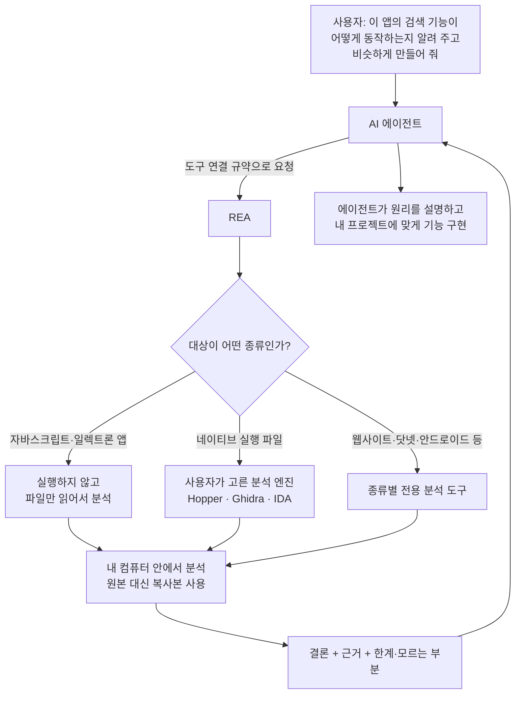

<div class="ai-knowledge-shell">

<aside class="ai-knowledge-sidebar">
  <p class="ai-eyebrow">CATEGORIES</p>
  <nav class="ai-cat-tree"><details class="ai-cat" open><summary><span class="catname">에이전트 오케스트레이션</span><span class="catcount">19</span></summary><ul><li><a href="https://altjs4510.github.io/ai_news_blog/knowledge/20260930/"><span class="kdate">2026-09-30</span><span class="ktitle">Agents you can coach: how Asana builds human-age…</span></a></li><li><a href="https://altjs4510.github.io/ai_news_blog/knowledge/20260929/"><span class="kdate">2026-09-29</span><span class="ktitle">vectorize-io/hindsight — Hindsight: Agent Memory…</span></a></li><li><a href="https://altjs4510.github.io/ai_news_blog/knowledge/20260908/"><span class="kdate">2026-09-08</span><span class="ktitle">bytedance/deer-flow — 샌드박스·메모리·서브에이전트·메시지 게이트웨이를…</span></a></li><li><a href="https://altjs4510.github.io/ai_news_blog/knowledge/20260904/"><span class="kdate">2026-09-04</span><span class="ktitle">HarnessDev: Can LLMs Create and Evolve Their Own…</span></a></li><li><a href="https://altjs4510.github.io/ai_news_blog/knowledge/20260831-openexecutive-virtual-c-suite/"><span class="kdate">2026-08-31</span><span class="ktitle">Open Executive — 8명의 전문 에이전트를 하나의 임원 목소리로</span></a></li><li><a href="https://altjs4510.github.io/ai_news_blog/knowledge/20260828/"><span class="kdate">2026-08-28</span><span class="ktitle">Google ADK for Python v2.8.0 — RemoteA2aAgent 네이…</span></a></li><li><a href="https://altjs4510.github.io/ai_news_blog/knowledge/20260826/"><span class="kdate">2026-08-26</span><span class="ktitle">apache/maka — 도구 호출·권한 결정·종료 이벤트를 append-only 로그…</span></a></li><li><a href="https://altjs4510.github.io/ai_news_blog/knowledge/20260823/"><span class="kdate">2026-08-23</span><span class="ktitle">The Evolution of the Agent Harness — 하네스가 모델 가중치…</span></a></li><li><a href="https://altjs4510.github.io/ai_news_blog/knowledge/20260805/"><span class="kdate">2026-08-05</span><span class="ktitle">TencentCloud/TencentDB-Agent-Memory — 대화·문서·코드를 …</span></a></li><li><a href="https://altjs4510.github.io/ai_news_blog/knowledge/20260726/"><span class="kdate">2026-07-26</span><span class="ktitle">citrolabs/ego-lite — 로그인된 브라우저 상태를 AI 에이전트와 공유하는…</span></a></li><li><a href="https://altjs4510.github.io/ai_news_blog/knowledge/20260717/"><span class="kdate">2026-07-17</span><span class="ktitle">After a year building agent memory, 'save everyt…</span></a></li><li><a href="https://altjs4510.github.io/ai_news_blog/knowledge/20260709/"><span class="kdate">2026-07-09</span><span class="ktitle">mvanhorn/last30days-skill — Reddit·X·YouTube·HN·…</span></a></li><li><a href="https://altjs4510.github.io/ai_news_blog/knowledge/20260623/"><span class="kdate">2026-06-23</span><span class="ktitle">bytedance/deer-flow — 샌드박스·메모리·서브에이전트·메시지 게이트웨이를…</span></a></li><li><a href="https://altjs4510.github.io/ai_news_blog/knowledge/20260621/"><span class="kdate">2026-06-21</span><span class="ktitle">calesthio/OpenMontage — 12 파이프라인·52 도구·500+ 스킬을 …</span></a></li><li><a href="https://altjs4510.github.io/ai_news_blog/knowledge/20260611/"><span class="kdate">2026-06-11</span><span class="ktitle">The evolution of agentic surfaces: building with…</span></a></li><li><a href="https://altjs4510.github.io/ai_news_blog/knowledge/20260604/"><span class="kdate">2026-06-04</span><span class="ktitle">chopratejas/headroom — Compress tool outputs bef…</span></a></li><li><a href="https://altjs4510.github.io/ai_news_blog/knowledge/20260602/"><span class="kdate">2026-06-02</span><span class="ktitle">revfactory/harness — 도메인별 에이전트 팀과 스킬을 자동 설계하는 메타…</span></a></li><li><a href="https://altjs4510.github.io/ai_news_blog/knowledge/20260529/"><span class="kdate">2026-05-29</span><span class="ktitle">Introducing dynamic workflows in Claude Code</span></a></li><li><a href="https://altjs4510.github.io/ai_news_blog/knowledge/20260507/"><span class="kdate">2026-05-07</span><span class="ktitle">ruvnet/ruflo — Claude 멀티 에이전트 오케스트레이션 플랫폼</span></a></li></ul></details><details class="ai-cat" open><summary><span class="catname">MCP &amp; 도구 통합</span><span class="catcount">19</span></summary><ul><li><a href="https://altjs4510.github.io/ai_news_blog/knowledge/20261008/" class="current"><span class="kdate">2026-10-08</span><span class="ktitle">morluto/rea — 앱 동작부터 네이티브 바이너리까지 에이전트로 역공학하는 도구</span></a></li><li><a href="https://altjs4510.github.io/ai_news_blog/knowledge/20260829/"><span class="kdate">2026-08-29</span><span class="ktitle">cursor/plugins — 플러그인 명세(specification)와 공식 플러그인…</span></a></li><li><a href="https://altjs4510.github.io/ai_news_blog/knowledge/20260802/"><span class="kdate">2026-08-02</span><span class="ktitle">Stateless MCP has recaptured my interest (and in…</span></a></li><li><a href="https://altjs4510.github.io/ai_news_blog/knowledge/20260801/"><span class="kdate">2026-08-01</span><span class="ktitle">different-ai/openwork — Claude Cowork의 오픈소스 대체 에…</span></a></li><li><a href="https://altjs4510.github.io/ai_news_blog/knowledge/20260731/"><span class="kdate">2026-07-31</span><span class="ktitle">different-ai/openwork — Claude Cowork의 오픈소스 대안(o…</span></a></li><li><a href="https://altjs4510.github.io/ai_news_blog/knowledge/20260729/"><span class="kdate">2026-07-29</span><span class="ktitle">Bringing MCP 2026-07-28 to Claude</span></a></li><li><a href="https://altjs4510.github.io/ai_news_blog/knowledge/20260718/"><span class="kdate">2026-07-18</span><span class="ktitle">tirth8205/code-review-graph — MCP·CLI용 로컬 코드 인텔리…</span></a></li><li><a href="https://altjs4510.github.io/ai_news_blog/knowledge/20260708/"><span class="kdate">2026-07-08</span><span class="ktitle">Expanding Managed Agents in Gemini API: backgrou…</span></a></li><li><a href="https://altjs4510.github.io/ai_news_blog/knowledge/20260701/"><span class="kdate">2026-07-01</span><span class="ktitle">Google OKF (Open Knowledge Format) — 벤더 중립 에이전트 …</span></a></li><li><a href="https://altjs4510.github.io/ai_news_blog/knowledge/20260618/"><span class="kdate">2026-06-18</span><span class="ktitle">DeusData/codebase-memory-mcp — 158개 언어 코드베이스를 밀리…</span></a></li><li><a href="https://altjs4510.github.io/ai_news_blog/knowledge/20260603/"><span class="kdate">2026-06-03</span><span class="ktitle">How Bad MCP design cost your Agent 5× more token…</span></a></li><li><a href="https://altjs4510.github.io/ai_news_blog/knowledge/20260526/"><span class="kdate">2026-05-26</span><span class="ktitle">colbymchenry/codegraph — Pre-indexed code knowle…</span></a></li><li><a href="https://altjs4510.github.io/ai_news_blog/knowledge/20260524/"><span class="kdate">2026-05-24</span><span class="ktitle">colbymchenry/codegraph — Pre-indexed code knowle…</span></a></li><li><a href="https://altjs4510.github.io/ai_news_blog/knowledge/20260523/"><span class="kdate">2026-05-23</span><span class="ktitle">colbymchenry/codegraph — 사전 인덱싱된 코드 지식 그래프 MCP</span></a></li><li><a href="https://altjs4510.github.io/ai_news_blog/knowledge/20260521/"><span class="kdate">2026-05-21</span><span class="ktitle">colbymchenry/codegraph — Pre-indexed code knowle…</span></a></li><li><a href="https://altjs4510.github.io/ai_news_blog/knowledge/20260520/"><span class="kdate">2026-05-20</span><span class="ktitle">New in Claude Managed Agents: self-hosted sandbo…</span></a></li><li><a href="https://altjs4510.github.io/ai_news_blog/knowledge/20260517/"><span class="kdate">2026-05-17</span><span class="ktitle">I gave my LLM 100,000+ tools — Lazy Discovery &a…</span></a></li><li><a href="https://altjs4510.github.io/ai_news_blog/knowledge/20260509/"><span class="kdate">2026-05-09</span><span class="ktitle">How to connect 100 MCP servers without the conte…</span></a></li><li><a href="https://altjs4510.github.io/ai_news_blog/knowledge/20260506/"><span class="kdate">2026-05-06</span><span class="ktitle">mksglu/context-mode — AI 코딩 에이전트용 컨텍스트 윈도우 최적화</span></a></li></ul></details><details class="ai-cat" open><summary><span class="catname">코딩 에이전트</span><span class="catcount">37</span></summary><ul><li><a href="https://altjs4510.github.io/ai_news_blog/knowledge/20261007/"><span class="kdate">2026-10-07</span><span class="ktitle">morluto/rea — 앱 동작부터 네이티브 바이너리까지 에이전트로 리버스 엔지니어링</span></a></li><li><a href="https://altjs4510.github.io/ai_news_blog/knowledge/20260920/"><span class="kdate">2026-09-20</span><span class="ktitle">Claude Code 2.1.277 — CLAUDE.md가 없으면 AGENTS.md를 …</span></a></li><li><a href="https://altjs4510.github.io/ai_news_blog/knowledge/20260918/"><span class="kdate">2026-09-18</span><span class="ktitle">alibaba/open-code-review — 결정론적 파이프라인 + LLM 에이전트…</span></a></li><li><a href="https://altjs4510.github.io/ai_news_blog/knowledge/20260917/"><span class="kdate">2026-09-17</span><span class="ktitle">alibaba/open-code-review — 결정론적 파이프라인과 LLM 에이전트를…</span></a></li><li><a href="https://altjs4510.github.io/ai_news_blog/knowledge/20260916/"><span class="kdate">2026-09-16</span><span class="ktitle">alibaba/open-code-review — 결정론적 파이프라인과 LLM Agent…</span></a></li><li><a href="https://altjs4510.github.io/ai_news_blog/knowledge/20260915/"><span class="kdate">2026-09-15</span><span class="ktitle">alibaba/open-code-review — 결정적 파이프라인과 LLM 에이전트를 …</span></a></li><li><a href="https://altjs4510.github.io/ai_news_blog/knowledge/20260912/"><span class="kdate">2026-09-12</span><span class="ktitle">Quoting Boris Cherny — 'Claude가 쓴 프로덕션 코드는 사람이 쓴…</span></a></li><li><a href="https://altjs4510.github.io/ai_news_blog/knowledge/20260910/"><span class="kdate">2026-09-10</span><span class="ktitle">vastsa/PI-Desktop — Electron + Rust 호스트 코어 + 에이전…</span></a></li><li><a href="https://altjs4510.github.io/ai_news_blog/knowledge/20260906/"><span class="kdate">2026-09-06</span><span class="ktitle">DietrichGebert/ponytail — 에이전트를 '방에서 가장 게으른 시니어 …</span></a></li><li><a href="https://altjs4510.github.io/ai_news_blog/knowledge/20260903/"><span class="kdate">2026-09-03</span><span class="ktitle">pacifio/atlas — 여러 코딩 에이전트의 변경을 한곳에서 추적·질의하는 '에이…</span></a></li><li><a href="https://altjs4510.github.io/ai_news_blog/knowledge/20260901/"><span class="kdate">2026-09-01</span><span class="ktitle">affaan-m/ECC — 스킬·본능·메모리·보안을 묶은 에이전트 하네스 성능 최적화 …</span></a></li><li><a href="https://altjs4510.github.io/ai_news_blog/knowledge/20260831-gitnexus-code-knowledge-graph/"><span class="kdate">2026-08-31</span><span class="ktitle">GitNexus — 코드베이스를 지식그래프로 바꿔 에이전트에게 쥐어주기</span></a></li><li><a href="https://altjs4510.github.io/ai_news_blog/knowledge/20260822/"><span class="kdate">2026-08-22</span><span class="ktitle">mattpocock/skills — Skills for Real Engineers (하…</span></a></li><li><a href="https://altjs4510.github.io/ai_news_blog/knowledge/20260820/"><span class="kdate">2026-08-20</span><span class="ktitle">akitaonrails/ai-memory — 코딩 에이전트 CLI의 장기 메모리와 벤더…</span></a></li><li><a href="https://altjs4510.github.io/ai_news_blog/knowledge/20260819/"><span class="kdate">2026-08-19</span><span class="ktitle">akitaonrails/ai-memory — 코딩 에이전트 CLI 간 장기 기억과 벤더…</span></a></li><li><a href="https://altjs4510.github.io/ai_news_blog/knowledge/20260814/"><span class="kdate">2026-08-14</span><span class="ktitle">cathrynlavery/diagram-design — Claude Code용 에디토리…</span></a></li><li><a href="https://altjs4510.github.io/ai_news_blog/knowledge/20260811/"><span class="kdate">2026-08-11</span><span class="ktitle">PrimeIntellect-ai/prime-agent — 장기 자율 실행을 전제로 설계…</span></a></li><li><a href="https://altjs4510.github.io/ai_news_blog/knowledge/20260810/"><span class="kdate">2026-08-10</span><span class="ktitle">Auto mode is now the default in Claude Code for …</span></a></li><li><a href="https://altjs4510.github.io/ai_news_blog/knowledge/20260809/"><span class="kdate">2026-08-09</span><span class="ktitle">PrimeIntellect-ai/prime-agent — 코딩 워크플로우·장기 자율 작…</span></a></li><li><a href="https://altjs4510.github.io/ai_news_blog/knowledge/20260808/"><span class="kdate">2026-08-08</span><span class="ktitle">PrimeIntellect-ai/prime-agent — 코딩 워크플로우와 장시간 자율…</span></a></li><li><a href="https://altjs4510.github.io/ai_news_blog/knowledge/20260804/"><span class="kdate">2026-08-04</span><span class="ktitle">esengine/DeepSeek-Reasonix — prefix-cache 안정성을 축…</span></a></li><li><a href="https://altjs4510.github.io/ai_news_blog/knowledge/20260728/"><span class="kdate">2026-07-28</span><span class="ktitle">alibaba/open-code-review — 결정론적 파이프라인 + LLM 에이전트…</span></a></li><li><a href="https://altjs4510.github.io/ai_news_blog/knowledge/20260725/"><span class="kdate">2026-07-25</span><span class="ktitle">The new rules of context engineering for Claude …</span></a></li><li><a href="https://altjs4510.github.io/ai_news_blog/knowledge/20260722/"><span class="kdate">2026-07-22</span><span class="ktitle">tirth8205/code-review-graph — MCP·CLI용 로컬 우선 코드 …</span></a></li><li><a href="https://altjs4510.github.io/ai_news_blog/knowledge/20260721/"><span class="kdate">2026-07-21</span><span class="ktitle">tirth8205/code-review-graph — 로컬 우선 코드 인텔리전스 그래프…</span></a></li><li><a href="https://altjs4510.github.io/ai_news_blog/knowledge/20260719/"><span class="kdate">2026-07-19</span><span class="ktitle">tirth8205/code-review-graph — 로컬 우선 코드 인텔리전스 그래프…</span></a></li><li><a href="https://altjs4510.github.io/ai_news_blog/knowledge/20260714/"><span class="kdate">2026-07-14</span><span class="ktitle">Graphify-Labs/graphify — 코드베이스를 질의 가능한 지식 그래프로 만…</span></a></li><li><a href="https://altjs4510.github.io/ai_news_blog/knowledge/20260707/"><span class="kdate">2026-07-07</span><span class="ktitle">AI Hero Skills Catalog — 실무 엔지니어를 위한 재사용 가능한 판단 …</span></a></li><li><a href="https://altjs4510.github.io/ai_news_blog/knowledge/20260705/"><span class="kdate">2026-07-05</span><span class="ktitle">openai/codex-plugin-cc — Claude Code에서 Codex를 위임…</span></a></li><li><a href="https://altjs4510.github.io/ai_news_blog/knowledge/20260626/"><span class="kdate">2026-06-26</span><span class="ktitle">google-labs-code/design.md — 코딩 에이전트에게 디자인 시스템을 …</span></a></li><li><a href="https://altjs4510.github.io/ai_news_blog/knowledge/20260619/"><span class="kdate">2026-06-19</span><span class="ktitle">Claude Code now supports artifacts</span></a></li><li><a href="https://altjs4510.github.io/ai_news_blog/knowledge/20260530/"><span class="kdate">2026-05-30</span><span class="ktitle">Leonxlnx/taste-skill — AI에게 좋은 취향을 부여해 generic s…</span></a></li><li><a href="https://altjs4510.github.io/ai_news_blog/knowledge/20260528/"><span class="kdate">2026-05-28</span><span class="ktitle">Building self-improving tax agents with Codex</span></a></li><li><a href="https://altjs4510.github.io/ai_news_blog/knowledge/20260512/"><span class="kdate">2026-05-12</span><span class="ktitle">agentmemory — Persistent memory for AI coding ag…</span></a></li><li><a href="https://altjs4510.github.io/ai_news_blog/knowledge/20260510/"><span class="kdate">2026-05-10</span><span class="ktitle">addyosmani/agent-skills — Production-grade engin…</span></a></li><li><a href="https://altjs4510.github.io/ai_news_blog/knowledge/20260508/"><span class="kdate">2026-05-08</span><span class="ktitle">addyosmani/agent-skills — Production-grade engin…</span></a></li><li><a href="https://altjs4510.github.io/ai_news_blog/knowledge/20260505/"><span class="kdate">2026-05-05</span><span class="ktitle">mattpocock/skills — Skills for Real Engineers (.…</span></a></li></ul></details><details class="ai-cat" open><summary><span class="catname">모델 &amp; 연구</span><span class="catcount">8</span></summary><ul><li><a href="https://altjs4510.github.io/ai_news_blog/knowledge/20261009/"><span class="kdate">2026-10-09</span><span class="ktitle">Claude Haiku 5.5 (Simon Willison의 출시 노트와 가격 분석)</span></a></li><li><a href="https://altjs4510.github.io/ai_news_blog/knowledge/20260907-voicemem-dual-brain-memory/"><span class="kdate">2026-09-07</span><span class="ktitle">VoiceMem — 좌뇌·우뇌로 쪼갠 스트리밍 메모리로 음성 에이전트 지연 없애기</span></a></li><li><a href="https://altjs4510.github.io/ai_news_blog/knowledge/20260716-proprag/"><span class="kdate">2026-07-16</span><span class="ktitle">PropRAG — 프로포지션 경로 위 beam search로 멀티홉 검색 안내</span></a></li><li><a href="https://altjs4510.github.io/ai_news_blog/knowledge/20260712/"><span class="kdate">2026-07-12</span><span class="ktitle">Do Automated Evals Work?</span></a></li><li><a href="https://altjs4510.github.io/ai_news_blog/knowledge/20260620/"><span class="kdate">2026-06-20</span><span class="ktitle">zai-org/GLM-5 — From Vibe Coding to Agentic Engi…</span></a></li><li><a href="https://altjs4510.github.io/ai_news_blog/knowledge/20260617/"><span class="kdate">2026-06-17</span><span class="ktitle">Predicting model behavior before release by simu…</span></a></li><li><a href="https://altjs4510.github.io/ai_news_blog/knowledge/20260516/"><span class="kdate">2026-05-16</span><span class="ktitle">STALE — 에이전트가 자기 기억의 유효성을 인지할 수 있는가</span></a></li><li><a href="https://altjs4510.github.io/ai_news_blog/knowledge/20260513/"><span class="kdate">2026-05-13</span><span class="ktitle">Thinking Machines' Native Interaction Models — T…</span></a></li></ul></details><details class="ai-cat" open><summary><span class="catname">인프라 &amp; 컴퓨트</span><span class="catcount">9</span></summary><ul><li><a href="https://altjs4510.github.io/ai_news_blog/knowledge/20260905/"><span class="kdate">2026-09-05</span><span class="ktitle">magnitudedev/magnitude — 하드웨어에 맞는 최적 로컬 모델을 띄워 이…</span></a></li><li><a href="https://altjs4510.github.io/ai_news_blog/knowledge/20260821/"><span class="kdate">2026-08-21</span><span class="ktitle">volcengine/OpenViking — 에이전트 메모리·Knowledge RAG·스…</span></a></li><li><a href="https://altjs4510.github.io/ai_news_blog/knowledge/20260806/"><span class="kdate">2026-08-06</span><span class="ktitle">cloudflare/computer — 에이전트에게 컴퓨터를 통째로 주는 엣지 실행 샌…</span></a></li><li><a href="https://altjs4510.github.io/ai_news_blog/knowledge/20260724/"><span class="kdate">2026-07-24</span><span class="ktitle">diegosouzapw/OmniRoute — 단일 엔드포인트로 278+ 프로바이더·50…</span></a></li><li><a href="https://altjs4510.github.io/ai_news_blog/knowledge/20260723/"><span class="kdate">2026-07-23</span><span class="ktitle">diegosouzapw/OmniRoute — 268+ 프로바이더를 단일 엔드포인트로 묶…</span></a></li><li><a href="https://altjs4510.github.io/ai_news_blog/knowledge/20260610/"><span class="kdate">2026-06-10</span><span class="ktitle">Fable 5 just made cost-aware model routing manda…</span></a></li><li><a href="https://altjs4510.github.io/ai_news_blog/knowledge/20260606/"><span class="kdate">2026-06-06</span><span class="ktitle">chopratejas/headroom — Compress tool outputs, lo…</span></a></li><li><a href="https://altjs4510.github.io/ai_news_blog/knowledge/20260605/"><span class="kdate">2026-06-05</span><span class="ktitle">chopratejas/headroom — Compress tool outputs, lo…</span></a></li><li><a href="https://altjs4510.github.io/ai_news_blog/knowledge/20260522/"><span class="kdate">2026-05-22</span><span class="ktitle">Giving Agents Computers — Ivan Burazin, Daytona</span></a></li></ul></details><details class="ai-cat" open><summary><span class="catname">보안 &amp; 거버넌스</span><span class="catcount">26</span></summary><ul><li><a href="https://altjs4510.github.io/ai_news_blog/knowledge/20261004/"><span class="kdate">2026-10-04</span><span class="ktitle">Apple says it's tightening macOS 'Full Disk Acce…</span></a></li><li><a href="https://altjs4510.github.io/ai_news_blog/knowledge/20261003/"><span class="kdate">2026-10-03</span><span class="ktitle">NVIDIA/OpenShell — 자율 AI 에이전트를 위한 안전하고 프라이빗한 런타임…</span></a></li><li><a href="https://altjs4510.github.io/ai_news_blog/knowledge/20261002/"><span class="kdate">2026-10-02</span><span class="ktitle">NVIDIA/OpenShell — 자율 AI 에이전트를 위한 안전하고 프라이빗한 런타임…</span></a></li><li><a href="https://altjs4510.github.io/ai_news_blog/knowledge/20261001/"><span class="kdate">2026-10-01</span><span class="ktitle">NVIDIA/OpenShell</span></a></li><li><a href="https://altjs4510.github.io/ai_news_blog/knowledge/20260919/"><span class="kdate">2026-09-19</span><span class="ktitle">cloudflare/security-audit-skill — 다단계 보안 감사를 '독립…</span></a></li><li><a href="https://altjs4510.github.io/ai_news_blog/knowledge/20260913/"><span class="kdate">2026-09-13</span><span class="ktitle">OpenAI agents attacked RubyGems back in May: Ope…</span></a></li><li><a href="https://altjs4510.github.io/ai_news_blog/knowledge/20260902/"><span class="kdate">2026-09-02</span><span class="ktitle">AIR raises $50M to help companies vet the skills…</span></a></li><li><a href="https://altjs4510.github.io/ai_news_blog/knowledge/20260827/"><span class="kdate">2026-08-27</span><span class="ktitle">Claude in Chrome is generally available</span></a></li><li><a href="https://altjs4510.github.io/ai_news_blog/knowledge/20260819-mind-viruses/"><span class="kdate">2026-08-19</span><span class="ktitle">탈옥도, 인젝션도 없이 — 대화로만 퍼지는 에이전트의 '마인드 바이러스'</span></a></li><li><a href="https://altjs4510.github.io/ai_news_blog/knowledge/20260813/"><span class="kdate">2026-08-13</span><span class="ktitle">semantica-agi/semantica — 컨텍스트와 책임 추적을 위한 그래프 네이…</span></a></li><li><a href="https://altjs4510.github.io/ai_news_blog/knowledge/20260812/"><span class="kdate">2026-08-12</span><span class="ktitle">semantica-agi/semantica — 컨텍스트와 '책임 추적 가능한(accou…</span></a></li><li><a href="https://altjs4510.github.io/ai_news_blog/knowledge/20260730/"><span class="kdate">2026-07-30</span><span class="ktitle">Anatomy of a Frontier Lab Agent Intrusion: A Tec…</span></a></li><li><a href="https://altjs4510.github.io/ai_news_blog/knowledge/20260716/"><span class="kdate">2026-07-16</span><span class="ktitle">Dicklesworthstone/destructive_command_guard — 에이…</span></a></li><li><a href="https://altjs4510.github.io/ai_news_blog/knowledge/20260715/"><span class="kdate">2026-07-15</span><span class="ktitle">Dicklesworthstone/destructive_command_guard — 에이…</span></a></li><li><a href="https://altjs4510.github.io/ai_news_blog/knowledge/20260710/"><span class="kdate">2026-07-10</span><span class="ktitle">70개 MCP 서버 strace 런타임 감사 — 부팅 시 아웃바운드 호출 서버 적발</span></a></li><li><a href="https://altjs4510.github.io/ai_news_blog/knowledge/20260704/"><span class="kdate">2026-07-04</span><span class="ktitle">Cloudflare is about to block AI agents by defaul…</span></a></li><li><a href="https://altjs4510.github.io/ai_news_blog/knowledge/20260703/"><span class="kdate">2026-07-03</span><span class="ktitle">Giving admins more visibility and control over C…</span></a></li><li><a href="https://altjs4510.github.io/ai_news_blog/knowledge/20260630/"><span class="kdate">2026-06-30</span><span class="ktitle">Introducing the Claude apps gateway for Amazon B…</span></a></li><li><a href="https://altjs4510.github.io/ai_news_blog/knowledge/20260625/"><span class="kdate">2026-06-25</span><span class="ktitle">Agent identity in Claude Tag: a new access model…</span></a></li><li><a href="https://altjs4510.github.io/ai_news_blog/knowledge/20260624/"><span class="kdate">2026-06-24</span><span class="ktitle">Agent identity in Claude Tag: a new access model…</span></a></li><li><a href="https://altjs4510.github.io/ai_news_blog/knowledge/20260614/"><span class="kdate">2026-06-14</span><span class="ktitle">NVIDIA/SkillSpector — Security scanner for AI ag…</span></a></li><li><a href="https://altjs4510.github.io/ai_news_blog/knowledge/20260613/"><span class="kdate">2026-06-13</span><span class="ktitle">Fable 5's guardrails got bypassed in 48 hours — …</span></a></li><li><a href="https://altjs4510.github.io/ai_news_blog/knowledge/20260612/"><span class="kdate">2026-06-12</span><span class="ktitle">NVIDIA/SkillSpector — AI 에이전트 스킬용 보안 스캐너</span></a></li><li><a href="https://altjs4510.github.io/ai_news_blog/knowledge/20260607/"><span class="kdate">2026-06-07</span><span class="ktitle">OpenAI Help: Lockdown Mode</span></a></li><li><a href="https://altjs4510.github.io/ai_news_blog/knowledge/20260531/"><span class="kdate">2026-05-31</span><span class="ktitle">How we contain Claude across products</span></a></li><li><a href="https://altjs4510.github.io/ai_news_blog/knowledge/20260527/"><span class="kdate">2026-05-27</span><span class="ktitle">Microsoft Copilot Cowork Exfiltrates Files</span></a></li></ul></details><details class="ai-cat" open><summary><span class="catname">응용 사례</span><span class="catcount">7</span></summary><ul><li><a href="https://altjs4510.github.io/ai_news_blog/knowledge/20261006/"><span class="kdate">2026-10-06</span><span class="ktitle">How Cresta turned CX expertise into an agent bui…</span></a></li><li><a href="https://altjs4510.github.io/ai_news_blog/knowledge/20260911/"><span class="kdate">2026-09-11</span><span class="ktitle">Now everyone can put data to work — ChatGPT Work…</span></a></li><li><a href="https://altjs4510.github.io/ai_news_blog/knowledge/20260909/"><span class="kdate">2026-09-09</span><span class="ktitle">Reducing cost and improving performance with Cla…</span></a></li><li><a href="https://altjs4510.github.io/ai_news_blog/knowledge/20260609/"><span class="kdate">2026-06-09</span><span class="ktitle">Building intelligent apps for Apple platforms wi…</span></a></li><li><a href="https://altjs4510.github.io/ai_news_blog/knowledge/20260515/"><span class="kdate">2026-05-15</span><span class="ktitle">Clawdmeter — Claude Code 사용량을 데스크톱 대시보드로</span></a></li><li><a href="https://altjs4510.github.io/ai_news_blog/knowledge/20260514/"><span class="kdate">2026-05-14</span><span class="ktitle">Introducing Claude for Small Business</span></a></li><li><a href="https://altjs4510.github.io/ai_news_blog/knowledge/20260504/"><span class="kdate">2026-05-04</span><span class="ktitle">Agents for Everything Else: Codex for Knowledge …</span></a></li></ul></details><details class="ai-cat" open><summary><span class="catname">산업 동향</span><span class="catcount">6</span></summary><ul><li><a href="https://altjs4510.github.io/ai_news_blog/knowledge/20260907-humanmade-52week-rhythm/"><span class="kdate">2026-09-07</span><span class="ktitle">휴먼 메이드의 '52주 리듬' — 아이디어가 흔해진 시대에 값이 오르는 건 버리는 판단</span></a></li><li><a href="https://altjs4510.github.io/ai_news_blog/knowledge/20260830/"><span class="kdate">2026-08-30</span><span class="ktitle">[AINews] OpenAI shuts off Cursor — 프론티어 모델 공급 차단…</span></a></li><li><a href="https://altjs4510.github.io/ai_news_blog/knowledge/20260711/"><span class="kdate">2026-07-11</span><span class="ktitle">OpenAI says GPT 5.6 is the 'preferred model' for…</span></a></li><li><a href="https://altjs4510.github.io/ai_news_blog/knowledge/20260702/"><span class="kdate">2026-07-02</span><span class="ktitle">How Cursor deploys AI inside the enterprise (For…</span></a></li><li><a href="https://altjs4510.github.io/ai_news_blog/knowledge/20260616/"><span class="kdate">2026-06-16</span><span class="ktitle">Why AI hasn't replaced software engineers, and w…</span></a></li><li><a href="https://altjs4510.github.io/ai_news_blog/knowledge/20260519/"><span class="kdate">2026-05-19</span><span class="ktitle">Anthropic acquires Stainless</span></a></li></ul></details></nav>
</aside>

<article class="ai-knowledge-article">

<header class="ai-post-hero">
  <p class="ai-eyebrow"><a class="ai-back" href="../">KNOWLEDGE</a> · 2026-10-08 · 오늘의 학습</p>
  <h2 class="ai-post-title">morluto/rea — 앱 동작부터 네이티브 바이너리까지 에이전트로 역공학하는 도구</h2>
</header>

> 원문: [morluto/rea — 앱 동작부터 네이티브 바이너리까지 에이전트로 역공학하는 도구](https://github.com/morluto/rea)

## 📌 학습 정리

### 1. 한 줄로 말하면

REA는 소스 코드가 없는 앱을 AI 에이전트가 직접 뜯어보게 해 주는 도구예요. 에이전트는 마음에 드는 기능이 내부에서 어떻게 돌아가는지 근거와 함께 설명하고, 그걸 바탕으로 내 프로젝트용 버전까지 만들어 볼 수 있어요.

### 2. 왜 이게 만들어졌어요?

다른 앱에서 좋은 기능을 보면 "이건 어떻게 만든 걸까?" 궁금해지는데, 대부분은 소스 코드가 공개돼 있지 않아요. 이럴 때 이미 만들어진 프로그램을 거꾸로 분해해서 원리를 알아내는 일을 역공학(reverse engineering)이라고 해요. 원래는 전문가가 분해 도구를 직접 열고 함수와 문자열을 하나씩 따라가야 해서 진입 장벽이 꽤 높았어요. AI 에이전트에게 맡기더라도 분석 도구를 쓸 수 없으면 에이전트는 겉모습만 보고 추측할 수밖에 없었고요. REA는 에이전트가 이런 분석 도구를 직접 쓰게 하고, 결론마다 근거와 한계를 같이 보여 주도록 만든 도구예요.

### 3. 비유로 풀면

이건 마치 완성된 요리를 성분 분석 장비에 넣어서 어떤 재료를 어떤 순서로 넣었는지 거슬러 추적하는 일과 비슷해요. 레시피 원본(소스 코드)은 없지만 장비가 보여 주는 단서를 모아서 "이 맛은 아마 이 재료와 이 조리 순서에서 나왔을 거예요"라고 설명하는 거죠. 그다음엔 내 주방에 있는 재료와 도구에 맞춰 비슷한 요리를 새로 만들어 봐요.

다만 REA는 원래 레시피를 그대로 되살렸다고 하지 않아요. "여기까진 확인됐고, 여기부턴 모르겠다"를 분명히 나눠서 알려 줘요.

그래서 결국, REA는 에이전트에게 분석 장비를 쥐여 주는 도구이고, 그 결과를 바탕으로 기능을 직접 만드는 일은 에이전트가 평소처럼 코드를 편집하고 테스트하면서 해요.

### 4. 어떻게 작동하는지 (그림으로)



사용자가 에이전트에게 말로 부탁하면, 에이전트는 REA의 도구를 불러 앱을 열고 단서가 될 문자열을 찾아요. 그런 다음 단서와 연결된 코드를 따라가고, 읽을 수 있는 형태로 되돌린 코드를 확인해요. 원문 예시를 보면 1~5단계(열기 → 단서 찾기 → 코드 연결 → 흐름 복원 → 코드 되돌리기)까지가 REA의 몫이에요. 마지막 6단계인 실제 기능 구현은 에이전트가 원래 쓰던 도구로 해요. 분석은 모두 내 컴퓨터에서 이루어지고, 앱을 외부 분석 서비스로 올리지 않는다고 원문에 적혀 있어요.

### 5. 처음 보는 용어 풀이

- **거꾸로 분해해 원리 알아내기 (reverse engineering)** — 이미 완성된 프로그램을 분석해서 어떻게 만들어졌는지 추적하는 작업이에요. 소스 코드를 구할 수 없을 때 동작 원리를 이해하려고 써요.
- **실행 파일 (binary)** — 사람이 쓴 코드가 컴퓨터용 기계어로 바뀌어 담긴 파일이에요. 사람이 그대로 읽기는 거의 불가능해서 분석 도구가 필요해요.
- **읽을 수 있는 코드로 되돌리기 (decompile)** — 기계어를 사람이 읽을 만한 코드 형태로 다시 풀어내는 작업이에요. 원본 코드가 그대로 나오지는 않고, 원문 표현대로 "원본 소스가 아니라 의사코드"가 나와요.
- **흉내 코드 (pseudocode)** — 실제 원본은 아니지만 동작을 이해할 수 있게 재구성한 코드예요. 이름이나 구조가 원본과 다를 수 있어서 "추정된 설계도" 정도로 보면 돼요.
- **AI와 도구를 잇는 연결 규약 (MCP)** — 에이전트가 외부 도구를 정해진 방식으로 부를 수 있게 하는 약속이에요. REA는 이 규약으로 Claude Code, Codex, Cursor 같은 여러 에이전트에 붙어요.
- **근거 묶음 (Evidence)** — REA가 결론을 낼 때 함께 내놓는 근거 자료예요. 무엇을 관찰했고 무엇은 확인하지 못했는지가 같이 담겨서 나중에 비교하거나 다시 확인할 수 있어요.
- **분석 엔진 (provider)** — 실행 파일을 깊게 분석하는 실제 도구예요. Hopper(별도 라이선스가 있는 분해 도구로, 체험판으로도 분석할 수 있어요), Ghidra, IDA Pro를 쓸 수 있어요. 엔진이 여러 개 설치돼 있으면 REA가 마음대로 고르지 않고 사용자에게 하나를 고르게 해요.

### 6. 한 발 더 들어가고 싶다면

- [Guides](https://morluto.github.io/rea/guides/) — 공식 가이드 모음이에요. 처음 써 볼 때 어떤 순서로 하면 되는지 감을 잡을 수 있어요.
- [Installation and setup](https://github.com/morluto/rea/blob/main/docs/installation.md) — 설치 요구사항과 지원하는 에이전트 목록, Hopper·Ghidra 설치 방법을 볼 수 있어요.
- [DX-Ball](https://github.com/N0zoM1z0/dx-ball) — 고전 윈도우 게임의 실행 파일을 유지보수 가능한 C 코드로 되살리는 진행 중인 사례예요. 이걸 보면 REA가 실제 프로젝트에서 어떻게 쓰이는지 알 수 있어요.
- [REA workflow](https://github.com/N0zoM1z0/dx-ball/blob/main/docs/REA.md) — 위 사례에서 실행 파일의 근거를 따라 코드를 재구성한 과정이에요. 단계를 하나하나 따라가 보고 싶을 때 좋아요.
- [native investigation](https://github.com/morluto/rea/blob/main/docs/native-investigation.md) — 네이티브 앱을 더 깊게 조사할 때 쓰는 기능들을 정리한 문서예요. 호출 관계나 값의 흐름을 추적하는 방법을 알 수 있어요.

---

## 📖 원문 전체 번역 (정독용)

> 의역 최소화한 전체 번역입니다. 큰 흐름은 위 정리에서 잡고, 정확한 워딩이 필요할 땐 이 섹션에서 정독하세요.

**[English](https://github.com/morluto/rea)** · [简体中文](https://github.com/morluto/rea/blob/main/README_zh.md) · [日本語](https://github.com/morluto/rea/blob/main/README_ja.md) · [한국어](https://github.com/morluto/rea/blob/main/README_ko.md) · [العربية](https://github.com/morluto/rea/blob/main/README_ar.md)

### 바이너리, 애플리케이션, 런타임 동작 전반을 아우르는 역공학용 MCP 하나.

**마음에 드는 기능을 보셨나요? 바이너리 수준까지 그 동작 방식을 이해하세요.**

**[웹사이트](https://morluto.github.io/rea/) · [가이드](https://morluto.github.io/rea/guides/) · [쇼케이스](https://morluto.github.io/rea/showcase/)**

[빠른 시작](https://github.com/morluto/rea#quick-start) · [현재 상태](https://github.com/morluto/rea#current-status) · [조사 모델](https://github.com/morluto/rea#the-investigation-model) · [도구 카탈로그](https://github.com/morluto/rea#tool-catalog-for-investigation) · [로드맵](https://github.com/morluto/rea#roadmap) · [동작 방식](https://github.com/morluto/rea#how-it-works)

`npx rea-agents setup`

[](https://github.com/morluto/rea/blob/main/docs/assets/rea-hopper-analysis.png)

* * *

어떤 앱에서 본 기능을 내 제품에도 넣고 싶으신가요? 에이전트에게 REA로 조사하라고 요청하세요. 에이전트는 소스 코드 없이도 앱을 검사하고, 그 기능이 어떻게 동작하는지 설명하고, 근거를 보여 주고, 여러분의 프로젝트에 맞는 버전을 만들어 줄 수 있습니다.

REA는 에이전트를 네이티브 바이너리, JavaScript 및 Electron 앱, .NET 어셈블리, 웹사이트를 검사하는 도구들과 연결합니다. 같은 도구를 터미널에서도 사용할 수 있습니다. 분석은 로컬에서 실행되며, 결과에는 각 결론의 근거(Evidence)와 한계가 함께 포함됩니다.

setup은 REA를 에이전트에 등록하고 그에 맞는 워크플로우 지침을 설치합니다. 네이티브 분석은 이미 설치된 Hopper나 Ghidra를 사용할 수 있으며, setup은 승인을 받아 선택적으로 Hopper를 설치할 수도 있습니다. 정적 JavaScript 분석에는 두 엔진 모두 필요하지 않습니다.

## 빠른 시작

### setup 실행 (권장)

에이전트에 REA를 설정합니다:

npx rea-agents setup

REA를 사용할 지원 에이전트를 선택한 뒤, 정확한 경로와 변경 내용을 검토하고 승인하세요. 기존에 REA가 등록된 에이전트는 기본으로 선택되어 있습니다. 새로 감지된 에이전트는 선택할 수 있지만, 감지만으로는 선택되지 않습니다. setup은 선택된 에이전트에 MCP 접근 권한과 REA의 가이드 워크플로우를 추가합니다. Hopper는 별도의 선택 사항이며 자체 동의 절차가 있습니다. setup은 이미 설치된 Ghidra를 기록해 둘 수도 있습니다.

setup은 변경 사항을 적용하기 전에 먼저 보여 주고, 기존 설정을 백업합니다. 요구 사항과 setup 옵션은 [설치 및 설정](https://github.com/morluto/rea/blob/main/docs/installation.md)을 참고하세요.

### AI 코딩 어시스턴트 (선택)

더 풍부한 컨텍스트를 위해 AI 코딩 어시스턴트에 스킬을 추가하세요:

npx skills add morluto/rea --skill reverse-engineer-anything

이 스킬은 REA의 조사 워크플로우를 제공합니다. REA를 에이전트에 연결하고 분석 도구를 설정하려면 위의 setup을 실행하세요. setup은 기본적으로 버전이 일치하는 스킬을 이미 설치하며, 이 명령은 저장소 버전을 설치합니다.

### 에이전트와 함께 (권장)

setup 후에 에이전트를 재시작하고, 이해하고 싶은 [앱이나 기능을 설명](https://github.com/morluto/rea#just-ask-your-agent)하세요. Hopper는 데모 모드로 실행할 수 있습니다. 첫 실행 프롬프트가 나타나면 데모를 선택하거나 보유한 라이선스를 입력하세요.

REA는 Claude Code, Claude Desktop, Codex, Cursor, Gemini CLI, Windsurf, Devin, OpenCode, Antigravity, GitHub Copilot CLI, Command Code, VS Code를 지원합니다. setup 중에는 기존에 REA가 등록된 에이전트가 기본으로 선택되며, 그 밖에 감지된 에이전트는 직접 고르기 전까지 선택되지 않은 상태로 남습니다. 다른 에이전트는 [수동 MCP 설정](https://github.com/morluto/rea#manual-mcp-configuration)을 사용할 수 있습니다.

### 터미널에서 얻는 첫 결과

압축을 푼 JavaScript/Electron 애플리케이션 트리 또는 ASAR에 대해 다음을 실행하세요:

npx -y rea-agents@latest analyze-javascript-application /absolute/path/to/app --json

경로를 여러분의 대상으로 바꾸세요(예: Windows에서는 `"D:/apps/example"`). 이 명령은 MCP 설정, Hopper, Ghidra 없이, 그리고 애플리케이션을 실행하지 않고도 인라인 Evidence, 복원된 그래프, 한계(limitations), 미확인 사항(unknowns)을 반환합니다. 네이티브 앱의 경우 먼저 해당 엔진을 설정한 다음, 그 앱의 경로로 `analyze`를 사용하세요. 진단이 필요할 때는 `doctor`를 실행하세요. 모든 분석의 선행 조건은 아닙니다.

### 당면한 작업에 대한 준비 상태 확인

옵션 없이 실행하는 `rea doctor`는 통합 환경 전체에 대한 점검입니다. 감지된 모든 에이전트 등록, 설치된 스킬, 모든 선택적 분석 엔진을 확인하므로, 현재 작업이 잘 되는 중에도 `healthy: false`를 보고할 수 있습니다. 수행 중인 작업에 맞는 준비 상태 범위를 선택하세요:

| 작업 | 준비 상태 확인 |
| --- | --- |
| 정적 JavaScript/Electron 분석 | 없음. `analyze-javascript-application`을 바로 실행하세요. |
| 분석 엔진 하나 문제 해결 | `rea doctor --provider ghidra --json` (또는 `hopper`, `ida`) |
| 에이전트 하나의 MCP 등록 확인 | `rea doctor --client codex --json` ([클라이언트 ID](https://github.com/morluto/rea/blob/main/docs/installation.md#supported-agents) 참고) |
| 설치된 스킬 확인 | `rea doctor --skill --json` |

범위를 지정한 보고서에는 `scope.mode: "explicit"`가 들어 있습니다. `healthy`와 종료 상태(exit status)는 오직 `scope_checks`로만 결정됩니다. 나머지는 모두 `informational_checks`에 나열되며, 이번 작업을 위해 고칠 필요는 없습니다. 예를 들어 사용하지 않는 엔진이 없는 것은 수리가 필요하지 않습니다. `environment_healthy`는 여전히 전체 점검을 요약합니다. `--target`은 대상 점검을 추가하지만, 범위 옵션이 없으면 보고서는 계속 전체 점검(audit-wide)으로 남습니다.

설치된 엔진이 둘 이상 같은 네이티브 대상을 지원하는 경우 REA는 하나를 임의로 고르지 않습니다. 대상을 여는 작업이 `code: "capability_unavailable"`, `details.selection_reason: "ambiguous"`와 함께 실패하며, 후보 provider들은 `details.candidate_ids`에 담깁니다. 한 번만 선택하세요: CLI에서 `--provider`를 넘기거나 `open_binary`에 `provider_id`를 넘기거나, 상시 선호 설정으로 `REA_ANALYSIS_PROVIDER`를 지정합니다. 명시적 선택자는 환경 변수보다 우선합니다. 세션은 그 선택을 유지하며 다른 엔진으로 폴백하지 않습니다. 복구 방법은 `details.selection_reason`에 따라 다릅니다. `ambiguous`인 경우 후보 중 하나를 고르세요. `provider_unavailable`인 경우 선택한 엔진을 수리해야 하므로, `rea doctor --provider <id> --json`을 실행하고 그 해결 안내(remediation)를 따르세요. 어느 경우에도 모든 엔진을 설치해야 한다는 뜻은 아닙니다. [심층 분석 provider 선택](https://github.com/morluto/rea#choosing-a-deep-analysis-provider)을 참고하세요.

### rea 명령 설치

커맨드라인 인터페이스를 설치합니다:

curl -fsSL https://raw.githubusercontent.com/morluto/rea/main/install.sh | bash

설치 프로그램은 시스템에 `rea`를 추가하며, 터미널에서 실행하면 setup도 시작합니다. Node.js와 npm이 이미 설치되어 있어야 합니다.

또는 npm으로 설치한 뒤 setup을 실행할 수 있습니다:

npm install --global rea-agents
rea setup

어느 방식으로 설치했든 `rea update`로 업데이트합니다.

### 요구 사항

정적 JavaScript 검사에는 Node/npm 런타임만 필요합니다. 호스트 및 외부 도구의 선행 조건은 선택한 워크플로우에 따라 다르며, 지원 플랫폼은 네이티브 provider 가이드에 설명되어 있습니다.

*   macOS 12 이상
*   Ubuntu 24.04+, Fedora 41+, 64비트 Arch Linux, 또는 CachyOS
*   Node.js 22.x (>=22.19), 24.x (>=24.11), 또는 26+
*   npm. REA는 특정 npm 버전을 요구하거나 설치하지 않습니다

심층 네이티브 바이너리 분석에는 [Hopper](https://www.hopperapp.com/), [Ghidra](https://github.com/morluto/rea#ghidra-analysis-provider), 또는 [IDA Pro](https://github.com/morluto/rea#ida-pro-analysis-provider)가 필요합니다. Hopper는 자체 라이선스를 가진 별도의 소프트웨어이며, 데모는 공급사가 정한 제한 내에서 분석을 지원합니다. Ghidra와 IDA는 사용자가 직접 준비하는(bring-your-own) provider입니다.

펌웨어 영역 검사와 명시적 추출은 Linux에서 호출자가 제공한 Binwalk와 Unblob을 사용합니다. 설정, 출처(provenance), 리소스 제한, 네이티브 핸드오프는 [펌웨어 분석](https://github.com/morluto/rea/blob/main/docs/firmware-analysis.md)을 참고하세요.

정적 APK 분석은 별도로 제공되는 headless JADX JAR와 전체 JDK를 사용하며, 에뮬레이터나 APK 실행은 없습니다. 설정, CLI/MCP 작업, 커버리지, 공개 테스트 픽스처는 [Android 분석](https://github.com/morluto/rea/blob/main/docs/android-analysis.md)을 참고하세요. 인증된 IPA와 macOS `.app`, ZIP, DMG 인벤토리 Evidence는 [Apple 애플리케이션 분석](https://github.com/morluto/rea/blob/main/docs/apple-application-analysis.md)을 통해 XPC 서비스, 앱 확장(app extension), 로그인 항목, 권한 있는 헬퍼(privileged helper), launchd plist 같은 번들 구조(bundle anatomy)로 투영할 수 있습니다.

저장소 main과 npm 4.1.0에는 로컬 NTFS 상의 네이티브 x86-64 PE 애플리케이션을 위한 실험적 Windows x64 Ghidra 지원이 포함되어 있으며, Job Object, private-DACL, 경로 허용(path-admission) 제어가 함께 제공됩니다. 이전 npm 패키지에서 이 기능을 기대하기 전에 [릴리스 경계](https://github.com/morluto/rea/blob/main/docs/installation.md#released-package-and-main)를 확인하세요. 선행 조건과 검증된 범위는 [Windows Ghidra P0](https://github.com/morluto/rea/blob/main/docs/windows-ghidra-p0.md)를 참고하세요.

제대로 동작하지 않는다면 다음을 실행하세요:

npx -y rea-agents@latest doctor

`doctor`는 호스트, 의존성, 분석 도구, 에이전트 설정을 변경하지 않고 점검합니다. 구조화된 진단이 필요하면 `--json`을 사용하세요.

### Linux 설치 및 문제 해결

macOS에서는 setup이 승인 후 `~/Applications`에 Hopper를 설치할 수 있습니다. 공식 다운로드를 검증하며, Homebrew나 관리자 권한이 필요하지 않습니다.

지원되는 Linux 배포판에서는 setup이 시스템 패키지 관리자를 통해 Hopper와 그 데모 세션 의존성을 설치할 수 있습니다. 시스템 권한 승인 프롬프트가 나타날 수 있습니다. 데모 세션은 전용 가상 디스플레이를 사용하므로 여러분의 데스크톱에는 영향을 주지 않습니다. 다운로드 검증과 플랫폼별 세부 사항은 [Hopper 설치](https://github.com/morluto/rea/blob/main/docs/installation.md#hopper)를 참고하세요.

REA는 Linux에서 실행 가능한 `/opt/hopper/bin/Hopper`를 우선 사용합니다. 없으면 REA가 자동으로 `~/.local/share/rea/hopper/bin/Hopper`를 확인합니다. Hopper가 다른 곳에 설치되어 있다면:

export HOPPER_LAUNCHER_PATH=/absolute/path/to/Hopper
rea doctor --json

파일이 존재하는데도 doctor가 분석 엔진이 없다고 보고한다면, 다음으로 공유 라이브러리 해석 상태를 확인하세요:

ldd /absolute/path/to/Hopper | grep 'not found'

누락된 패키지를 설치하고 `rea setup`을 다시 실행하세요. Linux 데모에는 Xvfb, Python 3, X11, XTEST가 필요하며, 승인된 setup이 이 의존성들을 설치합니다. curl 설치 프로그램을 사용했다면 필요에 따라 `~/.local/bin`을 셸 `PATH`에 추가하세요.

REA는 macOS에서 기본적으로 `/Applications/Hopper Disassembler.app/Contents/MacOS/hopper`를 사용합니다. Linux에서는 실행 가능한 `/opt/hopper/bin/Hopper`를 먼저, 그다음 실행 가능한 `~/.local/share/rea/hopper/bin/Hopper`를 선호하며, 둘 다 없으면 진단용 폴백으로 `/opt/hopper/bin/Hopper`를 유지합니다. 명시적인 `HOPPER_LAUNCHER_PATH` 설정이 항상 우선합니다.

### Ghidra 분석 provider

이미 Ghidra를 사용하고 계신가요? REA는 Linux x64 또는 macOS x64/arm64에서 Ghidra를 에이전트에 연결할 수 있습니다. **Ghidra 12.1.x**와 해당 설치본이 선언한 **64비트 전체 JDK**(`application.java.min`부터 `application.java.max`까지)를 지원합니다. 현재의 12.1 릴리스는 JDK 21 이상을 요구하며 최댓값은 정해져 있지 않습니다. 이 브리지는 Ghidra 12.1.4와 JDK 21로 검증되었습니다. macOS에서는 Ghidra 설치본에 해당 아키텍처용 네이티브 디컴파일러도 포함되어 있어야 합니다.

설치 경로를 지정한 뒤 setup을 실행하세요:

export GHIDRA_INSTALL_DIR=/absolute/path/to/ghidra_12.1.4_PUBLIC
export JAVA_HOME=/absolute/path/to/jdk-21 # java와 javac가 PATH에서 해석되면 선택 사항
rea doctor --json
rea setup
rea providers --json

setup은 설치본을 확인하고, 승인 후 그 경로를 선택된 에이전트의 설정에 저장합니다. Ghidra와 Java는 이미 설치되어 있어야 하며, REA는 이를 다운로드하거나 변경하지 않습니다.

이 어댑터는 인벤토리, 함수, 메모리 및 로드 이미지 검사와 함께, Linux와 macOS에서 원자적(atomic) 함수 주석(annotation) 편집을 제공합니다. `annotate_native_function`은 세션 데이터베이스의 이름과 진입점(entry) 주석을 편집하고 갱신된 함수 dossier를 반환하며, 실행 바이트는 변경되지 않습니다. Ghidra는 REA를 통한 GUI 제어를 제공하지 않습니다.

Ghidra 대상을 열면 해당 provider가 선택되고, 첫 번째 분석 쿼리가 import와 자동 분석을 시작합니다. 이 쿼리는 클라이언트의 기본 요청 데드라인보다 오래 걸릴 수 있습니다. SDK 예제와 취소 복구는 [첫 쿼리 데드라인과 복구](https://github.com/morluto/rea/blob/main/docs/mcp-contracts.md#ghidra-first-query-deadlines-and-recovery)를 참고하세요.

REA는 대상의 임시 복사본을 분석하고, 세션이 닫힐 때 임시 프로젝트를 제거합니다. 결과는 Ghidra가 관찰한 것과 해결하지 못한 것을 구분해 보여 줍니다. 디컴파일은 원본 소스가 아니라 의사 코드(pseudocode)를 생성합니다.

Ghidra는 DOS MZ 실행 파일도 명시적인 16비트 x86 리얼 모드 프로파일로 import합니다. 함수 결과에는 관찰된 본문 범위 전체가 포함되며, 함수가 소유한 바이트와 이를 둘러싼 구간(span)을 구분합니다. 주소, 패킹, 검증 경계는 [DOS 분석 가이드](https://github.com/morluto/rea/blob/main/docs/ghidra-dos.md)를 참고하세요. 고정된(pinned) headless 어댑터, 지원되는 레이아웃, 기존 네이티브 도구 워크플로우는 [선택적 NativeAOT 메타데이터 복구](https://github.com/morluto/rea/blob/main/docs/ghidra-nativeaot.md)를 참고하세요.

Windows Ghidra P0는 로컬 NTFS 상의 읽기 전용 네이티브 x86-64 PE 범위에서 번들된 네이티브 제어를 사용합니다. [Windows Ghidra P0 가이드](https://github.com/morluto/rea/blob/main/docs/windows-ghidra-p0.md)를 참고하세요. 설정 세부 사항, 커버리지, 실제 provider 검증은 [Ghidra 설치](https://github.com/morluto/rea/blob/main/docs/installation.md#ghidra), [provider 평가](https://github.com/morluto/rea/blob/main/docs/provider-evaluation.md), [테스트](https://github.com/morluto/rea/blob/main/docs/testing.md)를 참고하세요.

REA가 소유한 MCP 등록과 관리되는 스킬만 제거하려면:

rea uninstall
rea uninstall --purge-data # ~/.rea/cache와 ~/.rea/state만 추가로 제거

uninstall은 Hopper, Node.js, Evidence 파일, 캡처, 관련 없는 스킬, 다른 MCP 서버를 보존합니다. 형식이 잘못된 클라이언트 설정은 거부하며, purge-data의 심볼릭 링크는 절대 따라가지 않습니다.

### IDA Pro 분석 provider

[mrexodia/ida-pro-mcp](https://github.com/mrexodia/ida-pro-mcp)가 이미 동작하고 있나요? REA는 그 MCP 등록을 재사용해 현재 GUI 대상을 읽기 전용으로 분석하거나, 그 데이터베이스 supervisor를 사용해 제공된 바이너리를 headless로 열어 분석할 수 있습니다.

export REA_IDA_MCP_CONFIG=/absolute/path/to/ida-mcp.json
rea function /absolute/path/to/program main --provider ida --json

이 등록은 `attached`(기본값, 레거시 1.4 도구) 또는 `headless`(최신 데이터베이스 supervisor) 중 하나를 선택합니다. setup은 이 파일 참조를 선택된 에이전트의 REA 등록에 보존할 수 있습니다. REA는 기존 분석 계약(contract)에 맞춰 적응하고 자체 headless 데이터베이스를 관리합니다. attached 상태의 GUI 데이터베이스는 열린 채로 두며 절대 저장하지 않습니다. 외부에서 일어난 IDA 데이터베이스 변경은 불변(immutable) 스냅샷이 아니므로, 결과는 라이브 상태로 유지됩니다.

업스트림 설치 링크, 정확한 설정 예제, Windows 네이티브 headless 운용, 수명주기 정리, 커버리지는 [IDA provider 가이드](https://github.com/morluto/rea/blob/main/docs/ida-provider.md)를 참고하세요. 초기의 실제 워크플로우는 Windows GUI와 Windows x64 headless IDA 9.3을 다루며, 그 밖의 엔진/플랫폼 조합은 검증되지 않았습니다. 이 어댑터가 포함된 패키지 버전을 사용하세요. 저장소 main이 npm 릴리스보다 앞서 있을 수 있습니다.

### CLI와 에이전트, 무엇을 쓸까?

| 하고 싶은 일 | 사용할 것 |
| --- | --- |
| 에이전트에게 앱을 조사하고 기능을 만들어 달라고 요청 | setup을 실행하고 에이전트를 재시작한 뒤, 작업을 설명 |
| 터미널에서 앱의 한 부분을 검사하거나 디컴파일 | `rea analyze` 또는 `rea decompile` |
| Evidence 번들을 검증, 정규화(canonicalize), 비교 | `rea evidence-import`, `rea evidence-export`, 또는 `rea compare` |
| 로컬 JavaScript/Electron 애플리케이션을 실행하지 않고 매핑 | `rea analyze PATH` 또는 `rea analyze-javascript-application` |
| provider를 다시 띄우지 않고 불변 분석 결과 재사용 | 심층 분석 명령에 `--snapshot /path/to/analysis.json` 전달 |
| 소스를 과거 참조(historical reference)로 가져오기 | `rea import-reference-source` |
| 통제된 프로세스 동작을 캡처하거나 비교 | `rea capture-process` 또는 `rea compare-process-captures` |

rea evidence-import /absolute/path/to/evidence/bundle.json
rea evidence-export /absolute/path/to/evidence/bundle.json /absolute/path/to/evidence/canonical.json
rea compare /absolute/path/to/evidence/left.json /absolute/path/to/evidence/right.json

JavaScript 애플리케이션 디렉터리나 ASAR을 실행하지 않고 분석합니다:

rea analyze /absolute/path/to/releases/app.asar --json
rea analyze-javascript-application /absolute/path/to/releases/app.asar --json

디렉터리나 `.asar`의 경우, `--provider`와 `--snapshot`이 모두 지정되지 않으면 일반 `rea analyze`가 정적 JavaScript 애플리케이션 provider를 자동으로 선택합니다. 두 경로 모두 분석 결과와 그 Evidence 컨텍스트를 인라인으로 반환합니다.

이전 소스 트리를 참조(reference)로 가져옵니다. REA는 이를 현재 앱에 대한 관찰 결과와 분리해서 보관합니다:

rea import-reference-source /absolute/path/to/source

과거 소스 import는 안전한 no-follow 파일 열기를 요구하며 현재 Linux와 macOS에서 실행됩니다. 네이티브 Windows에서는 `unsupported_host`를 보고하므로, WSL의 Linux REA나 다른 지원 호스트에서 import를 실행하세요. 권한을 바꾸거나 REA를 재설치해도 이 Windows 워크플로우는 활성화되지 않습니다.

import는 명령에 제공된 경로를 읽습니다. 파일 이름 때문에 자동으로 누락되는 일은 없으며, 파일은 해시와 메타데이터로 표현됩니다. 선택한 경로를 제외하려면 `REA_REFERENCE_SECRET_PATTERNS_JSON`을 무시 패턴의 JSON 문자열 배열로 설정하세요. export는 `--overwrite`를 명시하지 않는 한 기존 파일을 절대 대체하지 않습니다.

스냅샷을 사용하면 성공한 분석 결과를 저장해 이후 실행에서 재사용할 수 있습니다. REA는 대상 바이트, 작업(operation), 매개변수, 분석 도구, 설정이 모두 일치할 때만 결과를 재사용합니다. 변경 작업이나 커서에 의존하는 호출은 캐시하지 않습니다. 스냅샷 파일은 로컬에 남으며 소유자 전용 권한을 사용합니다.

rea analyze /absolute/path/to/app --snapshot /absolute/path/to/analysis/app.json
# 동일한 쿼리는 그 스냅샷에서 응답할 수 있습니다.
rea analyze /absolute/path/to/app --snapshot /absolute/path/to/analysis/app.json

정확히 일치하는 CLI의 캐시된 Evidence 읽기는 어떤 provider 프로세스가 시작되기 전에 이루어집니다. MCP 세션에서는 `open_binary`에 `snapshot_path`를 넘겨, 일치하는 대상을 여는 동시에 스냅샷을 원자적으로 import할 수 있습니다. 다만 MCP provider는 캐시된 호출 결과가 반환되기 전에 시작될 수도 있습니다. Hopper 리소스가 해제되기 전에 원자적으로 저장하려면 `close_binary`에 `snapshot_path`를 넘기고, 필요하면 `overwrite: true`도 넘기세요. 저장에 실패하면 REA는 의도적으로 세션을 열어 둔 채로 둡니다.

## 에이전트에게 그냥 물어보세요

[setup](https://github.com/morluto/rea#quick-start) 후에 에이전트를 재시작하고 다음과 같이 요청하세요:

```
Understand how search works in the Notes app, show me the evidence, and build a
similar feature for my project.
```

(번역: 메모(Notes) 앱의 검색이 어떻게 동작하는지 이해하고, 근거를 보여 주고, 내 프로젝트에 비슷한 기능을 만들어 줘.)

Notes 대신 이해하고 싶은 앱을 넣거나, 먼저 개요부터 요청하세요.

## 조사 모델

**Decompile (디컴파일)**
앱을 열고, 그 동작 방식에 대한 읽을 수 있는 코드, 문자열, 이름, 기타 단서를 복원합니다.

**Understand (이해)**
에이전트가 기능이 실제로 어떻게 동작하는지 설명할 수 있을 때까지, 앱의 한 부분에서 다른 부분으로 코드를 따라갑니다.

**Recreate (재현)**
에이전트가 알아낸 것을, 여러분의 스택, 인터페이스, 요구 사항에 맞게 조정해 여러분 제품의 기능으로 만듭니다.

REA는 결론에 어떻게 도달했는지를 보여 줍니다. 원본 소스 코드를 복원한다거나 애플리케이션을 자동으로 복제한다고 주장하지 않습니다.

## 왜 REA인가

|  |  |
| --- | --- |
| **에이전트를 위해 만들어짐** | 앱이 무엇을 하는지 물어보고, 추측하는 대신 에이전트가 직접 검사하게 하세요. |
| **CLI와 MCP** | 동일한 역공학 기능을 터미널이나 에이전트에서 실행하세요. |
| **가이드형 setup** | 에이전트를 설정하고, 기존 분석 도구를 연결하거나, 승인하에 Hopper를 설치하세요. |
| **통찰에서 코드까지** | 기능을 이해한 뒤, 같은 코딩 세션에서 여러분만의 버전을 만드세요. |
| **설계상 로컬** | 분석은 지원되는 로컬 호스트에서 실행됩니다. REA는 앱을 호스팅된 분석 서비스에 업로드하지 않습니다. |
| **컨텍스트 유지** | 질문마다 처음부터 다시 시작하지 않고 여러 앱을 조사하세요. |

## 프롬프트 하나로, 전체 조사

```
Reverse engineer the Notes app. Find how offline search works, explain it,
and build a version for my project using TypeScript and SQLite.
```

(번역: Notes 앱을 역공학해. 오프라인 검색이 어떻게 동작하는지 찾아서 설명하고, TypeScript와 SQLite로 내 프로젝트용 버전을 만들어 줘.)

REA는 에이전트에게 그 요청에서 동작하는 코드까지 이어지는 명확한 경로를 제공합니다:

| 단계 | 에이전트가 하는 일 | REA 도구 |
| --- | --- | --- |
| 1 | 바이너리를 열고 식별 | `open_binary`, `binary_overview` |
| 2 | 오프라인 검색으로 보이는 단서를 탐색 | `search_strings`, `search_procedures`, `list_names` |
| 3 | 그 단서를 실행 코드와 연결 | `find_xrefs_to_name`, `xrefs`, `procedure_callers` |
| 4 | 관련 제어 흐름을 재구성 | `get_call_graph`, `procedure_callees`, `procedure_info` |
| 5 | 관련 루틴을 디컴파일 | `procedure_pseudo_code`, `procedure_assembly`, `batch_decompile` |
| 6 | 여러분의 프로젝트에 기능을 구현 | 여러분의 스택, 제품, 요구 사항에 맞게 조정된 코드 |

REA는 1~5단계의 앱 분석을 담당합니다. 6단계는 에이전트가 앱에 대해 알아낸 것을 활용해, 일반적인 파일 편집 및 테스트 도구로 수행합니다.

## 쇼케이스

### DX-Ball: 게임 재구성 (진행 중)

[DX-Ball](https://github.com/N0zoM1z0/dx-ball)은 고전 Windows 게임의 실행 파일에서 유지보수 가능한 C 코드에 이르는 여정을 따라갑니다. 이 프로젝트는 REA의 Ghidra provider를 사용해 함수, 게임 상태, 의존성을 추적하고, 재구성된 동작을 원본 x86 차분 테스트(differential test)와 고정된 컴파일러 재현(pinned-compiler replay)으로 검증합니다.

[사운드 팬(sound-pan) 조사](https://github.com/N0zoM1z0/dx-ball/blob/main/docs/GAMEPLAY_OWNER.md)는 불완전한 의사 코드를 C 구현으로 바꾸었고, 이 구현은 원본 x86 테스트 케이스 3,205개를 통과하며 컴파일된 함수 바이트 63개 전체를 그대로 재현합니다. 바이너리 증거에서 재구성에 이르는 [REA 워크플로우](https://github.com/N0zoM1z0/dx-ball/blob/main/docs/REA.md)를 따라가 보세요.

## 에이전트가 할 수 있는 일

*   마음에 드는 기능을 조사하고, 여러분 제품에 맞게 조정한 버전을 만듭니다.
*   소스 코드를 구할 수 없는 기능이 어떻게 동작하는지 설명합니다.
*   앱의 인증, 저장소, 업데이트, 네트워킹 흐름을 재구성합니다.
*   문서화되지 않은 포맷이나 인터페이스를 문서화할 수 있을 만큼 구조를 복원합니다.
*   의심스러운 동작을 문자열이나 심볼에서 그것을 구현한 코드까지 추적합니다.
*   복원한 동작을 제품 기능, 테스트, 마이그레이션 노트, 포팅, 상호 운용 가능한 대체물로 전환합니다.
*   맹글링(mangling)된 심볼을 일일이 수작업으로 풀지 않고 Swift와 Objective-C 메타데이터를 분석합니다.
*   Hopper에 이름, 주석, 북마크를 남겨 사람의 분석과 에이전트의 분석이 서로를 보강하게 합니다.

keyed archive, 명령어/호출/타입 프리미티브, 타입이 있는 디스패치 메타데이터, 값 추적(value trace), 네이티브 데스크톱 관찰은 [네이티브 조사](https://github.com/morluto/rea/blob/main/docs/native-investigation.md)를 참고하세요.

## 조사용 도구 카탈로그

| 도구 계열 | 개수 | 예시 |
| --- | --- | --- |
| 네이티브 검사 | 41 | 함수, 의사 코드, 어셈블리, 문자열, 심볼, 호출, 참조, 주석, 바이트 읽기, 파일 오프셋 |
| 조사 워크플로우 | 14 | 앱 개요, 함수 dossier, 네이티브 API와 디스패치, 일괄 디컴파일, 기능 추적, 호출 경로, 호출 그래프, Swift 및 Objective-C 탐색 |
| 네이티브 macOS 유틸리티 | 7 | Hopper를 실행하지 않는 Mach-O 메타데이터, 코드 서명, plist, 아키텍처, Swift 디맹글링 |
| 아티팩트 그래프 | 5 | 디렉터리 및 패키지 인벤토리, 컴파일된 Interface Builder 파일, Apple 에셋 카탈로그, 추출 |
| 관리형 PE/CLI | 7 | .NET 식별 정보, 메타데이터, CIL 명령어, 네이티브 의존성, 재구성 import, 빌드 비교 |
| 펌웨어 | 2 | Linux 펌웨어 영역 검사와 명시적 추출 |
| Android APK | 5 | 패키지 및 매니페스트 선언, 클래스 검색, 멤버 인벤토리, 메서드 디컴파일, 들어오는 정적 참조 |
| 브라우저 관찰 | 11 | 페이지 구조, 네트워크 메타데이터, 스크립트, 소스 맵, WebMCP 탐색, 스크린샷, 캡처 비교 |
| Electron 분석 | 5 | 렌더러 관찰, 정적 앱 매핑, 정적/런타임 조정(reconciliation) |
| JavaScript 런타임 | 2 | Node/Electron Inspector 대상 탐색, 스크립트 위치, 실행 컨텍스트 이벤트 |
| 애플리케이션 워크플로우 | 13 | 캡처한 웹사이트 스크립트 내보내기, Android/Apple 인벤토리 투영, 계층 간 기능 추적, 빌드 비교, 과거 소스 매핑, 정적 반환 형태(return-shape) 비교, 재구성 검사 |
| 워크스페이스 및 관찰 | 21 | 세션, Evidence 번들, 탐색 컨텍스트, 프로세스/아티팩트/함수 비교, 미해결 질문 추적 |

공개 인터페이스는 에이전트가 무엇을 알아내려 하는지를 기술합니다. 어떻게 답할지는 provider가 결정합니다. macOS 유틸리티는 Hopper를 실행하지 않고 일반적인 의미론적 검사를 처리하고, Hopper는 더 깊은 네이티브 분석을 처리하며, 프로세스 하니스(process harness)는 직접적인 동작 캡처를 기록합니다.

## 현재 상태

REA는 macOS와 Linux에서 네이티브 애플리케이션, JavaScript, Electron, .NET, 브라우저 조사를 지원합니다. 개별 도구에는 플랫폼 및 런타임 선행 조건이 있습니다. `rea capabilities`와 `rea providers`는 바이너리 세션 provider와 보조 작업을 설명하며, 모든 브라우저, Android, 애플리케이션 워크플로우의 목록은 아닙니다. 전체 MCP 표면은 연결된 MCP 도구 목록과 `binary_session` 도구 가용성을, 각 도구의 선행 조건은 해당 가이드를 참고하세요. 저장소 main이 [npm 릴리스](https://github.com/morluto/rea/blob/main/docs/installation.md#released-package-and-main)보다 앞서 있을 수 있습니다.

정적 Android APK 검사는 Linux와 macOS를 지원합니다. 현재의 메타데이터 브리지는 macOS arm64에서 headless JADX로 검증되었습니다. 별도의 선행 조건과 커버리지는 [Android 분석](https://github.com/morluto/rea/blob/main/docs/android-analysis.md)을 참고하세요.

*   **네이티브 바이너리:** 선택한 심층 provider를 통해 Mach-O, ELF, PE, Mac `.app` 대상을 엽니다. Hopper와 Ghidra는 폭넓은 인벤토리 및 함수 분석을 다루며, IDA 어댑터는 문서화된 읽기 전용 함수/문자열 작업을 제공합…

(※ 원문 본문이 이 지점에서 잘려 있어, 번역도 여기까지입니다.)

</article>

</div>

<!-- ai-related-links -->
<aside class="ai-related-links">
  <p class="ai-eyebrow">관련 학습</p>
  <ul><li><a href="https://altjs4510.github.io/ai_news_blog/knowledge/20260618/"><span class="kdate">2026-06-18</span><span class="ktitle">DeusData/codebase-memory-mcp — 158개 언어 코드베이스를 밀리…</span></a></li><li><a href="https://altjs4510.github.io/ai_news_blog/knowledge/20260730/"><span class="kdate">2026-07-30</span><span class="ktitle">Anatomy of a Frontier Lab Agent Intrusion: A Tec…</span></a></li><li><a href="https://altjs4510.github.io/ai_news_blog/knowledge/20260726/"><span class="kdate">2026-07-26</span><span class="ktitle">citrolabs/ego-lite — 로그인된 브라우저 상태를 AI 에이전트와 공유하는…</span></a></li></ul>
</aside>
<!-- /ai-related-links -->
