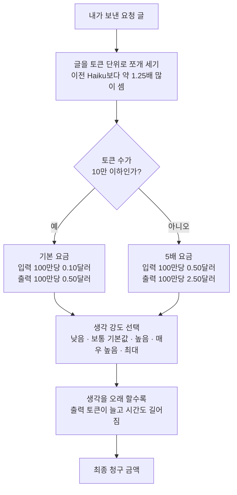

<div class="ai-knowledge-shell">

<aside class="ai-knowledge-sidebar">
  <p class="ai-eyebrow">CATEGORIES</p>
  <nav class="ai-cat-tree"><details class="ai-cat" open><summary><span class="catname">에이전트 오케스트레이션</span><span class="catcount">14</span></summary><ul><li><a href="https://altjs4510.github.io/ai_news_blog/knowledge/20260930/"><span class="kdate">2026-09-30</span><span class="ktitle">Agents you can coach: how Asana builds human-age…</span></a></li><li><a href="https://altjs4510.github.io/ai_news_blog/knowledge/20260908/"><span class="kdate">2026-09-08</span><span class="ktitle">bytedance/deer-flow — 샌드박스·메모리·서브에이전트·메시지 게이트웨이를…</span></a></li><li><a href="https://altjs4510.github.io/ai_news_blog/knowledge/20260831-openexecutive-virtual-c-suite/"><span class="kdate">2026-08-31</span><span class="ktitle">Open Executive — 8명의 전문 에이전트를 하나의 임원 목소리로</span></a></li><li><a href="https://altjs4510.github.io/ai_news_blog/knowledge/20260828/"><span class="kdate">2026-08-28</span><span class="ktitle">Google ADK for Python v2.8.0 — RemoteA2aAgent 네이…</span></a></li><li><a href="https://altjs4510.github.io/ai_news_blog/knowledge/20260826/"><span class="kdate">2026-08-26</span><span class="ktitle">apache/maka — 도구 호출·권한 결정·종료 이벤트를 append-only 로그…</span></a></li><li><a href="https://altjs4510.github.io/ai_news_blog/knowledge/20260823/"><span class="kdate">2026-08-23</span><span class="ktitle">The Evolution of the Agent Harness — 하네스가 모델 가중치…</span></a></li><li><a href="https://altjs4510.github.io/ai_news_blog/knowledge/20260805/"><span class="kdate">2026-08-05</span><span class="ktitle">TencentCloud/TencentDB-Agent-Memory — 대화·문서·코드를 …</span></a></li><li><a href="https://altjs4510.github.io/ai_news_blog/knowledge/20260726/"><span class="kdate">2026-07-26</span><span class="ktitle">citrolabs/ego-lite — 로그인된 브라우저 상태를 AI 에이전트와 공유하는…</span></a></li><li><a href="https://altjs4510.github.io/ai_news_blog/knowledge/20260717/"><span class="kdate">2026-07-17</span><span class="ktitle">After a year building agent memory, 'save everyt…</span></a></li><li><a href="https://altjs4510.github.io/ai_news_blog/knowledge/20260623/"><span class="kdate">2026-06-23</span><span class="ktitle">bytedance/deer-flow — 샌드박스·메모리·서브에이전트·메시지 게이트웨이를…</span></a></li><li><a href="https://altjs4510.github.io/ai_news_blog/knowledge/20260611/"><span class="kdate">2026-06-11</span><span class="ktitle">The evolution of agentic surfaces: building with…</span></a></li><li><a href="https://altjs4510.github.io/ai_news_blog/knowledge/20260602/"><span class="kdate">2026-06-02</span><span class="ktitle">revfactory/harness — 도메인별 에이전트 팀과 스킬을 자동 설계하는 메타…</span></a></li><li><a href="https://altjs4510.github.io/ai_news_blog/knowledge/20260529/"><span class="kdate">2026-05-29</span><span class="ktitle">Introducing dynamic workflows in Claude Code</span></a></li><li><a href="https://altjs4510.github.io/ai_news_blog/knowledge/20260507/"><span class="kdate">2026-05-07</span><span class="ktitle">ruvnet/ruflo — Claude 멀티 에이전트 오케스트레이션 플랫폼</span></a></li></ul></details><details class="ai-cat" open><summary><span class="catname">MCP &amp; 도구 통합</span><span class="catcount">18</span></summary><ul><li><a href="https://altjs4510.github.io/ai_news_blog/knowledge/20261008/"><span class="kdate">2026-10-08</span><span class="ktitle">morluto/rea — 앱 동작부터 네이티브 바이너리까지 에이전트로 역공학하는 도구</span></a></li><li><a href="https://altjs4510.github.io/ai_news_blog/knowledge/20260829/"><span class="kdate">2026-08-29</span><span class="ktitle">cursor/plugins — 플러그인 명세(specification)와 공식 플러그인…</span></a></li><li><a href="https://altjs4510.github.io/ai_news_blog/knowledge/20260802/"><span class="kdate">2026-08-02</span><span class="ktitle">Stateless MCP has recaptured my interest (and in…</span></a></li><li><a href="https://altjs4510.github.io/ai_news_blog/knowledge/20260801/"><span class="kdate">2026-08-01</span><span class="ktitle">different-ai/openwork — Claude Cowork의 오픈소스 대체 에…</span></a></li><li><a href="https://altjs4510.github.io/ai_news_blog/knowledge/20260731/"><span class="kdate">2026-07-31</span><span class="ktitle">different-ai/openwork — Claude Cowork의 오픈소스 대안(o…</span></a></li><li><a href="https://altjs4510.github.io/ai_news_blog/knowledge/20260729/"><span class="kdate">2026-07-29</span><span class="ktitle">Bringing MCP 2026-07-28 to Claude</span></a></li><li><a href="https://altjs4510.github.io/ai_news_blog/knowledge/20260722/"><span class="kdate">2026-07-22</span><span class="ktitle">tirth8205/code-review-graph — MCP·CLI용 로컬 우선 코드 …</span></a></li><li><a href="https://altjs4510.github.io/ai_news_blog/knowledge/20260721/"><span class="kdate">2026-07-21</span><span class="ktitle">tirth8205/code-review-graph — 로컬 우선 코드 인텔리전스 그래프…</span></a></li><li><a href="https://altjs4510.github.io/ai_news_blog/knowledge/20260718/"><span class="kdate">2026-07-18</span><span class="ktitle">tirth8205/code-review-graph — MCP·CLI용 로컬 코드 인텔리…</span></a></li><li><a href="https://altjs4510.github.io/ai_news_blog/knowledge/20260708/"><span class="kdate">2026-07-08</span><span class="ktitle">Expanding Managed Agents in Gemini API: backgrou…</span></a></li><li><a href="https://altjs4510.github.io/ai_news_blog/knowledge/20260618/"><span class="kdate">2026-06-18</span><span class="ktitle">DeusData/codebase-memory-mcp — 158개 언어 코드베이스를 밀리…</span></a></li><li><a href="https://altjs4510.github.io/ai_news_blog/knowledge/20260603/"><span class="kdate">2026-06-03</span><span class="ktitle">How Bad MCP design cost your Agent 5× more token…</span></a></li><li><a href="https://altjs4510.github.io/ai_news_blog/knowledge/20260526/"><span class="kdate">2026-05-26</span><span class="ktitle">colbymchenry/codegraph — Pre-indexed code knowle…</span></a></li><li><a href="https://altjs4510.github.io/ai_news_blog/knowledge/20260523/"><span class="kdate">2026-05-23</span><span class="ktitle">colbymchenry/codegraph — 사전 인덱싱된 코드 지식 그래프 MCP</span></a></li><li><a href="https://altjs4510.github.io/ai_news_blog/knowledge/20260520/"><span class="kdate">2026-05-20</span><span class="ktitle">New in Claude Managed Agents: self-hosted sandbo…</span></a></li><li><a href="https://altjs4510.github.io/ai_news_blog/knowledge/20260517/"><span class="kdate">2026-05-17</span><span class="ktitle">I gave my LLM 100,000+ tools — Lazy Discovery &a…</span></a></li><li><a href="https://altjs4510.github.io/ai_news_blog/knowledge/20260509/"><span class="kdate">2026-05-09</span><span class="ktitle">How to connect 100 MCP servers without the conte…</span></a></li><li><a href="https://altjs4510.github.io/ai_news_blog/knowledge/20260506/"><span class="kdate">2026-05-06</span><span class="ktitle">mksglu/context-mode — AI 코딩 에이전트용 컨텍스트 윈도우 최적화</span></a></li></ul></details><details class="ai-cat" open><summary><span class="catname">코딩 에이전트</span><span class="catcount">38</span></summary><ul><li><a href="https://altjs4510.github.io/ai_news_blog/knowledge/20261007/"><span class="kdate">2026-10-07</span><span class="ktitle">morluto/rea — 앱 동작부터 네이티브 바이너리까지 에이전트로 리버스 엔지니어링</span></a></li><li><a href="https://altjs4510.github.io/ai_news_blog/knowledge/20260920/"><span class="kdate">2026-09-20</span><span class="ktitle">Claude Code 2.1.277 — CLAUDE.md가 없으면 AGENTS.md를 …</span></a></li><li><a href="https://altjs4510.github.io/ai_news_blog/knowledge/20260918/"><span class="kdate">2026-09-18</span><span class="ktitle">alibaba/open-code-review — 결정론적 파이프라인 + LLM 에이전트…</span></a></li><li><a href="https://altjs4510.github.io/ai_news_blog/knowledge/20260917/"><span class="kdate">2026-09-17</span><span class="ktitle">alibaba/open-code-review — 결정론적 파이프라인과 LLM 에이전트를…</span></a></li><li><a href="https://altjs4510.github.io/ai_news_blog/knowledge/20260916/"><span class="kdate">2026-09-16</span><span class="ktitle">alibaba/open-code-review — 결정론적 파이프라인과 LLM Agent…</span></a></li><li><a href="https://altjs4510.github.io/ai_news_blog/knowledge/20260915/"><span class="kdate">2026-09-15</span><span class="ktitle">alibaba/open-code-review — 결정적 파이프라인과 LLM 에이전트를 …</span></a></li><li><a href="https://altjs4510.github.io/ai_news_blog/knowledge/20260912/"><span class="kdate">2026-09-12</span><span class="ktitle">Quoting Boris Cherny — 'Claude가 쓴 프로덕션 코드는 사람이 쓴…</span></a></li><li><a href="https://altjs4510.github.io/ai_news_blog/knowledge/20260910/"><span class="kdate">2026-09-10</span><span class="ktitle">vastsa/PI-Desktop — Electron + Rust 호스트 코어 + 에이전…</span></a></li><li><a href="https://altjs4510.github.io/ai_news_blog/knowledge/20260906/"><span class="kdate">2026-09-06</span><span class="ktitle">DietrichGebert/ponytail — 에이전트를 '방에서 가장 게으른 시니어 …</span></a></li><li><a href="https://altjs4510.github.io/ai_news_blog/knowledge/20260903/"><span class="kdate">2026-09-03</span><span class="ktitle">pacifio/atlas — 여러 코딩 에이전트의 변경을 한곳에서 추적·질의하는 '에이…</span></a></li><li><a href="https://altjs4510.github.io/ai_news_blog/knowledge/20260901/"><span class="kdate">2026-09-01</span><span class="ktitle">affaan-m/ECC — 스킬·본능·메모리·보안을 묶은 에이전트 하네스 성능 최적화 …</span></a></li><li><a href="https://altjs4510.github.io/ai_news_blog/knowledge/20260831-gitnexus-code-knowledge-graph/"><span class="kdate">2026-08-31</span><span class="ktitle">GitNexus — 코드베이스를 지식그래프로 바꿔 에이전트에게 쥐어주기</span></a></li><li><a href="https://altjs4510.github.io/ai_news_blog/knowledge/20260822/"><span class="kdate">2026-08-22</span><span class="ktitle">mattpocock/skills — Skills for Real Engineers (하…</span></a></li><li><a href="https://altjs4510.github.io/ai_news_blog/knowledge/20260820/"><span class="kdate">2026-08-20</span><span class="ktitle">akitaonrails/ai-memory — 코딩 에이전트 CLI의 장기 메모리와 벤더…</span></a></li><li><a href="https://altjs4510.github.io/ai_news_blog/knowledge/20260819/"><span class="kdate">2026-08-19</span><span class="ktitle">akitaonrails/ai-memory — 코딩 에이전트 CLI 간 장기 기억과 벤더…</span></a></li><li><a href="https://altjs4510.github.io/ai_news_blog/knowledge/20260814/"><span class="kdate">2026-08-14</span><span class="ktitle">cathrynlavery/diagram-design — Claude Code용 에디토리…</span></a></li><li><a href="https://altjs4510.github.io/ai_news_blog/knowledge/20260811/"><span class="kdate">2026-08-11</span><span class="ktitle">PrimeIntellect-ai/prime-agent — 장기 자율 실행을 전제로 설계…</span></a></li><li><a href="https://altjs4510.github.io/ai_news_blog/knowledge/20260810/"><span class="kdate">2026-08-10</span><span class="ktitle">Auto mode is now the default in Claude Code for …</span></a></li><li><a href="https://altjs4510.github.io/ai_news_blog/knowledge/20260809/"><span class="kdate">2026-08-09</span><span class="ktitle">PrimeIntellect-ai/prime-agent — 코딩 워크플로우·장기 자율 작…</span></a></li><li><a href="https://altjs4510.github.io/ai_news_blog/knowledge/20260808/"><span class="kdate">2026-08-08</span><span class="ktitle">PrimeIntellect-ai/prime-agent — 코딩 워크플로우와 장시간 자율…</span></a></li><li><a href="https://altjs4510.github.io/ai_news_blog/knowledge/20260804/"><span class="kdate">2026-08-04</span><span class="ktitle">esengine/DeepSeek-Reasonix — prefix-cache 안정성을 축…</span></a></li><li><a href="https://altjs4510.github.io/ai_news_blog/knowledge/20260728/"><span class="kdate">2026-07-28</span><span class="ktitle">alibaba/open-code-review — 결정론적 파이프라인 + LLM 에이전트…</span></a></li><li><a href="https://altjs4510.github.io/ai_news_blog/knowledge/20260719/"><span class="kdate">2026-07-19</span><span class="ktitle">tirth8205/code-review-graph — 로컬 우선 코드 인텔리전스 그래프…</span></a></li><li><a href="https://altjs4510.github.io/ai_news_blog/knowledge/20260714/"><span class="kdate">2026-07-14</span><span class="ktitle">Graphify-Labs/graphify — 코드베이스를 질의 가능한 지식 그래프로 만…</span></a></li><li><a href="https://altjs4510.github.io/ai_news_blog/knowledge/20260707/"><span class="kdate">2026-07-07</span><span class="ktitle">AI Hero Skills Catalog — 실무 엔지니어를 위한 재사용 가능한 판단 …</span></a></li><li><a href="https://altjs4510.github.io/ai_news_blog/knowledge/20260705/"><span class="kdate">2026-07-05</span><span class="ktitle">openai/codex-plugin-cc — Claude Code에서 Codex를 위임…</span></a></li><li><a href="https://altjs4510.github.io/ai_news_blog/knowledge/20260701/"><span class="kdate">2026-07-01</span><span class="ktitle">Google OKF (Open Knowledge Format) — 벤더 중립 에이전트 …</span></a></li><li><a href="https://altjs4510.github.io/ai_news_blog/knowledge/20260626/"><span class="kdate">2026-06-26</span><span class="ktitle">google-labs-code/design.md — 코딩 에이전트에게 디자인 시스템을 …</span></a></li><li><a href="https://altjs4510.github.io/ai_news_blog/knowledge/20260619/"><span class="kdate">2026-06-19</span><span class="ktitle">Claude Code now supports artifacts</span></a></li><li><a href="https://altjs4510.github.io/ai_news_blog/knowledge/20260530/"><span class="kdate">2026-05-30</span><span class="ktitle">Leonxlnx/taste-skill — AI에게 좋은 취향을 부여해 generic s…</span></a></li><li><a href="https://altjs4510.github.io/ai_news_blog/knowledge/20260528/"><span class="kdate">2026-05-28</span><span class="ktitle">Building self-improving tax agents with Codex</span></a></li><li><a href="https://altjs4510.github.io/ai_news_blog/knowledge/20260524/"><span class="kdate">2026-05-24</span><span class="ktitle">colbymchenry/codegraph — Pre-indexed code knowle…</span></a></li><li><a href="https://altjs4510.github.io/ai_news_blog/knowledge/20260521/"><span class="kdate">2026-05-21</span><span class="ktitle">colbymchenry/codegraph — Pre-indexed code knowle…</span></a></li><li><a href="https://altjs4510.github.io/ai_news_blog/knowledge/20260512/"><span class="kdate">2026-05-12</span><span class="ktitle">agentmemory — Persistent memory for AI coding ag…</span></a></li><li><a href="https://altjs4510.github.io/ai_news_blog/knowledge/20260510/"><span class="kdate">2026-05-10</span><span class="ktitle">addyosmani/agent-skills — Production-grade engin…</span></a></li><li><a href="https://altjs4510.github.io/ai_news_blog/knowledge/20260508/"><span class="kdate">2026-05-08</span><span class="ktitle">addyosmani/agent-skills — Production-grade engin…</span></a></li><li><a href="https://altjs4510.github.io/ai_news_blog/knowledge/20260505/"><span class="kdate">2026-05-05</span><span class="ktitle">mattpocock/skills — Skills for Real Engineers (.…</span></a></li><li><a href="https://altjs4510.github.io/ai_news_blog/knowledge/20260504/"><span class="kdate">2026-05-04</span><span class="ktitle">Agents for Everything Else: Codex for Knowledge …</span></a></li></ul></details><details class="ai-cat" open><summary><span class="catname">모델 &amp; 연구</span><span class="catcount">10</span></summary><ul><li><a href="https://altjs4510.github.io/ai_news_blog/knowledge/20261009/" class="current"><span class="kdate">2026-10-09</span><span class="ktitle">Claude Haiku 5.5 (Simon Willison의 출시 노트와 가격 분석)</span></a></li><li><a href="https://altjs4510.github.io/ai_news_blog/knowledge/20260929/"><span class="kdate">2026-09-29</span><span class="ktitle">vectorize-io/hindsight — Hindsight: Agent Memory…</span></a></li><li><a href="https://altjs4510.github.io/ai_news_blog/knowledge/20260907-voicemem-dual-brain-memory/"><span class="kdate">2026-09-07</span><span class="ktitle">VoiceMem — 좌뇌·우뇌로 쪼갠 스트리밍 메모리로 음성 에이전트 지연 없애기</span></a></li><li><a href="https://altjs4510.github.io/ai_news_blog/knowledge/20260904/"><span class="kdate">2026-09-04</span><span class="ktitle">HarnessDev: Can LLMs Create and Evolve Their Own…</span></a></li><li><a href="https://altjs4510.github.io/ai_news_blog/knowledge/20260725/"><span class="kdate">2026-07-25</span><span class="ktitle">The new rules of context engineering for Claude …</span></a></li><li><a href="https://altjs4510.github.io/ai_news_blog/knowledge/20260716-proprag/"><span class="kdate">2026-07-16</span><span class="ktitle">PropRAG — 프로포지션 경로 위 beam search로 멀티홉 검색 안내</span></a></li><li><a href="https://altjs4510.github.io/ai_news_blog/knowledge/20260712/"><span class="kdate">2026-07-12</span><span class="ktitle">Do Automated Evals Work?</span></a></li><li><a href="https://altjs4510.github.io/ai_news_blog/knowledge/20260620/"><span class="kdate">2026-06-20</span><span class="ktitle">zai-org/GLM-5 — From Vibe Coding to Agentic Engi…</span></a></li><li><a href="https://altjs4510.github.io/ai_news_blog/knowledge/20260516/"><span class="kdate">2026-05-16</span><span class="ktitle">STALE — 에이전트가 자기 기억의 유효성을 인지할 수 있는가</span></a></li><li><a href="https://altjs4510.github.io/ai_news_blog/knowledge/20260513/"><span class="kdate">2026-05-13</span><span class="ktitle">Thinking Machines' Native Interaction Models — T…</span></a></li></ul></details><details class="ai-cat" open><summary><span class="catname">인프라 &amp; 컴퓨트</span><span class="catcount">11</span></summary><ul><li><a href="https://altjs4510.github.io/ai_news_blog/knowledge/20260905/"><span class="kdate">2026-09-05</span><span class="ktitle">magnitudedev/magnitude — 하드웨어에 맞는 최적 로컬 모델을 띄워 이…</span></a></li><li><a href="https://altjs4510.github.io/ai_news_blog/knowledge/20260821/"><span class="kdate">2026-08-21</span><span class="ktitle">volcengine/OpenViking — 에이전트 메모리·Knowledge RAG·스…</span></a></li><li><a href="https://altjs4510.github.io/ai_news_blog/knowledge/20260813/"><span class="kdate">2026-08-13</span><span class="ktitle">semantica-agi/semantica — 컨텍스트와 책임 추적을 위한 그래프 네이…</span></a></li><li><a href="https://altjs4510.github.io/ai_news_blog/knowledge/20260806/"><span class="kdate">2026-08-06</span><span class="ktitle">cloudflare/computer — 에이전트에게 컴퓨터를 통째로 주는 엣지 실행 샌…</span></a></li><li><a href="https://altjs4510.github.io/ai_news_blog/knowledge/20260724/"><span class="kdate">2026-07-24</span><span class="ktitle">diegosouzapw/OmniRoute — 단일 엔드포인트로 278+ 프로바이더·50…</span></a></li><li><a href="https://altjs4510.github.io/ai_news_blog/knowledge/20260723/"><span class="kdate">2026-07-23</span><span class="ktitle">diegosouzapw/OmniRoute — 268+ 프로바이더를 단일 엔드포인트로 묶…</span></a></li><li><a href="https://altjs4510.github.io/ai_news_blog/knowledge/20260610/"><span class="kdate">2026-06-10</span><span class="ktitle">Fable 5 just made cost-aware model routing manda…</span></a></li><li><a href="https://altjs4510.github.io/ai_news_blog/knowledge/20260606/"><span class="kdate">2026-06-06</span><span class="ktitle">chopratejas/headroom — Compress tool outputs, lo…</span></a></li><li><a href="https://altjs4510.github.io/ai_news_blog/knowledge/20260605/"><span class="kdate">2026-06-05</span><span class="ktitle">chopratejas/headroom — Compress tool outputs, lo…</span></a></li><li><a href="https://altjs4510.github.io/ai_news_blog/knowledge/20260604/"><span class="kdate">2026-06-04</span><span class="ktitle">chopratejas/headroom — Compress tool outputs bef…</span></a></li><li><a href="https://altjs4510.github.io/ai_news_blog/knowledge/20260522/"><span class="kdate">2026-05-22</span><span class="ktitle">Giving Agents Computers — Ivan Burazin, Daytona</span></a></li></ul></details><details class="ai-cat" open><summary><span class="catname">보안 &amp; 거버넌스</span><span class="catcount">26</span></summary><ul><li><a href="https://altjs4510.github.io/ai_news_blog/knowledge/20261004/"><span class="kdate">2026-10-04</span><span class="ktitle">Apple says it's tightening macOS 'Full Disk Acce…</span></a></li><li><a href="https://altjs4510.github.io/ai_news_blog/knowledge/20261003/"><span class="kdate">2026-10-03</span><span class="ktitle">NVIDIA/OpenShell — 자율 AI 에이전트를 위한 안전하고 프라이빗한 런타임…</span></a></li><li><a href="https://altjs4510.github.io/ai_news_blog/knowledge/20261002/"><span class="kdate">2026-10-02</span><span class="ktitle">NVIDIA/OpenShell — 자율 AI 에이전트를 위한 안전하고 프라이빗한 런타임…</span></a></li><li><a href="https://altjs4510.github.io/ai_news_blog/knowledge/20261001/"><span class="kdate">2026-10-01</span><span class="ktitle">NVIDIA/OpenShell</span></a></li><li><a href="https://altjs4510.github.io/ai_news_blog/knowledge/20260919/"><span class="kdate">2026-09-19</span><span class="ktitle">cloudflare/security-audit-skill — 다단계 보안 감사를 '독립…</span></a></li><li><a href="https://altjs4510.github.io/ai_news_blog/knowledge/20260913/"><span class="kdate">2026-09-13</span><span class="ktitle">OpenAI agents attacked RubyGems back in May: Ope…</span></a></li><li><a href="https://altjs4510.github.io/ai_news_blog/knowledge/20260902/"><span class="kdate">2026-09-02</span><span class="ktitle">AIR raises $50M to help companies vet the skills…</span></a></li><li><a href="https://altjs4510.github.io/ai_news_blog/knowledge/20260827/"><span class="kdate">2026-08-27</span><span class="ktitle">Claude in Chrome is generally available</span></a></li><li><a href="https://altjs4510.github.io/ai_news_blog/knowledge/20260819-mind-viruses/"><span class="kdate">2026-08-19</span><span class="ktitle">탈옥도, 인젝션도 없이 — 대화로만 퍼지는 에이전트의 '마인드 바이러스'</span></a></li><li><a href="https://altjs4510.github.io/ai_news_blog/knowledge/20260812/"><span class="kdate">2026-08-12</span><span class="ktitle">semantica-agi/semantica — 컨텍스트와 '책임 추적 가능한(accou…</span></a></li><li><a href="https://altjs4510.github.io/ai_news_blog/knowledge/20260730/"><span class="kdate">2026-07-30</span><span class="ktitle">Anatomy of a Frontier Lab Agent Intrusion: A Tec…</span></a></li><li><a href="https://altjs4510.github.io/ai_news_blog/knowledge/20260716/"><span class="kdate">2026-07-16</span><span class="ktitle">Dicklesworthstone/destructive_command_guard — 에이…</span></a></li><li><a href="https://altjs4510.github.io/ai_news_blog/knowledge/20260715/"><span class="kdate">2026-07-15</span><span class="ktitle">Dicklesworthstone/destructive_command_guard — 에이…</span></a></li><li><a href="https://altjs4510.github.io/ai_news_blog/knowledge/20260710/"><span class="kdate">2026-07-10</span><span class="ktitle">70개 MCP 서버 strace 런타임 감사 — 부팅 시 아웃바운드 호출 서버 적발</span></a></li><li><a href="https://altjs4510.github.io/ai_news_blog/knowledge/20260704/"><span class="kdate">2026-07-04</span><span class="ktitle">Cloudflare is about to block AI agents by defaul…</span></a></li><li><a href="https://altjs4510.github.io/ai_news_blog/knowledge/20260703/"><span class="kdate">2026-07-03</span><span class="ktitle">Giving admins more visibility and control over C…</span></a></li><li><a href="https://altjs4510.github.io/ai_news_blog/knowledge/20260630/"><span class="kdate">2026-06-30</span><span class="ktitle">Introducing the Claude apps gateway for Amazon B…</span></a></li><li><a href="https://altjs4510.github.io/ai_news_blog/knowledge/20260625/"><span class="kdate">2026-06-25</span><span class="ktitle">Agent identity in Claude Tag: a new access model…</span></a></li><li><a href="https://altjs4510.github.io/ai_news_blog/knowledge/20260624/"><span class="kdate">2026-06-24</span><span class="ktitle">Agent identity in Claude Tag: a new access model…</span></a></li><li><a href="https://altjs4510.github.io/ai_news_blog/knowledge/20260617/"><span class="kdate">2026-06-17</span><span class="ktitle">Predicting model behavior before release by simu…</span></a></li><li><a href="https://altjs4510.github.io/ai_news_blog/knowledge/20260614/"><span class="kdate">2026-06-14</span><span class="ktitle">NVIDIA/SkillSpector — Security scanner for AI ag…</span></a></li><li><a href="https://altjs4510.github.io/ai_news_blog/knowledge/20260613/"><span class="kdate">2026-06-13</span><span class="ktitle">Fable 5's guardrails got bypassed in 48 hours — …</span></a></li><li><a href="https://altjs4510.github.io/ai_news_blog/knowledge/20260612/"><span class="kdate">2026-06-12</span><span class="ktitle">NVIDIA/SkillSpector — AI 에이전트 스킬용 보안 스캐너</span></a></li><li><a href="https://altjs4510.github.io/ai_news_blog/knowledge/20260607/"><span class="kdate">2026-06-07</span><span class="ktitle">OpenAI Help: Lockdown Mode</span></a></li><li><a href="https://altjs4510.github.io/ai_news_blog/knowledge/20260531/"><span class="kdate">2026-05-31</span><span class="ktitle">How we contain Claude across products</span></a></li><li><a href="https://altjs4510.github.io/ai_news_blog/knowledge/20260527/"><span class="kdate">2026-05-27</span><span class="ktitle">Microsoft Copilot Cowork Exfiltrates Files</span></a></li></ul></details><details class="ai-cat" open><summary><span class="catname">응용 사례</span><span class="catcount">8</span></summary><ul><li><a href="https://altjs4510.github.io/ai_news_blog/knowledge/20261006/"><span class="kdate">2026-10-06</span><span class="ktitle">How Cresta turned CX expertise into an agent bui…</span></a></li><li><a href="https://altjs4510.github.io/ai_news_blog/knowledge/20260911/"><span class="kdate">2026-09-11</span><span class="ktitle">Now everyone can put data to work — ChatGPT Work…</span></a></li><li><a href="https://altjs4510.github.io/ai_news_blog/knowledge/20260909/"><span class="kdate">2026-09-09</span><span class="ktitle">Reducing cost and improving performance with Cla…</span></a></li><li><a href="https://altjs4510.github.io/ai_news_blog/knowledge/20260709/"><span class="kdate">2026-07-09</span><span class="ktitle">mvanhorn/last30days-skill — Reddit·X·YouTube·HN·…</span></a></li><li><a href="https://altjs4510.github.io/ai_news_blog/knowledge/20260621/"><span class="kdate">2026-06-21</span><span class="ktitle">calesthio/OpenMontage — 12 파이프라인·52 도구·500+ 스킬을 …</span></a></li><li><a href="https://altjs4510.github.io/ai_news_blog/knowledge/20260609/"><span class="kdate">2026-06-09</span><span class="ktitle">Building intelligent apps for Apple platforms wi…</span></a></li><li><a href="https://altjs4510.github.io/ai_news_blog/knowledge/20260515/"><span class="kdate">2026-05-15</span><span class="ktitle">Clawdmeter — Claude Code 사용량을 데스크톱 대시보드로</span></a></li><li><a href="https://altjs4510.github.io/ai_news_blog/knowledge/20260514/"><span class="kdate">2026-05-14</span><span class="ktitle">Introducing Claude for Small Business</span></a></li></ul></details><details class="ai-cat" open><summary><span class="catname">산업 동향</span><span class="catcount">6</span></summary><ul><li><a href="https://altjs4510.github.io/ai_news_blog/knowledge/20260907-humanmade-52week-rhythm/"><span class="kdate">2026-09-07</span><span class="ktitle">휴먼 메이드의 '52주 리듬' — 아이디어가 흔해진 시대에 값이 오르는 건 버리는 판단</span></a></li><li><a href="https://altjs4510.github.io/ai_news_blog/knowledge/20260830/"><span class="kdate">2026-08-30</span><span class="ktitle">[AINews] OpenAI shuts off Cursor — 프론티어 모델 공급 차단…</span></a></li><li><a href="https://altjs4510.github.io/ai_news_blog/knowledge/20260711/"><span class="kdate">2026-07-11</span><span class="ktitle">OpenAI says GPT 5.6 is the 'preferred model' for…</span></a></li><li><a href="https://altjs4510.github.io/ai_news_blog/knowledge/20260702/"><span class="kdate">2026-07-02</span><span class="ktitle">How Cursor deploys AI inside the enterprise (For…</span></a></li><li><a href="https://altjs4510.github.io/ai_news_blog/knowledge/20260616/"><span class="kdate">2026-06-16</span><span class="ktitle">Why AI hasn't replaced software engineers, and w…</span></a></li><li><a href="https://altjs4510.github.io/ai_news_blog/knowledge/20260519/"><span class="kdate">2026-05-19</span><span class="ktitle">Anthropic acquires Stainless</span></a></li></ul></details></nav>
</aside>

<article class="ai-knowledge-article">

<header class="ai-post-hero">
  <p class="ai-eyebrow"><a class="ai-back" href="../">KNOWLEDGE</a> · 2026-10-09 · 오늘의 학습</p>
  <h2 class="ai-post-title">Claude Haiku 5.5 (Simon Willison의 출시 노트와 가격 분석)</h2>
</header>

> 원문: [Claude Haiku 5.5 (Simon Willison의 출시 노트와 가격 분석)](https://simonwillison.net/2026/Oct/7/claude-haiku-5-5/)

## 📌 학습 정리

### 1. 한 줄로 말하면

Anthropic이 빠르고 저렴하게 쓰는 AI 모델 'Haiku'의 새 버전을 1년 만에 내놓았어요. 짧은 작업에서는 경쟁 모델과 값은 같고 성능은 더 좋다고 해요. 다만 긴 글을 넣으면 값이 꽤 올라가는 구조라, 어떤 작업에 쓰는지에 따라 유리할 수도 있고 손해일 수도 있어요.

### 2. 왜 이게 만들어졌어요?

이전 버전인 Haiku 4.5는 [거의 1년 전](https://simonwillison.net/2025/Oct/15/claude-haiku-45/)에 나왔어요. 입력 100만 토큰에 1달러, 출력 100만 토큰에 5달러를 받았는데, 그때 기준으로도 비싼 편이었어요. 그런데 지난달 OpenAI가 [GPT-6 Luna](https://simonwillison.net/2026/Sep/22/opus-and-sol-and-luna/#gpt-6-sol-and-luna-are-half-the-price-of-their-gpt-5-6-equivalents)를 내놓으면서 격차가 크게 벌어졌어요. Luna는 Haiku 4.5보다 가격이 10분의 1이었거든요. 결국 "싸고 빠른 모델" 자리에서 Haiku가 많이 밀린 상태였고, 이번 Haiku 5.5는 Luna와 가격을 똑같이 맞추고 성능을 끌어올려서 나왔어요.

### 3. 비유로 풀면

새 Haiku의 요금제는 휴대폰 데이터 요금제와 비슷해요. 정해진 양(10만 토큰)까지는 아주 싼 기본 요금이 붙어요. 그 선을 넘으면 단가가 갑자기 5배로 뛰어요. 경쟁 상품인 Luna는 기준선이 더 높고(27만 2천 토큰), 넘어도 단가가 2배 남짓만 올라요.

여기에 눈에 잘 안 띄는 차이가 하나 더 있어요. 같은 거리를 달려도 계량기가 더 빨리 올라가는 택시를 생각해 보세요. Haiku 5.5는 글을 세는 방식이 바뀌어서, 같은 글을 넣어도 예전보다 약 1.25배 많은 양으로 계산해요.

그래서 결국 표에 적힌 가격만 보지 말고, 내 작업에 보통 글이 얼마나 길게 들어가는지부터 확인해야 어느 모델이 실제로 싼지 판단할 수 있어요.

### 4. 어떻게 작동하는지 (그림으로)



요청을 보내면 먼저 글이 토큰으로 쪼개져 계산돼요. 이때 새 계산 방식 때문에 같은 글도 예전보다 토큰이 더 많이 나와요. 그다음 전체 길이가 10만 토큰 안쪽인지에 따라 단가가 정해지고, 마지막으로 "얼마나 깊게 생각할지" 단계에 따라 출력량과 걸리는 시간이 달라져요.

참고로 글쓴이가 '자전거 타는 펠리컨 그림'을 시켜 본 결과가 있어요. 가장 낮은 단계에서는 0.0936센트에 7초가 걸렸어요. 가장 높은 단계에서는 5분 9초나 걸렸는데도 비용은 3.3826센트였어요. 1년 전 Haiku 4.5로 같은 그림을 그렸을 때는 0.7583센트가 들었고, 결과물은 꽤 엉성했다고 해요.

### 5. 처음 보는 용어 풀이

- **토큰 (token)** — AI가 글을 처리할 때 쓰는 작은 조각 단위예요. 요금도 글자 수가 아니라 이 조각 수로 매기기 때문에, 몇 개로 쪼개지는지가 곧 비용이에요.
- **글 쪼개는 규칙 (tokenizer)** — 글을 토큰으로 나누는 방식이에요. Haiku 5.5는 이 방식이 바뀌어서 같은 글이 약 1.25배 많은 토큰으로 계산돼요. 가격표에는 드러나지 않지만 사실상 값이 오른 셈이에요.
- **입력·출력 요금 (input / output price)** — 내가 모델에 보내는 글(입력)과 모델이 돌려주는 글(출력)에 각각 다른 단가가 붙어요. 보통 출력 쪽이 더 비싸요.
- **생각 강도 (reasoning / thinking effort)** — 모델이 답하기 전에 속으로 얼마나 오래 따져 볼지 정하는 설정이에요. Haiku 5.5는 이 기능을 끌 수 없고, 기본값은 '보통(medium)'이에요.
- **생각 과정 기록 (reasoning trace)** — 모델이 답을 내기 전에 거친 중간 생각을 글로 남긴 거예요. 이번 테스트에서는 모델이 "이거 유명한 펠리컨 시험이네"라고 알아채는 대목이 보여서, 글쓴이가 다른 엉뚱한 그림 주제로도 한 번 더 시험해 봤어요.
- **캐시 읽기 (cache read)** — 앞에서 보낸 글을 저장해 두었다가 다시 쓸 때 붙는 요금이에요. 이번에 Sonnet 5.5의 캐시 읽기 가격이 절반으로 내려갔어요.
- **API 크레딧 (API credits)** — 프로그램이 AI를 직접 부를 때 쓰는 선불 금액이에요. 이번부터 Max·Team 구독자에게 매달 지급되는데, 남은 금액은 다음 달로 넘어가지 않아요.

### 6. 한 발 더 들어가고 싶다면

- [Introducing Claude Haiku 5.5](https://www.anthropic.com/claude-haiku-5-5) — 이걸 보면 Anthropic이 직접 밝힌 출시 내용과 성능 설명을 확인할 수 있어요.
- [Claude Token Counter](https://tools.simonwillison.net/claude-token-counter) — 이걸 보면 내 글이 모델마다 토큰 몇 개로 계산되는지 직접 비교해 볼 수 있어요.
- [pelicans for low, medium, high, xhigh, and max](https://tools.simonwillison.net/markdown-svg-renderer?url=https%3A%2F%2Fgist.github.com%2Fsimonw%2F485dfa24b4efa1267ee2d0911594fb81) — 이걸 보면 생각 강도에 따라 그림 결과가 어떻게 달라지는지 한눈에 비교할 수 있어요.
- [monthly credits do not roll over](https://support.claude.com/en/articles/17154008-monthly-api-credits-for-max-and-team-plans#h_dfc1659cee) — 이걸 보면 구독자용 월간 API 크레딧이 어떤 조건으로 지급되고 사라지는지 알 수 있어요.
- [risk of a nasty billing surprise](https://simonwillison.net/2026/Oct/3/default-hard-budget-caps/) — 이걸 보면 API 요금이 예상보다 많이 나오는 일을 막으려면 지출 상한을 왜 걸어 둬야 하는지 알 수 있어요.

---

## 📖 원문 전체 번역 (정독용)

> 의역 최소화한 전체 번역입니다. 큰 흐름은 위 정리에서 잡고, 정확한 워딩이 필요할 땐 이 섹션에서 정독하세요.

2026년 10월 7일

[예고](https://simonwillison.net/2026/Sep/28/claude-sonnet-5-5/)된 대로, Anthropic의 새로운 빠르고 저렴한 모델이 나왔습니다: [Claude Haiku 5.5 소개](https://www.anthropic.com/claude-haiku-5-5).

이전 Haiku인 4.5는 나이가 많이 느껴졌습니다. [거의 1년 전](https://simonwillison.net/2025/Oct/15/claude-haiku-45/)에 나왔고, 가격은 입력 100만 토큰당 $1, 출력 100만 토큰당 $5였습니다. 당시에도 상대적으로 비쌌고, 지난달 출시된 OpenAI의 [GPT-6 Luna](https://simonwillison.net/2026/Sep/22/opus-and-sol-and-luna/#gpt-6-sol-and-luna-are-half-the-price-of-their-gpt-5-6-equivalents)와 비교하면 가격이 무려 10배였습니다.

새 Haiku는 100,000 토큰까지는 GPT-6 Luna의 가격($0.10/$0.50)과 정확히 같습니다. 100,000 토큰을 넘으면 가격이 5배 올라 $0.50/$2.50이 됩니다. Luna 자체도 272,000 토큰에서 가격이 오르지만 $0.20/$0.75까지만 오릅니다.

Haiku 5.5는 또한 덜 관대한 새 토크나이저를 사용합니다. 제 [Claude Token Counter](https://tools.simonwillison.net/claude-token-counter) 도구로 확인해 보니, 같은 긴 프롬프트가 Haiku 4.5 대비 Haiku 5.5에서 약 1.25배의 토큰을 사용합니다. 즉 숨겨진 가격 인상이 있는 셈입니다.

워크로드가 100,000 토큰 안에 들어온다면 Haiku는 Luna와 가격이 같으면서 더 높은 벤치마크 점수를 보고합니다. 100,000 토큰을 넘으면 Luna가 훨씬 더 나은 거래로 보입니다.

[llm-anthropic의 최근 릴리스](https://github.com/simonw/llm-anthropic/releases/tag/0.30)에서 마침내 문제가 고쳐져서, 새 모델이 나올 때마다 그 플러그인의 새 버전을 배포하지 않아도 됩니다. 저는 새 모델을 다음과 같이 테스트했습니다:

```
llm install -U llm-anthropic
llm anthropic refresh
llm -m claude-haiku-5.5 "Generate an SVG of a pelican riding a bicycle" -o thinking_effort low
```

#### 펠리컨[#](https://simonwillison.net/2026/Oct/7/claude-haiku-5-5/#pelicans)

여기 [low, medium, high, xhigh, max 각각의 펠리컨](https://tools.simonwillison.net/markdown-svg-renderer?url=https%3A%2F%2Fgist.github.com%2Fsimonw%2F485dfa24b4efa1267ee2d0911594fb81)이 있습니다. 새 Haiku는 추론(reasoning)을 끌 수 없고, 기본값은 `medium`입니다. `low`를 넘는 모든 설정에서 자전거 프레임이 잘 나왔습니다. [low effort 펠리컨](https://tools.simonwillison.net/markdown-svg-renderer?url=https%3A%2F%2Fgist.github.com%2Fsimonw%2F485dfa24b4efa1267ee2d0911594fb81#response)은 비용이 0.0936센트, 소요 시간이 7초였습니다.

이 `max` effort 펠리컨([추론 트레이스](https://tools.simonwillison.net/markdown-svg-renderer?url=https%3A%2F%2Fgist.github.com%2Fsimonw%2F485dfa24b4efa1267ee2d0911594fb81#reasoning-3)는 "This is the classic pelican-on-bicycle SVG test..."로 시작합니다)는 생성하는 데 5분 9초가 걸렸지만, 그래도 비용은 [3.3826센트](https://www.llm-prices.com/#it=27&ot=67647&sel=claude-haiku-5.5)에 불과했습니다:


(추론 트레이스에서 이 벤치마크를 인식하고 있음이 드러나므로, [화성에서 그물 타이츠를 신고 무단횡단하는 아르마딜로의 SVG를 생성하라(xhigh)](https://tools.simonwillison.net/markdown-svg-renderer?url=https%3A%2F%2Fgist.github.com%2Fsimonw%2F375ae4f2bb68999976b8da50548c788d#response)는 프롬프트의 결과와, 같은 프롬프트를 [최근 다른 모델들](https://tools.simonwillison.net/markdown-svg-renderer?url=https%3A%2F%2Fgist.github.com%2Fsimonw%2F18c9f7fc3b3705cf88514cb9170ec246)에 돌린 결과도 함께 올립니다. [이에 대한 배경](https://news.ycombinator.com/item?id=49977979#49982139).)

비교를 위해, 1년 전 Haiku 4.5에서 [얻은 펠리컨](https://simonwillison.net/2025/Oct/15/claude-haiku-45/)을 보여드립니다([0.7583센트](https://www.llm-prices.com/#it=18&ot=1513&ic=1&oc=5) 소요—Haiku 4.5는 추론 레벨을 지원하지 않았습니다). 펠리컨을 그리는 데는 _형편없었습니다_:


#### 그리고 구독자를 위한 넉넉한 API 크레딧 제도[#](https://simonwillison.net/2026/Oct/7/claude-haiku-5-5/#api-credits)

Haiku 5.5와 더불어, Anthropic은 오늘 Sonnet 5.5의 캐시 읽기(cache read) 가격을 절반으로 인하한다고 발표했습니다. 또한 구독 플랜에 API 크레딧을 추가했습니다:

> 둘째, 이번 주에 **모든 Max 및 Team 구독자에게 Claude Platform에서 사용할 수 있는 새로운 월간 API 크레딧**을 순차적으로 제공합니다. Max 5x 사용자는 월 $100, Max 20x 사용자는 $200의 크레딧을 받고, Team 구독자는 사용자 간에 풀링되는 최대 $500를 받게 됩니다.

받는 방법은 기분 좋을 만큼 쉽습니다. [Settings -> Billing](https://claude.ai/new#settings/billing)으로 이동해 매월 크레딧의 혜택을 받을 API 조직을 선택하면 됩니다:

![이미지 3: 우측 상단에 닫기 X 버튼이 있고 "General", "Account", "Privacy", "Billing"(선택됨), "Usage", "Capabilities", "Memory", "Design sys"(가장자리에서 잘림) 탭이 한 줄로 늘어선 Settings 대화상자의 스크린샷. 동그란 꽃봉오리가 달린 가지 친 식물의 선화 아이콘 옆에 "Max plan", "20x more usage than Pro", "Your subscription will auto renew on Nov 2, 2026."이 표시되고 오른쪽에 "Adjust plan" 버튼이 있다. 그 아래에는 파란색 "New" 배지가 붙은 "API credits" 섹션이 있으며, "Your Max 20x plan includes $200 USD in API credits each month."라는 문구와 회색 글씨 "Link an API organization to start receiving credits.", 그리고 오른쪽의 "Link organization" 버튼이 있다.](https://static.simonwillison.net/static/2026-10-07/claude-credits.webp)

API 크레딧은 구독료 자체와 정확히 일치합니다. 이는 정말 후한 조치로, 구독자가 API를 훨씬 쉽게 쓸 수 있게 해 줍니다. Anthropic은 또한 API의 자동 충전(auto-reload)을 끌 수 있게 해 주는데, 그 결과 "잔액이 소진되면 API 요청이 중단됩니다". 이는 [끔찍한 청구서 깜짝 사고의 위험](https://simonwillison.net/2026/Oct/3/default-hard-budget-caps/) 없이 그 API 크레딧을 다 써 버릴 계획이라면 정확히 원하는 동작입니다.

월간 크레딧은 [이월되지 않는다](https://support.claude.com/en/articles/17154008-monthly-api-credits-for-max-and-team-plans#h_dfc1659cee)는 점에 유의하세요. 쓰지 않으면 사라집니다.

OpenAI는 여전히 Codex 구독을 개인 API 용도로 쓸 수 있게 해 주며, 이는 API를 많이 쓰는 사용자에게 더 나은 조건입니다. 이번 새 크레딧 제도는 그 차이를 적어도 어느 정도는 메워 줍니다.

</article>

</div>
