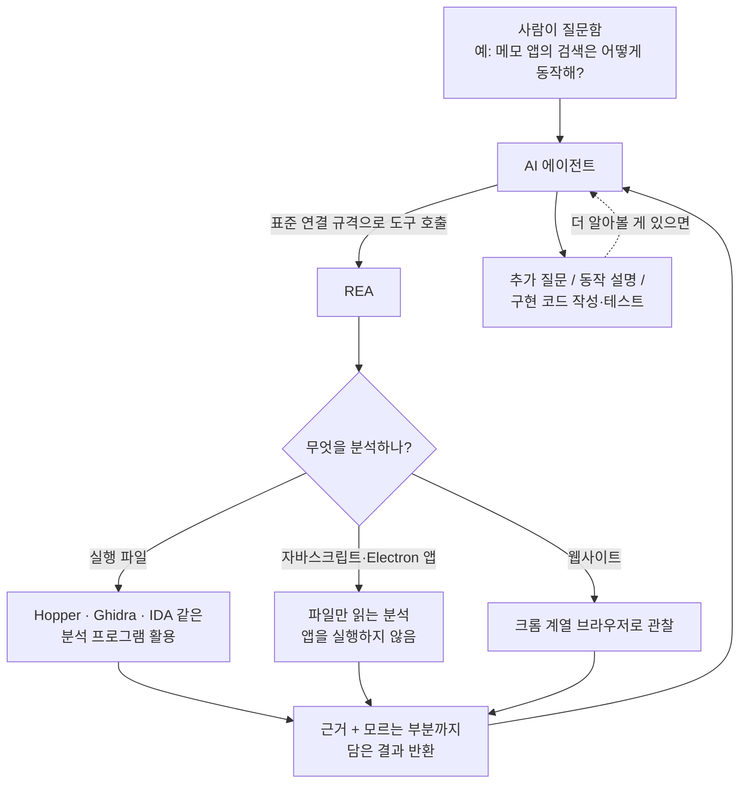

<div class="ai-knowledge-shell">

<aside class="ai-knowledge-sidebar">
  <p class="ai-eyebrow">CATEGORIES</p>
  <nav class="ai-cat-tree"><details class="ai-cat" open><summary><span class="catname">에이전트 오케스트레이션</span><span class="catcount">19</span></summary><ul><li><a href="https://altjs4510.github.io/ai_news_blog/knowledge/20260930/"><span class="kdate">2026-09-30</span><span class="ktitle">Agents you can coach: how Asana builds human-age…</span></a></li><li><a href="https://altjs4510.github.io/ai_news_blog/knowledge/20260929/"><span class="kdate">2026-09-29</span><span class="ktitle">vectorize-io/hindsight — Hindsight: Agent Memory…</span></a></li><li><a href="https://altjs4510.github.io/ai_news_blog/knowledge/20260908/"><span class="kdate">2026-09-08</span><span class="ktitle">bytedance/deer-flow — 샌드박스·메모리·서브에이전트·메시지 게이트웨이를…</span></a></li><li><a href="https://altjs4510.github.io/ai_news_blog/knowledge/20260904/"><span class="kdate">2026-09-04</span><span class="ktitle">HarnessDev: Can LLMs Create and Evolve Their Own…</span></a></li><li><a href="https://altjs4510.github.io/ai_news_blog/knowledge/20260831-openexecutive-virtual-c-suite/"><span class="kdate">2026-08-31</span><span class="ktitle">Open Executive — 8명의 전문 에이전트를 하나의 임원 목소리로</span></a></li><li><a href="https://altjs4510.github.io/ai_news_blog/knowledge/20260828/"><span class="kdate">2026-08-28</span><span class="ktitle">Google ADK for Python v2.8.0 — RemoteA2aAgent 네이…</span></a></li><li><a href="https://altjs4510.github.io/ai_news_blog/knowledge/20260826/"><span class="kdate">2026-08-26</span><span class="ktitle">apache/maka — 도구 호출·권한 결정·종료 이벤트를 append-only 로그…</span></a></li><li><a href="https://altjs4510.github.io/ai_news_blog/knowledge/20260823/"><span class="kdate">2026-08-23</span><span class="ktitle">The Evolution of the Agent Harness — 하네스가 모델 가중치…</span></a></li><li><a href="https://altjs4510.github.io/ai_news_blog/knowledge/20260805/"><span class="kdate">2026-08-05</span><span class="ktitle">TencentCloud/TencentDB-Agent-Memory — 대화·문서·코드를 …</span></a></li><li><a href="https://altjs4510.github.io/ai_news_blog/knowledge/20260726/"><span class="kdate">2026-07-26</span><span class="ktitle">citrolabs/ego-lite — 로그인된 브라우저 상태를 AI 에이전트와 공유하는…</span></a></li><li><a href="https://altjs4510.github.io/ai_news_blog/knowledge/20260717/"><span class="kdate">2026-07-17</span><span class="ktitle">After a year building agent memory, 'save everyt…</span></a></li><li><a href="https://altjs4510.github.io/ai_news_blog/knowledge/20260709/"><span class="kdate">2026-07-09</span><span class="ktitle">mvanhorn/last30days-skill — Reddit·X·YouTube·HN·…</span></a></li><li><a href="https://altjs4510.github.io/ai_news_blog/knowledge/20260623/"><span class="kdate">2026-06-23</span><span class="ktitle">bytedance/deer-flow — 샌드박스·메모리·서브에이전트·메시지 게이트웨이를…</span></a></li><li><a href="https://altjs4510.github.io/ai_news_blog/knowledge/20260621/"><span class="kdate">2026-06-21</span><span class="ktitle">calesthio/OpenMontage — 12 파이프라인·52 도구·500+ 스킬을 …</span></a></li><li><a href="https://altjs4510.github.io/ai_news_blog/knowledge/20260611/"><span class="kdate">2026-06-11</span><span class="ktitle">The evolution of agentic surfaces: building with…</span></a></li><li><a href="https://altjs4510.github.io/ai_news_blog/knowledge/20260604/"><span class="kdate">2026-06-04</span><span class="ktitle">chopratejas/headroom — Compress tool outputs bef…</span></a></li><li><a href="https://altjs4510.github.io/ai_news_blog/knowledge/20260602/"><span class="kdate">2026-06-02</span><span class="ktitle">revfactory/harness — 도메인별 에이전트 팀과 스킬을 자동 설계하는 메타…</span></a></li><li><a href="https://altjs4510.github.io/ai_news_blog/knowledge/20260529/"><span class="kdate">2026-05-29</span><span class="ktitle">Introducing dynamic workflows in Claude Code</span></a></li><li><a href="https://altjs4510.github.io/ai_news_blog/knowledge/20260507/"><span class="kdate">2026-05-07</span><span class="ktitle">ruvnet/ruflo — Claude 멀티 에이전트 오케스트레이션 플랫폼</span></a></li></ul></details><details class="ai-cat" open><summary><span class="catname">MCP &amp; 도구 통합</span><span class="catcount">19</span></summary><ul><li><a href="https://altjs4510.github.io/ai_news_blog/knowledge/20261008/"><span class="kdate">2026-10-08</span><span class="ktitle">morluto/rea — 앱 동작부터 네이티브 바이너리까지 에이전트로 역공학하는 도구</span></a></li><li><a href="https://altjs4510.github.io/ai_news_blog/knowledge/20260829/"><span class="kdate">2026-08-29</span><span class="ktitle">cursor/plugins — 플러그인 명세(specification)와 공식 플러그인…</span></a></li><li><a href="https://altjs4510.github.io/ai_news_blog/knowledge/20260802/"><span class="kdate">2026-08-02</span><span class="ktitle">Stateless MCP has recaptured my interest (and in…</span></a></li><li><a href="https://altjs4510.github.io/ai_news_blog/knowledge/20260801/"><span class="kdate">2026-08-01</span><span class="ktitle">different-ai/openwork — Claude Cowork의 오픈소스 대체 에…</span></a></li><li><a href="https://altjs4510.github.io/ai_news_blog/knowledge/20260731/"><span class="kdate">2026-07-31</span><span class="ktitle">different-ai/openwork — Claude Cowork의 오픈소스 대안(o…</span></a></li><li><a href="https://altjs4510.github.io/ai_news_blog/knowledge/20260729/"><span class="kdate">2026-07-29</span><span class="ktitle">Bringing MCP 2026-07-28 to Claude</span></a></li><li><a href="https://altjs4510.github.io/ai_news_blog/knowledge/20260718/"><span class="kdate">2026-07-18</span><span class="ktitle">tirth8205/code-review-graph — MCP·CLI용 로컬 코드 인텔리…</span></a></li><li><a href="https://altjs4510.github.io/ai_news_blog/knowledge/20260708/"><span class="kdate">2026-07-08</span><span class="ktitle">Expanding Managed Agents in Gemini API: backgrou…</span></a></li><li><a href="https://altjs4510.github.io/ai_news_blog/knowledge/20260701/"><span class="kdate">2026-07-01</span><span class="ktitle">Google OKF (Open Knowledge Format) — 벤더 중립 에이전트 …</span></a></li><li><a href="https://altjs4510.github.io/ai_news_blog/knowledge/20260618/"><span class="kdate">2026-06-18</span><span class="ktitle">DeusData/codebase-memory-mcp — 158개 언어 코드베이스를 밀리…</span></a></li><li><a href="https://altjs4510.github.io/ai_news_blog/knowledge/20260603/"><span class="kdate">2026-06-03</span><span class="ktitle">How Bad MCP design cost your Agent 5× more token…</span></a></li><li><a href="https://altjs4510.github.io/ai_news_blog/knowledge/20260526/"><span class="kdate">2026-05-26</span><span class="ktitle">colbymchenry/codegraph — Pre-indexed code knowle…</span></a></li><li><a href="https://altjs4510.github.io/ai_news_blog/knowledge/20260524/"><span class="kdate">2026-05-24</span><span class="ktitle">colbymchenry/codegraph — Pre-indexed code knowle…</span></a></li><li><a href="https://altjs4510.github.io/ai_news_blog/knowledge/20260523/"><span class="kdate">2026-05-23</span><span class="ktitle">colbymchenry/codegraph — 사전 인덱싱된 코드 지식 그래프 MCP</span></a></li><li><a href="https://altjs4510.github.io/ai_news_blog/knowledge/20260521/"><span class="kdate">2026-05-21</span><span class="ktitle">colbymchenry/codegraph — Pre-indexed code knowle…</span></a></li><li><a href="https://altjs4510.github.io/ai_news_blog/knowledge/20260520/"><span class="kdate">2026-05-20</span><span class="ktitle">New in Claude Managed Agents: self-hosted sandbo…</span></a></li><li><a href="https://altjs4510.github.io/ai_news_blog/knowledge/20260517/"><span class="kdate">2026-05-17</span><span class="ktitle">I gave my LLM 100,000+ tools — Lazy Discovery &a…</span></a></li><li><a href="https://altjs4510.github.io/ai_news_blog/knowledge/20260509/"><span class="kdate">2026-05-09</span><span class="ktitle">How to connect 100 MCP servers without the conte…</span></a></li><li><a href="https://altjs4510.github.io/ai_news_blog/knowledge/20260506/"><span class="kdate">2026-05-06</span><span class="ktitle">mksglu/context-mode — AI 코딩 에이전트용 컨텍스트 윈도우 최적화</span></a></li></ul></details><details class="ai-cat" open><summary><span class="catname">코딩 에이전트</span><span class="catcount">37</span></summary><ul><li><a href="https://altjs4510.github.io/ai_news_blog/knowledge/20261007/"><span class="kdate">2026-10-07</span><span class="ktitle">morluto/rea — 앱 동작부터 네이티브 바이너리까지 에이전트로 리버스 엔지니어링</span></a></li><li><a href="https://altjs4510.github.io/ai_news_blog/knowledge/20260920/"><span class="kdate">2026-09-20</span><span class="ktitle">Claude Code 2.1.277 — CLAUDE.md가 없으면 AGENTS.md를 …</span></a></li><li><a href="https://altjs4510.github.io/ai_news_blog/knowledge/20260918/"><span class="kdate">2026-09-18</span><span class="ktitle">alibaba/open-code-review — 결정론적 파이프라인 + LLM 에이전트…</span></a></li><li><a href="https://altjs4510.github.io/ai_news_blog/knowledge/20260917/"><span class="kdate">2026-09-17</span><span class="ktitle">alibaba/open-code-review — 결정론적 파이프라인과 LLM 에이전트를…</span></a></li><li><a href="https://altjs4510.github.io/ai_news_blog/knowledge/20260916/"><span class="kdate">2026-09-16</span><span class="ktitle">alibaba/open-code-review — 결정론적 파이프라인과 LLM Agent…</span></a></li><li><a href="https://altjs4510.github.io/ai_news_blog/knowledge/20260915/"><span class="kdate">2026-09-15</span><span class="ktitle">alibaba/open-code-review — 결정적 파이프라인과 LLM 에이전트를 …</span></a></li><li><a href="https://altjs4510.github.io/ai_news_blog/knowledge/20260912/"><span class="kdate">2026-09-12</span><span class="ktitle">Quoting Boris Cherny — 'Claude가 쓴 프로덕션 코드는 사람이 쓴…</span></a></li><li><a href="https://altjs4510.github.io/ai_news_blog/knowledge/20260910/"><span class="kdate">2026-09-10</span><span class="ktitle">vastsa/PI-Desktop — Electron + Rust 호스트 코어 + 에이전…</span></a></li><li><a href="https://altjs4510.github.io/ai_news_blog/knowledge/20260906/"><span class="kdate">2026-09-06</span><span class="ktitle">DietrichGebert/ponytail — 에이전트를 '방에서 가장 게으른 시니어 …</span></a></li><li><a href="https://altjs4510.github.io/ai_news_blog/knowledge/20260903/"><span class="kdate">2026-09-03</span><span class="ktitle">pacifio/atlas — 여러 코딩 에이전트의 변경을 한곳에서 추적·질의하는 '에이…</span></a></li><li><a href="https://altjs4510.github.io/ai_news_blog/knowledge/20260901/"><span class="kdate">2026-09-01</span><span class="ktitle">affaan-m/ECC — 스킬·본능·메모리·보안을 묶은 에이전트 하네스 성능 최적화 …</span></a></li><li><a href="https://altjs4510.github.io/ai_news_blog/knowledge/20260831-gitnexus-code-knowledge-graph/"><span class="kdate">2026-08-31</span><span class="ktitle">GitNexus — 코드베이스를 지식그래프로 바꿔 에이전트에게 쥐어주기</span></a></li><li><a href="https://altjs4510.github.io/ai_news_blog/knowledge/20260822/"><span class="kdate">2026-08-22</span><span class="ktitle">mattpocock/skills — Skills for Real Engineers (하…</span></a></li><li><a href="https://altjs4510.github.io/ai_news_blog/knowledge/20260820/"><span class="kdate">2026-08-20</span><span class="ktitle">akitaonrails/ai-memory — 코딩 에이전트 CLI의 장기 메모리와 벤더…</span></a></li><li><a href="https://altjs4510.github.io/ai_news_blog/knowledge/20260819/"><span class="kdate">2026-08-19</span><span class="ktitle">akitaonrails/ai-memory — 코딩 에이전트 CLI 간 장기 기억과 벤더…</span></a></li><li><a href="https://altjs4510.github.io/ai_news_blog/knowledge/20260814/"><span class="kdate">2026-08-14</span><span class="ktitle">cathrynlavery/diagram-design — Claude Code용 에디토리…</span></a></li><li><a href="https://altjs4510.github.io/ai_news_blog/knowledge/20260811/"><span class="kdate">2026-08-11</span><span class="ktitle">PrimeIntellect-ai/prime-agent — 장기 자율 실행을 전제로 설계…</span></a></li><li><a href="https://altjs4510.github.io/ai_news_blog/knowledge/20260810/"><span class="kdate">2026-08-10</span><span class="ktitle">Auto mode is now the default in Claude Code for …</span></a></li><li><a href="https://altjs4510.github.io/ai_news_blog/knowledge/20260809/"><span class="kdate">2026-08-09</span><span class="ktitle">PrimeIntellect-ai/prime-agent — 코딩 워크플로우·장기 자율 작…</span></a></li><li><a href="https://altjs4510.github.io/ai_news_blog/knowledge/20260808/"><span class="kdate">2026-08-08</span><span class="ktitle">PrimeIntellect-ai/prime-agent — 코딩 워크플로우와 장시간 자율…</span></a></li><li><a href="https://altjs4510.github.io/ai_news_blog/knowledge/20260804/"><span class="kdate">2026-08-04</span><span class="ktitle">esengine/DeepSeek-Reasonix — prefix-cache 안정성을 축…</span></a></li><li><a href="https://altjs4510.github.io/ai_news_blog/knowledge/20260728/"><span class="kdate">2026-07-28</span><span class="ktitle">alibaba/open-code-review — 결정론적 파이프라인 + LLM 에이전트…</span></a></li><li><a href="https://altjs4510.github.io/ai_news_blog/knowledge/20260725/"><span class="kdate">2026-07-25</span><span class="ktitle">The new rules of context engineering for Claude …</span></a></li><li><a href="https://altjs4510.github.io/ai_news_blog/knowledge/20260722/"><span class="kdate">2026-07-22</span><span class="ktitle">tirth8205/code-review-graph — MCP·CLI용 로컬 우선 코드 …</span></a></li><li><a href="https://altjs4510.github.io/ai_news_blog/knowledge/20260721/"><span class="kdate">2026-07-21</span><span class="ktitle">tirth8205/code-review-graph — 로컬 우선 코드 인텔리전스 그래프…</span></a></li><li><a href="https://altjs4510.github.io/ai_news_blog/knowledge/20260719/"><span class="kdate">2026-07-19</span><span class="ktitle">tirth8205/code-review-graph — 로컬 우선 코드 인텔리전스 그래프…</span></a></li><li><a href="https://altjs4510.github.io/ai_news_blog/knowledge/20260714/"><span class="kdate">2026-07-14</span><span class="ktitle">Graphify-Labs/graphify — 코드베이스를 질의 가능한 지식 그래프로 만…</span></a></li><li><a href="https://altjs4510.github.io/ai_news_blog/knowledge/20260707/"><span class="kdate">2026-07-07</span><span class="ktitle">AI Hero Skills Catalog — 실무 엔지니어를 위한 재사용 가능한 판단 …</span></a></li><li><a href="https://altjs4510.github.io/ai_news_blog/knowledge/20260705/"><span class="kdate">2026-07-05</span><span class="ktitle">openai/codex-plugin-cc — Claude Code에서 Codex를 위임…</span></a></li><li><a href="https://altjs4510.github.io/ai_news_blog/knowledge/20260626/"><span class="kdate">2026-06-26</span><span class="ktitle">google-labs-code/design.md — 코딩 에이전트에게 디자인 시스템을 …</span></a></li><li><a href="https://altjs4510.github.io/ai_news_blog/knowledge/20260619/"><span class="kdate">2026-06-19</span><span class="ktitle">Claude Code now supports artifacts</span></a></li><li><a href="https://altjs4510.github.io/ai_news_blog/knowledge/20260530/"><span class="kdate">2026-05-30</span><span class="ktitle">Leonxlnx/taste-skill — AI에게 좋은 취향을 부여해 generic s…</span></a></li><li><a href="https://altjs4510.github.io/ai_news_blog/knowledge/20260528/"><span class="kdate">2026-05-28</span><span class="ktitle">Building self-improving tax agents with Codex</span></a></li><li><a href="https://altjs4510.github.io/ai_news_blog/knowledge/20260512/"><span class="kdate">2026-05-12</span><span class="ktitle">agentmemory — Persistent memory for AI coding ag…</span></a></li><li><a href="https://altjs4510.github.io/ai_news_blog/knowledge/20260510/"><span class="kdate">2026-05-10</span><span class="ktitle">addyosmani/agent-skills — Production-grade engin…</span></a></li><li><a href="https://altjs4510.github.io/ai_news_blog/knowledge/20260508/"><span class="kdate">2026-05-08</span><span class="ktitle">addyosmani/agent-skills — Production-grade engin…</span></a></li><li><a href="https://altjs4510.github.io/ai_news_blog/knowledge/20260505/"><span class="kdate">2026-05-05</span><span class="ktitle">mattpocock/skills — Skills for Real Engineers (.…</span></a></li></ul></details><details class="ai-cat" open><summary><span class="catname">모델 &amp; 연구</span><span class="catcount">8</span></summary><ul><li><a href="https://altjs4510.github.io/ai_news_blog/knowledge/20261009/"><span class="kdate">2026-10-09</span><span class="ktitle">Claude Haiku 5.5 (Simon Willison의 출시 노트와 가격 분석)</span></a></li><li><a href="https://altjs4510.github.io/ai_news_blog/knowledge/20260907-voicemem-dual-brain-memory/"><span class="kdate">2026-09-07</span><span class="ktitle">VoiceMem — 좌뇌·우뇌로 쪼갠 스트리밍 메모리로 음성 에이전트 지연 없애기</span></a></li><li><a href="https://altjs4510.github.io/ai_news_blog/knowledge/20260716-proprag/"><span class="kdate">2026-07-16</span><span class="ktitle">PropRAG — 프로포지션 경로 위 beam search로 멀티홉 검색 안내</span></a></li><li><a href="https://altjs4510.github.io/ai_news_blog/knowledge/20260712/"><span class="kdate">2026-07-12</span><span class="ktitle">Do Automated Evals Work?</span></a></li><li><a href="https://altjs4510.github.io/ai_news_blog/knowledge/20260620/"><span class="kdate">2026-06-20</span><span class="ktitle">zai-org/GLM-5 — From Vibe Coding to Agentic Engi…</span></a></li><li><a href="https://altjs4510.github.io/ai_news_blog/knowledge/20260617/"><span class="kdate">2026-06-17</span><span class="ktitle">Predicting model behavior before release by simu…</span></a></li><li><a href="https://altjs4510.github.io/ai_news_blog/knowledge/20260516/"><span class="kdate">2026-05-16</span><span class="ktitle">STALE — 에이전트가 자기 기억의 유효성을 인지할 수 있는가</span></a></li><li><a href="https://altjs4510.github.io/ai_news_blog/knowledge/20260513/"><span class="kdate">2026-05-13</span><span class="ktitle">Thinking Machines' Native Interaction Models — T…</span></a></li></ul></details><details class="ai-cat" open><summary><span class="catname">인프라 &amp; 컴퓨트</span><span class="catcount">9</span></summary><ul><li><a href="https://altjs4510.github.io/ai_news_blog/knowledge/20260905/"><span class="kdate">2026-09-05</span><span class="ktitle">magnitudedev/magnitude — 하드웨어에 맞는 최적 로컬 모델을 띄워 이…</span></a></li><li><a href="https://altjs4510.github.io/ai_news_blog/knowledge/20260821/"><span class="kdate">2026-08-21</span><span class="ktitle">volcengine/OpenViking — 에이전트 메모리·Knowledge RAG·스…</span></a></li><li><a href="https://altjs4510.github.io/ai_news_blog/knowledge/20260806/"><span class="kdate">2026-08-06</span><span class="ktitle">cloudflare/computer — 에이전트에게 컴퓨터를 통째로 주는 엣지 실행 샌…</span></a></li><li><a href="https://altjs4510.github.io/ai_news_blog/knowledge/20260724/"><span class="kdate">2026-07-24</span><span class="ktitle">diegosouzapw/OmniRoute — 단일 엔드포인트로 278+ 프로바이더·50…</span></a></li><li><a href="https://altjs4510.github.io/ai_news_blog/knowledge/20260723/"><span class="kdate">2026-07-23</span><span class="ktitle">diegosouzapw/OmniRoute — 268+ 프로바이더를 단일 엔드포인트로 묶…</span></a></li><li><a href="https://altjs4510.github.io/ai_news_blog/knowledge/20260610/"><span class="kdate">2026-06-10</span><span class="ktitle">Fable 5 just made cost-aware model routing manda…</span></a></li><li><a href="https://altjs4510.github.io/ai_news_blog/knowledge/20260606/"><span class="kdate">2026-06-06</span><span class="ktitle">chopratejas/headroom — Compress tool outputs, lo…</span></a></li><li><a href="https://altjs4510.github.io/ai_news_blog/knowledge/20260605/"><span class="kdate">2026-06-05</span><span class="ktitle">chopratejas/headroom — Compress tool outputs, lo…</span></a></li><li><a href="https://altjs4510.github.io/ai_news_blog/knowledge/20260522/"><span class="kdate">2026-05-22</span><span class="ktitle">Giving Agents Computers — Ivan Burazin, Daytona</span></a></li></ul></details><details class="ai-cat" open><summary><span class="catname">보안 &amp; 거버넌스</span><span class="catcount">27</span></summary><ul><li><a href="https://altjs4510.github.io/ai_news_blog/knowledge/20261010/" class="current"><span class="kdate">2026-10-10</span><span class="ktitle">morluto/rea — 앱 동작부터 네이티브 바이너리까지 에이전트로 리버스 엔지니어링</span></a></li><li><a href="https://altjs4510.github.io/ai_news_blog/knowledge/20261004/"><span class="kdate">2026-10-04</span><span class="ktitle">Apple says it's tightening macOS 'Full Disk Acce…</span></a></li><li><a href="https://altjs4510.github.io/ai_news_blog/knowledge/20261003/"><span class="kdate">2026-10-03</span><span class="ktitle">NVIDIA/OpenShell — 자율 AI 에이전트를 위한 안전하고 프라이빗한 런타임…</span></a></li><li><a href="https://altjs4510.github.io/ai_news_blog/knowledge/20261002/"><span class="kdate">2026-10-02</span><span class="ktitle">NVIDIA/OpenShell — 자율 AI 에이전트를 위한 안전하고 프라이빗한 런타임…</span></a></li><li><a href="https://altjs4510.github.io/ai_news_blog/knowledge/20261001/"><span class="kdate">2026-10-01</span><span class="ktitle">NVIDIA/OpenShell</span></a></li><li><a href="https://altjs4510.github.io/ai_news_blog/knowledge/20260919/"><span class="kdate">2026-09-19</span><span class="ktitle">cloudflare/security-audit-skill — 다단계 보안 감사를 '독립…</span></a></li><li><a href="https://altjs4510.github.io/ai_news_blog/knowledge/20260913/"><span class="kdate">2026-09-13</span><span class="ktitle">OpenAI agents attacked RubyGems back in May: Ope…</span></a></li><li><a href="https://altjs4510.github.io/ai_news_blog/knowledge/20260902/"><span class="kdate">2026-09-02</span><span class="ktitle">AIR raises $50M to help companies vet the skills…</span></a></li><li><a href="https://altjs4510.github.io/ai_news_blog/knowledge/20260827/"><span class="kdate">2026-08-27</span><span class="ktitle">Claude in Chrome is generally available</span></a></li><li><a href="https://altjs4510.github.io/ai_news_blog/knowledge/20260819-mind-viruses/"><span class="kdate">2026-08-19</span><span class="ktitle">탈옥도, 인젝션도 없이 — 대화로만 퍼지는 에이전트의 '마인드 바이러스'</span></a></li><li><a href="https://altjs4510.github.io/ai_news_blog/knowledge/20260813/"><span class="kdate">2026-08-13</span><span class="ktitle">semantica-agi/semantica — 컨텍스트와 책임 추적을 위한 그래프 네이…</span></a></li><li><a href="https://altjs4510.github.io/ai_news_blog/knowledge/20260812/"><span class="kdate">2026-08-12</span><span class="ktitle">semantica-agi/semantica — 컨텍스트와 '책임 추적 가능한(accou…</span></a></li><li><a href="https://altjs4510.github.io/ai_news_blog/knowledge/20260730/"><span class="kdate">2026-07-30</span><span class="ktitle">Anatomy of a Frontier Lab Agent Intrusion: A Tec…</span></a></li><li><a href="https://altjs4510.github.io/ai_news_blog/knowledge/20260716/"><span class="kdate">2026-07-16</span><span class="ktitle">Dicklesworthstone/destructive_command_guard — 에이…</span></a></li><li><a href="https://altjs4510.github.io/ai_news_blog/knowledge/20260715/"><span class="kdate">2026-07-15</span><span class="ktitle">Dicklesworthstone/destructive_command_guard — 에이…</span></a></li><li><a href="https://altjs4510.github.io/ai_news_blog/knowledge/20260710/"><span class="kdate">2026-07-10</span><span class="ktitle">70개 MCP 서버 strace 런타임 감사 — 부팅 시 아웃바운드 호출 서버 적발</span></a></li><li><a href="https://altjs4510.github.io/ai_news_blog/knowledge/20260704/"><span class="kdate">2026-07-04</span><span class="ktitle">Cloudflare is about to block AI agents by defaul…</span></a></li><li><a href="https://altjs4510.github.io/ai_news_blog/knowledge/20260703/"><span class="kdate">2026-07-03</span><span class="ktitle">Giving admins more visibility and control over C…</span></a></li><li><a href="https://altjs4510.github.io/ai_news_blog/knowledge/20260630/"><span class="kdate">2026-06-30</span><span class="ktitle">Introducing the Claude apps gateway for Amazon B…</span></a></li><li><a href="https://altjs4510.github.io/ai_news_blog/knowledge/20260625/"><span class="kdate">2026-06-25</span><span class="ktitle">Agent identity in Claude Tag: a new access model…</span></a></li><li><a href="https://altjs4510.github.io/ai_news_blog/knowledge/20260624/"><span class="kdate">2026-06-24</span><span class="ktitle">Agent identity in Claude Tag: a new access model…</span></a></li><li><a href="https://altjs4510.github.io/ai_news_blog/knowledge/20260614/"><span class="kdate">2026-06-14</span><span class="ktitle">NVIDIA/SkillSpector — Security scanner for AI ag…</span></a></li><li><a href="https://altjs4510.github.io/ai_news_blog/knowledge/20260613/"><span class="kdate">2026-06-13</span><span class="ktitle">Fable 5's guardrails got bypassed in 48 hours — …</span></a></li><li><a href="https://altjs4510.github.io/ai_news_blog/knowledge/20260612/"><span class="kdate">2026-06-12</span><span class="ktitle">NVIDIA/SkillSpector — AI 에이전트 스킬용 보안 스캐너</span></a></li><li><a href="https://altjs4510.github.io/ai_news_blog/knowledge/20260607/"><span class="kdate">2026-06-07</span><span class="ktitle">OpenAI Help: Lockdown Mode</span></a></li><li><a href="https://altjs4510.github.io/ai_news_blog/knowledge/20260531/"><span class="kdate">2026-05-31</span><span class="ktitle">How we contain Claude across products</span></a></li><li><a href="https://altjs4510.github.io/ai_news_blog/knowledge/20260527/"><span class="kdate">2026-05-27</span><span class="ktitle">Microsoft Copilot Cowork Exfiltrates Files</span></a></li></ul></details><details class="ai-cat" open><summary><span class="catname">응용 사례</span><span class="catcount">7</span></summary><ul><li><a href="https://altjs4510.github.io/ai_news_blog/knowledge/20261006/"><span class="kdate">2026-10-06</span><span class="ktitle">How Cresta turned CX expertise into an agent bui…</span></a></li><li><a href="https://altjs4510.github.io/ai_news_blog/knowledge/20260911/"><span class="kdate">2026-09-11</span><span class="ktitle">Now everyone can put data to work — ChatGPT Work…</span></a></li><li><a href="https://altjs4510.github.io/ai_news_blog/knowledge/20260909/"><span class="kdate">2026-09-09</span><span class="ktitle">Reducing cost and improving performance with Cla…</span></a></li><li><a href="https://altjs4510.github.io/ai_news_blog/knowledge/20260609/"><span class="kdate">2026-06-09</span><span class="ktitle">Building intelligent apps for Apple platforms wi…</span></a></li><li><a href="https://altjs4510.github.io/ai_news_blog/knowledge/20260515/"><span class="kdate">2026-05-15</span><span class="ktitle">Clawdmeter — Claude Code 사용량을 데스크톱 대시보드로</span></a></li><li><a href="https://altjs4510.github.io/ai_news_blog/knowledge/20260514/"><span class="kdate">2026-05-14</span><span class="ktitle">Introducing Claude for Small Business</span></a></li><li><a href="https://altjs4510.github.io/ai_news_blog/knowledge/20260504/"><span class="kdate">2026-05-04</span><span class="ktitle">Agents for Everything Else: Codex for Knowledge …</span></a></li></ul></details><details class="ai-cat" open><summary><span class="catname">산업 동향</span><span class="catcount">6</span></summary><ul><li><a href="https://altjs4510.github.io/ai_news_blog/knowledge/20260907-humanmade-52week-rhythm/"><span class="kdate">2026-09-07</span><span class="ktitle">휴먼 메이드의 '52주 리듬' — 아이디어가 흔해진 시대에 값이 오르는 건 버리는 판단</span></a></li><li><a href="https://altjs4510.github.io/ai_news_blog/knowledge/20260830/"><span class="kdate">2026-08-30</span><span class="ktitle">[AINews] OpenAI shuts off Cursor — 프론티어 모델 공급 차단…</span></a></li><li><a href="https://altjs4510.github.io/ai_news_blog/knowledge/20260711/"><span class="kdate">2026-07-11</span><span class="ktitle">OpenAI says GPT 5.6 is the 'preferred model' for…</span></a></li><li><a href="https://altjs4510.github.io/ai_news_blog/knowledge/20260702/"><span class="kdate">2026-07-02</span><span class="ktitle">How Cursor deploys AI inside the enterprise (For…</span></a></li><li><a href="https://altjs4510.github.io/ai_news_blog/knowledge/20260616/"><span class="kdate">2026-06-16</span><span class="ktitle">Why AI hasn't replaced software engineers, and w…</span></a></li><li><a href="https://altjs4510.github.io/ai_news_blog/knowledge/20260519/"><span class="kdate">2026-05-19</span><span class="ktitle">Anthropic acquires Stainless</span></a></li></ul></details></nav>
</aside>

<article class="ai-knowledge-article">

<header class="ai-post-hero">
  <p class="ai-eyebrow"><a class="ai-back" href="../">KNOWLEDGE</a> · 2026-10-10 · 오늘의 학습</p>
  <h2 class="ai-post-title">morluto/rea — 앱 동작부터 네이티브 바이너리까지 에이전트로 리버스 엔지니어링</h2>
</header>

> 원문: [morluto/rea — 앱 동작부터 네이티브 바이너리까지 에이전트로 리버스 엔지니어링](https://github.com/morluto/rea)

## 📌 학습 정리

### 1. 한 줄로 말하면

다른 앱에서 마음에 드는 기능을 보고 "이거 어떻게 만든 거지?" 싶을 때, AI 에이전트가 그 앱을 대신 뜯어보게 해 주는 도구예요. 에이전트는 기능이 어떻게 돌아가는지 근거와 함께 설명해 주고, 내 프로젝트에 비슷한 기능을 만들어 주기도 해요.

### 2. 왜 이게 만들어졌어요?

설계도(소스 코드) 없이 완성된 프로그램을 거꾸로 따라가며 작동 원리를 알아내는 일을 역공학(reverse engineering)이라고 해요. 원래 이 일은 전문가가 전용 분석 도구를 하나하나 직접 다루면서 하던 작업이었어요. 분석 대상이 앱인지, 웹사이트인지, 게임 실행 파일인지에 따라 써야 하는 도구도 다 달랐고요. REA는 이런 도구들을 AI 에이전트에 연결해서, 사람이 손으로 하던 탐색을 에이전트가 이어서 하도록 만든 프로젝트예요. 원문에 따르면 분석은 내 컴퓨터 안에서 이뤄지고, 결론마다 근거와 한계를 함께 돌려준다고 해요.

### 3. 비유로 풀면

이건 마치 **현장 감식반과 수사관이 한 팀으로 일하는 것**과 비슷해요. 수사관(AI 에이전트)이 "이 기능은 어떻게 동작하지?" 하고 질문을 던지면, 감식반(REA)이 현장(분석할 앱)에서 지문이나 흔적 같은 증거를 채취해 와요. 이때 "여기까지는 확인됐고, 이 부분은 아직 모른다"는 보고서도 함께 붙여 줘요. 수사관은 그 보고서를 읽고 추가 감식을 요청하거나, 사건 경위를 정리해요.

그래서 결국, 에이전트가 추측으로 답하는 대신 REA가 실제로 확인한 증거를 바탕으로 설명하고 구현하게 된다는 점이 핵심이에요.

### 4. 어떻게 작동하는지 (그림으로)



사람이 질문을 하면 에이전트가 MCP라는 연결 규격으로 REA를 불러요. REA는 대상에 맞는 분석 도구를 써서 조사하고, 찾아낸 코드와 참조 관계, 그리고 아직 모르는 부분까지 정리해서 돌려줘요. 에이전트는 이 결과를 보고 필요하면 다시 질문을 던지고, 충분히 모이면 설명을 하거나 직접 구현해서 테스트해요.

한 가지 짚어 둘 부분이 있어요. 파일만 읽는 분석과 달리 "실행 중 동작 관찰"은 대상 앱을 실제로 돌리거나 조작하는데, 이때 내 사용자 권한으로 실행돼요. 그래서 에이전트에게 어떤 도구를 어디까지 맡길지 사람이 정해 두는 게 중요해요. 처음 설치할 때도 바뀔 설정을 사람이 검토하고 승인하는 단계를 거쳐요.

### 5. 처음 보는 용어 풀이

- **에이전트와 도구를 잇는 표준 연결 규격 (MCP)** — AI 에이전트가 외부 도구를 불러 쓸 수 있게 해 주는 약속된 방식이에요. REA는 이 규격을 따르는 서버라서, 로컬 MCP 서버를 지원하는 에이전트라면 어디서든 쓸 수 있어요.
- **기계어로 된 실행 파일 (native binary)** — 사람이 읽을 수 있는 코드가 컴퓨터용 명령으로 바뀐 완성본 프로그램이에요. 그냥 열어서는 읽을 수 없어서 전용 분석 도구가 필요해요.
- **사람이 읽기 쉽게 복원한 코드 (pseudocode) / 기계 명령에 가까운 코드 (assembly)** — 실행 파일을 분석해서 얻는 두 가지 결과물이에요. 원문에 따르면 REA의 실행 파일 분석은 이 두 가지를 돌려주고, 이걸 바탕으로 실제 코드를 짜는 건 에이전트의 몫이에요.
- **Hopper · Ghidra · IDA** — 실행 파일을 깊이 들여다볼 때 쓰는 전문 분석 프로그램들이에요. REA는 이 중 이미 설치된 것을 활용하고, Hopper는 사용자가 승인하면 설치까지 도와줘요.
- **Electron** — 웹 기술(자바스크립트)로 데스크톱 앱을 만드는 틀이에요. 원문 사례에 나온 Notion 데스크톱 앱처럼 많은 앱이 이걸로 만들어져요.
- **프로그램 내부 구역끼리 주고받는 통신 (IPC)** — 한 앱 안에서도 화면 쪽과 핵심 처리 쪽이 나뉘어 있을 때, 둘이 메시지를 주고받는 통로예요. Notion 사례에서는 클립보드 기능이 이 통로를 거쳐 가는 길을 따라갔어요.
- **에이전트용 작업 지침 (skill)** — 에이전트에게 "조사는 이런 순서로 진행해"라고 알려 주는 안내서예요. 설치 과정에서 MCP 서버 등록과 함께 이 지침도 같이 깔려요.

### 6. 한 발 더 들어가고 싶다면

- [REA 웹사이트](https://rea.tools/) — 그림이 곁들여진 설치 안내와 실제 사례 모음을 볼 수 있어요.
- [DX-Ball 사례 연구](https://rea.tools/showcase/dx-ball/) — 오래된 게임의 사운드 계산을 C 코드로 복원해서 원본 동작과 맞춰 본 과정을 알 수 있어요. 원문에 따르면 3,205개 원본 케이스를 통과했다고 해요.
- [Notion 사례 연구](https://rea.tools/showcase/notion/) — Electron 앱에서 클립보드 기능이 화면에서 핵심 처리 쪽까지 어떤 경로로 이어지는지 따라가는 법을 알 수 있어요.
- [Installation and setup](https://github.com/morluto/rea/blob/main/docs/installation.md) — 지원하는 에이전트 목록, 분석 프로그램 설정, 업데이트와 제거 방법을 알 수 있어요.
- [MCP contracts](https://github.com/morluto/rea/blob/main/docs/mcp-contracts.md) — 에이전트가 REA를 부를 때 어떤 형식으로 결과를 주고받는지 알 수 있어요.

참고로 원문에서는 REA를 합법적인 연구와 분석 용도로만 쓰라고 밝히고 있어요. 필요한 허가를 받고 관련 법을 지키는 건 사용자 책임이라는 점도 함께 적혀 있어요.

---

## 📖 원문 전체 번역 (정독용)

> 의역 최소화한 전체 번역입니다. 큰 흐름은 위 정리에서 잡고, 정확한 워딩이 필요할 땐 이 섹션에서 정독하세요.

* * *

만들고 싶은 제품에 넣고 싶은 기능이 어떤 앱에 있나요? 에이전트에게 REA로 조사해 달라고 요청해 보세요. 에이전트는 소스 코드 없이도 앱을 살펴보고, 해당 기능이 어떻게 동작하는지 설명하고, 근거를 보여주고, 여러분의 프로젝트에 맞는 버전을 만들어 줄 수 있습니다.

REA는 에이전트를 네이티브 바이너리, JavaScript 및 Electron 앱, .NET 어셈블리, 웹사이트를 검사하는 도구에 연결해 줍니다. 같은 도구를 터미널에서도 사용할 수 있습니다. 분석은 로컬에서 실행되며, 결과에는 각 결론의 근거와 한계가 함께 담깁니다.

설정(Setup)은 REA를 에이전트에 등록하고 그에 맞는 워크플로우 지침을 설치합니다. 네이티브 분석은 이미 설치된 Hopper 또는 Ghidra를 사용할 수 있으며, 설정 과정에서 승인을 거쳐 Hopper를 선택적으로 설치할 수도 있습니다. 정적 JavaScript 분석에는 두 엔진 모두 필요하지 않습니다.

> **[REA 웹사이트](https://rea.tools/)** 에서 설정 방법, 그림이 포함된 가이드, 실제 사례 연구를 확인하세요.

## 빠른 시작

[](https://github.com/morluto/rea#quick-start)
### 에이전트 설정

[](https://github.com/morluto/rea#set-up-your-agent)
Node.js와 npm이 설치되어 있다면 다음을 실행하세요.

npx rea-agents setup

사용할 에이전트를 선택하고, 제안된 변경 사항을 검토한 뒤 승인하세요. 설정은 REA의 MCP 서버와 그에 맞는 워크플로우 지침을 추가하며, 기존 설정은 백업해 둡니다. 이후 에이전트를 재시작하세요.

설정은 Claude Code, Codex, Cursor, Gemini CLI, Grok Build 및 [기타 에이전트](https://github.com/morluto/rea/blob/main/docs/installation.md#supported-agents)를 지원합니다. 프로바이더 설정과 수동 MCP 등록은 [설치 및 설정](https://github.com/morluto/rea/blob/main/docs/installation.md)을 참고하세요.

### 에이전트에게 요청하기

[](https://github.com/morluto/rea#ask-your-agent)

```
Understand how search works in the Notes app, show me the evidence, and build a
similar feature for my project.
```

Notes를 분석하려는 대상 앱으로, 검색을 이해하려는 기능으로 바꿔서 사용하세요.

### 터미널 사용

[](https://github.com/morluto/rea#use-the-terminal)
압축을 푼 JavaScript/Electron 앱 디렉터리 또는 ASAR를 검사합니다.

npx -y rea-agents@latest analyze-javascript-application /absolute/path/to/app --json

결과에는 모듈, import, Electron 경계와 그 근거가 포함됩니다. 경로를 분석 대상으로 바꾸세요. Windows라면 `"D:/apps/example"` 같은 형태입니다.

일상적으로 사용할 `rea` 명령을 설치하려면 다음을 실행하세요.

npm install --global rea-agents
rea --help

네이티브 분석을 하려면 먼저 프로바이더를 설정해야 합니다. 네이티브 명령, 프로바이더 선택, 스냅샷, 스크립팅은 [CLI 및 증거(Evidence) 가이드](https://github.com/morluto/rea/blob/main/docs/cli.md)를 참고하세요.

### REA 업데이트

[](https://github.com/morluto/rea#update-rea)
REA는 빠르게 변하며, 새 릴리스에는 버그 수정이 자주 포함됩니다. 설치본을 최신 상태로 유지하세요.

npm으로 설치한 CLI의 경우:

rea update

에이전트 등록과 스킬을 새로 고치려면 업데이트가 출력하는 setup 명령을 실행하세요.

`npx`를 사용한다면 다음으로 에이전트 설정을 업데이트하세요.

npx rea-agents@latest setup

설정 변경 사항을 검토하고 에이전트를 재시작하세요. 일회성 CLI 명령은 `npx rea-agents@latest` 뒤에 명령을 붙여 사용하세요.

## REA의 동작 방식

[](https://github.com/morluto/rea#how-rea-works)
에이전트는 MCP를 통해 REA를 호출하여 대상을 검사하고 관련 코드를 추적합니다. REA는 발견한 내용을 근거와 함께 반환합니다. 에이전트는 이를 바탕으로 후속 질문을 하거나, 동작을 설명하거나, 구현을 작성하고 테스트합니다. CLI 명령도 동일한 워크플로우를 사용합니다.

[](https://github.com/morluto/rea/blob/main/website/public/assets/figures/rea-investigation-flow.svg)

[전체 크기 그림 열기](https://github.com/morluto/rea/blob/main/website/public/assets/figures/rea-investigation-flow.svg).

## 분석 가능한 대상

[](https://github.com/morluto/rea#what-you-can-analyze)
REA에는 Node.js 22.x(>=22.19), 24.x(>=24.11) 또는 26+ 와 npm이 필요합니다. 추가 도구와 호스트 지원 여부는 대상에 따라 다릅니다.

| 대상 | REA가 반환하는 것 | 요구 사항 및 가이드 |
| --- | --- | --- |
| 네이티브 바이너리 | 의사 코드(pseudocode), 어셈블리, 문자열, 심볼, 호출 및 참조 | Hopper, Ghidra 또는 IDA; [네이티브 분석](https://rea.tools/guides/native/) |
| 오프라인 ELF 레이아웃 | 섹션, 세그먼트, 원본 심볼/재배치(relocation), 정적 완화 기법 후보 | Linux x64에서 호출자가 제공하는 pwntools; [바이너리 진단](https://github.com/morluto/rea/blob/main/docs/binary-diagnostics.md) |
| EVM 바이트코드 | 디스패치 셀렉터, 바이트 오프셋, 추론된 인자와 가변성(mutability) | 로컬 raw/hex 입력; [오프라인 EVM 가이드](https://github.com/morluto/rea/blob/main/docs/evm-bytecode.md) |
| 기록된 Linux 크래시 | 원시 노트, 기록된 모든 스레드의 레지스터/시그널, 선택적 매핑 후보 | 호출자가 제공하는 pwntools; 선택적 GDB/pwndbg; [기록된 크래시](https://github.com/morluto/rea/blob/main/docs/recorded-crashes.md) |
| JavaScript / Electron | 모듈, import, 소스 맵, 라우트, IPC, 네이티브 애드온 관계 | Node.js 및 npm; [애플리케이션 분석](https://rea.tools/guides/javascript/) |
| 웹사이트 | 페이지 구조, 스크립트, 네트워크 관측 결과, 요청한 스크린샷 | Chrome 계열 브라우저; [브라우저 분석](https://rea.tools/guides/browser/) |
| 저장된 네트워크 캡처 | 요청, 응답, 노출된 페이로드, 소스 위치 | HAR; 네이티브 mitmproxy 캡처의 경우 Linux에서 mitmdump; [캡처 가이드](https://github.com/morluto/rea/blob/main/docs/web-network-captures.md) |
| .NET 어셈블리 | 메타데이터, CIL 명령어, 선언된 네이티브 의존성, 빌드 비교 | 정적 검사; [관리 코드 가이드](https://github.com/morluto/rea/blob/main/docs/managed-code-analysis.md) |
| Android APK | 매니페스트 선언, 클래스, 디컴파일된 메서드와 참조 | Linux/macOS/Windows x64에서 헤드리스 JADX와 전체 JDK; [Android 가이드](https://github.com/morluto/rea/blob/main/docs/android-analysis.md) |
| 펌웨어 | 영역, 추출 결과, 네이티브 분석으로의 핸드오프 | Linux에서 Binwalk / Unblob; [펌웨어 가이드](https://github.com/morluto/rea/blob/main/docs/firmware-analysis.md) |
| 패키지 및 리소스 | 파일 목록, 다이제스트, plist, Apple 번들 구조, 추출된 리소스 | [아티팩트 및 JavaScript 가이드](https://github.com/morluto/rea/blob/main/docs/javascript-artifact-reconstruction.md), [Apple 애플리케이션](https://github.com/morluto/rea/blob/main/docs/apple-application-analysis.md) |
| 프로세스 동작 | 터미널 출력, 상호작용, 종료 및 파일시스템 관측, 실행 간 비교 | 네이티브 PTY가 있는 Linux/macOS; [프로세스 캡처](https://github.com/morluto/rea/blob/main/docs/process-capture.md) |

정적 JavaScript 및 .NET 검사는 애플리케이션을 실행하지 않고 제공된 파일을 읽기만 합니다. 런타임 캡처는 선택한 대상을 여러분의 사용자 권한으로 실행하거나 상호작용합니다. 각 런타임 가이드에 그 영향이 설명되어 있습니다.

네이티브 포맷과 호스트 지원은 프로바이더마다 다릅니다. [Hopper 및 Ghidra 설정](https://github.com/morluto/rea/blob/main/docs/installation.md#hopper), [IDA 가이드](https://github.com/morluto/rea/blob/main/docs/ida-provider.md), [실험적 Windows Ghidra 지원](https://github.com/morluto/rea/blob/main/docs/windows-ghidra-p0.md)을 참고하세요. Ghidra는 [16비트 DOS 분석](https://github.com/morluto/rea/blob/main/docs/ghidra-dos.md)도 지원합니다. 큰 바이너리의 경우 `REA_GHIDRA_STARTUP_TIMEOUT_MS`로 시작 제한 시간을 늘릴 수 있습니다. 프로바이더 선택은 [CLI 가이드](https://github.com/morluto/rea/blob/main/docs/cli.md#choose-a-provider)를 참고하세요. 최신 npm 릴리스 이후에 추가된 기능은 [릴리스 제공 여부](https://github.com/morluto/rea/blob/main/docs/installation.md#released-package-and-main)를 확인하세요.

## 쇼케이스

[](https://github.com/morluto/rea#showcases)
[](https://rea.tools/showcase/)

### DX-Ball: 사운드 팬 계산 복원

[](https://github.com/morluto/rea#dx-ball-reconstruct-a-sound-pan-calculation)
사운드 호출을 따라 위치-팬(position-to-pan) 헬퍼로 들어가고, 명령어를 검사한 뒤, 불완전한 의사 코드를 C 코드로 바꿉니다. 복원된 코드는 원본 x86 테스트 케이스 3,205개를 통과하며 컴파일된 함수 바이트 63개를 모두 그대로 재현합니다.

[사례 연구 읽기](https://rea.tools/showcase/dx-ball/) · [복원 저장소](https://github.com/N0zoM1z0/dx-ball)

### Notion: Electron 클립보드 브리지 추적

[](https://github.com/morluto/rea#notion-trace-the-electron-clipboard-bridge)
렌더러의 클립보드 API를 찾고, preload와 IPC를 거쳐 메인 프로세스까지 따라간 뒤, 리치 클립보드 포맷을 검사합니다.

[사례 연구 읽기](https://rea.tools/showcase/notion/)

### TH04: DOS 탄막 링 계산 복구

[](https://github.com/morluto/rea#th04-recover-a-dos-bullet-ring-calculation)
원작 PC-98 게임의 16비트 명령어를 검사하고, 고정 각도와 조준 각도 계산을 복구하며, 복원한 C++ 코드를 당시 컴파일러의 출력과 비교합니다.

[사례 연구 읽기](https://rea.tools/showcase/th04/) · [복원 저장소](https://github.com/N0zoM1z0/th04)

REA를 흥미로운 대상에 사용해 보셨다면 꼭 보고 싶습니다. 대상, 질문, REA가 어떻게 도움이 되었는지, 무엇을 발견했는지를 포함해 [이슈](https://github.com/morluto/rea/issues)나 [풀 리퀘스트](https://github.com/morluto/rea/pulls)로 사례를 공유해 주세요.

## FAQ

[](https://github.com/morluto/rea#faq)

**어떤 에이전트가 REA를 사용할 수 있나요?**
로컬 MCP 서버를 지원하는 모든 에이전트입니다. 설정은 [지원되는 에이전트](https://github.com/morluto/rea/blob/main/docs/installation.md#supported-agents)를 구성해 주며, 그 외 클라이언트는 [수동 MCP 등록](https://github.com/morluto/rea/blob/main/docs/installation.md#mcp-registry)을 사용할 수 있습니다.

**Hopper, Ghidra 또는 IDA가 필요한가요?**
심층 네이티브 분석에는 이 중 하나를 사용합니다. 정적 JavaScript 및 .NET 검사는 네이티브 분석 엔진 없이도 동작합니다. 설정에서 승인 후 Hopper를 설치할 수 있으며, Ghidra와 IDA는 이미 설치된 것을 사용합니다. [프로바이더 설정](https://github.com/morluto/rea/blob/main/docs/installation.md#hopper)을 참고하세요.

**Hopper를 먼저 실행해야 하나요?**
작업에 Hopper가 필요할 때 REA가 Hopper를 실행합니다. macOS에서는 처음 실행할 때 데모 모드를 선택하거나 라이선스를 활성화하라는 대화상자가 나타날 수 있습니다. [Hopper 시작 및 문제 해결](https://github.com/morluto/rea/blob/main/docs/installation.md#launcher-paths-and-troubleshooting)을 참고하세요.

**skills.sh에서 스킬을 설치하면 무엇을 하나요?**
스킬은 에이전트에 조사 지침을 제공합니다. `rea setup`을 사용해 REA의 MCP 서버를 등록하고 그에 맞는 지침을 설치한 뒤 에이전트를 재시작하세요. [스킬만 설치하기](https://github.com/morluto/rea/blob/main/docs/installation.md#skill-only-installation)를 참고하세요.

**REA는 어떤 코드를 반환하나요?**
네이티브 분석은 의사 코드와 어셈블리를 반환합니다. JavaScript/Electron 분석은 모듈과 그 관계를 복원합니다. 에이전트는 이러한 결과를 사용해 구현을 작성하고 테스트합니다. 구체적인 예시는 [쇼케이스](https://github.com/morluto/rea#showcases)를 참고하세요.

**REA가 내 앱을 업로드하나요?**
REA는 대상을 로컬에서 분석합니다. 에이전트는 도구 결과를 전달받으며, 해당 모델 프로바이더에는 자체 데이터 정책이 있습니다.

**버그를 만나면 어떻게 해야 하나요?**
먼저 업데이트하세요. 최근 릴리스에서 이미 수정되었을 수 있습니다.

npm으로 설치한 CLI의 경우:

rea update

`npx`를 통한 에이전트 설정의 경우:

npx rea-agents@latest setup

에이전트를 사용 중이라면 [설정 새로 고침](https://github.com/morluto/rea#update-rea)을 완료하고 에이전트를 재시작하세요. 같은 작업을 다시 시도하세요. 문제가 계속되면 REA 버전, 대상 유형, 재현 단계, 오류 출력을 포함해 [이슈를 열어 주세요](https://github.com/morluto/rea/issues).

## 문서

[](https://github.com/morluto/rea#documentation)
먼저 웹사이트의 [실습형 가이드](https://rea.tools/guides/)부터 시작하세요. 정확한 옵션, 사전 요구 사항, 결과 규약은 다음을 참고하세요.

*   [설치 및 설정](https://github.com/morluto/rea/blob/main/docs/installation.md): 에이전트 등록, 프로바이더 구성, 업데이트 및 제거.
*   [준비 상태 점검 및 문제 해결](https://github.com/morluto/rea/blob/main/docs/installation.md#check-readiness-for-your-task): 에이전트 또는 분석 엔진 하나를 진단.
*   [CLI 및 증거(Evidence)](https://github.com/morluto/rea/blob/main/docs/cli.md): 명령, 프로바이더 선택, 스냅샷, 가져오기/내보내기, 종료 상태.
*   [MCP 규약](https://github.com/morluto/rea/blob/main/docs/mcp-contracts.md) 및 [에이전트 프롬프트](https://github.com/morluto/rea/blob/main/docs/mcp-prompts.md): 도구 결과, 세션, 안내형 조사.
*   [도구 카탈로그](https://github.com/morluto/rea/blob/main/docs/mcp-contracts.md#generated-catalog): 도구, 프로바이더, CLI 명령의 자동 생성 목록.
*   [로드맵](https://github.com/morluto/rea/blob/main/docs/roadmap.md): 계획된 작업과 기능 트래커.

취약점은 [SECURITY.md](https://github.com/morluto/rea/blob/main/SECURITY.md)를 통해 신고해 주세요.

## 스타 히스토리

[](https://github.com/morluto/rea#star-history)
🎉 **GitHub 스타 40,000개 — 감사합니다!**

REA를 사용하고, 버그를 제보하고, 기능을 요청하고, 빌드를 테스트하고, 수정에 기여해 주신 모든 분들께 감사드립니다.

[](https://www.star-history.com/?repos=morluto%2Frea&type=date)
## 면책 조항

[](https://github.com/morluto/rea#disclaimer)
REA는 합법적인 리버스 엔지니어링 연구, 분석, 복원을 위한 도구를 제공합니다. 필요한 승인을 얻고 관련 법규를 준수할 책임은 사용자에게 있습니다. 이 프로젝트는 불법적이거나 승인되지 않은 사용을 지지하지 않습니다.

REA는 오픈 소스 소프트웨어 프로젝트입니다. 우리는 어떠한 암호화폐나 토큰도 발행하거나 보증한 적이 없습니다. REA라는 이름을 사용하는 토큰은 이 프로젝트와 관련이 없습니다.

## 기여하기

[](https://github.com/morluto/rea#contributing)
REA에 대한 여러분의 도움을 환영합니다! 버그를 신고하거나 기능을 제안하려면 [이슈를 열고](https://github.com/morluto/rea/issues), 코드나 문서를 개선하려면 [풀 리퀘스트를 보내 주세요](https://github.com/morluto/rea/pulls).

개발 환경 설정과 점검 사항은 [CONTRIBUTING.md](https://github.com/morluto/rea/blob/main/CONTRIBUTING.md), 검증 단계는 [테스트](https://github.com/morluto/rea/blob/main/docs/testing.md), 프로젝트 구조는 [아키텍처 맵](https://github.com/morluto/rea/blob/main/docs/architecture.mermaid)을 참고하세요.

## 라이선스

[](https://github.com/morluto/rea#license)
[MIT](https://github.com/morluto/rea/blob/main/LICENSE)

</article>

</div>
