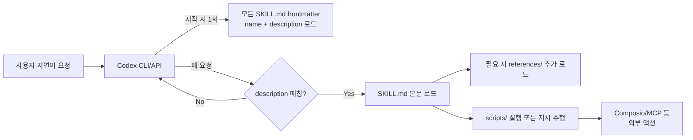

> 원문: [ComposioHQ/awesome-codex-skills](https://github.com/ComposioHQ/awesome-codex-skills)

## 📌 학습 정리

### 1. 한 줄 정의
**Codex CLI/API**용 실전 스킬을 카테고리별로 모은 큐레이션 저장소로, `SKILL.md` 메타데이터 기반의 모듈식 명령 번들을 `$CODEX_HOME/skills`에 설치해 자연어 트리거로 작동시키는 표준 패턴을 제시한다.

### 2. 왜 지금 중요한가
- **`SKILL.md` = 새로운 dotfiles** 흐름이 Anthropic Claude Code뿐 아니라 **Codex(OpenAI) 진영**에도 그대로 자리잡고 있음을 보여준다(name/description frontmatter + 본문 progressive disclosure 구조).
- **Progressive disclosure**: Codex는 메타데이터만 먼저 읽고 트리거 시점에 본문을 로드해 컨텍스트를 가볍게 유지 — 멀티 스킬 환경에서 토큰 예산 관리의 사실상 표준이 되고 있다.
- **MCP 통합이 스킬 레벨로 내려옴**: `mcp-builder`, `helium-mcp`, `paperjsx`(@paperjsx/mcp-server), `codex-sms-verification`(VirtualSMS MCP) 등 스킬이 곧 MCP 서버 래퍼로 출시되는 패턴.
- **Composio CLI**를 통한 1000+ 앱 액션 연결(`connect/`, `connect-apps/`, `pr-review-ci-fix/`, `datadog-logs/`)이 “텍스트 생성 너머 실제 행동” 레이어로 자리잡았다.
- **거버넌스/품질 게이트 스킬**이 본격화: `Bernstein`(병렬 Codex 에이전트 + git worktree 격리 + 품질 게이트), `Vibe-Skills`(요구 동결 → 계획 승인 → 검증 evidence 단계), `AuraKit`(46 modes, 23 sub-agents, 6-layer OWASP, 10 lifecycle hooks) — HITL·감사 가능성을 스킬 단에서 강제하는 흐름.

### 3. 핵심 개념
| 용어 | 정의 | 비고/관련 키워드 |
|---|---|---|
| **Codex Skill** | `SKILL.md`(name+description frontmatter)와 본문 instruction을 담은 폴더 단위 명령 번들 | Claude Code의 skills과 동형 구조 |
| **`$CODEX_HOME/skills`** | 스킬 설치 루트 디렉터리(기본 `~/.codex/skills`) | 재시작 시 메타데이터 재로드 |
| **Progressive disclosure** | 메타데이터 → 본문 → `references/` 순으로 필요시점에만 로드 | context 예산 보호 |
| **Skill layout** | `SKILL.md` + `scripts/` + `references/` + `assets/` | README/changelog는 두지 말 것 |
| **Skill Installer** | `install-skill-from-github.py --repo … --path … --name …` 스크립트 | GitHub 경로에서 직접 설치 |
| **Composio CLI 연결** | 1000+ 앱(Slack, GitHub, Notion 등)에 대한 실 액션 어댑터 | `connect/`, `connect-apps/` |
| **Bernstein** | Codex CLI 어댑터를 가진 멀티 에이전트 오케스트레이터, **격리된 git worktree**에서 병렬 실행 + 품질 게이트 | 멀티 에이전트 안전 실행 |
| **Vibe-Skills** | 340+ 스킬을 **requirement freeze → plan approval → execution → verification evidence → cross-session memory**로 라우팅 | governed skill harness |
| **AuraKit** | 46 modes / 23 sub-agents / 6-layer OWASP / 10 lifecycle hooks / ~55% 토큰 절감 | `npx @smorky85/aurakit` |
| **Emdash Skills** | 14 카테고리 자율 제품화 OS, Codex 네이티브 `.agents/skills/` 지원, 18 agents | CF Workers + Hono + Angular + D1 + Stripe 레퍼런스 |
| **Skill 트리거 메커니즘** | 사용자 자연어 요청과 `description` frontmatter의 의미적 매칭으로 자동 발화, 또는 이름 직접 호명 | description은 "언제 트리거할지"를 exhaustive하게 |

### 4. 작동 원리 / 구조



핵심은 **두 단계 로딩**이다. 시작 시점에는 메타데이터만 인덱싱하고, 실제 트리거가 발생한 스킬에 한해 본문과 `references/`, `scripts/`를 호출 시점에 가져온다. 이로 인해 `description` 작성 품질이 트리거 정확도를 결정한다(원문: "Keep the description exhaustive about when to trigger; keep the body focused on execution steps").

### 5. 실제 사용법 / 예시

설치(권장):
```
git clone https://github.com/ComposioHQ/awesome-codex-skills.git
cd awesome-codex-skills
python skill-installer/scripts/install-skill-from-github.py --repo ComposioHQ/awesome-codex-skills --path meeting-notes-and-actions
```

외부 저장소에서 직접 설치(예: brooks-lint):
```
python3 ~/.codex/skills/.system/skill-installer/scripts/install-skill-from-github.py --repo hyhmrright/brooks-lint --path skills/brooks-lint --name brooks-lint
```

수동 설치:
```
# 폴더를 $CODEX_HOME/skills/ 로 복사 후 Codex 재시작
ls ~/.codex/skills
head ~/.codex/skills/<skill>/SKILL.md
```

스킬 폴더 레이아웃:
```
skill-name/
├── SKILL.md          # Required: instructions + YAML frontmatter
├── scripts/          # Optional: helper scripts for deterministic steps
├── references/       # Optional: long-form docs loaded only when needed
└── assets/           # Optional: templates or files used in outputs
```

`SKILL.md` 템플릿:
```
---
name: my-skill-name
description: What the skill does and when Codex should use it.
---
# My Skill Name
Clear instructions and steps for Codex to execute the task.
```

### 6. 사용자 프로젝트 접목

- **DCSAI `dcs-ai-plugin`(Claude Code plugin) ↔ Codex 양립 fork**: `commands/agents/skills/hooks` 디렉터리 중 **`skills/`** 하위에 본 저장소의 `SKILL.md` frontmatter 컨벤션(name + "언제 트리거할지" exhaustive description + `references/`/`scripts/` 분리)을 사내 표준으로 채택. `ff-claude-manager`(Tauri 2)에는 본 저장소의 **`install-skill-from-github.py`** 패턴을 차용해 "사내 fork repo + path + name" 3-필드 입력으로 동기화하는 자동 업데이트 정책을 추가하면 좋다.
- **DCSAI agent loop · MCP host에 `mcp-builder`/Bernstein 패턴 이식**: 자체 구현한 **MCP host server**의 신규 서버 등록·검증 워크플로를 `mcp-builder`의 evaluation harness 형태로 스킬화하고, **HITL 분기**는 `Vibe-Skills`의 *requirement freeze → plan approval → execution → verification evidence* 5단계를 그대로 차용해 Anthropic SDK agent loop의 사람 승인 지점을 명시화. 멀티 작업 병렬 처리는 `Bernstein`의 **격리 git worktree + 품질 게이트** 모델이 그대로 매핑된다.
- **Team Agent `discovery-core-agent` 실행 환경 표준화**: 브랜드별 **`brand.yaml`** 주입 단계를 스킬 한 개(`brand-context-loader` 류)로 표준화하고, `notion-spec-to-implementation`/`notion-knowledge-capture` 패턴을 참고해 **dcsai KG MCP** 결과를 구조화 산출물로 변환하는 스킬을 만들면 `platform-core-agent`와 `discovery-core-agent` 양 계층에서 재사용 가능. **Activity Log/Observer L1~L4 피드백 루프**는 `Vibe-Skills`의 cross-session memory + verification evidence 개념과 직결되므로, 각 스킬의 산출물에 evidence id를 강제 첨부하는 frontmatter 확장을 사내 컨벤션으로 정의.
- **Quest 3계층(전체·파티·플레이어)에 스킬 스코프 매핑**: 전체 Quest = `platform-core-agent` 공용 스킬, 파티 Quest = 브랜드(`discovery-core-agent`) 전용 스킬(`brand.yaml` 의존), 플레이어 Quest = 개인 워크스페이스 스킬로 3-tier 디렉터리 분리. **FSD/server-only** 원칙상 스킬 실행 결과를 클라이언트로 흘릴 때 `paperjsx` 스타일(JSON → PPTX/DOCX/XLSX/PDF, 로컬 MCP, no API key) 산출 변환을 server-only 액션으로 채택하면 안전.

### 7. 더 파고들 거리
- [Bernstein](https://github.com/ComposioHQ/awesome-codex-skills) — 멀티 에이전트 오케스트레이터 + Codex CLI 어댑터(원문에 외부 URL 미명시, 저장소 README 참조)
- [brooks-lint (hyhmrright/brooks-lint)](https://github.com/hyhmrright/brooks-lint) — 6대 엔지니어링 고전 기반 AI 코드 리뷰
- [codebase-recon (yujiachen-y/codebase-recon-skill)](https://github.com/yujiachen-y/codebase-recon-skill) — git history 기반 hotspot/bug-magnet 분석
- AuraKit — `npx @smorky85/aurakit` (6-layer OWASP, 10 lifecycle hooks)
- [ComposioHQ/awesome-codex-skills 본 저장소](https://github.com/ComposioHQ/awesome-codex-skills) — `mcp-builder/`, `Vibe-Skills`, `Emdash Skills`, `paperjsx/` 등 카테고리별 스킬 원본

---

## 📖 원문 전체 번역 (정독용)

> 의역 최소화한 전체 번역입니다. 큰 흐름은 위 정리에서 잡고, 정확한 워딩이 필요할 땐 이 섹션에서 정독하세요.

# Awesome Codex Skills

Codex CLI와 API 전반에 걸쳐 워크플로우를 자동화하기 위한 실용적인 Codex 스킬 큐레이션 목록입니다.

텍스트 생성 이상의 기능을 하는 스킬을 원하시나요?
Codex는 이메일 전송, 이슈 생성, Slack 포스팅, 그리고 1000개 이상의 앱에서 작업을 수행할 수 있습니다.
자세히 보기 →

---

## 빠른 시작: Codex에 스킬 추가하기

### 스킬 설치 도구로 설치 (권장)

```bash
git clone https://github.com/ComposioHQ/awesome-codex-skills.git
cd awesome-codex-skills

# $CODEX_HOME/skills (기본값: ~/.codex/skills)에 하나 이상의 스킬 설치
python skill-installer/scripts/install-skill-from-github.py --repo ComposioHQ/awesome-codex-skills --path meeting-notes-and-actions
```

설치 도구는 스킬을 가져와 `$CODEX_HOME/skills/<skill-name>`에 배치합니다. 새 스킬을 적용하려면 Codex를 재시작하세요.

### 수동 설치

원하는 스킬 폴더(예: `./spreadsheet-formula-helper`)를 `$CODEX_HOME/skills/` (기본값: `~/.codex/skills/`)에 복사합니다.

Codex를 재시작하면 새 메타데이터가 로드됩니다.

다음 세션에서 작업을 설명하거나 스킬 이름을 언급하면, Codex가 `description` 프론트매터를 기반으로 일치하는 스킬을 트리거합니다.

---

## 목차

- **Bernstein** — 멀티 에이전트 오케스트레이터(Codex CLI 어댑터 포함). 품질 게이트와 함께 격리된 git 워크트리에서 병렬 Codex 에이전트를 실행합니다.
- [Codex 스킬이란?](#codex-스킬이란)
- [스킬](#스킬)
  - [개발 및 코드 도구](#개발-및-코드-도구)
  - [생산성 및 협업](#생산성-및-협업)
  - [커뮤니케이션 및 글쓰기](#커뮤니케이션-및-글쓰기)
  - [데이터 및 분석](#데이터-및-분석)
  - [메타 및 유틸리티](#메타-및-유틸리티)
- [Codex에서 스킬 사용하기](#codex에서-스킬-사용하기)
- [스킬 만들기](#스킬-만들기)
- [기여하기](#기여하기)
- [커뮤니티 참여](#커뮤니티-참여)

---

## Codex 스킬이란?

Codex 스킬은 Codex에게 원하는 방식으로 작업을 수행하는 방법을 알려주는 모듈식 명령 번들입니다. 각 스킬은 메타데이터(이름 + 설명)와 단계별 안내를 포함하는 `SKILL.md`가 있는 자체 폴더에 위치합니다. Codex는 메타데이터를 읽어 스킬을 트리거할 시기를 결정하고, 스킬이 실행된 후에만 본문을 로드하여 컨텍스트를 간결하게 유지합니다.

---

## 스킬

### 개발 및 코드 도구

- **brooks-lint** — 6권의 고전 엔지니어링 도서를 기반으로 한 AI 코드 리뷰 — 도서 인용, 심각도 레이블, 4가지 분석 모드(PR 리뷰, 아키텍처 감사, 기술 부채, 테스트 품질)를 포함한 코드 품질 저하 위험 진단. 설치:
  ```bash
  python3 ~/.codex/skills/.system/skill-installer/scripts/install-skill-from-github.py --repo hyhmrright/brooks-lint --path skills/brooks-lint --name brooks-lint
  ```

- **codebase-migrate/** — 대규모 코드베이스 마이그레이션 및 다중 파일 리팩터링을 검토 가능한 배치로 CI 검증과 함께 실행합니다.

- **codebase-recon** — 코드를 읽기 전에 git 히스토리를 분석하여 코드베이스를 파악 — 자동 스케일 분석을 통해 핫스팟, 버그 유발 지점, 버스 팩터, 모멘텀, 고위험 파일(핫스팟 ∩ 버그 유발 지점)을 표시합니다. 설치:
  ```bash
  python3 ~/.codex/skills/.system/skill-installer/scripts/install-skill-from-github.py --repo yujiachen-y/codebase-recon-skill --path skills/codebase-recon --name codebase-recon
  ```

- **create-plan/** — 코딩 작업을 위한 간결한 실행 계획을 빠르게 초안 작성합니다.

- **deploy-pipeline/** — Stripe → Supabase → Vercel 엔드투엔드 릴리스 파이프라인(검증 및 롤백 포함).

- **Emdash Skills** — 14개 카테고리의 자율적 제품 구축 OS: CF Workers + Hono + Angular + D1 + Stripe. 간단한 한 줄 프롬프트로 94개의 참조 문서, 18개의 에이전트, Codex 네이티브 `.agents/skills/` 지원을 갖춘 SaaS를 배포합니다.

- **gh-address-comments/** — 현재 브랜치의 열린 GitHub PR에 대한 리뷰 또는 이슈 코멘트를 `gh`를 사용하여 처리합니다.

- **gh-fix-ci/** — 실패한 GitHub Actions 검사를 검사하고, 실패를 요약하며, 수정 사항을 제안합니다.

- **mcp-builder/** — 모범 사례와 평가 하네스를 사용하여 MCP 서버를 빌드하고 평가합니다.

- **pr-review-ci-fix/** — Composio CLI를 통한 자동화된 GitHub/GitLab PR 리뷰 및 CI 자동 수정 루프.

- **sentry-triage/** — 스택 프레임을 로컬 소스에 매핑하여 Sentry 이슈를 진단 — 복사-붙여넣기 없이.

- **webapp-testing/** — 타깃 웹 앱 테스트를 실행하고 결과를 요약합니다.

- **AuraKit** — 올인원 스킬 프레임워크: 46개 모드, 23개 서브 에이전트, 6계층 OWASP 보안, 10개 라이프사이클 훅, ~55% 토큰 절감. 설치:
  ```bash
  npx @smorky85/aurakit
  ```

- **Vibe-Skills** — 단계적이고 테스트 중심의 작업을 위한 거버넌스 기반 Codex 스킬 하네스: 340개 이상의 스킬을 요구사항 동결, 계획 승인, 실행, 검증 증거, 세션 간 메모리를 통해 라우팅합니다.

---

### 생산성 및 협업

- **connect/** — Composio CLI를 통해 Codex를 1000개 이상의 앱(Slack, GitHub, Notion 등)에 연결하여 실제 작업을 수행합니다.

- **connect-apps/** — Claude를 위한 Composio CLI 연결을 구성하고 셸에서 앱 워크플로우를 시작합니다.

- **issue-triage/** — Linear 또는 Jira 백로그를 분류하고 터미널에서 버그 스윕을 실행합니다.

- **linear/** — Linear에서 이슈, 프로젝트, 팀 워크플로우를 관리합니다.

- **meeting-insights-analyzer/** — 회의 전사본에서 주제, 위험 요소, 후속 조치를 분석합니다.

- **meeting-notes-and-actions/** — 회의 전사본을 결정 사항과 담당자 태그가 붙은 액션 아이템이 포함된 요약본으로 변환합니다.

- **internal-comms/** — 내부 공지, 업데이트, 이해관계자 메시지를 작성합니다.

- **invoice-organizer/** — 추적 및 보고를 위해 인보이스 데이터를 정규화하고 추출합니다.

- **notion-knowledge-capture/** — 채팅 또는 메모를 적절한 링크가 포함된 구조화된 Notion 페이지로 변환합니다.

- **notion-meeting-intelligence/** — Notion 컨텍스트와 Codex 리서치를 활용하여 회의 자료를 준비합니다.

- **notion-research-documentation/** — 여러 Notion 소스를 인용이 포함된 브리핑, 비교, 또는 보고서로 종합합니다.

- **notion-spec-to-implementation/** — Notion 스펙을 구현 계획, 작업, 진행 추적으로 변환합니다.

- **support-ticket-triage/** — 카테고리, 우선순위, 다음 조치, 초안 답변과 함께 고객 지원 티켓을 분류합니다.

- **file-organizer/** — 워크스페이스를 깔끔하게 유지하기 위해 파일을 정리, 이름 변경, 정돈합니다.

- **paperjsx/** — 구조화된 JSON에서 PPTX 프레젠테이션, DOCX 문서, XLSX 스프레드시트, PDF 인보이스/보고서/차트를 생성합니다. `@paperjsx/mcp-server`를 통해 로컬에서 실행 — API 키 불필요, 네트워크 호출 없음.

- **skill-share/** — 팀원 간에 스킬과 재사용 가능한 명령을 공유합니다.

---

### 커뮤니케이션 및 글쓰기

- **codex-sms-verification** — 외부 저장소: VirtualSMS MCP를 통한 AI 에이전트용 실제 SIM SMS 검증. 145개 이상 국가, 2000개 이상 서비스, 호스팅(mcp.virtualsms.io)과 로컬 stdio 전송 방식 모두 지원.

- **email-draft-polish/** — 적절한 톤과 대상에 맞게 이메일을 초안 작성, 재작성, 또는 압축합니다.

- **changelog-generator/** — 커밋 또는 요약으로부터 명확한 체인지로그를 생성합니다.

- **content-research-writer/** — 출처 인용과 함께 콘텐츠를 리서치하고 초안을 작성합니다.

- **novel-writing** — 외부 저장소: 소설 기획, 챕터 초안 작성, 장면 이어쓰기, 수정을 위한 공개 Codex 스킬.

- **tailored-resume-generator/** — 정량적 성과와 함께 이력서를 직무 설명에 맞게 조정합니다.

- **unslop** — 외부 저장소: 텍스트에서 AI 글쓰기 패턴(삼중 구문, 대시 남용, 헤징 중첩, 아첨식 도입부)을 제거하는 CLI 및 MCP 서버. Codex, Claude Code, Gemini CLI, Cursor와 함께 작동. 5단계 강도 및 린트 전용 감사 모드 지원.

---

### 데이터 및 분석

- **spreadsheet-formula-helper/** — 스프레드시트 수식, 피벗, 배열 수식을 작성하고 디버깅합니다.

- **competitive-ads-extractor/** — 경쟁사 광고를 분석하고 구조화된 인사이트를 추출합니다.

- **datadog-logs/** — Composio CLI를 통해 셸에서 Datadog 로그를 필터링하며, JSON 친화적 출력 및 다이제스트 워크플로우를 제공합니다.

- **developer-growth-analysis/** — Codex 채팅 히스토리를 분석하여 코딩 패턴과 학습 격차를 파악합니다.

- **lead-research-assistant/** — 리드를 리서치하고 기업 정보 데이터로 레코드를 보강합니다.

- **domain-name-brainstormer/** — 기준과 확인을 포함하여 사용 가능한 도메인 이름을 브레인스토밍합니다.

- **raffle-winner-picker/** — 감사 친화적인 로그와 함께 무작위로 당첨자를 선택합니다.

- **langsmith-fetch/** — 분석을 위해 LangSmith 프로젝트/테스트 데이터를 가져옵니다.

- **helium-mcp/** — MCP를 통해 편향 점수와 함께 실시간 뉴스를 검색하고, 실시간 시장 데이터, ML 옵션 가격 책정, 균형 잡힌 뉴스 종합을 제공합니다.

---

### 메타 및 유틸리티

- **brand-guidelines/** — OpenAI/Codex 브랜드 색상과 타이포그래피를 아티팩트에 적용합니다.

- **agent-deep-links/** — Codex, Cursor, VS Code용 딥 링크를 빌드하고 검증하며, Slack 안전 형식 및 대체 안내를 제공합니다.

- **canvas-design/** — 구조화된 캔버스 레이아웃과 디자인 아티팩트를 생성합니다.

- **image-enhancer/** — 구성 가능한 프리셋으로 이미지를 업스케일하고 개선합니다.

- **slack-gif-creator/** — 캡션과 스타일링이 포함된 Slack용 GIF를 생성합니다.

- **theme-factory/** — 재사용 가능한 테마 토큰과 팔레트를 생성합니다.

- **video-downloader/** — 오프라인 리뷰를 위해 동영상을 다운로드하고 준비합니다.

- **template-skill/** — 새 스킬 빌드를 위한 스타터 템플릿.

- **skill-installer/** — 큐레이션 목록 또는 GitHub 경로에서 스킬을 설치하는 헬퍼 스크립트.

- **skill-creator/** — 프로그레시브 디스클로저를 활용하여 효과적인 Codex 스킬을 빌드하기 위한 안내.

---

## Codex에서 스킬 사용하기

스킬은 `$CODEX_HOME/skills` (기본값: `~/.codex/skills`)에 위치합니다. 각 하위 폴더에는 `name`과 `description` 프론트매터가 포함된 `SKILL.md`가 필요합니다.

스킬을 설치하거나 업데이트한 후, Codex를 재시작하면 메타데이터가 다시 로드됩니다.

세션에서 작업을 자연스럽게 설명하면 Codex가 설명과 요청이 일치하는 스킬을 자동으로 트리거합니다. 특정 스킬을 고려하게 하려면 스킬 이름을 직접 언급할 수도 있습니다.

설치를 확인하려면 설치된 스킬을 나열하고(`ls ~/.codex/skills`) 메타데이터를 검사하세요(`head ~/.codex/skills/<skill>/SKILL.md`).

---

## 스킬 만들기

**스킬 구조:**

```
skill-name/
├── SKILL.md          # 필수: 명령 + YAML 프론트매터
├── scripts/          # 선택: 결정론적 단계를 위한 헬퍼 스크립트
├── references/       # 선택: 필요할 때만 로드하는 장문의 문서
└── assets/           # 선택: 출력에 사용되는 템플릿 또는 파일
```

**기본 SKILL.md 템플릿:**

```yaml
---
name: my-skill-name
description: 스킬이 하는 일과 Codex가 언제 사용해야 하는지.
---

# My Skill Name

Codex가 작업을 수행하기 위한 명확한 명령과 단계.
```

**모범 사례:**

- `description`은 트리거 시점에 대해 충분히 상세하게 작성하고, 본문은 실행 단계에 집중하세요.
- 프로그레시브 디스클로저를 활용하세요: 상세한 참조 자료는 `references/`에 넣고, 필요할 때만 `SKILL.md`에서 언급하세요.
- 반복 가능하거나 결정론적인 작업을 위해 스크립트를 포함하고, Codex가 언제 실행해야 하는지 명시하세요.
- 컨텍스트를 간결하게 유지하기 위해 스킬 폴더 내에 불필요한 문서(README, 체인지로그)를 추가하지 마세요.

---

## 기여하기

PR을 환영합니다. 실용적이고 재사용 가능한 스킬을 추가하고, 설명을 정확하게 작성하며, 필요한 스크립트나 참조 자료를 포함하세요. 새 스킬을 추가할 때는 `description`이 Codex가 언제 트리거해야 하는지를 명확히 명시하는지 확인하고, 메타데이터가 컨텍스트 제한 내에 맞는지 테스트하세요.

---

## 커뮤니티 참여

- **Discord 참여** — Codex 스킬을 개발하는 다른 개발자들과 채팅하세요.
- **X에서 팔로우** — 새로운 스킬과 기능에 대한 업데이트를 받으세요.
- **문의:** support@composio.dev
