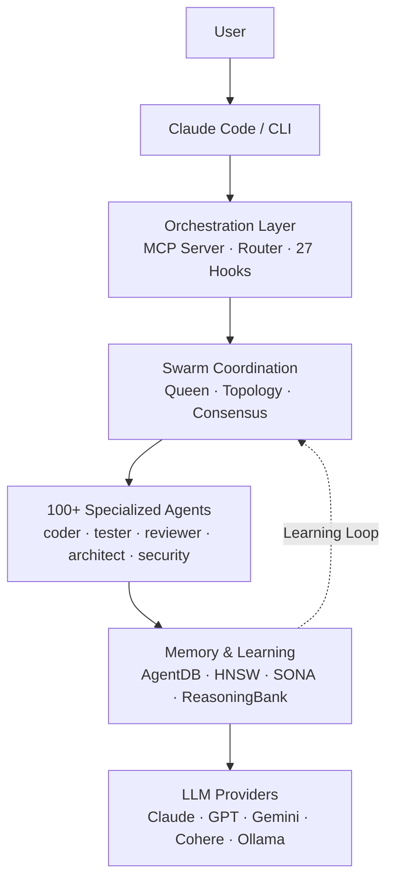

> 원문: [ruflo — Claude 멀티에이전트 오케스트레이션 플랫폼](https://github.com/ruvnet/ruflo)

## 📌 학습 정리

### 1. 한 줄 정의

**Ruflo**(구 Claude Flow)는 **Claude Code**에 swarm 코디네이션·자가학습 메모리·zero-trust 페더레이션을 얹어 100+ 전문 에이전트를 머신·팀·신뢰 경계 너머로 협업시키는 **멀티에이전트 오케스트레이션 플랫폼**이다.

### 2. 왜 지금 중요한가

- **Claude Code 네이티브 플러그인 마켓플레이스**(32개) + **MCP 서버**로 직통합되는 구조라, "Claude Code를 평소처럼 쓰면 hooks가 알아서 라우팅·학습·코디네이션"이라는 **invisible orchestration** 패턴을 구현했다.
- **Queen-led 계층 + Raft/Byzantine/Gossip 합의**로 swarm topology를 다루는 방식은 단일 agent loop 시대를 넘어 **multi-agent consensus**가 실전에 들어왔다는 신호.
- **SONA neural patterns + ReasoningBank + trajectory learning**으로 "세션 단위 정적 행동"에서 "**과거 trajectory에서 학습하는 self-optimizing 에이전트**"로 이동.
- **Agent Federation**(mTLS + ed25519 + PII 14타입 파이프라인 + 행동 기반 trust score `0.4×success + 0.2×uptime + 0.2×threat + 0.2×integrity`)는 **에이전트판 Slack/B2B 신원 프로토콜**의 초기 형태.
- **GOAP A\* 플래너**(`goal.ruv.io`)로 자연어 목표 → preconditions/actions/state-space 탐색 → MCP 툴 콜로 dispatch하는 **plain-English → executable plan** 패러다임 제시.

### 3. 핵심 개념

| 용어 | 정의 | 비고/관련 키워드 |
|---|---|---|
| **Swarm Coordination** | 다수 에이전트를 hierarchical/mesh/adaptive topology로 조율, 합의 알고리즘 적용 | Queen-led, Raft, Byzantine, Gossip |
| **SONA** | 자가학습 neural pattern 시스템, trajectory에서 패턴 추출 | ReasoningBank, MicroLoRA |
| **AgentDB + HNSW** | 벡터 메모리, 브루트포스 대비 150×~12,500× 빠른 검색 | sub-ms retrieval |
| **27 Hooks** | Claude Code 동작에 자동 끼어들어 라우팅·학습·코디네이션 트리거 | invisible orchestration |
| **MCP 통합** | `claude mcp add ruflo`로 MCP 서버 등록, ~210 툴 노출 | 5 server groups: Core/Intelligence/Agents/Memory/DevTools |
| **Agent Federation** | 머신·조직 경계 넘은 zero-trust 에이전트 협업 채널 | mTLS, ed25519 challenge-response, PII gate |
| **Trust Scoring** | `0.4×success + 0.2×uptime + 0.2×threat + 0.2×integrity`, 업그레이드는 점진·다운그레이드는 즉시 | HIPAA/SOC2/GDPR 감사 모드 |
| **PII Pipeline** | 14타입 탐지 + BLOCK/REDACT/HASH/PASS per-trust-level 정책 | adaptive calibration |
| **GOAP A\* Planner** | 자연어 목표 → precondition/effect 그래프 → A\* 최단경로 → MCP 툴 dispatch | replanning on state change |
| **ruvLLM** | 로컬 자가학습 LLM 레이어, MicroLoRA 어댑터로 라우팅 | `ruvnet/RuVector/examples/ruvLLM` |
| **Background Workers** | 12개 자동 트리거 워커(audit, optimize, testgaps 등) | loop-workers 플러그인 |
| **Plugin Marketplace** | 32개 native Claude Code 플러그인 + 21개 npm 플러그인 | core/swarm/autopilot/federation 등 |

### 4. 작동 원리 / 구조

원문 다이어그램을 그대로 정리하면:



핵심은 **Router가 task를 swarm에 분배** → **swarm이 agent를 spawn** → **결과/trajectory가 Memory에 적재** → **Learning Loop가 다음 라우팅 정확도(89%)를 끌어올린다**는 폐쇄 루프.

페더레이션은 별도 레이어:

```
Your Agent → [PII strip] → [ed25519 sign] → [encrypted channel]
                                                    ↓
Their Agent ← [block prompt injection] ← [verify identity]
            (양쪽 audit trail · trust 점진 상승 · 위반 시 즉시 강등)
```

### 5. 실제 사용법 / 예시

**Claude Code 플러그인 설치 (권장)**
```
/plugin marketplace add ruvnet/ruflo
/plugin install ruflo-core@ruflo
/plugin install ruflo-swarm@ruflo
/plugin install ruflo-autopilot@ruflo
/plugin install ruflo-federation@ruflo
```

**CLI / MCP 등록**
```
curl -fsSL https://cdn.jsdelivr.net/gh/ruvnet/ruflo@main/scripts/install.sh | bash
# 또는
npx ruflo@latest init --wizard
npm install -g ruflo@latest
# Claude Code에 MCP 서버로 연결
claude mcp add ruflo -- npx -y @claude-flow/cli@latest
```

**Federation — 두 팀이 고객 데이터 공유 없이 사기 신호만 교환**
```
# Team A: 페더레이션 초기화 + 키페어 생성
npx claude-flow@latest federation init

# Team A: Team B 엔드포인트 join
npx claude-flow@latest federation join wss://team-b.example.com:8443

# Team A: task 전송 — PII는 떠나기 전에 자동 제거
npx claude-flow@latest federation send --to team-b --type task-request \
  --message "Analyze transaction patterns for account anomalies"

# Trust/세션 상태 확인
npx claude-flow@latest federation status
```

### 6. 사용자 프로젝트 접목

- **DCSAI / MCP host server**: 현재 자체 구현 중인 MCP 호스트에 **Ruflo MCP 서버**(`claude mcp add ruflo`)를 게스트 툴 그룹으로 노출시키고, **27 Hooks 패턴**을 참조해 DCSAI의 **agent loop**가 task 시작/종료 시점에 자동으로 메모리 적재·라우팅 결정을 갈아끼우는 **invisible orchestration 레이어**를 추가. **HITL 분기**는 Ruflo의 federation **trust score 다운그레이드 정책**을 차용해 "신뢰 점수 낮은 외부 에이전트 출력 = HITL 강제"로 모델링.
- **DCSAI / dcs-ai-plugin (Claude Code) + ff-claude-manager (Tauri)**: Ruflo가 **Claude Code 마켓플레이스 플러그인** 32종을 어떻게 모듈로 쪼갰는지(`ruflo-core`, `ruflo-swarm`, `ruflo-rag-memory`, `ruflo-knowledge-graph`)가 곧 dcs-ai-plugin의 분할 레퍼런스. Tauri 매니저에는 Ruflo의 **Goal Planner UI**(자연어 → action tree → live agent dashboard)를 참고해 **사내 task → agent 트리 시각화 패널**을 추가.
- **Team Agent / platform-core-agent ↔ discovery-core-agent**: Ruflo의 **Queen-led hierarchy + Router** 구조가 정확히 platform-core(상위 큐)↔discovery-core(브랜드별 워커) 매핑. **Quest 3계층(전체·파티·플레이어)** 분배 로직은 **GOAP A\* 플래너**의 precondition/effect 분해 → 의존 그래프 병렬 dispatch 방식을 가져와 "Quest → 파티 액션 노드 → 플레이어 툴 콜"로 환원하면 자연스럽다.
- **Team Agent / Activity Log·Observer (L1~L4 피드백 루프)**: Ruflo의 **AgentDB + HNSW + SONA + ReasoningBank Learning Loop**가 L1 자동 피드백의 직접 레퍼런스. Activity Log를 **trajectory store**로 재정의하고, Observer는 **behavioral trust score 공식**(`0.4×success + 0.2×uptime + 0.2×threat + 0.2×integrity`)을 브랜드별 에이전트 평가 지표로 차용. **brand.yaml**은 Ruflo의 per-trust-level **PII policy(BLOCK/REDACT/HASH/PASS)** 패턴을 따라 "브랜드별 데이터 노출 정책"을 선언형으로 분리.
- **Team Agent / 크로스 브랜드 협업**: 향후 F&F 브랜드 간 또는 외부 파트너(에이전시·물류) 에이전트 협업 시 **Agent Federation**(mTLS + ed25519 + PII 14타입 파이프라인 + HIPAA/SOC2/GDPR 감사 모드)을 그대로 참조 — KG MCP 직연결 구조에 trust boundary를 얹는 자연스러운 확장 경로.

### 7. 더 파고들 거리

- [User Guide (전체 문서)](https://github.com/ruvnet/ruflo) — Quick Start, Core Features, Intelligence & Learning, Swarm & Coordination, Security, Configuration
- [flo.ruv.io](https://flo.ruv.io/) — Web UI 호스팅 데모, 6개 frontier 모델 + 병렬 MCP 툴 콜
- [goal.ruv.io](https://goal.ruv.io/) · [goal.ruv.io/agents](https://goal.ruv.io/agents) — GOAP A\* 플래너 + 라이브 agent 대시보드
- ruvLLM 소스: `ruvnet/RuVector/examples/ruvLLM` (원문 언급, 직접 URL 미제공)
- 원문 인용 이슈: **ADR-033**(Web UI 아키텍처), **issue #1689**(Web UI 로드맵), **issue #1669**(Federation 아키텍처·trust 모델·구현 로드맵) — 모두 `ruvnet/ruflo` GitHub 저장소 내

---

## 📖 원문 전체 번역 (정독용)

> 의역 최소화한 전체 번역입니다. 큰 흐름은 위 정리에서 잡고, 정확한 워딩이 필요할 땐 이 섹션에서 정독하세요.

# Ruflo
## Claude Code를 위한 멀티에이전트 AI 오케스트레이션

머신, 팀, 신뢰 경계를 가로질러 100개 이상의 특화 AI 에이전트를 오케스트레이션하세요. Ruflo는 Claude Code에 조율된 스웜(swarm), 자가 학습 메모리, 연합 통신(federated comms), 그리고 엔터프라이즈 보안을 추가합니다 — 에이전트들이 단순히 실행되는 것이 아니라, 협업합니다.

---

## Ruflo를 사용하는 이유?

Claude Flow가 이제 Ruflo가 되었습니다 — Rust, 플로우 상태(flow states), 그리고 필연적으로 느껴지는 것들을 만드는 것을 사랑하는 rUv가 명명했습니다. "Ru"는 Ruv에서 왔고, "flo"는 flow(흐름)를 의미합니다. 내부적으로는 Rust로 작성된 WASM 커널이 정책 엔진, 임베딩, 그리고 증명 시스템(proof system)을 구동합니다.

---

## Ruflo가 하는 일

`init` 하나로 Claude Code에 신경계가 생깁니다: 에이전트들은 스스로 스웜을 구성하고, 모든 태스크에서 학습하고, 세션을 넘어 기억하며 — 연합(federation)을 통해 — 데이터를 유출하지 않으면서 다른 머신의 에이전트들과 안전하게 통신합니다. 여러분은 계속 코드를 작성하면 됩니다. Ruflo가 조율을 담당합니다.

### 자가 학습 / 자가 최적화 에이전트 아키텍처

```
User --> Ruflo (CLI/MCP) --> Router --> Swarm --> Agents --> Memory --> LLM Providers
                          ^                           |
                          +---- Learning Loop <-------+
```

---

## Ruflo가 처음이신가요?

314개의 MCP 툴이나 26개의 CLI 명령어를 배울 필요가 없습니다. `init` 후에는 Claude Code를 평소처럼 사용하기만 하면 됩니다 — 훅(hooks) 시스템이 자동으로 태스크를 라우팅하고, 성공적인 패턴에서 학습하며, 백그라운드에서 에이전트들을 조율합니다.

---

## 빠른 시작

### Claude Code 플러그인 (권장)

Ruflo를 네이티브 Claude Code 플러그인으로 설치하세요 — 스킬, 명령어, 에이전트, MCP 툴을 직접 추가합니다:

```bash
# 마켓플레이스 추가
/plugin marketplace add ruvnet/ruflo

# 코어 + 필요한 플러그인 설치
/plugin install ruflo-core@ruflo
/plugin install ruflo-swarm@ruflo
/plugin install ruflo-autopilot@ruflo
/plugin install ruflo-federation@ruflo
```

---

## 전체 32개 플러그인

### 코어 & 오케스트레이션

| 플러그인 | 기능 |
|---|---|
| ruflo-core | 기반 — 서버, 헬스 체크, 플러그인 디스커버리 |
| ruflo-swarm | 여러 에이전트를 팀으로 조율 |
| ruflo-autopilot | 에이전트가 루프 내에서 자율적으로 실행되도록 허용 |
| ruflo-loop-workers | 타이머로 백그라운드 태스크 스케줄링 |
| ruflo-workflows | 재사용 가능한 멀티스텝 태스크 템플릿 |
| ruflo-federation | 다른 머신의 에이전트들이 안전하게 협업 |

### 메모리 & 지식

| 플러그인 | 기능 |
|---|---|
| ruflo-agentdb | 에이전트 메모리용 빠른 벡터 데이터베이스 |
| ruflo-rag-memory | 스마트 검색 — 하이브리드 검색, 그래프 홉, 다양성 랭킹 |
| ruflo-rvf | 세션 간 에이전트 메모리 저장 및 복원 |
| ruflo-ruvector | ruvector — GPU 가속 검색, Graph RAG, 103개 툴 |
| ruflo-knowledge-graph | 엔티티 관계 맵 구축 및 탐색 |

### 지능 & 학습

| 플러그인 | 기능 |
|---|---|
| ruflo-intelligence | 에이전트가 과거 성공에서 학습하며 더 똑똑해짐 |
| ruflo-daa | 동적 에이전트 행동 및 인지 패턴 |
| ruflo-ruvllm | 스마트 라우팅으로 로컬 LLM (Ollama 등) 실행 |
| ruflo-goals | 큰 목표를 계획으로 분해하고 진행 상황 추적 |

### 코드 품질 & 테스팅

| 플러그인 | 기능 |
|---|---|
| ruflo-testgen | 누락된 테스트 발견 및 자동 생성 |
| ruflo-browser | Playwright로 브라우저 테스팅 자동화 |
| ruflo-jujutsu | git diff 분석, 위험도 점수, 리뷰어 제안 |
| ruflo-docs | 문서 자동 생성 및 유지 관리 |

### 보안 & 컴플라이언스

| 플러그인 | 기능 |
|---|---|
| ruflo-security-audit | 취약점 및 CVE 스캔 |
| ruflo-aidefence | 프롬프트 인젝션 차단, PII 감지, 안전 스캐닝 |

### 아키텍처 & 방법론

| 플러그인 | 기능 |
|---|---|
| ruflo-adr | 살아있는 기록으로 아키텍처 결정 추적 |
| ruflo-ddd | 도메인 주도 설계 스캐폴딩 — 컨텍스트, 애그리게이트, 이벤트 |
| ruflo-sparc | 품질 게이트를 포함한 가이드 5단계 개발 방법론 |

### DevOps & 관찰 가능성

| 플러그인 | 기능 |
|---|---|
| ruflo-migrations | 데이터베이스 스키마 변경 안전하게 관리 |
| ruflo-observability | 구조화된 로그, 트레이스, 메트릭을 한 곳에서 |
| ruflo-cost-tracker | 토큰 사용량 추적, 예산 설정, 비용 알림 수신 |

### 확장성

| 플러그인 | 기능 |
|---|---|
| ruflo-wasm | 샌드박스 WebAssembly 에이전트 실행 |
| ruflo-plugin-creator | 나만의 플러그인 스캐폴딩, 검증 및 게시 |

### 도메인 특화

| 플러그인 | 기능 |
|---|---|
| ruflo-iot-cognitum | IoT 디바이스 관리 — 신뢰 점수, 이상 감지, 플릿 |
| ruflo-neural-trader | neural-trader — 4개 에이전트, 백테스팅, 112개 이상 툴을 갖춘 AI 트레이딩 |
| ruflo-market-data | 시장 데이터 수집, OHLCV 벡터화, 패턴 감지 |

---

## CLI 설치

```bash
# 원라인 설치
curl -fsSL https://cdn.jsdelivr.net/gh/ruvnet/ruflo@main/scripts/install.sh | bash

# 또는 npx 경유
npx ruflo@latest init --wizard

# 또는 전역 설치
npm install -g ruflo@latest
```

## MCP 서버

```bash
# Claude Code에 Ruflo를 MCP 서버로 추가
claude mcp add ruflo -- npx -y @claude-flow/cli@latest
```

---

## 제공되는 기능

| | 기능 | 설명 |
|---|---|---|
| 🤖 | 100개 이상의 에이전트 | 코딩, 테스팅, 보안, 문서화, 아키텍처 전문 에이전트 |
| 📡 | 통신 레이어 | 제로 트러스트 연합 — 머신/조직 간 에이전트가 발견, 인증, 작업 교환을 안전하게 수행 |
| 🐝 | 스웜 조율 | 합의(consensus)를 갖춘 계층형, 메시, 적응형 토폴로지 |
| 🧠 | 자가 학습 | SONA 신경 패턴, ReasoningBank, 트라젝토리 학습 |
| 💾 | 벡터 메모리 | HNSW 인덱싱된 AgentDB (150배~12,500배 더 빠른 검색) |
| ⚡ | 백그라운드 워커 | 자동 트리거되는 12개 워커 (audit, optimize, testgaps 등) |
| 🧩 | 플러그인 마켓플레이스 | 32개 네이티브 Claude Code 플러그인 + 21개 npm 플러그인 |
| 🔌 | 멀티 프로바이더 | Claude, GPT, Gemini, Cohere, Ollama와 스마트 라우팅 |
| 🛡️ | 보안 | AIDefence, 입력 검증, CVE 치료, 경로 탐색 방지 |
| 🌐 | 에이전트 연합 | 제로 트러스트 보안으로 크로스 인스톨레이션 에이전트 협업 |
| 💬 | Web UI 베타 | flo.ruv.io에서 멀티모델 채팅, 병렬 MCP 툴 호출, 브라우저 내 WASM 툴 갤러리 |
| 🎯 | RuFlo 리서치 | goal.ruv.io의 GOAP A* 플래너 — 일반 영어 목표 → 실행 가능한 에이전트 계획, `/agents`의 실시간 에이전트 대시보드 |

---

## Web UI (베타) — 셀프 호스팅 가능, 호스팅 데모: flo.ruv.io

RuFlo의 웹 UI는 내장된 Model Context Protocol (MCP) 툴 호출 기능을 갖춘 멀티모델 AI 채팅입니다.

Qwen, Claude, Gemini, 또는 OpenAI와 대화하는 동안 RuFlo가 CLI에서 사용하는 것과 동일한 MCP 툴들을 — 에이전트 오케스트레이션, 영구 메모리, 스웜 조율, 코드 리뷰, GitHub 작업 — 채팅에서 직접 호출합니다. 설치 불필요, 시도해 보는 데 API 키도 필요 없습니다.

| | 기능 | 중요한 이유 |
|---|---|---|
| 🧠 | 로컬 또는 원격 어떤 모델이든 | 기본 제공 6개 큐레이션 프론티어 모델 — Qwen 3.6 Max (기본값), Claude Sonnet 4.6, Claude Haiku 4.5, Gemini 2.5 Pro, Gemini 2.5 Flash, OpenAI — OpenRouter 경유. 나만의 모델 추가: OpenAI 호환 엔드포인트 (vLLM, Ollama, LM Studio, Together, Groq, 셀프 호스팅) 모두 가능. |
| 🦾 | ruvLLM 자가 학습 AI | `ruvLLM` 네이티브 지원 (위치: `ruvnet/RuVector/examples/ruvLLM`) — RuFlo의 자가 개선 로컬 모델 레이어. MicroLoRA 어댑터로 라우팅하고, SONA를 통해 트라젝토리에서 학습하며, 머신에 머뭅니다. 클라우드 모델과 페어링하거나 완전 오프라인으로 실행. |
| 🛠️ | ~210개 툴, 바로 호출 가능 | 5개 서버 그룹 (Core, Intelligence, Agents, Memory, DevTools) + 브라우저에서 완전히 실행되는 18개 툴 갤러리 — 오프라인에서도 작동. |
| 🔌 | 나만의 MCP 서버 연결 | 채팅 입력의 `MCP (n)` 버튼 → `Add Server`를 클릭하고 아무 MCP 엔드포인트 (HTTP, SSE, 또는 stdio)를 붙여넣으세요. 툴들이 동일한 병렬 실행 플로우에서 RuFlo 네이티브 툴들과 합류합니다. `localhost:3000`의 로컬 MCP 서버를 실행하면 바로 작동합니다. |
| ⚡ | 툴 병렬 실행 | 하나의 모델 응답이 4~6개 이상의 툴을 동시에 실행할 수 있습니다. UI는 `Step 1 — 2 tools completed` 배지가 붙은 카드로 표시되어 무엇이 실행되었는지 정확히 확인할 수 있습니다. |
| 💾 | 지속되는 메모리 | `"내가 좋아하는 색은 인디고야"`라고 말하고 몇 주 후에 물어봐도 — RuFlo가 기억합니다. AgentDB + HNSW 벡터 검색 (무차별 대입보다 ≥150배 빠름) 기반. |
| 📘 | 내장 기능 투어 | 사이드바의 물음표 아이콘 클릭 — "RuFlo Capabilities" 모달이 열려 전체 툴 목록, 모델 강점, 아키텍처, 키보드 단축키가 표시됩니다. |
| 🏠 | 셀프 호스팅 가능 | Web UI는 Docker (`ruflo/src/ruvocal/Dockerfile`)로 임베디드 Mongo와 함께 제공됩니다. 나만의 Cloud Run / Fly / Kubernetes / docker-compose에 배포하세요. 호스팅된 `flo.ruv.io` 데모는 하나의 옵션이며, 직접 실행하는 것도 완전히 지원됩니다. |
| 🚀 | 설치 없이 바로 시도 | 호스팅 URL 열기, 모델 선택, 질문 입력. 온보딩의 전부입니다. |

- **호스팅 데모 시도:** https://flo.ruv.io/ — 계정 없음, API 키 없음.
- **직접 실행:** 소스는 `ruflo/src/ruvocal/`에 있으며, 멀티스테이지 Dockerfile (`INCLUDE_DB=true`는 MongoDB 포함 빌드)과 Google Cloud Run용 `cloudbuild.yaml`이 제공됩니다. 아키텍처는 ADR-033, 로드맵은 issue #1689를 참조하세요.

---

## 목표 플래너 UI — goal.ruv.io의 자율 에이전트

고수준 목표를 실행 가능한 에이전트 계획으로 전환하세요.

`goal.ruv.io`는 RuFlo의 호스팅된 GOAP (Goal-Oriented Action Planning) 프론트엔드입니다 — 일반 영어로 결과를 설명하면 RuFlo가 이를 전제조건, 액션, 상태 공간을 통한 A* 경로로 분해하고, `/agents`의 실제 에이전트들에게 작업을 디스패치합니다.

| | 기능 | 중요한 이유 |
|---|---|---|
| 🎯 | 일반 영어 목표 | `"테스트와 PR과 함께 auth 리팩토링 완료하기"` 입력 — RuFlo가 성공 기준, 제약 조건, 암묵적 전제조건을 추출합니다. JSON 불필요, DSL 불필요. |
| 🧭 | GOAP A* 플래너 | 소프트웨어 작업에 포팅된 클래식 게임 AI 플래닝: 가장 짧은 실행 가능 경로를 찾기 위해 전제조건/효과를 가진 액션을 통해 상태 공간 탐색. 상태가 변하면 즉시 재계획. |
| 🤖 | 실시간 에이전트 대시보드 | `goal.ruv.io/agents`에서 모든 생성된 에이전트 — 역할, 현재 단계, 메모리 네임스페이스, 토큰 예산, 상태 — 를 확인합니다. 클릭해서 트라젝토리 검사, 폭주한 워커 종료, 또는 재할당. |
| 🌳 | 시각적 계획 트리 | 목표는 진행 상황, 차단된 분기, 롤백이 강조된 접을 수 있는 액션 트리로 렌더링됩니다. 에이전트가 왜 그 경로를 선택했는지 *정확히* 확인 — 불투명한 chain-of-thought 없음. |
| ♻️ | 적응형 재계획 | 액션이 실패하거나 새로운 정보가 도착하면, 플래너가 처음부터 재시작하는 대신 현재 상태에서 A*를 재실행합니다. 실패가 학습이 되고, 루프가 되지 않습니다. |
| 🧠 | 공유 메모리 + SONA | 계획, 트라젝토리, 결과가 AgentDB로 흘러들어갑니다. 미래의 계획은 HNSW를 통해 과거 솔루션을 검색합니다 — 플래너는 실행할수록 더 똑똑해집니다. |
| 🔗 | MCP 툴과 연결 | 모든 액션 노드는 툴 호출에 매핑됩니다 (RuFlo의 ~210개 MCP 툴, 커스텀 서버, 또는 셸). 플래너는 의존성 그래프가 허용하는 경우 병렬로 스케줄링합니다. |
| 🚀 | 설치 없이 바로 시도 | `goal.ruv.io` 열기, 목표 설명, 실행 지켜보기. 소스는 `v3/goal_ui/`에 있습니다 — Vite + Supabase, 셀프 호스팅 가능. |

- **시도:** https://goal.ruv.io/ (목표) · https://goal.ruv.io/agents (실시간 에이전트)
- **직접 실행:** `goal` 브랜치 클론 후 `cd v3/goal_ui && npm install && npm run dev`

---

## 에이전트 연합 — 에이전트들을 위한 Slack

```
Your Agent --> [ 비밀 제거 ] --> [ 메시지 서명 ] --> [ 암호화된 채널 ]
                 이메일, SSN,       발신자 증명          전송 중 아무도
                 키 제거됨          위조 거부              읽지 못함
                                                                |
                                                                v
Their Agent <-- [ 공격 차단 ] <-- [ 신원 확인 ] <--------------+
                 프롬프트            위조 거부
                 인젝션 차단

                          양측에 감사 추적.
                  신뢰는 시간이 지남에 따라 쌓입니다. 나쁜 행동 = 즉시 강등.
```

Slack이 팀에게 채널을 제공했듯이, 연합은 에이전트들에게 동일한 것을 제공합니다 — **신뢰 경계를 넘어선 공유 작업공간** — 서로 다른 머신, 조직, 클라우드 리전의 에이전트들이 서로를 발견하고, 신원을 증명하며, 태스크를 협업할 수 있습니다.

차이점: 일부 채널은 신뢰할 수 있고, 일부는 그렇지 않습니다.

`@claude-flow/plugin-agent-federation`이 이를 자동으로 처리합니다. 에이전트들이 연합에 참여하고, mTLS + ed25519로 검증을 받으며, 작업 교환을 시작합니다 — 노드를 떠나기 전에 PII가 제거되고, 모든 메시지가 감사 가능합니다. 신뢰할 수 없는 에이전트들도 낮은 권한으로 참여할 수 있습니다: 이들은 디스커버리 정보를 볼 수 있지만, 메모리는 볼 수 없습니다. 신뢰성을 증명할수록 신뢰가 업그레이드됩니다. 잘못된 행동을 하면 즉시 강등됩니다 — 루프에 사람이 필요 없습니다.

핸드셰이크를 구성하거나 인증서를 관리할 필요가 없습니다. `federation init`, `federation join`을 실행하면 에이전트들이 통신을 시작합니다. 프로토콜이 신원을 처리하고, PII 파이프라인이 데이터 안전을 처리하며, 감사 추적이 컴플라이언스를 처리합니다.

### 연합 기능

| | 기능 | 작동 방식 |
|---|---|---|
| 🔒 | 제로 트러스트 연합 | 원격 에이전트는 신뢰할 수 없는 상태로 시작됩니다. mTLS + ed25519 챌린지-응답으로 신원 증명. API 키 없음, 공유 비밀 없음. |
| 🛡️ | PII 게이팅 데이터 플로우 | 14가지 유형 감지 파이프라인이 모든 아웃바운드 메시지를 스캔. 신뢰 수준별 정책: BLOCK, REDACT, HASH, 또는 PASS. 적응형 캘리브레이션으로 거짓 양성 감소. |
| 📊 | 행동 신뢰 점수 | 공식 (`0.4×success + 0.2×uptime + 0.2×threat + 0.2×integrity`)으로 피어를 지속적으로 평가. 업그레이드는 히스토리 필요; 강등은 즉각적. |
| 📋 | 내장 컴플라이언스 | HIPAA, SOC2, GDPR 감사 추적을 컴플라이언스 모드로. 모든 연합 이벤트는 HNSW로 검색 가능한 구조화된 기록을 생성. |
| 🤝 | 9개 MCP 툴 + 10개 CLI 명령어 | 전체 라이프사이클: `federation_init`, `federation_send`, `federation_trust`, `federation_audit` 등. |

### 예시: 두 팀이 고객 데이터를 공유하지 않고 사기 신호 공유

```bash
# Team A: 연합 초기화 및 키페어 생성
npx claude-flow@latest federation init

# Team A: Team B의 연합 엔드포인트에 참여
npx claude-flow@latest federation join wss://team-b.example.com:8443

# Team A: 태스크 전송 — PII는 떠나기 전에 자동으로 제거됨
npx claude-flow@latest federation send --to team-b --type task-request \
  --message "Analyze transaction patterns for account anomalies"

# Team A: 피어 신뢰 수준 및 세션 상태 확인
npx claude-flow@latest federation status
```

전체 아키텍처, 신뢰 모델, 구현 로드맵은 issue #1669를 참조하세요.

```bash
# Claude Code 플러그인
/plugin install ruflo-federation@ruflo

# 또는 CLI 경유
npx claude-flow@latest plugins install @claude-flow/plugin-agent-federation
```

---

## Claude Code: Ruflo 없이 vs 있을 때

| 기능 | Claude Code 단독 | + Ruflo |
|---|---|---|
| 에이전트 협업 | 격리됨, 공유 컨텍스트 없음 | 공유 메모리와 합의를 가진 스웜 |
| 조율 | 수동 오케스트레이션 | 퀸 주도 계층 구조 (Raft, Byzantine, Gossip) |
| 메모리 | 세션 전용 | 밀리초 이하 검색의 HNSW 벡터 메모리 |
| 학습 | 정적 행동 | 패턴 매칭을 통한 SONA 자가 학습 |
| 태스크 라우팅 | 사용자가 결정 | 지능형 라우팅 (89% 정확도) |
| 백그라운드 워커 | 없음 | 자동 트리거되는 12개 워커 |
| LLM 프로바이더 | Anthropic 전용 | 페일오버를 갖춘 5개 프로바이더 |
| 보안 | 표준 | AIDefence를 갖춘 CVE 강화 |

---

## 아키텍처 개요

```
User --> Claude Code / CLI
          |
          v
    오케스트레이션 레이어
    (MCP Server, Router, 27 Hooks)
          |
          v
    스웜 조율
    (Queen, Topology, Consensus)
          |
          v
    100개 이상의 특화 에이전트
    (coder, tester, reviewer, architect, security...)
          |
          v
    메모리 & 학습
    (AgentDB, HNSW, SONA, ReasoningBank)
          |
          v
    LLM 프로바이더
    (Claude, GPT, Gemini, Cohere, Ollama)
```

---

## 문서

아키텍처, 구성, CLI 레퍼런스, API 사용법, 플러그인 개발, 고급 주제를 포함한 전체 문서:

**사용자 가이드** — 완전한 레퍼런스 문서

| 섹션 | 주제 |
|---|---|
| 빠른 시작 | 설치, 사전 요구사항, 설치 프로필 |
| 코어 기능 | MCP 툴, 에이전트, 메모리, 신경 학습 |
| 지능 & 학습 | 훅, 워커, SONA, 모델 라우팅 |
| 스웜 & 조율 | 토폴로지, 합의, 하이브 마인드 |
| 보안 | AIDefence, CVE 치료, 검증 |
| 에코시스템 | RuVector, agentic-flow, Flow Nexus |
| 구성 | 환경 변수, 구성 스키마 |
| 플러그인 마켓플레이스 | 플러그인 탐색 및 설치 |

---

## 지원

| 리소스 | 링크 |
|---|---|
| 문서 | 사용자 가이드 |
| 이슈 & 버그 | GitHub Issues |
| 엔터프라이즈 | ruv.io |
| 커뮤니티 | Agentics Foundation Discord |

---

Cognitum.one 기반  
라이선스: MIT — RuvNet
