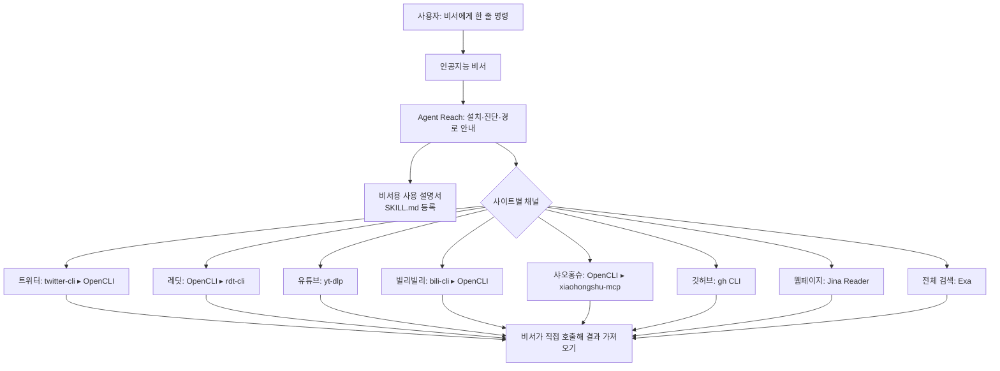

<article class="ai-knowledge-article">

<header class="ai-post-hero">
  <p class="ai-eyebrow"><a class="ai-back" href="../">이번 호</a> · 2026-06-15 · 학습 브리프</p>
  <h2 class="ai-post-title">Panniantong/Agent-Reach — 외부 API 비용 없이 Twitter·Reddit·YouTube·GitHub를 읽고 검색하는 CLI</h2>
</header>

> 원문: [Panniantong/Agent-Reach — 외부 API 비용 없이 Twitter·Reddit·YouTube·GitHub를 읽고 검색하는 CLI](https://github.com/Panniantong/Agent-Reach)

## 📌 학습 정리

### 1. 한 줄로 말하면

여러분의 인공지능 비서가 트위터, 레딧, 유튜브, 깃허브 같은 사이트를 직접 들여다볼 수 있게, 필요한 도구들을 한 번에 깔아주고 관리해주는 설치 도우미예요.

### 2. 왜 이게 만들어졌어요?

요즘 인공지능 비서(AI Agent)는 코드도 짜고 문서도 고쳐주지만, "이 유튜브 영상 요약해줘"나 "레딧에서 이 버그 얘기 좀 찾아봐" 같은 부탁에는 의외로 약합니다. 트위터는 공식 데이터 통로(API)를 쓰려면 돈을 내야 하고, 레딧은 익명 접근을 막아버렸고, 샤오홍슈는 로그인을 해야 보이고, 빌리빌리는 일반적인 다운로드 도구를 차단해 두었거든요. 그래서 사람들은 플랫폼마다 "어떤 도구를 써야 하지?", "쿠키는 어떻게 넘기지?", "어제 되던 게 왜 오늘 안 되지?" 하면서 시간을 빨아먹히곤 합니다. Agent Reach는 "지금 시점에서 가장 안정적인 접속 방법을 우리가 골라 깔아 둘 테니, 너는 그냥 비서에게 시키기만 해" 라는 결로 만들어진 도구예요. 접속 방법이 바뀌면 프로젝트 쪽에서 갈아끼우고, 사용자는 명령 한 줄로 갱신만 받으면 됩니다.

### 3. 비유로 풀면

이건 마치 해외여행 갈 때 나라마다 다른 전기 콘센트를 한 번에 처리해주는 **만능 어댑터 키트** 같은 거예요. 어댑터 키트 자체가 전기를 만들어내는 건 아니지만, "어느 나라에서는 어떤 모양 플러그가 필요한지"를 알고 있어서 도착하자마자 바로 꽂아 쓸 수 있죠.

그래서 결국, Agent Reach는 인터넷을 읽어주는 일을 직접 하는 게 아니라, 각 사이트별로 "지금 가장 잘 통하는 도구"를 골라 깔아주고 "이건 막히면 저거 써" 하고 길을 안내해주는 역할을 합니다.

### 4. 어떻게 작동하는지 (그림으로)



흐름을 풀어쓰면, 사용자가 비서에게 "Agent Reach 깔아줘"라고 부탁하면 비서가 설치 스크립트를 실행해 각 사이트별 도구를 깔고, "이런 일에는 이 도구를 써"라는 안내서(SKILL.md)를 자기 자신에게 등록해 둡니다. 이후 사용자가 "트위터 검색해줘" 같은 요청을 하면, 비서가 이 안내서를 보고 알맞은 도구를 직접 호출해 결과를 가져옵니다. Agent Reach 자체는 중간에서 데이터를 가공하지 않고, 어디까지나 "길잡이" 역할만 합니다.

### 5. 처음 보는 용어 풀이

- **에이전트 (AI Agent)** — 사용자의 자연어 부탁을 받아 스스로 명령을 실행하고 결과를 가져다주는 인공지능 비서를 말해요. Claude Code, Cursor, OpenClaw 같은 것들이 여기에 해당합니다.
- **명령줄 도구 (CLI, Command Line Interface)** — 터미널 창에 문장을 입력해 실행하는 형태의 프로그램이에요. 마우스로 클릭하는 앱과 달리, 비서가 글자로 "명령"을 적어 호출하기에 잘 맞습니다.
- **모델 컨텍스트 프로토콜 호스트 (MCP, Model Context Protocol)** — 인공지능 모델이 외부 도구나 데이터에 일관된 방식으로 접근할 수 있게 해주는 약속이에요. Agent Reach는 검색 엔진(Exa)을 이 방식으로 비서에 연결해 줍니다.
- **쿠키 (Cookie)** — 브라우저가 "이 사람은 로그인된 상태야"라고 기억하는 작은 데이터예요. 트위터·샤오홍슈처럼 로그인이 필요한 사이트는 이 쿠키를 도구에 넘겨야 비서가 대신 읽을 수 있습니다.
- **백엔드 (Backend)와 라우팅 (Routing)** — 여기서 백엔드는 "실제로 일을 처리해주는 뒤편의 도구"이고, 라우팅은 "어떤 도구로 길을 보낼지 정하는 일"이에요. Agent Reach는 사이트마다 "1순위 도구가 막히면 2순위로 자동으로 넘긴다"는 식의 우선순위 목록을 가지고 있습니다.
- **건강 검진 (doctor 명령)** — `agent-reach doctor`처럼 실행해서 "지금 어느 채널이 잘 되고 어느 게 막혔는지, 막혔다면 어떻게 고치면 되는지"를 알려주는 점검 기능이에요.
- **드라이런과 안전 모드 (Dry Run / Safe Mode)** — 드라이런은 "실제로는 안 깔고 무엇이 깔릴지 미리 보여주는" 모드이고, 안전 모드는 "시스템에 손대지 않고 필요한 게 뭔지만 알려주는" 모드예요. 공용 컴퓨터나 서버에서 신중하게 쓰고 싶을 때 유용합니다.

### 6. 한 발 더 들어가고 싶다면

- [한국어 README](https://github.com/Panniantong/Agent-Reach/blob/main/docs/README_ko.md) — 이걸 보면 Agent Reach 사용법을 한국어로 좀 더 자세히 따라갈 수 있어요.
- [yt-dlp](https://github.com/yt-dlp/yt-dlp) — 이걸 보면 유튜브 자막·메타데이터를 어떻게 가져오는지, 어떤 옵션이 있는지 감을 잡을 수 있어요.
- [Jina Reader](https://github.com/jina-ai/reader) — 이걸 보면 일반 웹페이지의 너저분한 HTML을 비서가 읽기 좋은 형태로 바꾸는 방식을 알 수 있어요.
- [OpenCLI](https://github.com/jackwener/opencli) — 이걸 보면 브라우저 로그인 상태를 그대로 빌려서 레딧·샤오홍슈 같은 사이트를 다루는 접근법을 알 수 있어요.
- [mcporter](https://github.com/nicobailon/mcporter) — 이걸 보면 모델 컨텍스트 프로토콜(MCP) 방식으로 외부 도구를 비서에 끼워 넣는 흐름을 알 수 있어요.

---

## 📖 원문 전체 번역 (정독용)

> 의역 최소화한 전체 번역입니다. 큰 흐름은 위 정리에서 잡고, 정확한 워딩이 필요할 땐 이 섹션에서 정독하세요.

**당신의 AI Agent에 인터넷 능력을 한 번에 장착하세요**

지금 가장 안정적인 접속 방식을 골라서, 설치하고, 점검까지 마쳤습니다 — 접속 방식은 교체될 수 있지만, 당신이 신경 쓸 필요는 없습니다

🇨🇳 국내 접속: 본 프로젝트는 [AtomGit 미러](https://atomgit.com/qq_51337814/Agent-Reach)에도 호스팅되어 있습니다 (GitHub와 자동 동기화, 클론이 더 빠릅니다)

---

## Agent Reach가 왜 필요한가?

AI Agent는 이미 코드를 작성하고, 문서를 수정하고, 프로젝트를 관리할 수 있습니다 — 하지만 인터넷에서 무언가를 찾아오라고 하면 막막해집니다:

*   📺 "이 YouTube 튜토리얼이 뭘 설명하는지 봐줘" → **볼 수 없음**, 자막을 가져오지 못함
*   🐦 "트위터에서 사람들이 이 제품에 대해 어떻게 평가하는지 검색해봐" → **검색 불가**, Twitter API는 유료
*   📖 "Reddit에서 똑같은 버그를 겪은 사람이 있는지 찾아봐" → **403 차단**, 서버 IP가 거부됨
*   📕 "샤오홍수(小红书)에서 이 제품 평판 좀 봐줘" → **열리지 않음**, 로그인 후에야 볼 수 있음
*   📺 "빌리빌리(B站)에 기술 영상이 있는데 요약해줘" → **가져올 수 없음**, 범용 다운로드 도구가 빌리빌리 풍크 대응에 전면 차단됨
*   🔍 "최신 LLM 프레임워크 비교를 인터넷에서 검색해줘" → **쓸만한 검색 도구가 없음**, 유료이거나 품질이 낮음
*   🌐 "이 웹페이지에 뭐가 쓰여 있는지 봐줘" → **HTML 태그만 잔뜩 가져옴**, 읽을 수가 없음
*   📦 "이 GitHub 저장소는 뭐 하는 건가요? Issue에는 뭐라고 쓰여 있나요?" → 사용 가능하긴 하지만 인증 설정이 번거로움
*   📡 "이 RSS 피드 몇 개 구독해서 업데이트 있으면 알려줘" → 직접 라이브러리 설치하고 코드 작성해야 함

**이것들이 구현하기 어려운 건 아니지만, 직접 하나하나 세팅해야 합니다**

각 플랫폼마다 자체적인 장벽이 있습니다 — 유료 API, 우회해야 할 차단, 로그인이 필요한 계정, 정제해야 할 데이터. 하나하나 직접 겪어보고, 도구 설치하고, 설정 조정해야 합니다. Agent가 트위터를 읽게 만드는 것만으로도 한참 걸립니다.

**Agent Reach는 이 모든 것을 한 문장으로 해결합니다:**

```
Agent Reach 설치를 도와줘: https://raw.githubusercontent.com/Panniantong/agent-reach/main/docs/install.md
```

이 내용을 당신의 Agent에게 복사해서 보내면, 몇 분 후 Agent는 트위터를 읽고, Reddit을 검색하고, YouTube를 보고, 샤오홍수를 둘러볼 수 있게 됩니다.

**이미 설치했다면? 업데이트도 한 문장:**

```
Agent Reach 업데이트를 도와줘: https://raw.githubusercontent.com/Panniantong/agent-reach/main/docs/update.md
```

> ⭐ **이 프로젝트에 Star를 눌러주세요**, 우리는 각 플랫폼의 변화를 지속적으로 추적하고 새로운 채널을 추가할 것입니다. 직접 지켜볼 필요 없습니다 — 플랫폼이 막히면 우리가 수정하고, 새 채널이 생기면 우리가 추가합니다.

### ✅ 사용 전에 알고 싶은 것들

|  |  |
| --- | --- |
| 💰 **완전 무료** | 모든 도구 오픈소스, 모든 API 무료. 유일하게 비용이 들 수 있는 것은 서버 프록시 ($1/월)이며, 로컬 PC에서는 필요 없음 |
| 🔒 **개인정보 보안** | Cookie는 로컬에만 저장되고 외부로 전송되지 않음. 코드 완전 오픈소스, 언제든 감사 가능 |
| 🔄 **지속적인 세대 교체** | 각 플랫폼은 "우선 선택 + 대안"의 다중 백엔드 라우팅 구조. 어떤 접속 방식이 실패해도 다음 것으로 전환하며, 사용자는 아무것도 느끼지 못함 (2026-06 사례: yt-dlp가 빌리빌리 풍크에 완전 차단됨 → bili-cli로 전환, 사용자 조작 불필요) |
| 🤖 **모든 Agent와 호환** | Claude Code, OpenClaw, Cursor, Windsurf… 커맨드라인을 실행할 수 있는 Agent라면 모두 사용 가능 |
| 🩺 **자체 진단 내장** | `agent-reach doctor` 하나의 명령으로 어느 채널이 연결되고 안 되는지, 어떻게 수정할지 알려줌 |

---

## 지원 플랫폼

| 플랫폼 | 설치 즉시 사용 | 설정 후 사용 가능 | 설정 방법 |
| --- | --- | --- | --- |
| 🌐 **웹페이지** | 임의 웹페이지 읽기 | — | 설정 불필요 |
| 📺 **YouTube** | 자막 추출 + 영상 검색 | — | 설정 불필요 |
| 📡 **RSS** | 임의 RSS/Atom 피드 읽기 | — | 설정 불필요 |
| 🔍 **전체 웹 검색** | — | 전체 웹 시맨틱 검색 | 자동 설정 (MCP 연결, 무료, Key 불필요) |
| 📦 **GitHub** | 공개 저장소 읽기 + 검색 | 비공개 저장소, Issue/PR 생성, Fork | Agent에게 "GitHub 로그인 도와줘"라고 하면 됨 |
| 🐦 **Twitter/X** | 단일 트윗 읽기 | 트윗 검색, 타임라인 보기, 장문 읽기 | Agent에게 "Twitter 설정 도와줘"라고 하면 됨 |
| 📺 **빌리빌리(B站)** | 검색 + 영상 상세정보 (bili-cli, 로그인 불필요) | 자막 (OpenCLI) | Agent에게 "빌리빌리 설정 도와줘"라고 하면 됨 |
| 📖 **Reddit** | — (무설정 경로 없음: 익명 인터페이스 차단됨) | 검색 + 게시글 및 댓글 읽기 | 데스크톱에서 OpenCLI 설치 후 브라우저 로그인 상태 활용; 또는 rdt-cli + Cookie |
| 📕 **샤오홍수(小红书)** | — | 검색, 읽기, 댓글 | 데스크톱에서 OpenCLI 설치 (샤오홍수를 한 번이라도 브라우저에서 사용한 적 있으면 바로 사용 가능); 서버는 xiaohongshu-mcp로 QR코드 스캔 |
| 💼 **LinkedIn** | Jina Reader로 공개 페이지 읽기 | 프로필 상세, 회사 페이지, 채용 검색 | Agent에게 "LinkedIn 설정 도와줘"라고 하면 됨 |
| 💻 **V2EX** | 인기 게시글, 노드 게시글, 게시글 상세+댓글, 사용자 정보 | — | 설정 불필요 |
| 📈 **쉐추(雪球)** | 주가 시세, 주식 검색, 인기 게시글, 인기 주식 순위 | — | Agent에게 "쉐추 설정 도와줘"라고 하면 됨 |
| 🎙️ **샤오위저우 팟캐스트(小宇宙播客)** | — | 팟캐스트 오디오 텍스트 변환 (Whisper 전사, 무료 Key) | Agent에게 "샤오위저우 팟캐스트 설정 도와줘"라고 하면 됨 |

> **설정 방법을 모르겠다면? 문서를 찾아볼 필요 없습니다.** Agent에게 "XXX 설정 도와줘"라고 바로 말하면, 무엇이 필요한지 알고 단계별로 안내해 줍니다.
>
> 🍪 Cookie가 필요한 플랫폼 (Twitter, 샤오홍수 등)은 Chrome 확장 [Cookie-Editor](https://chromewebstore.google.com/detail/cookie-editor/hlkenndednhfkekhgcdicdfddnkalmdm)로 Cookie를 내보내어 Agent에게 전달하면 설정이 완료됩니다. 절차가 통일되어 있습니다: 브라우저 로그인 → Cookie-Editor 내보내기 → Agent에게 전달. QR코드 스캔보다 더 간단하고 안정적입니다.
>
> 🔒 Cookie는 로컬에만 저장되며 외부로 전송되지 않습니다. 코드는 완전 오픈소스이며, 언제든 감사 가능합니다. 💻 로컬 PC에서는 프록시가 필요 없습니다. 프록시는 서버에 배포하는 경우에만 필요합니다 (~$1/월).

---

## 빠른 시작

> ⚠️ **OpenClaw 사용자는 먼저 exec 권한이 활성화되어 있는지 확인하세요**
>
> Agent Reach는 Agent가 셸 명령 (`pip install`, `mcporter`, `twitter` 등)을 실행할 수 있어야 합니다. OpenClaw가 기본 `messaging` 도구 설정을 사용하고 있다면, Agent는 명령을 실행할 수 없습니다. **설치 전에 먼저 exec 권한을 활성화하세요:**
>
> ```
> openclaw config set tools.profile "coding"
> ```
>
> 또는 `~/.openclaw/openclaw.json`에서 `"tools": { "profile": "coding" }`으로 설정하세요. 설정 후 Gateway를 재시작하고 (`openclaw gateway restart`) 새 대화를 시작하면 됩니다. 다른 플랫폼 (Claude Code, Cursor, Windsurf 등)은 이 제한을 받지 않습니다.

당신의 AI Agent (Claude Code, OpenClaw, Cursor 등)에게 이 문장을 복사해서 전달하세요:

```
Agent Reach 설치를 도와줘: https://raw.githubusercontent.com/Panniantong/agent-reach/main/docs/install.md
```

이것 하나면 됩니다. Agent가 나머지 모든 것을 알아서 처리합니다.

> 🔄 **이미 설치했나요?** 업데이트도 한 문장:
>
> ```
> Agent Reach 업데이트를 도와줘: https://raw.githubusercontent.com/Panniantong/agent-reach/main/docs/update.md
> ```

> 🛡️ **보안이 걱정되나요?** 안전 모드를 사용하면 됩니다 — 시스템 패키지를 자동 설치하지 않고, 필요한 것이 무엇인지만 알려줍니다:
>
> ```
> Agent Reach 설치를 도와줘 (안전 모드): https://raw.githubusercontent.com/Panniantong/agent-reach/main/docs/install.md
> 설치 시 --safe 파라미터 사용
> ```

<details>
<summary>무엇을 하나요? (클릭해서 펼치기)</summary>

1. **CLI 도구 설치** — `pip install`로 `agent-reach` 커맨드라인 설치 (yt-dlp, feedparser 내장)
2. **시스템 기반 인프라 설치** — Node.js, gh CLI, mcporter 자동 감지 및 설치
3. **검색 엔진 설정** — MCP를 통해 Exa 연결 (무료, API Key 불필요)
4. **환경 감지** — 로컬 PC인지 서버인지 판단하여 해당 설정 권고안 제공
5. **SKILL.md 등록** — Agent의 skills 디렉토리에 사용 가이드 설치. 이후 Agent가 "전체 웹 리서치", "트위터 검색", "영상 보기" 같은 요청을 받으면 자동으로 어떤 도구를 써야 할지 알게 됨
6. **추가 채널 선택** — 기본적으로 무설정 6개 채널만 활성화; 샤오홍수, Twitter, Reddit처럼 로그인이 필요한 것들은 Agent가 메뉴를 나열하며 어떤 것을 원하는지 물어보고 선택한 것만 설치

</details>

설치 완료 후, `agent-reach doctor` 하나의 명령으로 각 채널 상태와 현재 어떤 경로를 사용하는지 확인할 수 있습니다.

---

## 설치 즉시 사용 가능

설정 없이 Agent에게 바로 말하면 됩니다:

*   "이 링크 봐줘" → `curl https://r.jina.ai/URL` 임의 웹페이지 읽기
*   "이 GitHub 저장소는 무슨 용도야" → `gh repo view owner/repo`
*   "이 YouTube 영상 뭐 설명하는 건지" → `yt-dlp`로 자막 추출
*   "빌리빌리에서 AI 튜토리얼 검색해줘" → `bili search` (로그인 불필요)
*   "전체 웹에서 LLM 프레임워크 비교 검색해줘" → Exa 시맨틱 검색
*   "이 RSS 구독해줘" → `feedparser`로 파싱

**명령어를 외울 필요 없습니다.** Agent가 SKILL.md를 읽으면 어떤 도구를 써야 할지 스스로 압니다. 로그인이 필요한 플랫폼 (샤오홍수, Twitter, Reddit)은 Agent에게 "XXX 설정 도와줘"라고 하면 잠금이 해제됩니다.

---

## 기능 범위: 콘텐츠 읽기 vs 웹페이지 조작

Agent Reach가 해결하는 것은 Agent가 인터넷 콘텐츠를 **읽고 검색**할 수 있게 하는 것이며, 로그인 후 웹페이지 조작, 폼 제출, 다중 계정 격리, 병렬 브라우저 세션 등의 흐름은 대체하지 않습니다.

자동화 흐름에서 로그인, 인증, 풍크 감지 등 높은 마찰이 발생하는 단계를 만나면 수동 개입이나 실제 브라우저 세션이 필요합니다. 이때는 [BrowserAct](https://browseract.com/)와 같은 브라우저 자동화 도구와 함께 사용할 수 있습니다: 30개 이상의 사전 제작된 플랫폼 스킬을 제공하며, Claude Code / OpenClaw / Cursor 등 주류 Agent를 지원합니다.

---

## 설계 철학

**Agent Reach는 능력 레이어 (capability layer)이며, 또 하나의 도구가 아닙니다.**

어떤 구체적인 구현보다 한 단계 위에 위치하며 — **도구 선택, 설치, 상태 점검, 라우팅**을 담당하고, 하위 레벨의 실제 읽기는 담당하지 않습니다. 읽기는 Agent가 상위 도구를 직접 호출하여 수행하며, 래핑 레이어가 없습니다.

새 Agent에 환경을 구성할 때마다 도구 찾고, 의존성 설치하고, 설정 조정하는 데 시간이 걸립니다 — Twitter는 뭘로 읽지? Reddit은 어떻게 로그인하지? 샤오홍수 CLI가 업데이트 중단됐는데 뭐로 바꾸지? 매번 처음부터 겪어야 합니다. Agent Reach가 하는 일은 단순합니다: **지금 가장 안정적인 접속 방식을 골라서, 설치하고, 상태 점검까지 마칩니다. 접속 방식은 교체될 수 있지만 (2026년 3월에 단일 플랫폼 CLI들이 일괄 업데이트 중단되어 라우팅을 교체했습니다), 당신이 신경 쓸 필요는 없습니다.**

### 🔌 각 플랫폼 = 우선 선택 + 대안의 순서가 있는 백엔드 목록

접속 방식을 바꾸는 것 = 목록 순서 조정, 코드 재작성이 아닙니다. `agent-reach doctor`는 각 플랫폼이 **현재 어떤 백엔드를 사용하고 있는지** 알려줍니다.

```
channels/
├── web.py          → Jina Reader
├── twitter.py      → twitter-cli ▸ OpenCLI ▸ bird
├── youtube.py      → yt-dlp
├── github.py       → gh CLI
├── bilibili.py     → bili-cli ▸ OpenCLI ▸ 검색 API (yt-dlp는 빌리빌리 풍크에 412로 차단됨, 퇴역)
├── reddit.py       → OpenCLI ▸ rdt-cli (무설정 경로 없음, 반드시 로그인 상태 필요)
├── xiaohongshu.py  → OpenCLI ▸ xiaohongshu-mcp ▸ xhs-cli
├── linkedin.py     → linkedin-mcp ▸ Jina Reader
├── rss.py          → feedparser
├── exa_search.py   → Exa via mcporter
└── __init__.py     → 채널 등록 (doctor 감지용)
```

각 채널 파일은 순서대로 각 후보 백엔드를 **실제로 탐지**하고 (단순히 명령이 존재하는지만 확인하는 게 아니라), 첫 번째로 완전히 사용 가능한 것을 선택합니다; 문제가 있는 것은 수정 처방을 제공합니다. 실제 읽기 및 검색은 Agent가 상위 도구를 직접 호출하여 수행합니다.

### 현재 선택 도구

| 시나리오 | 우선 선택 | 대안 | 선택 이유 |
| --- | --- | --- | --- |
| 웹페이지 읽기 | [Jina Reader](https://github.com/jina-ai/reader) | — | 무료, API Key 불필요 |
| 트위터 읽기 | [twitter-cli](https://github.com/public-clis/twitter-cli) | [OpenCLI](https://github.com/jackwener/opencli) | 실제 테스트에서 검색 안정적; OpenCLI는 브라우저 로그인 상태로 폴백 |
| Reddit | [OpenCLI](https://github.com/jackwener/opencli) (데스크톱) | [rdt-cli](https://github.com/public-clis/rdt-cli) | 익명 인터페이스 차단됨, 공식 API는 심사제 — 로그인 상태 경로만 남음 |
| YouTube 자막 + 검색 | [yt-dlp](https://github.com/yt-dlp/yt-dlp) | — | 154K Star, YouTube에서는 여전히 최선 (주의: 빌리빌리에는 더 이상 사용 안 함) |
| 빌리빌리 | [bili-cli](https://github.com/public-clis/bilibili-cli) | OpenCLI ▸ 검색 API | yt-dlp가 빌리빌리 풍크에 412로 차단됨 (2026-06 실제 테스트), bili-cli는 로그인 없이 검색 및 읽기 가능 |
| 전체 웹 검색 | [Exa](https://exa.ai/) via [mcporter](https://github.com/nicobailon/mcporter) | — | AI 시맨틱 검색, MCP 연결 Key 불필요 |
| GitHub | [gh CLI](https://cli.github.com/) | — | 공식 도구, 인증 후 완전한 API 기능 |
| RSS 읽기 | [feedparser](https://github.com/kurtmckee/feedparser) | — | Python 생태계 표준 선택 |
| 샤오홍수 | [OpenCLI](https://github.com/jackwener/opencli) (데스크톱) | [xiaohongshu-mcp](https://github.com/xpzouying/xiaohongshu-mcp) (서버) ▸ xhs-cli | xhs-cli 개발자가 OpenCLI (24K Star)로 이전; 브라우저 로그인 상태로 마찰 없음 |
| LinkedIn | [linkedin-scraper-mcp](https://github.com/stickerdaniel/linkedin-mcp-server) | Jina Reader | MCP 서비스, 브라우저 자동화 |

> 📌 이것들은 모두 "현재 선택 도구"이며, 실제 기기 테스트를 기반으로 정기적으로 재검토됩니다. 어떤 경로가 실패하면 다음 것으로 전환합니다 — `agent-reach doctor`는 항상 현재 어떤 경로를 사용하는지 알려줍니다.

---

## 보안

Agent Reach는 설계 시 보안을 중시합니다:

| 조치 | 설명 |
| --- | --- |
| 🔒 **자격 증명 로컬 저장** | Cookie, Token은 `~/.agent-reach/config.yaml`에만 저장되며, 파일 권한은 600 (소유자만 읽기/쓰기 가능), 외부로 전송되지 않음 |
| 🛡️ **안전 모드** | `agent-reach install --safe`는 시스템을 자동 수정하지 않고, 필요한 것이 무엇인지만 나열하며 설치 여부는 사용자가 결정 |
| 👀 **완전 오픈소스** | 코드 투명하여 언제든 감사 가능. 모든 의존 도구도 오픈소스 프로젝트 |
| 🔍 **Dry Run** | `agent-reach install --dry-run` 모든 작업을 미리 보기하며 실제 변경 없음 |
| 🧩 **플러그형 아키텍처** | 특정 컴포넌트를 신뢰하지 않는다면? 해당 channel 파일만 교체하면 되며, 다른 것에 영향 없음 |

### 🍪 Cookie 보안 권고사항

> ⚠️ **계정 정지 위험 경고:** Cookie로 로그인하는 플랫폼 (Twitter, 샤오홍수 등)은 스크립트/API 호출을 통해 **플랫폼이 감지하고 계정을 정지할 위험이 있습니다**. 반드시 **전용 부계정**을 사용하고, 메인 계정은 사용하지 마세요.

Cookie가 필요한 플랫폼 (Twitter, 샤오홍수)에는 **전용 부계정** 사용을 권장하며, 메인 계정은 사용하지 마세요. 이유는 두 가지입니다:

1. **계정 정지 위험** — 플랫폼이 일반적이지 않은 브라우저의 API 호출 행동을 감지하여 계정이 제한되거나 정지될 수 있음
2. **보안 위험** — Cookie는 완전한 로그인 권한과 동일하므로, 부계정을 사용하면 자격 증명이 유출되더라도 피해 범위를 제한할 수 있음

### 📦 설치 방식

| 방식 | 명령 | 적합한 시나리오 |
| --- | --- | --- |
| 원클릭 자동화 (기본값) | `agent-reach install --env=auto` | 개인 PC, 개발 환경 |
| 안전 모드 | `agent-reach install --env=auto --safe` | 프로덕션 서버, 다중 사용자 공유 머신 |
| 미리 보기만 | `agent-reach install --env=auto --dry-run` | 먼저 무엇을 하는지 확인하기 |

### 🗑️ 제거

```
agent-reach uninstall
```

다음을 삭제합니다: `~/.agent-reach/` (모든 token/cookie 포함), 각 Agent의 skill 파일, mcporter의 MCP 설정.

```
# 미리 보기만, 실제 삭제 없음
agent-reach uninstall --dry-run

# skill 파일만 삭제, token 설정은 유지 (재설치 시 사용)
agent-reach uninstall --keep-config
```

Python 패키지 자체 제거: `pip uninstall agent-reach`

---

## 기여

이 프로젝트는 순수 vibe coding으로 만들어졌습니다 🎸 완벽하지 않은 부분이 있을 수 있으니 문제가 생기면 너그럽게 봐주세요. 버그가 있으면 [Issue](https://github.com/Panniantong/agent-reach/issues)를 올려주시면 최대한 빨리 수정하겠습니다.

**새 채널을 원하시나요?** Issue를 올려서 알려주시거나, 직접 PR을 제출하세요.

**로컬에 추가하고 싶으시다면?** Agent에게 저장소를 clone해서 수정하면 됩니다. 각 채널은 독립적인 파일이라 추가하기 쉽습니다.

[PR](https://github.com/Panniantong/agent-reach/pulls)도 언제든 환영합니다!

---

## ⭐ Star할 가치가 있는 이유

이 프로젝트를 저 자신이 매일 사용하고 있기 때문에 계속 유지 관리할 것입니다.

*   새로운 요구 사항이 생기거나 사람들이 원하는 채널을 요청하면 순차적으로 추가할 것입니다
*   각 채널이 **사용 가능하고, 잘 작동하고, 무료**가 되도록 최대한 보장할 것입니다
*   플랫폼의 크롤링 방지 방식이 바뀌거나 API가 변경되면 해결 방법을 찾겠습니다

Web 4.0 인프라에 작은 기여를 합니다.

Star 눌러두면, 다음에 필요할 때 찾을 수 있습니다. ⭐

---

## 자주 묻는 질문 / FAQ

**AI Agent가 Twitter / X를 검색하려면? API 비용을 내고 싶지 않음**
Agent Reach는 [twitter-cli](https://github.com/public-clis/twitter-cli)를 사용하여 Cookie 인증으로 Twitter에 접근하며, 완전히 무료입니다. 설치: `pipx install twitter-cli`, 브라우저에서 x.com에 로그인이 되어 있으면, Agent가 `twitter search "키워드"`로 검색하고 `twitter tweet URL`로 트윗을 읽을 수 있습니다.

**How to search Twitter/X with AI agent for free (no API)?**
Agent Reach uses twitter-cli with cookie auth — zero API fees. Install with `pipx install twitter-cli`, make sure you're logged into x.com in your browser, then your agent can search with `twitter search "query"` and read tweets with `twitter tweet URL`.

**Reddit에서 403이 반환될 때는?**
Reddit의 모든 접근은 로그인 상태가 필요합니다 (익명 인터페이스는 전면 차단됨, 공식 API는 수동 심사제). 데스크톱 우선 선택은 **OpenCLI**: 브라우저에서 reddit.com에 로그인한 적 있으면 바로 `opencli reddit search "키워드"` 사용 가능. 대안은 [rdt-cli](https://github.com/public-clis/rdt-cli): `pipx install 'git+https://github.com/public-clis/rdt-cli.git@5e4fb3720d5c174e976cd425ccc3b879d52cac66'` (코드와 동일한 버전으로 고정, PyPI는 뒤처져 있음), 이후 `rdt login`. 중국 본토 네트워크에서 Reddit 접근 시 프록시가 필요합니다.

**How to get YouTube video transcripts for AI?**
`yt-dlp --dump-json "https://youtube.com/watch?v=xxx"` extracts video metadata; `yt-dlp --write-sub --skip-download "URL"` extracts subtitles. Uses yt-dlp under the hood, supports multiple languages. No API key needed.

**AI Agent가 샤오홍수(小红书)를 읽으려면?**
데스크톱 PC 우선 선택은 **OpenCLI** (`agent-reach install --channels opencli`) — 브라우저의 로그인 상태를 재사용하므로 평소에 샤오홍수를 브라우저에서 사용한 적 있으면 바로 사용 가능, 무설정. Chrome 웹스토어에서 "확장 추가" 한 번 클릭하면 됩니다. 이후 Agent는 `opencli xiaohongshu search "키워드"`로 검색하고, `opencli xiaohongshu note URL`로 게시글을 읽습니다. 서버에서는 [xiaohongshu-mcp](https://github.com/xpzouying/xiaohongshu-mcp) 사용 (헤드리스 브라우저 내장, QR코드 스캔으로 로그인). 이미 xhs-cli를 설치한 기존 사용자는 영향 없으며, 여전히 대안 백엔드로 사용됩니다 (상위 프로젝트가 2026-03부터 업데이트 중단, 새로 설치는 권장하지 않음).

**Compatible with Claude Code / Cursor / OpenClaw / Windsurf?**
Yes! Agent Reach is an installer + configuration tool — any AI coding agent that can run shell commands can use it. Works with Claude Code, Cursor, OpenClaw, Windsurf, Codex, and more. Just `pip install agent-reach`, run `agent-reach install`, and the agent can start using the upstream tools immediately.

**OpenClaw note:** If your OpenClaw is using the default `messaging` tool profile, the agent won't be able to run shell commands. Enable exec first: `openclaw config set tools.profile "coding"` (or set `"tools": { "profile": "coding" }` in `~/.openclaw/openclaw.json`), then restart the Gateway and start a new conversation before installing.

**Is this free? Any API costs?**
100% free. All backends are open-source tools (OpenCLI, twitter-cli, bili-cli, rdt-cli, yt-dlp, Jina Reader, Exa, xiaohongshu-mcp, etc.) that don't require paid API keys. The only optional cost is a residential proxy (~$1/month) if your network blocks Reddit/Twitter (e.g. mainland China).

---

## 감사의 말

[OpenCLI](https://github.com/jackwener/opencli) · [twitter-cli](https://github.com/public-clis/twitter-cli) · [rdt-cli](https://github.com/public-clis/rdt-cli) · [xiaohongshu-mcp](https://github.com/xpzouying/xiaohongshu-mcp) · [xhs-cli](https://github.com/jackwener/xiaohongshu-cli) · [bili-cli](https://github.com/public-clis/bilibili-cli) · [yt-dlp](https://github.com/yt-dlp/yt-dlp) · [Jina Reader](https://github.com/jina-ai/reader) · [Exa](https://exa.ai/) · [mcporter](https://github.com/nicobailon/mcporter) · [feedparser](https://github.com/kurtmckee/feedparser) · [linkedin-scraper-mcp](https://github.com/stickerdaniel/linkedin-mcp-server)

## 연락처

*   📧 **이메일:** [pnt01@foxmail.com](mailto:pnt01@foxmail.com)
*   🐦 **Twitter/X:** [@Neo_Reidlab](https://x.com/Neo_Reidlab)

교류나 협업 문의는 WeChat으로 연락 주시면 커뮤니티 그룹에 초대해 드립니다.

> 버그 보고 및 기능 요청은 [GitHub Issues](https://github.com/Panniantong/Agent-Reach/issues)를 이용해 주시면 추적이 더 쉽습니다.

## 라이선스

[MIT](https://github.com/Panniantong/Agent-Reach/blob/main/LICENSE)

## 관련 링크

[텐센트 클라우드 OpenClaw](https://www.tencentcloud.com/act/pro/intl-openclaw?referral_code=G76Y819A&lang=zh&pg=) — 텐센트 클라우드 Lighthouse에서 OpenClaw 올인원 어시스턴트를 즉시 배포하고, 대화를 통해 Agent Reach에 원활하게 연결하여 OpenClaw에 인터넷 능력을 한 번에 장착할 수 있습니다.

</article>
