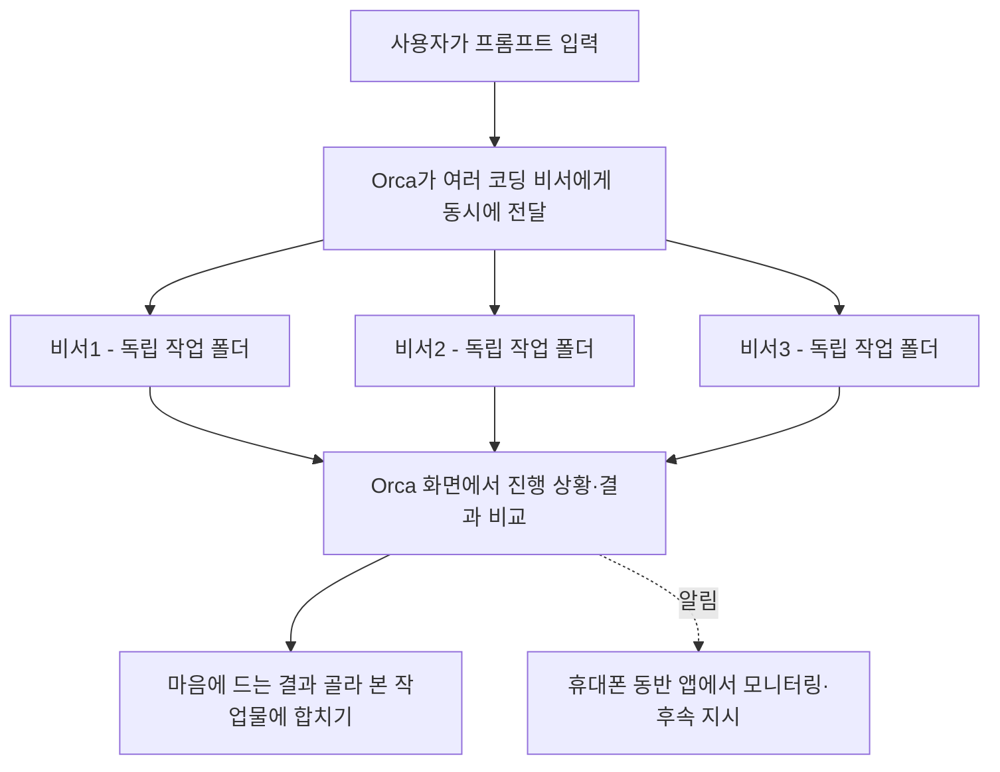

<article class="ai-knowledge-article">

<header class="ai-post-hero">
  <p class="ai-eyebrow"><a class="ai-back" href="../">이번 호</a> · 2026-06-29 · 학습 브리프</p>
  <h2 class="ai-post-title">stablyai/orca — 병렬 코딩 에이전트 함대를 운용하는 ADE</h2>
</header>

> 원문: [stablyai/orca — 병렬 코딩 에이전트 함대를 운용하는 ADE](https://github.com/stablyai/orca)

## 📌 학습 정리

### 1. 한 줄로 말하면

여러 명령줄(CLI) 코딩 비서를 동시에 띄워 놓고, 한 화면에서 누가 더 잘했는지 비교하면서 일을 시키는 작업실 같은 도구예요.

### 2. 왜 이게 만들어졌어요?

요즘은 코드를 대신 짜주는 코딩 비서가 정말 많아졌어요. Claude Code, Codex, Cursor, GitHub Copilot 같은 것들이죠. 그런데 보통은 한 번에 하나만 띄워서 결과를 기다리고, 마음에 안 들면 다시 시키는 식으로 일해왔어요. 이러다 보니 "같은 문제를 여러 비서한테 동시에 시켜서 제일 잘한 답을 고르고 싶다"거나 "여러 작업을 병렬로 굴리고 싶다"는 요구가 생겼어요. Orca는 이런 흐름을 한 곳에서 관리하려고 만들어진 데스크톱 앱이에요. 작업마다 별도의 작업 공간을 만들어주고, 진행 상황을 모아 보여주고, 심지어 휴대폰에서도 들여다볼 수 있게 해줍니다.

### 3. 비유로 풀면

이건 마치 **여러 명의 외주 개발자에게 동시에 같은 과제를 맡기고, 각자 따로 책상을 내어준 뒤 결과물을 나란히 놓고 고르는 사무실 매니저** 같은 거예요. 한 사람이 작업하는 동안 다른 사람 책상이 섞이지 않도록 각자 독립된 폴더(작업 공간)를 주고, 매니저는 누가 끝났는지·누가 막혔는지를 한 화면에서 보는 거죠.

그래서 결국 Orca는 "어떤 코딩 비서를 쓸지" 자체를 만드는 게 아니라, **이미 있는 비서들을 여러 명 동시에 부려서 비교·선택할 수 있게 해주는 지휘대** 역할을 합니다.

### 4. 어떻게 작동하는지 (그림으로)



핵심은 **각 비서가 서로 다른 격리된 작업 폴더(git worktree)에서 일한다**는 점이에요. 코드가 섞이지 않으니 결과를 안전하게 비교할 수 있고, 그중 가장 좋은 결과만 본 코드에 합치면 됩니다. 진행 상황은 데스크톱뿐 아니라 휴대폰에서도 확인하고 추가 지시를 보낼 수 있어요.

### 5. 처음 보는 용어 풀이

- **에이전트 개발 환경 (ADE, Agent Development Environment)** — 코딩 비서(에이전트) 여러 개를 띄우고 관리하기 위한 통합 작업 환경이에요. 우리가 흔히 쓰는 코드 편집기(IDE)가 사람을 위한 작업 공간이라면, ADE는 에이전트들을 위한 작업 공간이라고 보면 됩니다.
- **CLI 에이전트 (CLI agent)** — 터미널(검은 화면의 명령줄)에서 돌아가는 코딩 비서를 말해요. Claude Code, Codex 같은 도구들이 여기에 해당하고, Orca는 "터미널에서 돌아가는 거라면 다 끌어다 쓸 수 있다"고 합니다.
- **병렬 작업 폴더 (parallel worktrees)** — git의 worktree 기능을 활용해 같은 저장소의 여러 브랜치를 동시에 다른 폴더로 띄워두는 방식이에요. 비서마다 자기 폴더가 따로 있어서 서로 간섭 없이 같은 문제를 풀 수 있어요.
- **디자인 모드 (Design Mode)** — 앱 안에 내장된 크롬 기반 브라우저에서 화면의 UI 요소를 클릭하면, 해당 부분의 HTML·CSS·캡처 이미지를 통째로 코딩 비서에게 전달해주는 기능이에요. "여기 이 버튼 좀 고쳐줘"를 클릭 한 번으로 전달할 수 있게 해줍니다.
- **원격 작업 폴더 (SSH Worktrees)** — 내 노트북이 아니라 성능 좋은 원격 서버에 SSH로 접속해서, 그 위에서 비서들이 작업하게 만드는 기능이에요. 파일 편집·git·터미널이 다 원격에서 돌아가지만 화면은 내 Orca에서 보입니다.
- **AI 변경분 주석 (Annotate AI Diffs)** — 비서가 만들어낸 코드 변경 내역(diff)의 특정 줄에 코멘트를 달아 다시 비서에게 돌려보내는 기능이에요. 사람이 코드 리뷰하듯이 "여긴 이렇게 바꿔줘"라고 짚어줄 수 있어요.
- **휴대폰 동반 앱 (Mobile Companion)** — Orca 데스크톱 앱과 짝지어 쓰는 모바일 앱이에요. 비서가 작업을 끝내면 알림을 받고, 외부에 있을 때도 후속 지시를 보낼 수 있게 해줍니다.

### 6. 한 발 더 들어가고 싶다면

- [병렬 작업 폴더 문서](https://www.onorca.dev/docs/model/worktrees) — 같은 프롬프트를 여러 비서에게 동시에 시키고 결과를 비교하는 핵심 흐름을 볼 수 있어요.
- [Orca CLI 개요](https://www.onorca.dev/docs/cli/overview) — `orca worktree create`, `snapshot`, `click`, `fill` 같은 명령으로 Orca 자체를 스크립트로 조작하는 방법을 알 수 있어요. 비서가 Orca를 운전하게 만드는 그림이 가능합니다.
- [디자인 모드 문서](https://www.onorca.dev/docs/browser/design-mode) — 화면 UI 요소를 클릭해 그 정보를 비서에게 전달하는 워크플로의 구체적인 동작을 볼 수 있어요.
- [계정 전환 및 사용량 추적](https://www.onorca.dev/docs/agents/usage-tracking) — Claude·Codex 같은 비서의 사용량과 요청 한도(rate limit)를 한 곳에서 보는 방법을 알 수 있어요.
- [릴리스 노트(변경 이력)](https://github.com/stablyai/orca/releases) — 매일 기능이 추가되는 프로젝트라 README보다 여기가 실제 기능 목록에 더 가깝다고 안내하고 있어요.

---

## 📖 원문 전체 번역 (정독용)

> 의역 최소화한 전체 번역입니다. 큰 흐름은 위 정리에서 잡고, 정확한 워딩이 필요할 땐 이 섹션에서 정독하세요.

**100x 빌더를 위한 AI 오케스트레이터.**

Codex, ClaudeCode, OpenCode 또는 Pi를 각자의 워크트리(worktree)에서 나란히 실행하고 — 한 곳에서 모두 추적하세요.

### [Orca 다운로드](https://onorca.dev/download)

---

## 기능

### 모바일 컴패니언 (Mobile Companion)

스마트폰에서 에이전트를 모니터링하고 제어하세요 — 에이전트가 작업을 마치면 알림을 받고, 어디서든 후속 지시를 보낼 수 있습니다.

[iOS App Store](https://apps.apple.com/us/app/orca-ide/id6766130217) · [TestFlight](https://testflight.apple.com/join/YjeGMQBA) · [Android APK 0.0.17](https://github.com/stablyai/orca/releases/download/mobile-android-v0.0.17/app-release.apk) · [문서 →](https://www.onorca.dev/docs/mobile)

### 병렬 워크트리 (Parallel Worktrees)

하나의 프롬프트를 다섯 개의 에이전트에 동시에 전달하고, 각 에이전트는 독립된 git 워크트리에서 실행됩니다 — 결과를 비교하고 최선의 결과물을 병합하세요.

[문서 →](https://www.onorca.dev/docs/model/worktrees)

### 터미널 분할 (Terminal Splits)

Ghostty 수준의 터미널로, WebGL 렌더링, 무제한 분할, 그리고 재시작 후에도 유지되는 스크롤백을 제공합니다.

[문서 →](https://www.onorca.dev/docs/terminal)

### 디자인 모드 (Design Mode)

실제 Chromium 창에서 UI 요소를 클릭하면 해당 요소의 HTML, CSS, 그리고 잘라낸 스크린샷이 바로 에이전트 프롬프트로 전송됩니다.

[문서 →](https://www.onorca.dev/docs/browser/design-mode)

### GitHub & Linear 네이티브 지원

앱 내에서 PR, 이슈, 프로젝트 보드를 탐색하세요 — 어떤 태스크에서든 워크트리를 열고, 컨텍스트 전환 없이 리뷰할 수 있습니다.

[문서 →](https://www.onorca.dev/docs/review/linear)

### SSH 워크트리 (SSH Worktrees)

강력한 원격 서버에서 에이전트를 실행하고, 완전한 파일 편집, git, 터미널을 사용하세요 — 자동 재연결과 포트 포워딩이 포함되어 있습니다.

[문서 →](https://www.onorca.dev/docs/ssh)

### AI diff 주석 달기 (Annotate AI Diffs)

diff의 어느 줄에든 코멘트를 달고 에이전트에 다시 전달하세요 — Orca를 벗어나지 않고 리뷰, 편집, 커밋까지 완료할 수 있습니다.

[문서 →](https://www.onorca.dev/docs/review/annotate-ai-diff)

### 파일을 에이전트로 드래그 (Drag Files to Agents)

자동 저장이 적용된 VS Code 에디터 — 파일이나 이미지를 에이전트 프롬프트로 바로 드래그하세요.

[문서 →](https://www.onorca.dev/docs/editing/file-explorer)

### Orca CLI

에이전트도 Orca를 구동할 수 있습니다 — `orca worktree create`, `snapshot`, `click`, `fill` 명령으로 모든 워크플로우를 스크립트로 자동화하세요.

[문서 →](https://www.onorca.dev/docs/cli/overview)

**기본 포함 기능:**

- **[빠른 열기 (Quick open)](https://www.onorca.dev/docs/model/quick-open)** — 워크플로우를 중단하지 않고 워크트리, 파일, 에이전트, 명령어, 저장소 컨텍스트를 통합 검색.
- **[계정 전환 및 사용량 추적](https://www.onorca.dev/docs/agents/usage-tracking)** — Claude와 Codex 사용량 및 요청 제한 초기화 시각을 확인하고, 재로그인 없이 계정을 즉시 교체.
- **[풍부한 저장소 미리보기](https://www.onorca.dev/docs/editing/markdown)** — 워크스페이스에서 Markdown, 이미지, PDF, 저장소 문서를 미리보기.
- **[Computer Use](https://www.onorca.dev/docs/cli/computer-use)** — 워크플로우에 실제 상호작용이 필요한 경우 에이전트가 데스크톱 앱과 화면에 표시된 UI를 직접 조작하도록 허용.
- **[알림 및 읽지 않음 상태](https://www.onorca.dev/docs/notifications)** — 에이전트가 완료되거나 주의가 필요할 때 알림을 받고, 나중에 다시 확인할 수 있도록 스레드를 읽지 않음으로 표시.
- **그 외에도 수많은 기능** — 매일 출시하기 때문에 이 목록은 항상 뒤처져 있습니다. 실제 기능 목록은 [변경 로그(changelog)](https://github.com/stablyai/orca/releases)를 참고하세요.

---

## 지원 에이전트

**모든 CLI 에이전트**와 호환됩니다 — 터미널에서 실행된다면 Orca에서도 실행됩니다.

- [Claude Code](https://docs.anthropic.com/claude/docs/claude-code)
- [Codex](https://github.com/openai/codex)
- [Grok](https://x.ai/cli)
- [Cursor](https://cursor.com/cli)
- [GitHub Copilot](https://docs.github.com/en/copilot/how-tos/set-up/install-copilot-cli)
- [OpenCode](https://opencode.ai/docs/cli/)
- [MiMo Code](https://mimo.xiaomi.com/coder)
- [Amp](https://ampcode.com/manual#install)
- [OpenClaude](https://openclaude.gitlawb.com/)
- [Antigravity](https://antigravity.google/docs/cli-overview)
- [Pi](https://pi.dev/)
- [oh-my-pi](https://omp.sh/)
- [Hermes Agent](https://hermes-agent.nousresearch.com/docs/)
- [Devin](https://devin.ai/cli)
- [Goose](https://block.github.io/goose/docs/quickstart/)
- [Auggie](https://docs.augmentcode.com/cli/overview)
- [Autohand Code](https://github.com/autohandai/code-cli)
- [Charm](https://github.com/charmbracelet/crush)
- [Cline](https://docs.cline.bot/cline-cli/overview)
- [Codebuff](https://www.codebuff.com/docs/help/quick-start)
- [Command Code](https://commandcode.ai/docs/quickstart)
- [Continue](https://docs.continue.dev/guides/cli)
- [Droid](https://docs.factory.ai/cli/getting-started/quickstart)
- [Kilocode](https://kilo.ai/docs/cli)
- [Kimi](https://www.kimi.com/code/docs/en/kimi-code-cli/getting-started.html)
- [Kiro](https://kiro.dev/docs/cli/)
- [Mistral Vibe](https://github.com/mistralai/mistral-vibe)
- [Qwen Code](https://github.com/QwenLM/qwen-code)
- [Rovo Dev](https://support.atlassian.com/rovo/docs/install-and-run-rovo-dev-cli-on-your-device/)
- + 모든 CLI 에이전트

---

## 설치

### 데스크톱 — macOS, Windows, Linux

- **[onOrca.dev에서 다운로드](https://onorca.dev/download)**
- 또는 빌드를 직접 다운로드: [macOS Apple Silicon](https://github.com/stablyai/orca/releases/latest/download/orca-macos-arm64.dmg) · [macOS Intel](https://github.com/stablyai/orca/releases/latest/download/orca-macos-x64.dmg) · [Windows (.exe)](https://github.com/stablyai/orca/releases/latest/download/orca-windows-setup.exe) · [Linux AppImage](https://github.com/stablyai/orca/releases/latest/download/orca-linux.AppImage) · [전체 빌드](https://github.com/stablyai/orca/releases/latest)

_패키지 매니저를 통한 설치:_

```bash
# macOS (Homebrew)
brew install --cask stablyai/orca/orca

# Arch Linux (AUR) — 소스에서 빌드하려면 stably-orca-git 사용
yay -S stably-orca-bin
```

### 모바일 컴패니언 — iOS, Android

데스크톱 앱과 페어링하여 스마트폰에서 에이전트를 모니터링하고 제어하세요.

- **iOS:** [App Store에서 다운로드](https://apps.apple.com/us/app/orca-ide/id6766130217) 또는 [TestFlight 참여](https://testflight.apple.com/join/YjeGMQBA)
- **Android:** [APK 0.0.17 다운로드](https://github.com/stablyai/orca/releases/download/mobile-android-v0.0.17/app-release.apk)

---

## 커뮤니티 및 지원

- **Discord:** **[Discord](https://discord.gg/fzjDKHxv8Q)**에서 커뮤니티에 참여하세요.
- **Twitter / X:** 업데이트와 공지를 위해 **[@orca_build](https://x.com/orca_build)**을 팔로우하세요.
- **WeChat:** QR 코드를 스캔하여 커뮤니티에 참여하세요.
- **피드백 및 아이디어:** 빠르게 출시합니다. 빠진 기능이 있나요? [새 기능을 요청하세요](https://github.com/stablyai/orca/issues).
- **개인정보 보호:** Orca가 수집하는 익명 사용 데이터와 옵트아웃 방법은 [개인정보 보호 및 텔레메트리 문서](https://www.onorca.dev/docs/telemetry)를 참고하세요.
- **응원하기:** 매일 출시되는 내용을 팔로우하려면 이 저장소에 [Star](https://github.com/stablyai/orca)를 눌러주세요.

---

## 개발 참여

기여하거나 로컬에서 직접 실행하고 싶으신가요? [CONTRIBUTING.md](https://github.com/stablyai/orca/blob/main/.github/CONTRIBUTING.md) 가이드를 참고하세요.

## 라이선스

Orca는 [MIT 라이선스](https://github.com/stablyai/orca/blob/main/LICENSE) 하에 무료 오픈 소스로 제공됩니다.

</article>
