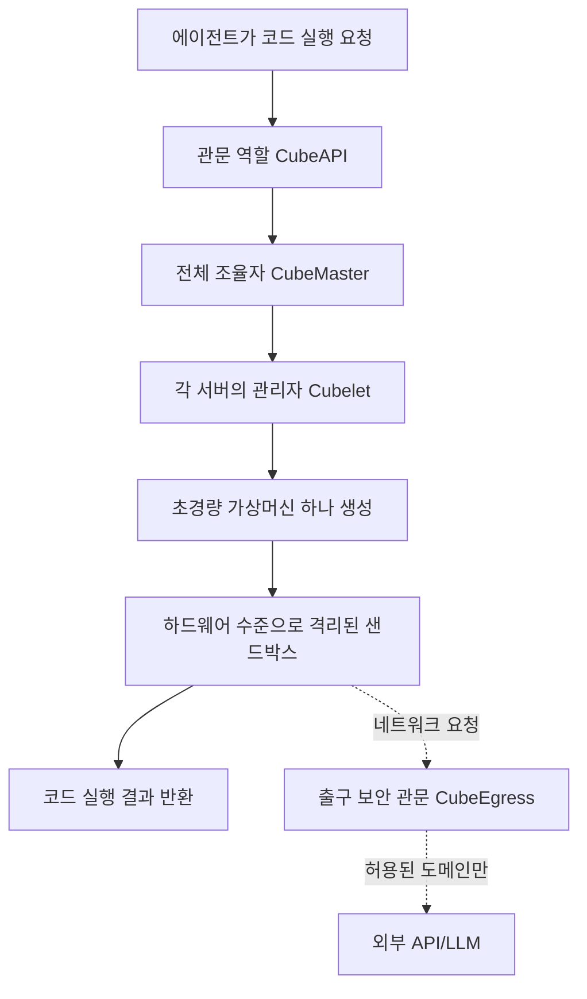

<article class="ai-knowledge-article">

<header class="ai-post-hero">
  <p class="ai-eyebrow"><a class="ai-back" href="../">이번 호</a> · 2026-07-13 · 학습 브리프</p>
  <h2 class="ai-post-title">TencentCloud/CubeSandbox — AI 에이전트를 위한 즉시·동시·경량 샌드박스</h2>
</header>

> 원문: [TencentCloud/CubeSandbox — AI 에이전트를 위한 즉시·동시·경량 샌드박스](https://github.com/TencentCloud/CubeSandbox)

## 📌 학습 정리

### 1. 한 줄로 말하면

인공지능 에이전트가 만들어낸 코드나 명령을 안전하게 격리된 방 안에서 실행해주는 도구예요. 그 방을 60밀리초 안에 만들고, 한 대의 서버에서 수천 개를 동시에 돌릴 수 있게 설계됐어요.

### 2. 왜 이게 만들어졌어요?

요즘 인공지능 에이전트는 스스로 코드를 짜서 실행하거나, 파일을 만지거나, 외부 명령을 돌리는 일이 많아졌어요. 그런데 이런 코드를 그냥 서버에서 실행하면 다른 작업까지 망가뜨릴 위험이 있어서, 보통은 도커 컨테이너(Docker container, 서버 안에 작은 실행 공간을 만들어주는 기술) 같은 걸로 감싸서 돌렸어요. 문제는 도커가 운영체제 커널(kernel, 운영체제의 핵심 부분)을 여러 컨테이너가 나눠 쓰기 때문에, 악의적인 코드가 그 틈을 파고들어 다른 곳까지 침범할 위험이 있다는 점이에요. 그렇다고 완전한 가상 머신(virtual machine, 컴퓨터 안에 또 다른 컴퓨터를 통째로 흉내내는 방식)을 쓰자니 부팅에 몇 초씩 걸리고 메모리도 많이 잡아먹었죠. Cube Sandbox는 "가상 머신만큼 안전하면서, 컨테이너만큼 빠르고 가볍게" 만드는 걸 목표로 등장했어요.

### 3. 비유로 풀면

이건 마치 회의실을 예약하는 것과 비슷해요. 도커는 큰 사무실을 파티션으로 나눠 쓰는 방식이라 옆 칸 소리가 새어 들어올 수 있어요. 반대로 전통적인 가상 머신은 아예 다른 건물을 하나 짓는 셈이라 완벽하게 분리되지만 지을 때마다 몇 시간이 걸리죠. Cube Sandbox는 "완전히 독립된 방음실을 60밀리초 만에 뚝딱 만들어주고, 다 쓰면 없애버리는" 서비스에 가까워요. 그래서 결국, 에이전트마다 자기만의 미니 컴퓨터를 순식간에 하나씩 쥐어주고, 그 안에서 뭘 하든 바깥에는 영향이 없게 만드는 거예요.

### 4. 어떻게 작동하는지 (그림으로)



에이전트가 "이 코드 좀 돌려줘"라고 요청하면, 입구 역할을 하는 CubeAPI가 받아서 전체를 조율하는 CubeMaster에게 넘겨요. CubeMaster는 여러 서버 중 여유 있는 곳의 Cubelet에게 일을 시키고, Cubelet이 실제로 초경량 가상 머신을 하나 띄워 샌드박스를 만들어요. 샌드박스 안에서 코드가 실행되고, 만약 외부로 요청을 보내야 하면 CubeEgress라는 관문을 거쳐서 허락된 곳만 갈 수 있게 걸러줘요.

### 5. 처음 보는 용어 풀이

- **샌드박스 (sandbox)** — 코드가 마음대로 뛰놀아도 바깥에 영향을 주지 못하도록 격리해둔 실행 공간이에요. 아이들 모래놀이터처럼 안에서 무슨 일을 벌여도 밖은 안전하다는 개념이에요.
- **가상 머신 모니터 / 하이퍼바이저 (hypervisor)** — 한 대의 컴퓨터 위에서 여러 개의 가상 컴퓨터를 만들고 관리해주는 소프트웨어예요. Cube Sandbox는 이걸 아주 가볍게 깎아내서 60밀리초 부팅을 달성했어요.
- **KVM** — 리눅스 커널에 내장된 가상화 기능이에요. 운영체제가 직접 가상 머신을 지원해주기 때문에 별도 프로그램보다 훨씬 빠르고 효율적이에요.
- **RustVMM** — 러스트(Rust)라는 안전한 프로그래밍 언어로 가상 머신 부품들을 만들어놓은 오픈소스 모음이에요. Cube Sandbox의 뼈대가 되는 재료라고 보면 돼요.
- **E2B 호환 (E2B compatible)** — E2B는 AI 에이전트용 샌드박스 서비스로 이미 널리 쓰이는데, Cube Sandbox는 E2B와 똑같은 방식으로 부를 수 있게 만들어져 있어요. 그래서 기존에 E2B로 짜둔 코드가 있다면 접속 주소만 바꾸면 그대로 동작해요.
- **eBPF** — 리눅스 커널 안에서 안전하게 작은 프로그램을 실행시켜 네트워크나 보안 정책을 세밀하게 제어할 수 있게 해주는 기술이에요. Cube Sandbox는 이걸로 샌드박스마다 네트워크를 통제해요.
- **스냅샷·클론·롤백 (snapshot, clone, rollback)** — 지금 이 순간의 샌드박스 상태를 사진 찍듯 저장해두고(스냅샷), 똑같은 걸 여러 개 복제하거나(클론), 나중에 그 시점으로 되돌리는(롤백) 기능이에요. 강화학습이나 실험할 때 특히 유용해요.
- **자동 일시정지·재개 (AutoPause / AutoResume)** — 놀고 있는 샌드박스는 자동으로 잠재웠다가 다음 요청이 오면 다시 깨우는 기능이에요. 안 쓰는 방에는 불을 꺼두는 셈이라 비용을 아낄 수 있어요.
- **자격증명 금고 (credential vault)** — 외부 API를 부를 때 필요한 열쇠(API 키)를 샌드박스 바깥에 따로 보관해두는 저장소예요. 에이전트가 만들어낸 코드가 그 열쇠를 훔쳐볼 수 없게 하는 장치예요.

### 6. 한 발 더 들어가고 싶다면

- [Quick Start](https://github.com/TencentCloud/CubeSandbox/blob/master/docs/guide/quickstart.md) — 서버 준비부터 첫 에이전트 코드 실행까지 네 단계로 따라해볼 수 있어요.
- [Architecture Design Document](https://github.com/TencentCloud/CubeSandbox/blob/master/docs/architecture/overview.md) — CubeAPI, CubeMaster, Cubelet 같은 부품들이 어떻게 맞물려 돌아가는지 자세히 알 수 있어요.
- [CubeVS Network Model](https://github.com/TencentCloud/CubeSandbox/blob/master/docs/architecture/network.md) — 샌드박스마다 네트워크를 어떻게 나누고 통제하는지, eBPF가 어떻게 쓰이는지 볼 수 있어요.
- [Core Operations Performance Benchmark Report](https://github.com/TencentCloud/CubeSandbox/blob/master/docs/blog/posts/2026-06-01-cubesandbox-perf-benchmark.md) — "정말 60밀리초에 뜨는 게 맞나?" 궁금할 때, 실제 측정 수치를 확인할 수 있어요.
- [Example Projects](https://github.com/TencentCloud/CubeSandbox/blob/master/docs/guide/tutorials/examples.md) — 코드 실행, 브라우저 자동화, 강화학습 훈련 같은 실제 활용 예시를 볼 수 있어요.
- [Security Proxy Guide](https://github.com/TencentCloud/CubeSandbox/blob/master/docs/guide/security-proxy.md) — 자격증명 금고와 도메인 허용 목록으로 외부 통신을 어떻게 안전하게 다루는지 알 수 있어요.

---

## 📖 원문 전체 번역 (정독용)

> 의역 최소화한 전체 번역입니다. 큰 흐름은 위 정리에서 잡고, 정확한 워딩이 필요할 땐 이 섹션에서 정독하세요.

# TencentCloud/CubeSandbox — AI 에이전트를 위한 즉시·동시·경량 샌드박스

**AI 에이전트를 위한 즉시 실행 가능한·동시·안전한·경량 샌드박스 서비스**

[中文文档](https://github.com/TencentCloud/CubeSandbox/blob/master/README_zh.md) · [빠른 시작 (Quick Start)](https://github.com/TencentCloud/CubeSandbox/blob/master/docs/guide/quickstart.md) · [문서 (Documentation)](https://github.com/TencentCloud/CubeSandbox/blob/master/docs/index.md) · [변경 이력 (Changelog)](https://github.com/TencentCloud/CubeSandbox/blob/master/docs/changelog/index.md) · [X(Twitter)](https://x.com/CubeSandbox_AI) · [최종 사용자 프로그램 (End User Program)](https://github.com/TencentCloud/CubeSandbox/issues/158)

---

Cube Sandbox는 RustVMM과 KVM 위에 구축된 고성능·즉시 사용 가능한 보안 샌드박스 서비스입니다. 단일 노드 배포와 멀티 노드 클러스터로의 간편한 확장을 모두 지원합니다. E2B SDK와 호환되며, 60ms 미만의 시간 안에 5MB 미만의 메모리 오버헤드로 하드웨어 격리된, 완전한 기능을 갖춘 샌드박스를 생성할 수 있습니다.

## 📰 뉴스

**v0.5: AutoPause, Terraform 배포, ARM64 및 네트워크 정책 강화**

**AutoPause/AutoResume** — 유휴 샌드박스가 자동으로 일시 정지되고 다음 요청 시 깨어납니다. **Terraform 원클릭 클러스터 배포** **ARM64** 네이티브 풀스택 지원 **네트워크 정책 강화** — 샌드박스별 트래픽 토큰, 정책 라우팅 이그레스(egress).

[변경 이력 →](https://github.com/TencentCloud/CubeSandbox/blob/master/docs/changelog/v0.5.0.md) · [Terraform 배포 →](https://github.com/TencentCloud/CubeSandbox/blob/master/docs/guide/tencentcloud-terraform-deploy.md)

**v0.4: 더 안전한 이그레스, 더 쉬운 운영**

**Credential vault** — 에이전트가 외부 API를 평소처럼 호출하되, 키는 샌드박스 안으로 절대 들어오지 않습니다. **대시보드** — 버전 매트릭스와 템플릿 헬스 체크; 업그레이드 후 템플릿 재빌드가 필요한지 한눈에 확인.

[변경 이력 →](https://github.com/TencentCloud/CubeSandbox/blob/master/docs/changelog/v0.4.0.md) · [보안 프록시 가이드 →](https://github.com/TencentCloud/CubeSandbox/blob/master/docs/guide/security-proxy.md) · [WebUI 가이드 →](https://github.com/TencentCloud/CubeSandbox/blob/master/docs/guide/webui.md)

**v0.3: 수백 밀리초 단위의 스냅샷, 클론 및 롤백**

CubeSandbox 0.3.0은 **CubeCoW** Copy-on-Write 스냅샷 엔진을 도입하여 이벤트 단위 스냅샷, 즉시 클로닝, 그리고 저장된 임의 상태로의 롤백을 가능하게 합니다. [변경 이력 →](https://github.com/TencentCloud/CubeSandbox/blob/master/docs/changelog/v0.3.0.md)

**v0.1: 🎉 최초 오픈소스 공개**

Cube Sandbox가 오픈소스로 공개되었습니다! 밀리초 단위 부팅, 하드웨어 수준 격리, AI 에이전트를 위한 E2B 호환 샌드박스. [변경 이력 →](https://github.com/TencentCloud/CubeSandbox/blob/master/docs/changelog/v0.1.0.md)

## 제품 주요 기능

**⚡ 60ms 미만 부팅 · 고밀도 · 자동 일시 정지/재개**
평균 60ms 미만 콜드 스타트, 인스턴스당 5MB 미만의 오버헤드 — 하나의 노드에서 수천 개의 에이전트 실행 가능. 비용 최적화를 위한 샌드박스 자동 일시 정지 및 재개 지원.

[빠른 시작 →](https://github.com/TencentCloud/CubeSandbox/blob/master/docs/guide/quickstart.md)

**🔒 하드웨어 수준 격리**
각 샌드박스는 전용 Guest OS 커널을 가집니다 — Docker 공유 커널 탈출이 없으므로 신뢰할 수 없는 LLM 생성 코드를 안전하게 실행 가능.

[아키텍처 →](https://github.com/TencentCloud/CubeSandbox/blob/master/docs/architecture/overview.md)

**🔌 E2B 원활한 마이그레이션**
네이티브 E2B SDK 호환성 — URL 환경 변수 하나만 바꾸면, 비즈니스 코드 변경 없이 전환 완료.

[예제 →](https://github.com/TencentCloud/CubeSandbox/blob/master/docs/guide/tutorials/examples.md)

**🖥️ 웹 콘솔**
브라우저에서 샌드박스, 템플릿, 노드, 버전 매트릭스를 관리 — 설치 직후 `:12088`로 바로 접속.

[WebUI 가이드 →](https://github.com/TencentCloud/CubeSandbox/blob/master/docs/guide/webui.md)

**🔐 Credential vault**
에이전트가 LLM과 외부 API를 평소처럼 호출 — 키는 샌드박스, 모델 컨텍스트, 로그 어디에도 들어가지 않음.

[보안 프록시 가이드 →](https://github.com/TencentCloud/CubeSandbox/blob/master/docs/guide/security-proxy.md)

**🛡️ 이그레스 제어**
도메인 허용 목록, 미승인 이그레스 즉시 차단, 컴플라이언스를 위한 완전한 감사 로그.

[보안 프록시 가이드 →](https://github.com/TencentCloud/CubeSandbox/blob/master/docs/guide/security-proxy.md)

**📸 스냅샷 · 클론 · 롤백**
실행 중인 샌드박스에 수백 밀리초 단위 체크포인트 — 저장된 임의 상태에서 롤백하거나 포크 가능.

[v0.3 변경 이력 →](https://github.com/TencentCloud/CubeSandbox/blob/master/docs/changelog/v0.3.0.md)

**📦 템플릿 시스템**
한 단계로 OCI 이미지를 템플릿으로 전환하고, Template Store에서 공식 프리셋을 설치하며, 노드 간 자동 배포.

[템플릿 가이드 →](https://github.com/TencentCloud/CubeSandbox/blob/master/docs/guide/templates.md)

**🤖 AgentHub 디지털 어시스턴트**
원클릭으로 OpenClaw 어시스턴트 시작 — 스냅샷, 롤백, 어시스턴트 템플릿 게시.

[디지털 어시스턴트 →](https://github.com/TencentCloud/CubeSandbox/blob/master/docs/guide/digital-assistant.md)

## 데모

_설치 & 데모_ _성능 테스트_ _RL (SWE-Bench)_ _스냅샷 · 클론 · 롤백_

## 벤치마크

AI 에이전트 코드 실행 맥락에서, CubeSandbox는 보안과 성능의 완벽한 균형을 달성합니다:

| 지표 | Docker 컨테이너 | 전통적인 VM | CubeSandbox |
| --- | --- | --- | --- |
| **격리 수준** | 낮음 (공유 커널 네임스페이스) | 높음 (전용 커널) | **극강 (전용 커널 + eBPF)** |
| **부팅 속도** *전체 OS 부팅 소요 시간 | 200ms | 수 초 | **밀리초 미만 (<60ms)** |
| **메모리 오버헤드** | 낮음 (공유 커널) | 높음 (전체 OS) | **초경량 (공격적 경량화, <5MB)** |
| **배포 밀도** | 높음 | 낮음 | **극강 (노드당 수천 개)** |
| **E2B SDK 호환** | / | / | **✅ 드롭인 교체** |

- _콜드 스타트는 베어메탈 환경에서 벤치마크됨. 단일 동시성에서 60ms; 50개 미만의 동시 생성 시, 평균 67ms, P95 90ms, P99 137ms — 일관되게 150ms 미만._
- _메모리 오버헤드는 샌드박스 스펙 ≤ 32GB 기준으로 측정됨. 더 큰 구성에서는 소폭 증가할 수 있음._

시작 지연 및 리소스 오버헤드에 대한 상세 지표는 [핵심 운영 성능 벤치마크 보고서](https://github.com/TencentCloud/CubeSandbox/blob/master/docs/blog/posts/2026-06-01-cubesandbox-perf-benchmark.md) (베어메탈)와 [PVM 클라우드 서버 벤치마크 보고서](https://github.com/TencentCloud/CubeSandbox/blob/master/docs/blog/posts/2026-06-03-cubesandbox-perf-benchmark-pvm.md)를 참조하세요.

## 빠른 시작

_⚡ 밀리초 수준 시작 — 위의 빠른 시작 흐름을 확인하세요._

Cube Sandbox는 **KVM** 지원이 있는 **x86_64 Linux** 환경이 필요합니다.

가이드는 **네 단계** — 서버 프로비저닝, Cube Sandbox 설치, 샌드박스 템플릿 생성, 첫 에이전트 코드 실행 — 를 통해 모든 과정을 안내합니다. 소스 빌드 없이, 몇 분 안에 실행 가능합니다.

**배포 방법 선택:**

### 설치 후 첫 번째로 할 일: 웹 콘솔 열기

_🖥️ 시각적 관리 — 개요부터 샌드박스 생성 및 스트리밍 로그까지, 모두 브라우저에서._

원클릭 배포 후, 브라우저에서 다음 주소를 여세요:

```
http://<컨트롤 노드 IP>:12088
```

**권장 세 단계:**

1. **개요 확인** — **Overview(개요)**를 열고, 노드가 Ready 상태이고 용량이 정상인지 확인
2. **템플릿 준비** — **Template Store(템플릿 스토어)**에서 공식 프리셋 설치; **Templates(템플릿)**에 이미 `READY` 상태의 템플릿이 있으면 건너뜀
3. **샌드박스 생성** — **Sandboxes → + New sandbox**, `READY` 상태의 템플릿을 선택하고, 수 초 내에 상세 페이지에서 라이브 로그 확인

전체 [WebUI 콘솔 가이드](https://github.com/TencentCloud/CubeSandbox/blob/master/docs/guide/webui.md)를 참조하세요.

## 심층 탐구

- [문서 홈](https://github.com/TencentCloud/CubeSandbox/blob/master/docs/index.md) — 완전한 가이드 내비게이션
- ☁️ [PVM 배포](https://github.com/TencentCloud/CubeSandbox/blob/master/docs/guide/pvm-deploy.md) — 베어메탈이나 중첩 가상화 없이 일반 클라우드 VM에 배포
- [템플릿 개념](https://github.com/TencentCloud/CubeSandbox/blob/master/docs/guide/templates.md) — 이미지-to-템플릿 개념 및 워크플로우
- [예제 프로젝트](https://github.com/TencentCloud/CubeSandbox/blob/master/docs/guide/tutorials/examples.md) — 실습 예제 (코드 실행, 브라우저 자동화, OpenClaw 통합, RL 훈련 등)
- 🖥️ [WebUI 콘솔](https://github.com/TencentCloud/CubeSandbox/blob/master/docs/guide/webui.md) — 설치 직후 시각적 관리 (`:12088`)
- 🔐 [보안 프록시 & Credential Vault](https://github.com/TencentCloud/CubeSandbox/blob/master/docs/guide/security-proxy.md) — CubeEgress 도메인 필터링, 인젝션, 감사
- 🤖 [디지털 어시스턴트 AgentHub](https://github.com/TencentCloud/CubeSandbox/blob/master/docs/guide/digital-assistant.md) — OpenClaw 어시스턴트 생성 및 관리 (Preview)
- 💻 [개발 환경 (QEMU VM)](https://github.com/TencentCloud/CubeSandbox/blob/master/docs/guide/dev-environment.md) — KVM 접근이 없나요? 일회성 OpenCloudOS 9 VM 안에서 Cube Sandbox를 사용해 보세요

## 아키텍처

| 컴포넌트 | 역할 |
| --- | --- |
| **CubeAPI** | 고동시성 REST API 게이트웨이 (Rust), E2B 호환. URL만 교체하면 원활하게 마이그레이션 가능. |
| **CubeMaster** | 클러스터 오케스트레이터. API 요청을 수신하고 해당 Cubelet으로 디스패치. 리소스 스케줄링 및 클러스터 상태 관리. |
| **CubeProxy** | 역방향 프록시, E2B 프로토콜 호환, 요청을 적절한 샌드박스 인스턴스로 라우팅. |
| **Cubelet** | 컴퓨트 노드 로컬 스케줄링 컴포넌트. 노드 위의 모든 샌드박스 인스턴스의 완전한 생명주기를 관리. |
| **CubeVS** | eBPF 기반 가상 스위치. 커널 수준의 네트워크 격리와 보안 정책 집행 제공. |
| **CubeEgress** | OpenResty 기반 이그레스 보안 게이트웨이: L7 도메인 필터링, 자격증명 인젝션, 접근 감사; CubeVS 커널 정책과 연동되어 샌드박스 트래픽이 검사를 우회할 수 없음. |
| **CubeHypervisor & CubeShim** | 가상화 계층 — CubeHypervisor는 KVM MicroVM을 관리하고, CubeShim은 containerd Shim v2 API를 구현하여 샌드박스를 컨테이너 런타임에 통합. |

👉 자세한 내용은 [아키텍처 설계 문서](https://github.com/TencentCloud/CubeSandbox/blob/master/docs/architecture/overview.md)와 [CubeVS 네트워크 모델](https://github.com/TencentCloud/CubeSandbox/blob/master/docs/architecture/network.md)을 참조하세요.

## 커뮤니티 & 기여

버그 신고, 기능 제안, 문서 개선, 코드 제출 등 모든 형태의 기여를 환영합니다!

- 🐞 **버그를 발견하거나 질문이 있으신가요?** [GitHub Issues](https://github.com/tencentcloud/CubeSandbox/issues)에 이슈를 제출하세요.
- 💡 **아이디어가 있으신가요?** [GitHub Discussions](https://github.com/tencentcloud/CubeSandbox/discussions)에서 대화에 참여하세요.
- 🛠️ **코드를 기여하고 싶으신가요?** [CONTRIBUTING.md](https://github.com/TencentCloud/CubeSandbox/blob/master/CONTRIBUTING.md)를 확인하여 Pull Request를 제출하는 방법을 알아보세요.
- 📝 **문서에 기여하고 싶으신가요?** 커뮤니티 문서 채널에 이중 언어 PR을 제출하세요: [트러블슈팅 (Troubleshooting)](https://github.com/TencentCloud/CubeSandbox/blob/master/docs/guide/troubleshooting/index.md), [사용 사례 (Use Cases)](https://github.com/TencentCloud/CubeSandbox/blob/master/docs/guide/usecases/index.md), [통합 (Integrations)](https://github.com/TencentCloud/CubeSandbox/blob/master/docs/guide/integrations/index.md).
- 💬 **채팅하고 싶으신가요?** [Discord](https://discord.gg/kkapzDXShb)에 참여하세요.

## 로드맵

**곧 출시 예정** — 자세한 내용은 [전체 로드맵](https://github.com/TencentCloud/CubeSandbox/blob/master/docs/guide/roadmap.md)을 참조하세요.

| 기능 | 설명 |
| --- | --- |
| **Kubernetes 네이티브 배포** | CRD, 오퍼레이터, 네이티브 스케줄링을 사용하여 K8s 클러스터 내에서 CubeSandbox를 완전히 배포하고 운영 — 외부 오케스트레이션 불필요 |
| **볼륨 지원** | E2B 볼륨 프로토콜과 호환되는 영구 및 공유 볼륨 지원 |
| **크로스 노드 일시 정지 & 재개** | 한 노드에서 샌드박스를 일시 정지하고, 전체 메모리 및 파일시스템 상태를 보존한 채로 다른 노드에서 재개 |
| **E2B API 호환성** | 완전한 드롭인 호환을 위해 E2B 명세와의 나머지 격차 해소 |
| **컨트롤 플레인 / 데이터 플레인 분리** | 컨트롤 플레인 업그레이드나 장애가 이미 실행 중인 샌드박스에 영향을 주지 않도록 컨트롤 플레인과 데이터 플레인을 분리 |
| **샌드박스 장애 복구** | 구성 가능한 복구 정책으로 충돌한 VM, 응답 없는 shim 프로세스, 네트워크 파티션의 자동 감지 및 복구 |
| **스케줄링 & 운영 개선** | 리소스 인식 배치, 어피니티 규칙, 라이브 리밸런싱, 샌드박스 마이그레이션이 포함된 노드 드레인 |

## 라이선스

CubeSandbox는 [Apache License 2.0](https://github.com/TencentCloud/CubeSandbox/blob/master/LICENSE)으로 배포됩니다.

CubeSandbox의 탄생은 오픈소스 거인들의 어깨 위에 서 있습니다. [Cloud Hypervisor](https://github.com/cloud-hypervisor/cloud-hypervisor), [Kata Containers](https://github.com/kata-containers/kata-containers), virtiofsd, containerd-shim-rs, ttrpc-rust 등에 특별히 감사드립니다. CubeSandbox 실행 모델에 맞게 일부 컴포넌트에 맞춤 수정을 가했으며, 파일 내 원본 저작권 고지는 그대로 보존되어 있습니다.

---

Cube Sandbox는 [CNCF 랜드스케이프 (CNCF Landscape)](https://landscape.cncf.io/?landscape=observability-and-analysis&group=ai-native&item=ai-native-infra--workload-runtime--cubesandbox)에 등재되어 있습니다.

</article>
