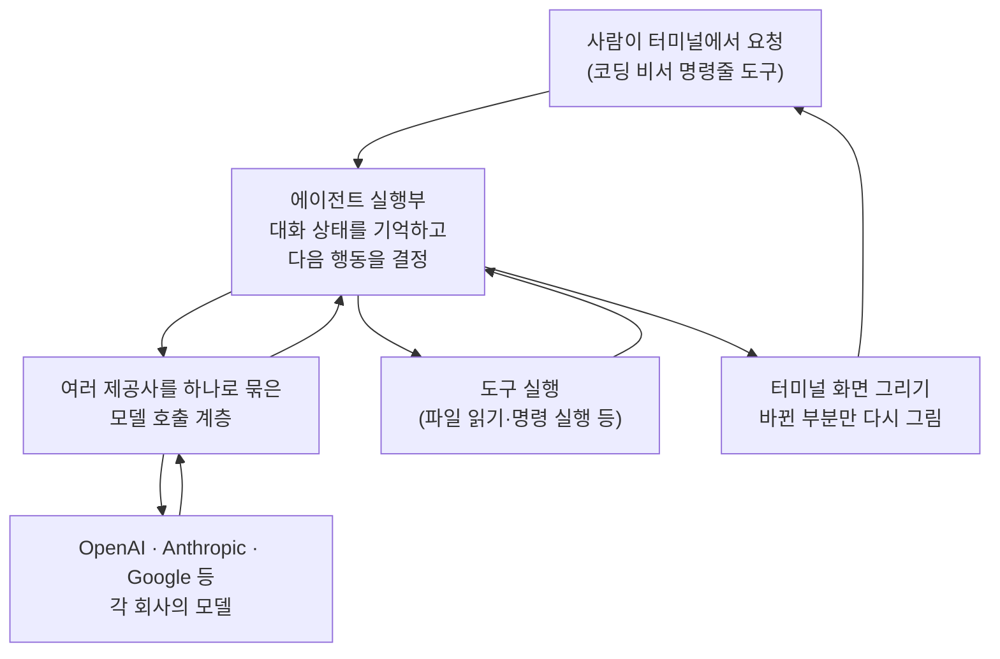

<article class="ai-knowledge-article">

<header class="ai-post-hero">
  <p class="ai-eyebrow"><a class="ai-back" href="../">이번 호</a> · 2026-07-27 · 학습 브리프</p>
  <h2 class="ai-post-title">earendil-works/pi — 통합 LLM API·에이전트 루프·TUI·코딩 에이전트 CLI를 묶은 오픈소스 툴킷</h2>
</header>

> 원문: [earendil-works/pi — 통합 LLM API·에이전트 루프·TUI·코딩 에이전트 CLI를 묶은 오픈소스 툴킷](https://github.com/earendil-works/pi)

## 📌 학습 정리

### 1. 한 줄로 말하면

여러 회사의 인공지능 모델을 하나의 방식으로 부르고, 그 모델이 실제로 파일을 읽고 명령을 실행하게 만들고, 그 과정을 터미널 화면에 보여주는 부품들을 한 창고에 모아둔 오픈소스 도구 모음입니다. 그 부품들을 조립해 만든 "코딩을 도와주는 비서 프로그램"도 함께 들어 있어요.

### 2. 왜 이게 만들어졌어요?

인공지능에게 일을 시키는 프로그램을 만들려면 생각보다 손이 많이 갑니다. 회사마다 모델을 호출하는 방식이 달라서 붙일 때마다 코드를 새로 쓰고, 모델이 "이 파일 좀 읽어줘"라고 요청하면 그걸 실제로 실행해서 결과를 되돌려주는 반복 구조도 직접 짜야 하고, 진행 상황을 사람이 볼 수 있게 화면에 그리는 일도 따로입니다. 이 저장소는 그 조각들을 각각 독립된 꾸러미(package)로 나눠 쌓아 올린 뒤, 맨 위에 실제로 쓸 수 있는 코딩 비서 명령줄 도구를 얹어 놓았습니다. 그래서 통째로 갖다 쓸 수도 있고, 필요한 층만 골라 쓸 수도 있는 구조예요. 스스로를 확장할 수 있는(self extensible) 코딩 비서를 지향한다는 점도 이 프로젝트가 내세우는 방향입니다.

### 3. 비유로 풀면

이건 마치 여러 나라 콘센트를 하나로 받아주는 멀티 어댑터 같은 거예요. 콘센트 모양(모델 제공사)이 달라도 꽂는 쪽은 하나로 통일해두면, 기기를 바꿀 때마다 배선을 다시 하지 않아도 되죠.

또 하나는 주방의 계층 구조에 가깝습니다. 재료 공급 창구(모델 호출), 실제로 조리하고 다음 단계를 판단하는 요리사(에이전트 실행부), 손님에게 보여주는 플레이팅(터미널 화면)이 각각 분리돼 있고, 맨 앞에 주문을 받는 창구(코딩 비서 명령줄 도구)가 있어요. 그래서 결국, 사람은 창구에만 말을 걸면 되고 안쪽 층은 필요할 때만 열어보면 되는 구조입니다.

### 4. 어떻게 작동하는지 (그림으로)



사람이 요청을 넣으면 에이전트 실행부가 대화 맥락을 들고 모델에게 물어보고, 모델이 "이 도구를 써달라"고 답하면 그 도구를 실제로 실행한 뒤 결과를 다시 모델에게 넘깁니다. 이 왕복이 일이 끝날 때까지 반복되고, 그동안의 진행 상황은 화면 전체를 다시 그리지 않고 바뀐 부분만 갱신해서 보여줍니다. 네 개 꾸러미가 딱 이 흐름의 각 구간을 하나씩 맡고 있는 셈이에요.

한 가지 중요한 전제가 있습니다. 이 도구에는 파일·프로세스·네트워크·인증정보 접근을 제한하는 자체 권한 장치가 들어 있지 않고, 기본적으로 실행한 사용자와 동일한 권한으로 돌아갑니다. 더 단단한 경계가 필요하면 격리된 환경 안에서 돌리라고 안내하며, 문서에서는 세 가지 방식을 소개합니다. 도구 실행만 작은 가상 리눅스로 흘려보내는 Gondolin 확장, 전체를 컨테이너에 담는 Docker 방식, 정책으로 통제되는 모래상자에서 돌리는 OpenShell 방식입니다.

### 5. 처음 보는 용어 풀이

- **에이전트 하네스 (agent harness)** — 인공지능 모델이 혼자 답만 하는 게 아니라, 도구를 쓰고 결과를 받아 다음 행동을 이어가도록 붙잡아 주는 뼈대입니다. 말(모델)에 마구를 채워 방향을 잡아주는 장치라고 생각하면 이해가 쉬워요.
- **여러 제공사를 하나로 통합한 모델 호출 방식 (unified multi-provider LLM API)** — OpenAI, Anthropic, Google처럼 회사마다 다른 호출 규격을 한 겹 감싸서 같은 방식으로 부를 수 있게 한 계층입니다. 모델을 바꿔도 앱 코드를 크게 고치지 않아도 되는 게 목적이에요.
- **도구 호출 (tool calling)** — 모델이 스스로 답을 만들지 않고 "이 기능을 실행해 달라"고 요청하면, 프로그램이 실제로 실행해서 결과를 되돌려주는 방식입니다. 파일을 읽거나 명령을 돌리는 실제 행동은 전부 여기서 일어납니다.
- **터미널 화면 라이브러리와 부분 갱신 (TUI, differential rendering)** — 검은 명령창 안에 목록·진행 표시 같은 화면을 그려주는 도구이고, 매번 전부 다시 그리지 않고 달라진 부분만 고쳐 그려서 깜빡임 없이 매끄럽게 보이게 합니다.
- **여러 꾸러미를 한 저장소에 모아둔 구조 (monorepo)** — 관련된 여러 소프트웨어 묶음을 각각 다른 저장소로 흩지 않고 한 곳에서 함께 관리하는 방식입니다. 층 사이 관계를 한눈에 보고 함께 빌드하기 좋습니다.
- **격리 실행 (containerization, sandbox)** — 프로그램을 바깥 시스템과 분리된 방 안에서 돌리는 것입니다. 자체 권한 제한 장치가 없는 도구를 다룰 때, 사고 범위를 그 방 안으로 묶어 두려고 씁니다.
- **공급망 보안 강화 (supply-chain hardening)** — 내가 쓴 코드뿐 아니라 가져다 쓰는 외부 라이브러리 쪽 위험까지 관리하는 활동입니다. 이 프로젝트는 외부 의존성 버전을 정확히 고정하고, 잠금 파일을 기준으로 삼고, 갓 나온 버전이 곧바로 딸려 들어오지 않게 최소 공개 경과 시간을 두고, 설치 과정에서 자동 실행되는 스크립트도 검토 대상으로 둡니다.
- **사용 기록 공개 (session sharing)** — 코딩 비서를 쓰면서 남은 대화·도구 사용·실패와 수정 과정을 공개 데이터로 내놓는 것입니다. 잘 만든 시험 문제보다 실제 작업 기록이 도구 개선에 더 도움이 된다는 게 이 프로젝트의 주장이에요.

### 6. 한 발 더 들어가고 싶다면

- [pi.dev](https://pi.dev) — 데모가 올라와 있는 공식 웹사이트입니다. 이 도구가 실제로 어떻게 움직이는지 눈으로 먼저 보고 싶을 때 여기부터 보면 됩니다.
- [earendil-works/pi-chat](https://github.com/earendil-works/pi-chat) — 채팅 도구 연동과 업무 흐름 자동화 쪽을 담당하는 별도 저장소입니다. 코딩 비서 말고 대화 채널에 붙이는 쪽이 궁금하면 이쪽이에요.
- [badlogic/pi-share-hf](https://github.com/badlogic/pi-share-hf) — 자기 작업 기록을 공개 데이터로 올릴 때 쓰는 도구입니다. 준비물과 설정 방법은 그 저장소의 안내 문서에 정리돼 있습니다.
- [badlogicgames/pi-mono on Hugging Face](https://huggingface.co/datasets/badlogicgames/pi-mono) — 프로젝트 관리자가 실제로 공개해 온 작업 기록 모음입니다. 코딩 비서가 현실의 작업에서 어떤 식으로 쓰이고 어디서 막히는지 날것으로 볼 수 있어요.

---

## 📖 원문 전체 번역 (정독용)

> 의역 최소화한 전체 번역입니다. 큰 흐름은 위 정리에서 잡고, 정확한 워딩이 필요할 땐 이 섹션에서 정독하세요.

새 기여자가 제출한 이슈와 PR은 기본적으로 자동으로 닫힙니다. 관리자(maintainer)는 자동으로 닫힌 이슈를 매일 검토합니다. `CONTRIBUTING.md`를 참고하세요.

## Pi Agent Harness

이 저장소는 자체 확장 가능한 코딩 에이전트를 포함한 Pi agent harness 프로젝트의 본거지입니다.

- `@earendil-works/pi-coding-agent`: 대화형 코딩 에이전트 CLI
- `@earendil-works/pi-agent-core`: 툴 호출과 상태 관리를 갖춘 에이전트 런타임
- `@earendil-works/pi-ai`: 통합 멀티 프로바이더 LLM API (OpenAI, Anthropic, Google, …)

Pi에 대해 더 알아보려면:
- 데모가 있는 프로젝트 웹사이트인 pi.dev를 방문하세요
- 문서를 읽으세요. 다만 에이전트 자신에게 직접 설명해 달라고 물어볼 수도 있습니다

### 전체 패키지

| 패키지 | 설명 |
|---|---|
| `@earendil-works/pi-ai` | 통합 멀티 프로바이더 LLM API (OpenAI, Anthropic, Google 등) |
| `@earendil-works/pi-agent-core` | 툴 호출과 상태 관리를 갖춘 에이전트 런타임 |
| `@earendil-works/pi-coding-agent` | 대화형 코딩 에이전트 CLI |
| `@earendil-works/pi-tui` | 차분(differential) 렌더링을 지원하는 터미널 UI 라이브러리 |

Slack/채팅 자동화와 워크플로우에 대해서는 `earendil-works/pi-chat`을 참고하세요.

## 권한 및 컨테이너화

Pi는 파일시스템, 프로세스, 네트워크, 또는 자격증명(credential) 접근을 제한하는 내장 권한 시스템을 포함하지 않습니다. 기본적으로 Pi를 실행한 사용자와 프로세스의 권한으로 실행됩니다.

더 강력한 경계가 필요하다면, Pi를 컨테이너화하거나 샌드박스화하세요. 세 가지 패턴에 대해서는 `packages/coding-agent/docs/containerization.md`를 참고하세요:

- **Gondolin 확장**: `pi`와 프로바이더 인증은 호스트에 유지하면서, 내장 툴과 `!` 커맨드는 로컬 Linux 마이크로 VM으로 라우팅합니다.
- **일반 Docker**: `pi` 프로세스 전체를 로컬 컨테이너 안에서 실행하여 단순하게 격리합니다.
- **OpenShell**: `pi` 프로세스 전체를 정책 제어형 샌드박스 안에서 실행합니다.

## 기여하기

기여 가이드라인은 `CONTRIBUTING.md`를, 프로젝트별 규칙(사람과 에이전트 모두를 위한)은 `AGENTS.md`를 참고하세요. Pi의 장기 계획은 `RFCs`에서도 확인할 수 있습니다.

## 개발

```
npm install --ignore-scripts   # 라이프사이클 스크립트를 실행하지 않고 모든 의존성 설치
npm run build                  # 모델 데이터를 새로고침한 뒤, 모든 패키지 빌드
npm run build:offline          # 네트워크 접근 없이 기존 모델 데이터로 다시 빌드
npm run check                  # 린트, 포맷, 타입 체크
./test.sh                      # 테스트 실행 (API 키가 없으면 LLM 의존 테스트는 건너뜀)
./pi-test.sh                   # 소스에서 pi 실행 (어느 디렉토리에서든 실행 가능)
```

### 릴리스 소스로부터 독립 실행형(standalone) 바이너리 빌드하기

GitHub 릴리스에는 해당 릴리스의 `SHA256SUMS` 파일로 커버되는 버전이 명시된 소스 아카이브가 포함되어 있습니다. 이를 압축 해제하고 공식 독립 실행형 바이너리와 동일한 빌드 스크립트를 실행하세요:

```
VERSION="<release-version>"
tar -xzf "pi-${VERSION}-source.tar.gz"
cd "pi-${VERSION}"
./scripts/build-binaries.sh --offline-model-data --platform linux-x64 --out "$PWD/out"
```

소스 아카이브에는 해당 릴리스에 사용된, 생성된 프로바이더 모델 데이터가 포함되어 있습니다. `--offline-model-data`는 이를 라이브 프로바이더 카탈로그에서 새로고침하는 대신 그 스냅샷을 사용해 빌드합니다. 이 스크립트는 여전히 의존성을 설치하고, 모노레포를 빌드하고, Bun 실행 파일을 컴파일하고, 런타임 자산을 스테이징합니다. 의존성을 별도로 제공하는 패키지 관리자는 `--skip-install --skip-deps`를 전달할 수 있습니다.

## 공급망(Supply-chain) 강화

우리는 npm 의존성 변경을 검토 대상 코드 변경과 동일하게 취급합니다.

- 직접 외부 의존성은 정확한 버전으로 고정(pin)됩니다. 내부 워크스페이스 패키지는 버전 범위를 유지합니다.
- `.npmrc`는 `save-exact=true`와 `min-release-age=2`를 설정하여 npm 의존성 해석(resolution) 중 당일 발행된 의존성 릴리스를 피합니다.
- `package-lock.json`이 의존성의 근거(ground truth)입니다. `PI_ALLOW_LOCKFILE_CHANGE=1`이 설정되지 않는 한, 프리커밋(pre-commit)이 우발적인 락파일 커밋을 차단합니다.
- `npm run check`는 고정된 직접 의존성, 네이티브 TypeScript import 호환성, 그리고 생성된 coding-agent shrinkwrap을 검증합니다.
- 배포되는 CLI 패키지에는 `packages/coding-agent/npm-shrinkwrap.json`이 포함되어 있으며, 이는 루트 락파일로부터 생성되어 npm 사용자를 위한 전이(transitive) 의존성을 고정합니다.
- 릴리스 스모크 테스트는 `npm run release:local`을 사용하여, 태깅 전에 저장소 밖에서 빌드, 패키징, 그리고 격리된 npm 및 Bun 설치를 생성합니다.
- 로컬 릴리스 설치, 문서화된 npm 설치, 그리고 `pi update --self`는 지원되는 경우 `--ignore-scripts`를 사용합니다.
- CI는 `npm ci --ignore-scripts`로 설치하며, 예약된 GitHub 워크플로우가 `npm audit --omit=dev`와 `npm audit signatures --omit=dev`를 실행합니다.
- Shrinkwrap 생성에는 의존성 라이프사이클 스크립트에 대한 명시적 허용 목록(allowlist)이 있습니다. 새로운 라이프사이클 스크립트를 가진 의존성은 검토되기 전까지 체크에 실패합니다.

## 오픈소스 코딩 에이전트 세션 공유하기

Pi나 다른 코딩 에이전트를 오픈소스 작업에 사용한다면, 여러분의 세션을 공유해 주세요.

공개된 OSS 세션 데이터는, 토이 벤치마크가 아닌 실제 작업, 툴 사용, 실패, 그리고 수정 과정을 통해 코딩 에이전트를 개선하는 데 도움이 됩니다.

전체 설명은 X의 이 게시물을 참고하세요.

세션을 공개하려면 `badlogic/pi-share-hf`를 사용하세요. 설정 방법은 해당 저장소의 README.md를 읽어보세요. 필요한 것은 Hugging Face 계정, Hugging Face CLI, 그리고 `pi-share-hf`뿐입니다.

또한 제가 `pi-mono` 세션을 공개하는 과정을 보여주는 이 영상을 시청할 수도 있습니다.

저는 제 자신의 `pi-mono` 작업 세션을 여기에 정기적으로 공개하고 있습니다: Hugging Face의 `badlogicgames/pi-mono`.

## 라이선스

MIT

pi.dev 도메인은 exe.dev가 감사하게도 기증해 주었습니다.

</article>
