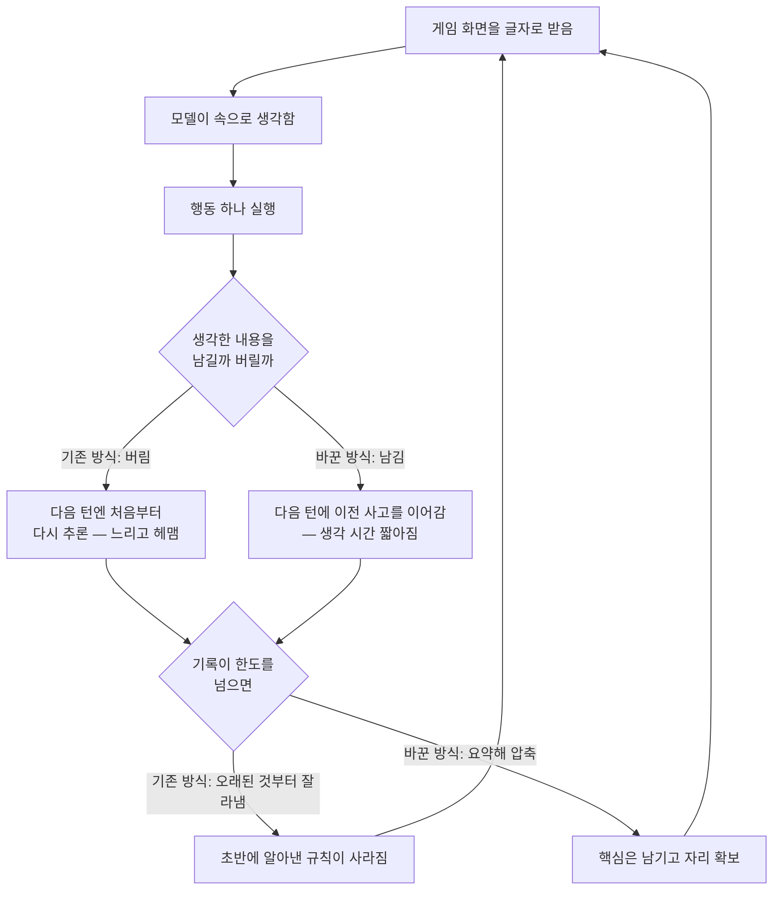

<article class="ai-knowledge-article">

<header class="ai-post-hero">
  
<a class="ai-back" href="../">이번 호</a> · 2026-08-03 · 학습 브리프

  <h2 class="ai-post-title">How enabling two settings tripled our scores on the ARC-AGI-3 benchmark</h2>
</header>

> 원문: [How enabling two settings tripled our scores on the ARC-AGI-3 benchmark](https://openai.com/index/how-two-settings-tripled-our-arc-agi-3-scores)

## 📌 학습 정리

### 1. 한 줄로 말하면

같은 모델인데도 "직전에 무슨 생각을 했는지 기억하게 해줬더니" 게임 성적이 세 배가 됐다는 이야기예요. 모델을 바꾼 게 아니라, 모델을 실행하는 껍데기의 설정 두 개를 켠 것뿐입니다.

### 2. 왜 이게 만들어졌어요?

OpenAI 쪽에서 자기 모델(GPT‑5.6 Sol)의 ARC-AGI-3 점수를 보고 좀 의아해했다고 해요. 이 모델은 수학의 오래된 미해결 문제를 풀거나 포켓몬 파이어레드를 클리어할 정도인데, 2D 퍼즐 게임 벤치마크에서는 7.8%밖에 못 냈거든요. 실제 플레이 기록을 뜯어보니 모델이 유난히 우물쭈물하고 진도를 못 뺐는데, 원인이 모델 자체가 아니라 **게임을 시키는 실행 껍데기(harness, 하네스)의 설정**에 있었습니다. 한 수 둘 때마다 모델이 속으로 했던 생각을 전부 버리고 있었고, 대화가 길어지면 오래된 기록부터 잘라내고 있었던 거죠. 그러니까 모델 입장에선 매 턴마다 "여기가 어디죠?" 상태로 게임을 다시 시작하는 셈이었어요.

### 3. 비유로 풀면

이건 마치 매일 아침 기억이 초기화되는 사람에게 방탈출을 시키는 것과 비슷해요. 전날 뭘 눌러봤는지 적힌 메모는 남아 있지만, "왜 그걸 눌렀는지, 무슨 가설을 세웠는지"는 사라져서 매번 처음부터 추론을 다시 해야 합니다. 게다가 메모장 칸이 다 차면 제일 오래된 줄부터 지워지니, 초반에 알아낸 규칙마저 슬금슬금 없어지고요.

그래서 결국, 이 실험이 켠 두 설정은 "생각한 흔적을 남겨두기"와 "오래된 기록을 그냥 버리는 대신 요약해서 압축하기"였습니다. 사람이 노트를 이어 쓰게 해준 것에 가까워요.

### 4. 어떻게 작동하는지 (그림으로)

핵심은 왼쪽 갈래(버리고 잘라내기)와 오른쪽 갈래(남기고 압축하기)의 차이뿐이고, 모델도 게임도 프롬프트도 그대로라는 점이에요. 오른쪽으로 바꾸자 공개 과제 세트 점수가 13.3%에서 38.3%로 올랐고, 출력 토큰은 6분의 1로 줄었습니다. 점수는 사람 기준선과 비교하는 지표인데, 공식 플레이 기록으로 추정한 사람 평균이 48% 정도라고 하니 격차가 꽤 좁혀진 셈이에요.

한 가지 흥미로운 건, 기억을 남겼더니 **행동 하나당 고민하는 시간이 오히려 줄었다**는 점입니다. 매번 게임 규칙을 처음부터 해석할 필요가 없어졌으니까요. 점수가 오르면서 비용도 같이 내려간 드문 조합이었습니다.

### 5. 처음 보는 용어 풀이

- **실행 껍데기 (harness, 하네스)** — 모델에게 매 턴 무엇을 보여주고, 무엇을 기억시키고, 어떤 형태로 답을 받을지 정하는 바깥쪽 프로그램이에요. 모델 자체가 아니라 모델을 굴리는 틀이라, 같은 모델도 이 틀에 따라 결과가 크게 달라집니다.
- **사고 과정 유지 (retained reasoning)** — 모델이 답을 내기 전에 속으로 정리한 생각을 대화 기록에 남겨두는 설정입니다. 이걸 꺼두면 모델은 자기가 왜 그런 선택을 했는지 다음 턴에 알 수 없어요.
- **압축 (compaction)** — 대화 기록이 한도에 가까워지면 오래된 내용을 요약해서 자리를 만드는 방식이에요. 뒤에서 소개할 '잘라내기'와 달리, 알아낸 내용을 버리지 않고 줄이는 게 차이입니다.
- **굴러가는 잘라내기 (rolling truncation)** — 기록이 정해진 길이(여기선 17만 5천 자)를 넘으면 가장 오래된 메시지부터 그냥 지우는 방식이에요. 구현은 간단하지만 초반 관찰과 행동이 통째로 사라진다는 단점이 있습니다.
- **맥락 창 (context window)** — 모델이 한 번에 볼 수 있는 글의 총량이에요. 책상 넓이 같은 개념이라, 여기가 꽉 차면 뭔가는 치워야 합니다.
- **사람 대비 행동 효율 (RHAE, Relative Human Action Efficiency)** — ARC-AGI-3의 채점 지표로, 사람 기준선과 비교해 모델이 얼마나 효율적으로 움직였는지를 봅니다. 모델은 자기 점수를 채점 방식조차 모른 채 플레이해요.
- **응답 API (Responses API)** — 직전 응답 ID만 넘기면 사고 과정을 자동으로 이어주는 방식의 인터페이스예요. 원문은 예전 방식인 Chat Completions API 대신 이쪽을 쓰라고 권합니다.
- **ARC-AGI-3** — 처음 보는 2D 게임을 설명서 없이 던져주고, 규칙을 스스로 알아내며 푸는지를 보는 평가 모음입니다. 도구나 특수 기능 없는 일부러 단순한 하네스를 쓰는데, 모델 간 비교를 공정하게 하려는 의도였다고 해요.

### 6. 한 발 더 들어가고 싶다면

- [arcprize.org/tasks](https://arcprize.org/tasks) — 데모 게임 25개를 직접 플레이해볼 수 있어요. 모델이 뭘 어려워했는지 몸으로 느껴보기 좋습니다.
- [ARC-AGI-3 벤치마크 소개](https://arcprize.org) — 이 평가가 무엇을 재려고 만들어졌는지 배경을 볼 수 있어요.
- [ARC 측의 GPT‑5.5 부진 분석](https://arcprize.org) — 이번 조사의 출발점이 된 문서로, 모델이 어디서 막혔는지를 평가 주최 쪽 시각으로 정리한 글이에요.
- [압축(compaction) 설정 문서](https://openai.com) — 잘라내기 대신 요약으로 맥락을 관리하는 방법의 실제 사용법을 확인할 수 있어요.

> 위 링크 중 원문에서 정확한 주소가 표기된 것은 `arcprize.org/tasks`이며, 나머지는 원문에 링크 텍스트만 있고 전체 주소가 드러나지 않아 대표 도메인만 적었습니다. 정확한 페이지는 [원문](https://openai.com/index/how-two-settings-tripled-our-arc-agi-3-scores)에서 확인하는 편이 안전합니다.

---

## 📖 원문 전체 번역 (정독용)

> 의역 최소화한 전체 번역입니다. 큰 흐름은 위 정리에서 잡고, 정확한 워딩이 필요할 땐 이 섹션에서 정독하세요.

2026년 7월 29일
Research
Publication

## 설정 두 가지를 켰더니 ARC-AGI-3 벤치마크 점수가 세 배가 된 이유

로딩 중…
공유

GPT‑5.6 Sol이 ARC-AGI-3 벤치마크의 퍼즐을 푸는 모습을 빠르게 재생한 영상. 공식 하네스(왼쪽)와, reasoning을 보존하고 compaction을 활성화한 우리의 Responses API 하네스(오른쪽)를 비교한다. [이 게임의 리더보드](https://arcprize.org/)에서는 어떤 프론티어 모델도 1단계를 넘어서지 못한다. 우리 하네스를 쓰면 GPT‑5.6 Sol은 여섯 단계 모두를 푼다.

GPT‑5.6 Sol이 [ARC-AGI-3](https://arcprize.org/) 벤치마크에서 낮은 점수를 받았을 때, 우리는 당혹스러웠다.

GPT‑5.6 Sol은 [cycle double cover conjecture(사이클 이중 피복 추측)](https://arcprize.org/) 같은 수학계의 오래된 미해결 문제를 풀었고, Pokémon FireRed 같은 게임도 클리어한 바 있다. 하지만 2D 퍼즐 게임 벤치마크인 ARC-AGI-3에서는 GPT‑5.6 Sol이 겨우 7.8%를 기록했고, GPT‑5.5는 이 게임들을 거의 플레이조차 못 해 0.4%라는 초라한 점수를 받았다.

2D 퍼즐 게임이 우리 모델에게 유독 어려운 것이었을까? 아니면 다른 무언가가 작용하고 있었던 걸까?

벤치마크는 AI 모델 그 자체만을 단독으로 측정하는 경우가 드물다. 벤치마크는 API 설정, 하네스 설계, 프롬프팅에 관한, 눈에 잘 띄지 않는 선택들도 함께 측정한다. ARC-AGI-3의 경우, 우리는 ChatGPT와 Codex에서 사용하는 두 가지 API 설정—**reasoning 보존(retained reasoning)**과 **compaction**—을 켜는 것만으로 공개 태스크 세트에서 점수가 세 배가 되고 출력 토큰이 6분의 1로 줄어든다는 사실을 발견했다.

공식 하네스로는 GPT‑5.6 Sol이 ARC-AGI-3 공개 세트에서 13.3%를 기록했다. reasoning 보존과 compaction을 적용하자 38.3%를 기록했다. 점수는 Relative Human Action Efficiency([RHAE](https://arcprize.org/))로 측정되는데—이는 모델 성능을 사람 기준선과 비교하는 지표다. [공식 게임플레이 로그](https://arcprize.org/)를 바탕으로, 우리는 평균적인 사람 테스터가 48%를 기록했을 것으로 추정한다. 모델은 자신이 어떻게 점수를 매기는지 안내받지 않으며, 진행 내내 자신의 점수를 볼 수도 없다—액션은 오직 각 프레임의 텍스트 표현과 현재 레벨만 반환할 뿐이다.

### ARC-AGI-3

ARC-AGI-3는 AI 에이전트가 얼마나 잘 학습하고 추론하는지를 측정하도록 설계된 벤치마크다. 에이전트는 낯선 2D 게임을 탐색하며, 명시적인 지침 없이 게임의 작동 방식을 스스로 추론해야 한다. arcprize.org/tasks에서 데모 게임 25종을 직접 플레이해볼 수 있다.

ARC-AGI-3는 도구나 특수 기능이 없는, 의도적으로 범용적인(generic) 하네스를 사용한다. ARC 측의 논리는, 단순한 하네스일수록 모델의 결점이 더 잘 드러나고 모델 간 비교가 더 공정해진다는 것이었다. 이와 대조적으로 상용 개발자들은 각 모델의 특징과 특성(quirk)에 맞춰 하네스를 최적화한다.

게이밍 분야에서 GPT‑5.6 Sol은 비전(vision)만 사용하는 하네스로 Pokémon FireRed를 클리어했고(GPT_Plays_Pokemon의 스트리밍으로 확인됨), Codex의 컴퓨터 사용(computer use) 기능으로 Slay the Spire를 클리어했으며(EpochAI의 스트리밍으로 확인됨), Baba Is You의 초반 스테이지들도 클리어했다(Piotr Migdał와 Piotr Grabowski가 공유). 그렇다면 ARC-AGI-3에서는 무엇이 그렇게 달랐던 걸까?

Ethan Mollick은 Codex에서 GPT‑5.6 Sol이 Slay the Spire 2—GPT‑5.6 Sol의 지식 컷오프 이후 출시된 게임—의 무작위 데일리 챌린지를 클리어하는 모습을 보여준다.

[ARC의 GPT‑5.5 결점 분석](https://arcprize.org/)에서 영감을 받아, 우리는 GPT‑5.6 Sol의 시도 일부를 살펴보았다. ARC와 마찬가지로, 우리도 이 모델이 그다지 영리해 보이지 않는다는 것을 확인했다. 모델은 각 액션마다 오랜 시간을 들였고 진전을 이루는 데 어려움을 겪었다.

하지만 더 깊이 파고들면서, 우리는 모델의 이러한 혼란 상당 부분이 모델 자체에 내재된 것이 아니라 하네스의 설정 때문이라는 사실을 발견했다.

첫째, 우리는 각 게임 액션 이후 모든 비공개(private) reasoning이 폐기된다는 점을 발견했다. 이는 곧 매 액션마다 GPT‑5.6 Sol이 과거의 사고 과정을 기억하지 못한 채 게임을 처음부터 다시 파악해야 했다는 뜻이다. 모델은 여전히 과거 행동의 기록과 그에 딸린 짧은 메모는 볼 수 있었지만, 그러한 행동으로 이어졌던 계획, 통찰, 사고 과정은 볼 수 없었다.

둘째, 하네스가 롤링 절단(rolling truncation) 윈도우를 사용해서, 히스토리가 길어질수록 오래된 액션이 보이지 않게 된다는 것을 확인했다. 즉 GPT‑5.6 Sol은 과거의 사고 과정을 기억하지 못했을 뿐 아니라, 과거 행동에 대한 기억마저 잃고 있었다.

이 두 가지 하네스 특성—reasoning 폐기와 롤링 절단—이 결합되어, GPT‑5.6 Sol이 시간이 지나도 학습에 어려움을 겪었던 이유를 상당 부분 설명해주었다.

### 에이전트는 자신이 한 일을 기억할 때 가장 잘 해낸다

우리 모델들은 답변이나 도구 호출을 출력하기 전에 비공개 reasoning 메시지로 사고하도록 훈련된다. 이러한 비공개 사고 메시지는 대화 기록의 일부로 보존된다. 대화가 너무 길어지면 이를 요약하고 이어간다.

이것이 우리 모델이 훈련되는 방식이며, 동시에 ChatGPT와 Codex에서 배포되는 방식이기도 하다. 우리의 프로덕션 설정과 더 잘 맞추기 위해, 우리는 [Responses API](https://platform.openai.com/docs/api-reference/responses)로 ARC-AGI-3 하네스를 구현했다. 우리 API는 컨텍스트 관리를 쉽게 해주는데, GPT‑5.6의 경우 이전 응답 ID를 전달하면 도구 호출과 턴을 넘나들며 reasoning이 자동으로 보존된다.

reasoning이 보존되자, 우리는 두 가지 큰 변화를 확인했다. 첫째, GPT‑5.6 Sol은 매 액션 전에 사고하는 데 드는 시간이 줄었는데, 매 턴마다 게임을 처음부터 새로 해석할 필요가 없어졌기 때문이다. 둘째, 과거의 사고를 기억할 수 있게 되자, GPT‑5.6 Sol은 시간이 지남에 따라 학습하고 일관된 전략을 구사하는 데 훨씬 능숙해졌다.

다음 개선은 롤링 절단을 Responses API의 또 다른 설정인 [compaction](https://platform.openai.com/docs/guides/compaction)으로 대체하는 데서 나왔다.

ARC-AGI-3 하네스는 컨텍스트 한계를 롤링 절단으로 해결한다. 대화 컨텍스트가 175,000자를 초과하면, 가장 오래된 메시지가 폐기된다.

롤링 절단에는 두 가지 단점이 있다. 첫째, 모델이 이전 관찰과 행동을 잃어버린다. 둘째, 태스크 진행의 상당 부분을 컨텍스트 윈도우가 거의 가득 찬 상태로 처리하게 되는데, 이는 성능을 약간 저해할 수 있다.

ARC-AGI-3에서 compaction을 활성화하자, GPT‑5.6 Sol은 더 긴 실행 구간에 걸쳐 각 게임에 대해 학습한 내용을 더 잘 보존할 수 있었고, 더 적은 출력 토큰으로 더 높은 점수를 달성했다.

reasoning 보존과 compaction 활성화의 효과를 보여주기 위해, 아래는 각 하네스로 일련의 ARC-AGI-3 퍼즐을 풀어나가는 동안 GPT‑5.6 Sol의 175K 컨텍스트 윈도우가 어떻게 쓰이는지를 보여주는 애니메이션이다.

가운데 두 열은 각 하네스가 모델 컨텍스트 윈도우를 어떻게 다르게 사용하는지를 보여준다. 과거에 대한 기억이 더 좋아지면서 GPT‑5.6 Sol은 액션당 사고를 덜 하게 되고 훨씬 빠르게 진행한다. 참고: 우리 구현은 문자(character) 대신 175,000 토큰이라는 한계치를 사용하지만, 텍스트의 대부분이 우리 토크나이저에서 1:1 비율로 토큰화되는 액션 그리드이기 때문에 결과적으로는 상당히 비슷하다.

reasoning 보존과 compaction을 함께 적용하면 GPT‑5.6 Sol(max)은 대략 3배의 점수를, 출력 토큰은 6분의 1로 줄여 달성할 수 있다.

### 결론 및 권장 사항

우리는 이 실험들이, 평가(eval)가 모델 자체를 단독으로 측정하는 경우가 드물다는 사실—즉 API 설정, 하네스 설계, 프롬프팅에 관한 눈에 잘 띄지 않는 여러 선택 묶음도 함께 측정한다는 사실—을 상기시키는 계기가 되기를 바란다. 공개 벤치마크에서 낮은 점수를 받고 놀랐다가, 이후 평가 실행기(eval runner)가 reasoning 메시지를 폐기하는 범용 하네스를 사용하고 있었다는 것을 발견한 것이 이번이 처음은 아니다.

성능을 극대화하고자 하는 API 개발자라면, 우리가 자체 제품에 배포할 때 사용하는 것과 동일한 설정을 사용하기를 권한다:

- 레거시 Chat Completions API가 아니라 우리의 Responses API를 사용할 것
- reasoning을 보존할 것
- compaction을 사용할 것

그리고 모델을 비교하고 있다면, ChatGPT와 Codex에서의 실제 사용과 가장 잘 부합하는, 위 설정을 사용하는 평가에 의존하기를 권한다.

AGI 평가에 관한 수년간의 창의적인 작업, 그리고 우리가 이 문제를 더 깊이 들여다보도록 영감을 준 그들의 분석에 대해 ARC에 감사를 표한다.

프론티어 모델들과 스스로의 역량을 겨뤄보고 싶다면, arcprize.org/tasks에서 직접 공개 게임을 플레이해보라.

2026

저자: Ilan Bigio, Ted Sanders

---

계속 읽기
전체 보기

- 수학 및 이론 컴퓨터과학의 열 가지 진전 — Publication — 2026년 8월 1일
- ChatGPT for Academic Researchers로 과학적 발견 가속화하기 — Company — 2026년 7월 29일
- 에이전틱 AI 시대의 과학 컴퓨팅 — Publication — 2026년 7월 28일

</article>
