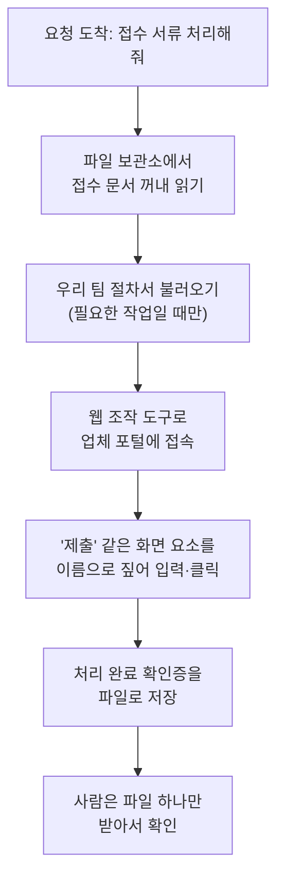

<article class="ai-knowledge-article">

<header class="ai-post-hero">
  
<a class="ai-back" href="../">이번 호</a> · 2026-08-24 · 학습 브리프

  <h2 class="ai-post-title">Build production agents with computer use, the Skills API, and the Files API</h2>
</header>

> 원문: [Build production agents with computer use, the Skills API, and the Files API](https://claude.com/blog/computer-use-skills-api-files-api)

## 📌 학습 정리

### 1. 한 줄로 말하면

사람이 마우스로 클릭하듯 화면을 보고 직접 프로그램을 조작하고, 우리 팀이 정리해둔 업무 절차서를 그대로 따라 하고, 결과를 파일로 만들어 건네주는 조수 — 그 세 가지를 한 세트로 쓸 수 있게 정식 공개했다는 이야기입니다.

### 2. 왜 이게 만들어졌어요?

지금까지 자동화는 대체로 "프로그램끼리 대화하는 통로"가 있어야 가능했습니다. 그 통로가 없는 오래된 사내 시스템이나 외부 업체 웹사이트 앞에서는 결국 사람이 직접 화면을 열고 클릭해야 했죠. 또 팀마다 쌓아온 "우리는 이런 순서로, 이런 양식으로 처리한다"는 노하우는 매번 사람이 프롬프트에 길게 적어 넣어야 했고, 다룰 문서도 요청마다 파일을 다시 붙여 보내는 식이었습니다. 그러니 조수를 만들 때마다 화면 조작·절차 지식·파일 관리를 각자 알아서 짜 맞춰야 했고, 그게 시범용 시연에서 실제 업무 운영으로 넘어가지 못하는 지점이 됐습니다. 이번 발표는 그 세 조각을 공식 부품으로 만들어 "이 조합으로 실무용 조수를 만들라"고 제시한 셈입니다.

### 3. 비유로 풀면

첫째 비유는 신입사원 하나를 받아 앉히는 상황입니다. 그 사람에게 필요한 건 셋인데, 화면 보고 마우스 쓸 손(컴퓨터 사용), 우리 팀 캐비닛에 꽂혀 있는 업무 매뉴얼(스킬), 그리고 서류를 넣고 꺼내는 공용 서류함(파일 보관소)입니다. 손만 있으면 뭘 해야 할지 모르고, 매뉴얼만 있으면 실제로 시스템을 만질 수 없습니다.

둘째 비유는 웹에서 일할 때의 차이입니다. 화면 사진만 보고 "왼쪽에서 320픽셀, 위에서 500픽셀 지점을 누르라"고 지시하는 것과, "'제출' 버튼을 누르라"고 지시하는 건 다릅니다. 창 크기가 조금 바뀌면 앞쪽은 엉뚱한 곳을 누르지만 뒤쪽은 여전히 맞습니다.

그래서 결국, 이번 변화의 핵심은 조수에게 손·매뉴얼·서류함을 정식 부품으로 갖춰주고, 웹에서는 좌표 대신 화면 요소의 이름을 짚어 누르게 만든 것입니다.

### 4. 어떻게 작동하는지 (그림으로)

흐름은 "읽기 → 절차 따르기 → 조작하기 → 결과 남기기" 네 걸음입니다. 여기서 절차서는 항상 켜져 있는 게 아니라 그 일에 필요할 때만 불려 나오고, 실행은 제공사 쪽 격리된 실행 공간에서 일어나서 우리가 서버를 따로 준비하지 않아도 됩니다. 문서도 한 번 올려두면 이후에는 번호만 가리켜 재사용하니, 매번 같은 파일을 다시 보내는 낭비가 줄어듭니다.

한 가지 더 눈여겨볼 변화는 속도 쪽입니다. 예전에는 모델을 한 번 부를 때마다 동작 하나만 할 수 있었는데, 이제 한 차례에 여러 동작을 묶어 하니 같은 일을 더 적은 호출로 끝냅니다. 원문에 실린 한 사례에서는 가장 긴 처리 흐름이 32분에서 13분으로 줄고, 작업당 비용은 약 30% 낮아졌으며, 프롬프트는 손대지 않았다고 합니다.

### 5. 처음 보는 용어 풀이

- **컴퓨터 사용 (computer use)** — 화면 사진을 보고 사람처럼 클릭·입력·스크롤하며 프로그램을 조작하는 기능입니다. 자동화용 연결 통로가 아예 없는 프로그램에도 손을 댈 수 있다는 게 핵심입니다.
- **브라우저 사용 도구 (browser use tool)** — 컴퓨터 사용의 웹 전용 버전입니다. 화면 사진만 보는 게 아니라 페이지의 구조까지 함께 읽어서, 좌표가 아니라 특정 입력칸이나 버튼을 지목해 동작합니다.
- **스킬 (skill)** — 지시문·스크립트·양식 파일을 한 폴더에 모아둔 업무 매뉴얼입니다. 항상 읽히는 게 아니라 그 일에 필요할 때만 불려 나오는 방식이라, 평소에는 조수의 머릿속을 차지하지 않습니다.
- **스킬 API (Skills API)** — 그 매뉴얼을 직접 올리고 버전을 관리한 뒤, 요청마다 붙여 쓸 수 있게 해주는 창구입니다. 프롬프트에 매번 복사해 넣던 노하우가 관리 가능한 자산이 된다는 뜻입니다.
- **파일 API (Files API)** — 조수가 읽고 쓸 문서를 보관하는 곳입니다. PDF나 표 문서를 한 번 올려두고 다음 요청에서는 식별 번호로 가리키면 되고, 조수가 만든 파일은 내려받을 수 있습니다.
- **코드 실행 격리 공간 (code execution sandbox)** — 스킬 안의 스크립트가 실제로 돌아가는, 바깥과 분리된 실행 환경입니다. 제공사 쪽에서 돌려주므로 우리가 별도로 서버를 띄워 관리할 필요가 없습니다.
- **정식 공개 (general availability)** — 시험판 딱지를 떼고 실제 업무에 써도 되는 상태로 열렸다는 뜻입니다. 기존 시험판 연동은 옮겨가는 동안 계속 동작한다고 안내되어 있습니다.
- **의료정보 보호 규정 대응 (HIPAA·BAA)** — 미국에서 환자 정보를 다룰 때 요구되는 규정과, 그에 맞춰 맺는 위탁 계약입니다. 이제 컴퓨터 사용도 그 계약 아래 규제 대상 업무에 쓸 수 있게 됐습니다.

### 6. 한 발 더 들어가고 싶다면

- [Build production agents with computer use, the Skills API, and the Files API](https://claude.com/blog/computer-use-skills-api-files-api) — 이번 발표 원문입니다. 세 부품이 하나의 작업 흐름으로 어떻게 맞물리는지, 그리고 도입 사례에서 시간·비용이 어떻게 달라졌는지를 발표자 표현 그대로 확인할 수 있어요.

원문에서 각 기능 문서(컴퓨터 사용, 브라우저 사용 도구, 스킬 API, 파일 API)로 가는 안내가 언급되어 있지만 주소 자체가 본문에 드러나 있지 않아, 여기서는 임의로 만들지 않았습니다. 위 원문 페이지의 문서 링크를 따라가면 됩니다.

---

## 📖 원문 전체 번역 (정독용)

> 의역 최소화한 전체 번역입니다. 큰 흐름은 위 정리에서 잡고, 정확한 워딩이 필요할 땐 이 섹션에서 정독하세요.

# Build production agents with computer use, the Skills API, and the Files API

**카테고리**: Product announcements · Agents · Enterprise AI · Product · Claude Platform
**날짜**: August 20, 2026
**읽는 시간**: 5분

원문 링크: https://claude.com/blog/computer-use-skills-api-files-api

Computer use, Skills API, Files API 가 오늘부로 Claude Platform 에서 정식 출시(generally available)됩니다. Computer use 에는 웹 애플리케이션에서 작동하는 에이전트를 위한 새로운 browser use 도구도 추가됩니다. 이들을 함께 사용하면 소프트웨어를 조작하고, 팀의 전문지식을 적용하며, 완성된 파일을 반환하는 에이전트를 만들 수 있습니다.

## Claude Platform 위에서 에이전트 구축하기

**Computer use** 는 눈으로 볼 수 있는 소프트웨어를 조작하는 에이전트를 만들 수 있게 해줍니다. 스크린샷이 주어지면 에이전트는 키보드 앞에 앉은 사람처럼 클릭하고, 타이핑하고, 스크롤합니다. 이를 통해 자동화를 염두에 두고 만들어지지 않은 애플리케이션에서도 작업할 수 있습니다. 새로운 **browser use 도구**는 이 기능을 웹으로 확장합니다. 스크린샷과 함께, 에이전트는 페이지의 구조를 읽고 화면상의 위치가 아니라 특정 필드나 버튼을 대상으로 동작합니다.

**Skills API** 와 **Files API** 는 그 에이전트에게 여러분의 전문지식과 문서를 부여할 수 있게 해줍니다. 스킬(skill)은 지시문, 스크립트, 템플릿으로 이루어진 폴더이며, Claude 는 작업이 필요로 할 때만 이를 로드합니다. Skills API 를 사용하면 여러분 자신의 스킬을 업로드하고 버전 관리한 다음, 어떤 요청에도 이를 첨부할 수 있습니다. 이들은 Claude 의 코드 실행 샌드박스 안에서 실행되므로, 여러분이 별도로 호스팅해야 할 것은 없습니다. Files API 는 에이전트가 읽고 쓰는 문서를 위한 저장소입니다. PDF 나 스프레드시트를 한 번 업로드해두고, 이후 요청에서는 다시 전송하는 대신 ID 로 참조하면 되며, 에이전트가 만들어낸 파일을 다운로드할 수도 있습니다.

예를 들어 여러분이 보험금 청구(claims) 에이전트를 만든다고 합시다. 이 에이전트는 Files API 에서 접수 문서를 읽고, 팀의 청구 절차를 인코딩한 스킬을 따르며, browser use 도구로 보험사의 웹 포털에서 제출을 완료하고, 확인서를 파일로 다시 저장합니다. 이미 정식 출시된 코드 실행(code execution)과 웹 검색(web search) 도 동일한 흐름에 들어맞습니다.

## 정식 출시(General Availability)로 새로워진 점

**Computer use**: 업데이트된 computer use 도구는 이제 모델 호출당 하나씩이 아니라 한 턴에 여러 작업을 수행할 수 있어, 더 적은 호출과 더 짧은 시간 안에 작업이 끝납니다. Computer use 는 이제 저희 BAA 하에서 HIPAA 규제 대상 워크로드에도 적합합니다.

**Browser use 도구**: 오늘 computer use 에 새로 추가되었습니다. 동일한 다중 작업(multi-action) 턴을 사용하며 페이지 구조를 추가로 활용하므로, 에이전트가 픽셀만으로 작업할 때보다 웹 요소를 더 안정적으로 타겟팅합니다.

**Skills API**: 여러분 자신의 스킬을 업로드하고 버전 관리하기 위한 더 단순한 API 입니다.

**Files API**: 자동 파일 만료, 5배 높아진 속도 제한(rate limit), 조직당 1TB 저장공간을 제공합니다.

> "저희 에이전트들은 API가 전혀 없는 헬스케어 및 보험 시스템 내부에서 작동합니다. 새로운 computer use 도구에서, 저희의 가장 긴 청구 워크플로우는 32분에서 13분으로 줄었고, 저희가 테스트한 모든 워크플로우에서 작업당 비용이 약 30% 감소했으며, 완료율은 프롬프트 변경 없이도 100%에 도달했습니다."
> — Davide Locatelli, Research Engineer

> "Skills API 는 Box Agent 에 특화된 문서 생성 기능을 구축할 수 있는 간단한 방법을 제공해주었습니다. 한 은행의 경우, 스킬이 그 회사의 신용 방법론과 승인된 메모 양식을 담아내고, Box Agent 는 이를 Box 에 이미 있는 재무제표와 거래 문서에 적용하여 애널리스트 검토용 출처 기반(source-grounded) 신용 메모를 생성합니다. 은행들은 각각을 처음부터 새로 만들 필요 없이 복잡한 워크플로우를 위한 에이전트를 얻게 됩니다."
> — Matthew Midson, Managing Director of Banking

(Prev / 0 of 5 / Next — 캐러셀 네비게이션)

**eBook**

## 시작하기

Computer use 도구, browser use 도구, Skills API, Files API 는 이제 Claude Platform 에서 이용 가능합니다. Skills API 와 Files API 는 Microsoft Foundry 를 통해서도 이용 가능하며, 업데이트된 computer use 및 browser use 도구는 Google Cloud 의 Vertex AI 에 곧 제공될 예정입니다. 기존 베타 통합은 여러분이 마이그레이션하는 동안에도 계속 작동합니다. 시작하려면 computer use, browser use 도구, Skills API, Files API 문서를 참조하세요.

## FAQ

없음(No items found).

## 관련 게시물

Claude 로 구축하는 팀을 위한 더 많은 제품 뉴스와 모범 사례를 살펴보세요.

- **Aug 21, 2026** — Bringing the cybersecurity capabilities of Claude Mythos 5 to more defenders (Product announcements)
- **Aug 13, 2026** — Self-service data analytics in Slack: how Anthropic deploys Claude Tag for ad-hoc questions (Agents)
- **Jul 24, 2026** — The new rules of context engineering for Claude 5 generation models (Claude Code)
- **Aug 21, 2026** — The AI-Native SDLC playbook (Enterprise AI)

---

여러분의 조직이 운영하는 방식을 Claude 로 전환해보세요.

[가격 보기] · [영업팀 문의]

개발자 뉴스레터 구독하기 — 제품 업데이트, 사용법, 커뮤니티 스포트라이트 등을 매달 이메일로 받아보세요. [구독하기]

(뉴스레터 구독을 원하시면 이메일 주소를 입력해주세요. 언제든지 구독 해지할 수 있습니다.)

</article>
