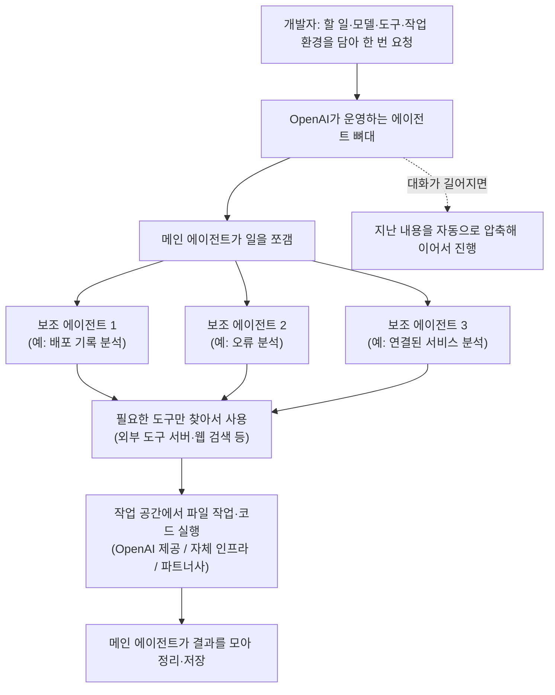

<article class="ai-knowledge-article">

<header class="ai-post-hero">
  <p class="ai-eyebrow"><a class="ai-back" href="../">이번 호</a> · 2026-09-14 · 학습 브리프</p>
  <h2 class="ai-post-title">Introducing the Agents API</h2>
</header>

> 원문: [Introducing the Agents API](https://openai.com/index/introducing-the-agents-api)

## 📌 학습 정리

### 1. 한 줄로 말하면

AI에게 일을 맡길 때 필요한 작업 관리, 작업 공간, 도구 연결을 OpenAI가 대신 운영해 주는 서비스예요. 개발자는 "무슨 일을, 어떤 도구로, 어디서 할지"만 정해서 한 번 요청하면 됩니다.

### 2. 왜 이게 만들어졌어요?

AI가 몇 초 만에 답하는 게 아니라 몇 시간, 길게는 며칠씩 일하게 하려면 챙길 게 많아요. 대화 내용이 너무 길어지면 정리해야 하고, 도구를 적절히 불러야 하고, 일을 나눠 여러 AI에게 맡기고 결과를 모아야 하죠. 파일을 다루고 코드를 실행할 안전한 공간도 필요하고요. 그래서 원래는 회사마다 질문을 여러 단계로 이어 붙이는 방식(prompt chain)을 짜고, 도구 호출도 직접 관리했어요. 원문에 나오는 고객사들도 이런 구조를 직접 만들고 다듬느라 시간을 많이 썼고, 여러 AI를 지켜보면서 조율하는 일이 꽤 번거로웠다고 말해요. OpenAI는 자사 코딩 에이전트인 Codex를 수백만 명에게 운영하면서 쌓은 이 기반을 API로 열어서 누구나 가져다 쓸 수 있게 했어요.

### 3. 비유로 풀면

이건 마치 **공유 주방과 주방 매니저를 함께 빌리는 것** 같아요. 요리사(AI 모델)는 원래 있고, 식당 주인(개발자)은 메뉴와 특별한 재료(우리만의 도구·지식)만 정하면 돼요. 주문이 몰리면 보조 요리사를 몇 명까지 부를지, 긴 영업시간에 메모를 어떻게 정리할지, 조리대를 어떻게 준비할지는 매니저가 알아서 챙기고요. 조리대는 매니저가 준비한 곳을 써도 되고, 우리 가게 주방이나 제휴 주방을 골라도 됩니다.

그래서 결국, 에이전트를 굴리는 뼈대와 운영은 OpenAI가 맡고, 개발자는 우리 서비스만의 차별점에 집중하는 구조예요.

### 4. 어떻게 작동하는지 (그림으로)



원문 예시는 "지난 30분 동안 서비스 오류가 늘어난 원인을 조사해 줘"라는 요청이에요. 메인 에이전트가 배포·오류·연결된 서비스 분석을 보조 에이전트들에게 나눠 맡기고, 결과를 모아 작업 공간의 폴더에 저장하는 흐름입니다. 이 과정에서 대화가 길어지면 알아서 요약하고, 도구도 필요한 것만 그때그때 불러와요.

### 5. 처음 보는 용어 풀이

- **에이전트를 굴리는 뼈대 (harness)**: 모델 호출, 도구 사용, 대화 내용 관리를 조율하는 핵심 로직이에요. 여기서는 Codex에 쓰이는 것과 같은 뼈대를 OpenAI가 운영하고 계속 개선해요. 코드는 오픈소스로 공개되어 있어서 누구나 들여다볼 수 있어요.
- **격리된 작업 공간 (sandbox)**: 에이전트가 파일을 다루고 코드를 실행하는 안전한 공간이에요. OpenAI가 관리하는 공간, 우리 회사 인프라, 파트너사(Cloudflare, Vercel, Modal 등) 중에서 고를 수 있어요. 한 고객사는 뼈대와 작업 공간을 분리한 덕분에 실패한 응답이 86% 줄었다고 해요.
- **보조 에이전트 (subagent)**: 메인 에이전트가 큰 일을 쪼개서 맡기는 하위 AI예요. 각자 자기 맥락을 따로 가지고 있어서 맡은 일에만 집중하고, 여러 명이 동시에 일해서 속도가 빨라져요. 동시에 몇 개까지 돌릴지 설정할 수 있어요.
- **맥락 자동 압축 (compaction)**: AI가 한 번에 기억할 수 있는 분량(context window)이 거의 찼을 때, 앞의 내용을 계속하는 데 필요한 정보만 남기고 줄여 주는 기능이에요. 덕분에 몇 시간짜리 작업도 끊기지 않고 이어갈 수 있어요.
- **도구 찾아 불러오기 (tool search)**: 쓸 수 있는 도구 설명을 처음부터 전부 넣지 않고, 필요할 때 관련된 것만 불러오는 방식이에요. 읽어야 할 글자 수(토큰)와 비용을 줄여 줘요.
- **코드로 도구 부르기 (programmatic tool calling)**: 에이전트가 도구 호출을 코드로 묶어서 여러 개를 동시에 돌리거나, 결과를 걸러 필요한 것만 가져오게 하는 방식이에요. 데이터가 많을 때 핵심만 대화에 남길 수 있어요.
- **외부 도구 연결 규격 (MCP)**: AI가 외부 서비스의 기능을 도구로 쓸 수 있게 연결하는 공통 규격이에요. 원문 예시에서는 모니터링 서비스 주소를 적어 넣는 것만으로 에이전트가 그 서비스를 도구로 쓰게 돼요.

---

참고로 이 서비스는 현재 공개 베타(public beta)라서 모든 개발자가 쓸 수 있고, 추가 요금 없이 사용한 토큰과 도구 비용만 낸다고 해요. 원문 본문에는 링크 제목만 있고 실제 주소가 없어서 6번 섹션은 뺐어요.

---

## 📖 원문 전체 번역 (정독용)

> 의역 최소화한 전체 번역입니다. 큰 흐름은 위 정리에서 잡고, 정확한 워딩이 필요할 땐 이 섹션에서 정독하세요.

2026년 9월 10일
제품
API

# Agents API 소개

OpenAI가 완전히 관리하는 Codex 하네스로 클라우드 에이전트를 구축하고 실행하세요.

로딩 중…
공유

Codex 와 ChatGPT for Work 를 전 세계 수백만 명을 대상으로 확장해오면서, 우리는 장시간 실행되는 에이전트를 실제로 잘 작동하게 만드는 데 무엇이 필요한지 배웠습니다. 유용한 에이전트에게는 컨텍스트를 관리하고, 도구를 효율적으로 사용하며, 서브에이전트를 조율하는 강력한 하네스가 필요합니다. 또한 며칠간 안정적으로 계속 실행될 수 있게 해주는 인프라, 그리고 파일 작업·코드 실행·중간 결과 저장이 가능한 환경도 필요합니다.

오늘 우리는 Codex를 구동하는 것과 동일한 그 하네스와 인프라를 개발자들에게 간단하고 유연한 API를 통해 제공하는 [Agents API](https://openai.com/index/introducing-the-agents-api)(새 창에서 열림)를 퍼블릭 베타로 소개합니다.

**고객들이 Agents API에 대해 말하는 것** (1/8)

"Agents API 덕분에 우리 평가 점수가 0.71에서 0.85로 올랐습니다. API의 서브에이전트 지원은 훌륭했고 우리 워크플로우 속도를 크게 높여줬습니다. 이전 방식에서는 서브에이전트를 관찰하고 조율하는 게 꽤 번거로웠는데, 새 API들은 4배의 지연시간 감소를 가져다줬습니다. 저희는 이걸 최적화하려고 오랫동안 애썼는데, 서브에이전트 흐름은 기본 제공만으로도 엄청난 개선이었습니다."
— Jack Weissenberger, CTO, Ciridae

"실제 비즈니스를 변화시키려면 온갖 형태의 워크플로우에 AI를 배치해야 합니다. Agents API는 하네스를 제공하고, 환경·컨텍스트·UX는 우리 몫으로 남습니다. 우리의 AI 플랫폼 Nexus로 이제 주거 서비스부터 건축까지 여러 산업에 걸쳐 몇 시간 만에 에이전트를 구축할 수 있습니다."
— Rasmus Wissmann, CTO, Long Lake

"Agents API 덕분에 복잡한 다단계 워크플로우를 어떻게 설계할지에 대한 사고방식이 달라졌습니다. 예전에는 프롬프트 체인을 작성하고 우리 자체 도구 호출 세트를 관리해야 했지만, 이제는 Codex가 노트북에서 작동하는 방식과 매우 비슷하게 코드 안에서 직접 에이전트를 사용할 수 있습니다. 이미 우리가 자체 에이전트 인프라를 구축해야 했을 몇 가지 문제를 해결하는 데 도움이 됐습니다."
— Cole Striler, Director of Engineering, WithCoverage

"케이스 리뷰 워크플로우를 Agents API로 마이그레이션한 후, 케이스당 비용이 60% 절감됐고, 지연시간이 낮아졌으며, 기존 성능을 유지하면서 토큰 효율성이 크게 개선됐습니다."
— Bhavyansh Sabharwal, Member of Technical Staff, SafetyKit

"우리 테스트에서 눈에 띈 점은 Agents API가 폭발적인(bursty) 워크로드를 얼마나 자연스럽게 처리하는가였습니다. 우리는 수백 개의 에이전트에 작업을 분산시키고, 비동기로 실행한 다음, 나중에 결과를 수집할 수 있었습니다 — 피크 사이에 인프라를 유휴 상태로 둘 필요 없이요."
— Dmitry Khanukov, Co-founder & CTO, Dwelly

"금융 서비스에서는 고객의 신뢰를 얻는 것이 매우 중요합니다. OpenAI의 Agents API는 우리가 더 신뢰할 수 있는 에이전트를 구축하게 해줘서, 고객들이 프로덕션 환경에서 이를 사용할 수 있다는 확신을 갖게 해줍니다. 에이전트 하네스를 샌드박스와 분리함으로써, 우리는 실패한 에이전트 응답을 86% 줄였습니다."
— Serhii Shchoholiev, Lead Engineer, Hypha

"Agents API는 실제 운영 중인 레포지토리에서 구현, 독립 리뷰, 수정(remediation), 실제 브라우저 검증까지 처리해냈습니다. 전반적으로 에이전트의 엔지니어링 품질은 매우 뛰어났습니다."
— Maks Operlejn, Senior ML Engineer, deepsense.ai

"Nash에서는 전 세계 물류 네트워크에 걸쳐 수억 건의 배송을 관리하는 수천 개의 장시간 실행 AI 에이전트를 배치하고 있습니다. OpenAI의 Agents API는 프로덕션에서 지속적으로 작동하는 에이전트에게 필요한 지속적(durable) 세션과 오케스트레이션 레이어를 제공합니다 — 컨텍스트, 복구(recovery), 다단계 실행을 관리하면서요. 한편 Nash는 그 에이전트들을 물리적 세계와 연결하는 도구와 실행 환경을 제공합니다. 이를 통해 우리 에이전트는 몇 시간에서 며칠에 걸칠 수 있는 복잡한 워크플로우 전반에서 추론하고, 행동하고, 복구하고, 협업할 수 있습니다. 이 에이전트들은 우리 파트너들을 위한 미션 크리티컬 물류 운영을 실행하는 프로덕션 인프라입니다."
— Aziz Alghunaim, Co-founder & CTO, Nash.ai

Ciridae · Long Lake · WithCoverage · SafetyKit · Dwelly · Hypha · deepsense.ai · Nash.ai

## API 호출 한 번으로 클라우드 에이전트 구축하기

Agents API를 사용하면 작업(task), 모델, 도구, 환경을 지정하는 API 호출 한 번으로 프로덕션 수준의 에이전트를 만들 수 있습니다:

```javascript
1  import OpenAI from "openai";
2
3  const client = new OpenAI();
4
5  const session = await client.beta.agents.sessions.create({
6    agent: {
7      model: "gpt-6-astra",
8      tools: [
9        {
10          type: "mcp",
11          server_label: "observability",
12          transport: {
13            type: "http",
14            server_url: "https://observability.example.com/mcp",
15          },
16        },
17      ],
18      multi_agent: { enabled: true, max_concurrent_subagents: 3 },
19    },
20    vault_ids: ["vault_YOUR_VAULT_ID"],
21    environment: {
22      type: "openai_hosted",
23      capability_directories: ["/workspace/capabilities/skills"],
24    },
25    input:
26      "Investigate service-api's elevated 5xx rate over the last 30 minutes. " +
27      "Delegate deployment, error, and dependency analysis to subagents. " +
28      "Save findings, evidence, and recommended mitigation in /workspace/outputs.",
29  });
```

OpenAI가 하네스를 호스팅하고 유지관리합니다. 여러분은 에이전트의 컴퓨트 환경을 선택합니다: OpenAI가 관리하는 샌드박스에서, 여러분 자신의 인프라에서, 또는 우리의 샌드박스 파트너 중 하나를 통해서요. Agents API는 우리가 최적화한 에이전트 하네스와 인프라 위에 에이전트를 구축할 수 있는 탄탄한 토대를 제공하므로, 여러분은 여러분의 에이전트를 독특하게 만드는 도구, 지식, 워크플로우에 집중할 수 있습니다.

*Agents API는 Codex 뒤에 있는 것과 동일한 하네스와 인프라로 여러분의 에이전트를 구동합니다.*

## 에이전트 환경 선택하기

서로 다른 워크로드는 서로 다른 컴퓨트, 스토리지, 배포 옵션을 필요로 합니다. Agents API를 사용하면 여러분의 애플리케이션에 맞는 샌드박스를 선택할 수 있습니다.

우리는 Blaxel, Cloudflare, Daytona, DigitalOcean, E2B, Modal, Oracle, Runloop, Vercel을 포함한 [에코시스템 제공업체들과 파트너십](https://openai.com/index/introducing-the-agents-api)(새 창에서 열림)을 맺어 다양한 요구에 대한 최상급 통합을 제공하고 있습니다:

- 완전 관리형 환경 또는 여러분의 VPC 내부 배포
- 특정 파일 및 시크릿 저장 메커니즘
- 여러분 회사의 워크플로우에 맞는 성능, 콜드스타트, 비용 프로필을 갖춘 다양한 CPU, GPU, 메모리 구성

*Agents API는 인기 있는 에코시스템 제공업체들과의 최상급 통합을 제공합니다.*

### OpenAI 호스팅 샌드박스

빠르게 시작해서 효율적으로 확장하고 싶은 개발자들을 위해, 우리는 [OpenAI 호스팅 샌드박스](https://openai.com/index/introducing-the-agents-api)(새 창에서 열림)도 함께 소개합니다. 이는 Codex와 ChatGPT를 구동하는 것과 동일한 샌드박싱 인프라를 활용합니다.

OpenAI가 샌드박스를 프로비저닝하고 관리하여, 여러분의 에이전트가 코드를 실행하고, 파일 작업을 하고, 산출물(artifact)을 만들어낼 수 있는 안전하고 성능이 뛰어난 환경을 제공합니다. 이 샌드박스들은 여러분의 파일, 패키지, 스킬, 플러그인으로 유연하게 구성해서 에이전트가 작업을 완수하는 데 필요한 것을 제공할 수 있습니다.

## 진화하는 Codex 하네스로 구축하기

새로운 모델 역량을 활용한다는 것은 종종 여러분의 하네스를 재작업해야 한다는 뜻이며, 이는 애플리케이션을 개선하는 데 써야 할 소중한 시간을 빼앗아갑니다. Agents API는 각 모델 출시 때마다 이러한 역량에 대한 버전 관리된 접근을 제공합니다. 우리는 모델과 함께 하네스를 유지관리하고 지속적으로 개선하여, 여러분의 에이전트가 모든 업그레이드에서 더 나은 성능을 얻을 수 있도록 돕습니다. 예를 들어, 최근 하네스 개선 사항은 다음과 같습니다:

### 긴 세션에 걸쳐 에이전트가 계속 작동하게 하기

몇 시간 동안 작동하는 모델들을 지원하기 위해, 우리는 에이전트가 더 긴 세션에 걸쳐 관련 정보를 이어갈 수 있도록 돕는 컨텍스트 관리 기능을 구축했습니다. Agents API는 세션이 컨텍스트 한계에 가까워지면 [이전 컨텍스트를 자동으로 압축](https://openai.com/index/introducing-the-agents-api)(새 창에서 열림)하여, 에이전트가 작업을 계속하는 데 필요한 정보를 보존합니다. 개발자들은 자체 압축 로직을 구현할 필요 없이 여러 컨텍스트 윈도우에 걸치는 워크플로우를 구축할 수 있습니다.

### 에이전트가 더 많은 도구를 효율적으로 사용하도록 돕기

Agents API는 에이전트가 올바른 도구를 찾아 효율적으로 사용하도록 돕습니다. [도구 검색(Tool search)](https://openai.com/index/introducing-the-agents-api)(새 창에서 열림)은 필요할 때 관련 도구 정의를 로드하여, 모델의 캐시를 보존하면서 토큰 사용량과 비용을 줄이는 데 도움을 줍니다. 일단 도구가 사용 가능해지면, [프로그래매틱 도구 호출(programmatic tool calling)](https://openai.com/index/introducing-the-agents-api)(새 창에서 열림)을 통해 에이전트는 호출을 병렬로 실행하고, 관련 작업을 연쇄(chain)하고, 코드 내에서 결과를 필터링하거나 결합할 수 있어, 대량의 데이터를 처리하면서도 관련 있는 결과만 컨텍스트로 가져올 수 있습니다. Agents API는 MCP, 커스텀 함수, 웹 검색과 같은 내장 도구를 지원합니다.

```json
1  "agent": {
2    "tools": [
3      {
4        "type": "mcp",
5        "server_label": "openai_docs",
6        "transport": {
7          "type": "http",
8          "server_url": "https://developers.openai.com/mcp"
9        }
10     },
11   ]
12  }
```

### 서브에이전트로 에이전트가 작업을 병렬화하게 하기

[멀티 에이전트 지원](https://openai.com/index/introducing-the-agents-api)(새 창에서 열림)을 통해, Agents API는 복잡한 작업을 독립적인 조각들로 나누어 병렬로 작동하는 서브에이전트들에게 위임할 수 있습니다. 각 서브에이전트는 자신만의 컨텍스트를 유지하여 맡은 임무에 집중할 수 있도록 돕고, 메인 에이전트는 그들의 작업을 조율하며 결과를 하나로 모읍니다. 이는 병렬 작업에서 이득을 보는 리서치, 분석, 코딩 작업의 속도를 여러분이 직접 오케스트레이션을 구축할 필요 없이 높여줄 수 있습니다.

```json
1  "agent": {
2    "model": "gpt-6-astra",
3    "multi_agent": {
4      "enabled": true,
5      "max_concurrent_subagents": 3,
6    }
7  }
```

## 오픈소스 기반

Agents API는 오픈소스 Codex 하네스로 구동되며, 개발자들에게 모델 호출, 도구, 컨텍스트를 조율하는 핵심 로직에 대한 가시성을 제공합니다. Agents API를 통해 OpenAI가 그 하네스를 운영하고 유지관리하는 동시에, 개발자들은 그 [공개 코드베이스](https://openai.com/index/introducing-the-agents-api)(새 창에서 열림)를 살펴보고 학습할 수 있습니다.

## 시작하기

Agents API는 오늘부터 모든 개발자에게 퍼블릭 베타로 제공됩니다. Agents API 사용에 대한 추가 요금은 없습니다 — 여러분은 그저 [가격 페이지](https://openai.com/index/introducing-the-agents-api)(새 창에서 열림)에 명시된 대로 에이전트가 사용하는 토큰과 도구에 대한 비용만 지불하면 됩니다.

더 알아보려면 [Agents API 개요](https://openai.com/index/introducing-the-agents-api)(새 창에서 열림)를 살펴보거나, [퀵스타트](https://openai.com/index/introducing-the-agents-api)(새 창에서 열림)를 따라 시작하여 Codex 뒤에 있는 하네스를 여러분 자신의 에이전트로 가져와 보세요.

퍼블릭 베타 기간 동안, 우리는 정식 출시(general availability)를 향해 나아가면서 여러분의 피드백을 바탕으로 빠르게 개선해 나갈 것입니다. 무엇이 잘 작동하는지, 어디서 마찰을 겪고 있는지, 프로덕션에서 에이전트를 구축하고 실행하는 데 무엇이 필요한지 알려주세요.

API · Codex · 2026

작성: OpenAI

**계속 읽기**
전체 보기

- Now everyone can put data to work — 제품, 2026년 9월 10일
- Introducing ChatGPT for Financial Services — 제품, 2026년 9월 10일
- Build more natural voice experiences with GPT‑Live‑1 in the API — 제품, 2026년 9월 10일

</article>
