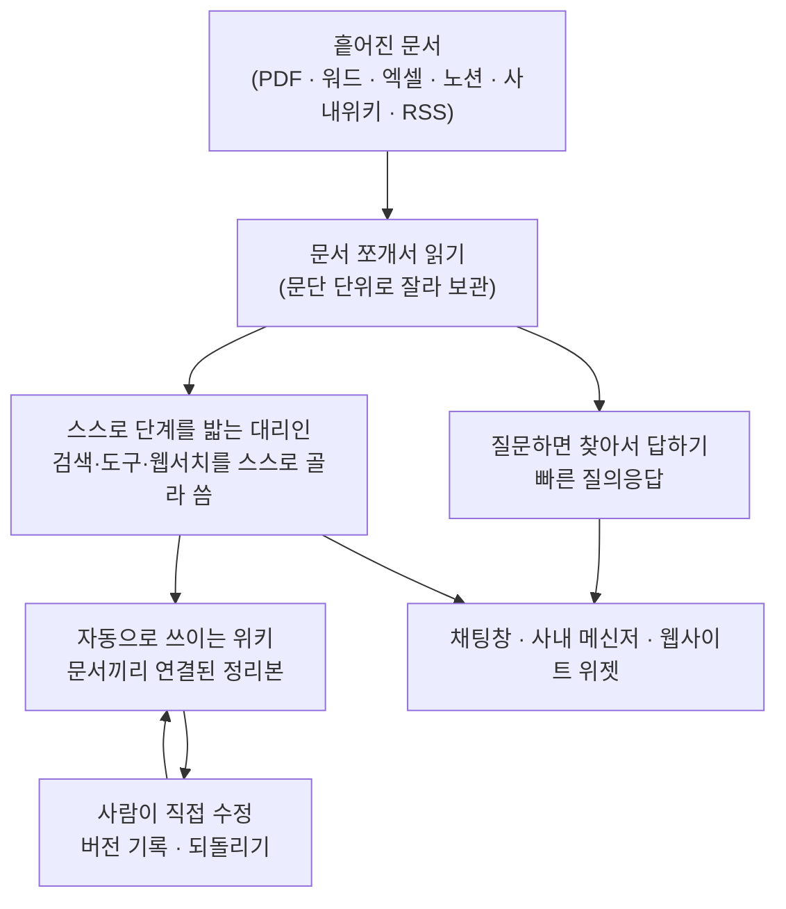

<article class="ai-knowledge-article">

<header class="ai-post-hero">
  
<a class="ai-back" href="../">이번 호</a> · 2026-09-21 · 학습 브리프

  <h2 class="ai-post-title">Tencent/WeKnora — 원문 문서를 질의 가능한 RAG·자율 추론 에이전트·자가 유지 Wiki로 한꺼번에 묶은 오픈 지식 플랫폼 (주간 4,867 stars)</h2>
</header>

> 원문: [Tencent/WeKnora — 원문 문서를 질의 가능한 RAG·자율 추론 에이전트·자가 유지 Wiki로 한꺼번에 묶은 오픈 지식 플랫폼 (주간 4,867 stars)](https://github.com/Tencent/WeKnora)

## 📌 학습 정리

### 1. 한 줄로 말하면

회사 안에 흩어져 있는 문서 더미를 한곳에 모아서, 질문하면 답해주고 스스로 정리해서 위키까지 만들어주는 문서 창고 소프트웨어예요. 텐센트가 공개했고, 내 서버에 직접 설치해서 쓸 수 있습니다.

### 2. 왜 이게 만들어졌어요?

원래 회사 문서는 여기저기 흩어져 있습니다. 어떤 건 노션에, 어떤 건 사내 위키에, 어떤 건 그냥 누군가의 드라이브에 PDF로요. 사람이 필요한 내용을 찾으려면 "그게 어디 있더라"부터 시작해야 하고, 찾아도 내용이 낡았는지 확인할 방법이 없죠. 최근에는 문서를 검색 가능하게 만들어 챗봇처럼 물어보는 방식(문서를 찾아와 답변에 활용하는 방식, RAG)이 유행했는데, 그건 "찾아서 답한다"까지만 해결합니다. WeKnora는 거기서 한 발 더 나가서, 넣어둔 문서를 정리해 위키 문서로 다시 써주고 그 위키가 스스로 갱신되게 하는 단계까지를 하나의 흐름으로 묶었습니다.

### 3. 비유로 풀면

이건 마치 **자료실 사서가 한 명 상주하는 도서관** 같은 거예요. 물어보면 책 위치만 알려주는 게 아니라, 여러 권을 직접 읽고 요약해서 답을 주고, 자주 묻는 주제는 아예 안내문으로 만들어 벽에 붙여둡니다. 새 책이 들어오면 그 안내문도 알아서 고쳐 쓰고요.

또 하나는 **회의록을 정리하는 신입 사원**에 가깝습니다. 처음엔 받아 적기만 하지만, 나중엔 "이 주제는 지난달 문서랑 연결되네요"라며 링크를 걸어주죠.

그래서 결국, 문서를 넣어두는 창고가 아니라 넣어둔 문서가 계속 다듬어지는 작업대에 가깝습니다.

### 4. 어떻게 작동하는지 (그림으로)

왼쪽에서 문서가 들어오면 먼저 잘게 쪼개서 보관합니다. 간단한 질문은 그중 관련 조각을 찾아 바로 답하고, 복잡한 요청은 스스로 여러 단계를 밟는 쪽으로 넘어가요. 그 과정에서 정리된 내용이 위키 페이지로 쌓이고, 사람이 손으로 고칠 수도 있으며 마음에 안 들면 예전 버전으로 되돌릴 수 있습니다.

### 5. 처음 보는 용어 풀이

- **찾아서 답하기 방식 (RAG, Retrieval-Augmented Generation)** — 인공지능이 아는 척으로 답하는 대신, 먼저 내 문서에서 관련 대목을 찾아온 다음 그걸 근거로 답을 만드는 방식이에요. 답변에 출처가 붙는 이유가 이것 때문입니다.
- **스스로 단계를 밟는 대리인 (ReAct Agent)** — "생각하고 → 행동하고 → 결과 보고 다시 생각하기"를 반복하는 방식입니다. 한 번에 답이 안 나오는 질문일 때 검색을 몇 번 더 돌리거나 다른 도구를 꺼내 쓰도록 하려고 씁니다.
- **문서 조각 (chunk)** — 긴 문서를 통째로 다루면 찾기가 어려워서 문단 단위로 잘라둔 것을 말해요. WeKnora는 이 조각을 화면에서 직접 고치고, 고친 이력을 남기고, 되돌릴 수도 있게 해뒀습니다.
- **외부 도구 연결 규약 (MCP, Model Context Protocol)** — 인공지능이 바깥 프로그램을 불러 쓸 때 쓰는 공통 약속이에요. 이게 있으면 도구마다 따로 연결 코드를 짜지 않아도 됩니다.
- **격리된 실행 공간 (sandbox)** — 인공지능이 코드를 돌리거나 파일을 만들 때, 본체 서버를 건드리지 못하도록 따로 떼어둔 작은 방입니다. 사고가 나도 그 방 안에서만 나도록 하려는 장치예요.
- **역할별 권한 관리 (RBAC, Role-Based Access Control)** — 사람마다 권한을 일일이 주는 대신 역할을 정해두고 그 역할에 권한을 붙이는 방식입니다. 여기선 소유자·관리자·기여자·열람자 네 단계로 나뉘고, 누가 뭘 했는지 기록도 남습니다.
- **동작 들여다보기 (observability, Langfuse)** — 인공지능이 어떤 순서로 생각했고 토큰을 얼마나 썼는지 추적해 보는 기능이에요. 답이 이상하게 나왔을 때 어디서 꼬였는지 되짚어보려고 붙입니다.
- **벡터 데이터베이스 (vector DB)** — 문장을 숫자 좌표로 바꿔 저장해두고 "의미가 비슷한 것"을 빠르게 찾아주는 저장소입니다. 단어가 정확히 일치하지 않아도 비슷한 내용을 건져 올릴 수 있어요.

### 6. 한 발 더 들어가고 싶다면

- [Tencent/WeKnora 저장소](https://github.com/Tencent/WeKnora) — 설치 방법과 전체 기능 목록을 볼 수 있어요. 도커 설치 명령 몇 줄로 시작하는 구조입니다.
- [WeKnora Chrome 확장](https://github.com/Tencent/WeKnora) 관련 안내 — 브라우저에서 보던 웹페이지를 곧장 지식창고에 담는 방식이 어떤 건지 감이 잡혀요.
- 원문의 개발자 가이드 섹션 — 도커 이미지를 매번 새로 만들지 않고 빠르게 고쳐가며 개발하는 방법(`make dev-start` 계열)을 알 수 있어요.
- 원문의 보안 안내 섹션 — 이런 문서 창고를 외부에 열어두면 왜 위험한지, 왜 사내망에 두라고 권하는지가 짧게 정리돼 있습니다.

---

## 📖 원문 전체 번역 (정독용)

> 의역 최소화한 전체 번역입니다. 큰 흐름은 위 정리에서 잡고, 정확한 워딩이 필요할 땐 이 섹션에서 정독하세요.

|
English
|
简体中文
|
日本語
|
한국어
|
개요
•
아키텍처
•
주요 기능
•
시작하기
•
API 레퍼런스
•
개발자 가이드
💡 WeKnora — RAG, 에이전트, 오토위키로 문서를 살아있는 지식으로 바꾸다
📌 개요
WeKnora
는 엔터프라이즈급 문서 이해, 시맨틱 검색, 자율 추론을 위해 구축된 오픈소스 LLM 기반 지식 프레임워크다.
weknora-narrated.mp4
2:25 · 1080p · 영어 내레이션 및 자막.
이 프레임워크는 세 가지 핵심 역량을 중심으로 구성된다:
일상적인 조회를 위한
RAG 기반 빠른 질의응답(Quick Q&A)
, 검색·MCP 도구·
테넌트 스킬 카탈로그
·세션 지속형
Docker / E2B / Cube 샌드박스
·웹 검색을 자율적으로 오케스트레이션해 복잡한 다단계 작업을 처리하는
ReAct 에이전트
, 그리고 에이전트가 원문 문서를 대화형 지식 그래프가 딸린 자가 유지형 상호 연결 마크다운 지식 베이스로 정제해내는 완전히 새로운
Wiki 모드
(수동 편집, 리비전 히스토리, 원클릭 롤백 포함)다.
세션을 넘나드는 장기 기억(Cross-session long-term memory)
은 사용자가 누구이며 무엇을 반복해서 묻는지를 기억한다. 지식 관리 또한 손이 많이 가는 부분까지 세심하다: 업로드의 디렉토리 레이아웃을 보존하는
트리 구조 폴더 뷰
, 그리고 검색용 청크(chunk)를 문서처럼 편집·비교(diff)·되돌리기 할 수 있게 하는
리비전 히스토리 딸린 청크 편집
이 그것이다. 여기에 다중 소스 수집(Feishu wiki / Feishu Drive / GitLab / Tencent IMA / Notion / Yuque / DingTalk Docs / RSS, 계속 추가 중), 외부 사이트에 에이전트를 게시하기 위한
웹사이트 임베드 위젯
, 프로그래밍 방식 통합을 위한
프린시펄 모델 기반 스코프 지정 API 키
, 워크스페이스별 유연한 데이터 배치를 위한
워크스페이스당 다중 인스턴스 스토리지 백엔드
, 20개 이상의 LLM 제공자 연동(LiteLLM 포함), 완전한 Langfuse 관측성(observability) 및
워커 풀 거버넌스가 딸린 런타임 작업 큐 대시보드
, 4단계 역할 매트릭스 + 리소스별 소유권 + 워크스페이스별 감사 로그로 구성된
엔터프라이즈급 다중 워크스페이스 RBAC
, 그리고 완전히 셀프 호스팅 가능한 모듈형 아키텍처가 결합되어, WeKnora는 흩어진 문서들을 질의 가능하고 추론 가능하며 지속적으로 진화하는 지식 자산으로 바꾼다.
이 프레임워크는 Feishu, GitLab, Tencent IMA, Notion, Yuque로부터의 지식 자동 동기화를 지원하며(더 많은 데이터 소스가 곧 추가될 예정), PDF, Word, 이미지, Excel, XMind를 포함한 10개 이상의 문서 형식을 처리하고, WeCom, Feishu, Slack, Telegram 같은 IM 채널을 통해 직접 질의응답 서비스를 제공할 수 있다. OpenAI, DeepSeek, Qwen(알리바바 클라우드), Zhipu, Hunyuan, Gemini, MiniMax, NVIDIA, LiteLLM, Ollama를 포함한 주요 LLM 제공자와 호환된다. 오피스 파일은
anydoc
을 통해 프로세스 내에서 파싱할 수 있다. 완전히 모듈화된 설계 덕분에 LLM, 벡터 데이터베이스, 스토리지 백엔드를 교체할 수 있으며, 로컬 및 프라이빗 클라우드 배포를 지원하여 완전한 데이터 주권을 보장한다. WeKnora는 또한 에이전트 추론, 토큰 사용량, 파이프라인 트레이싱에 대한 포괄적인 관측성을 위해
Langfuse
와 통합된다.
✨ 최신 업데이트
v0.8.0
—
스킬 샌드박스 런타임
(테넌트별 네트워크 정책을 갖춘 세션 지속형 Docker / E2B / Cube 백엔드; 로컬 호스트 프로세스 백엔드 제거; Docker는 옵트인);
테넌트 스킬 카탈로그
(ClawHub / SkillHub / git / zip에서 설치, 샌드박스별 스냅샷, 실시간 진행 표시, 파일 탐색/편집, 개인 및 워크스페이스 환경변수);
세션을 넘나드는 장기 기억
(프로필 / 선호도 / 사실 / 작업 / 관심사, 확인 절차가 딸린 자동 추출,
search_memory
); 프로세스 내
anydoc
오피스 파서; 공식
DeepSeek Harness 플러그인
@wxg-prc-cpg/dsh-weknora
; GitLab 및 Tencent IMA 데이터 소스; LiteLLM; Exa 및 Metaso 웹 검색; XMind 파싱; 채팅 아티팩트, 질문 개요 및 타임스탬프; 컨텍스트 압축 및 제공자 프롬프트 캐시 마커. 그 외 OIDC JWKS 검증, 선택적 복잡 비밀번호, 문서 자동 태깅, 광범위한 샌드박스/보안 강화. 자세한 내용은
CHANGELOG.md
참조.
v0.7.2
— 공식
제품 문서 사이트
출시(VitePress; 약 360개 API 엔드포인트와 약 150개 환경변수를 다루는 6개 섹션, 약 50페이지, 독립형 Docker/Nginx 배포, 퀵스타트 샘플 데이터, 로컬 MCP 데모 포함);
지식 베이스 폴더 트리
(업로드 경로를 일급 데이터로 저장, 파일 매니저처럼 문서를 탐색/이름 변경/재분류);
리비전 히스토리 딸린 청크 편집
(UI에서 검색 청크 편집, 버전별 diff와 롤백, 자동 재인덱싱, 커스텀 문서 메타데이터 추가);
Wiki 페이지 리비전 히스토리
(스냅샷 + 라인 단위 diff + 원클릭 롤백 + 브라우저 내 수동 편집);
resource_urls=public
/
RESOURCE_URL_MODE
를 통한
직접 로드 가능한 파일 URL
(서드파티 앱이 두 번째 인증 프록시 호출 없이 이미지·파일을 렌더링);
Feishu Drive 데이터 소스
및 blocks API를 통한 docx 동기화; 일괄 문서 태깅;
MCP Server 1.1.x
(mcp 2.x 상위 레벨 API로 마이그레이션, 공식 PyPI 패키지
tencent-weknora-mcp
, 신규
create_knowledge_from_text
및
list_shared_knowledge_bases
추가로 총 29개 도구); AWS S3 기본 자격 증명 체인(IAM Role / IRSA); 로컬 HTML 업로드 파싱; QQBot 마크다운 답장; app / frontend / docreader / mcp-server용 신규 PR CI 체크. 그 외 대규모 라우터 및
modelcontext
리팩터링, 리랭크 및 청킹 품질 개선, 광범위한 안정성 수정. 자세한 내용은
CHANGELOG.md
참조.
v0.7.1
— 신규
Yunzhijia(云之家) IM 연동
(WebSocket + 이미지 메시지 + 마크다운 답장);
Volcengine 리랭크
제공자(요청 배치 처리 포함) 및
Zhipu AI 웹 검색
제공자;
컨트롤 플레인 자동화(테넌트 관리, 시스템 설정, 런타임 큐, 감사 로그)를 위한 플랫폼 범위 API 키
;
KB별 활동 감사 추적
; FAQ 관리 기능 강화(필터링, 태깅, 내보내기, 가져오기 추적);
Langfuse OTLP/OTel 트레이싱
으로의 마이그레이션(W3C traceparent 전파 포함); 원클릭
마크다운 내보내기
가 딸린 채팅 헤더 액션 및 참조 드로어 내 wiki 도구 결과; 프롬프트 캐시 관측성; 세션 채널 거버넌스(관리자 범위 IM/임베드/API 세션); 견고한 Feishu 대용량 wiki 동기화; 레거시 Neo4j 대화 메모리 의존성 제거. 그 외 광범위한 슬러그 무결성, SSRF 전송, 상태 동기화 강화. 자세한 내용은
CHANGELOG.md
참조.
v0.7.0
— 세밀한
스코프 지정 API 키 & 프린시펄 모델
(역량 단위 부여 + KB별 제한 + API 연동 플레이그라운드);
런타임 작업 큐 관측성 대시보드 & 워커 풀 거버넌스
(단계별 풀 + 모델별 동시성 거버너 + 실패 작업 조회/재시도);
다중 인스턴스 스토리지 백엔드
(워크스페이스당 다중 스토리지 인스턴스, KB별 바인딩, 기본 인스턴스);
세션 범위 임시 첨부파일
(비동기 이미지/문서 파싱 + 통합 제한); 질문 및 후속 질문 제안; LLM 컨텍스트 별칭 압축을 갖춘 안정적 리소스 레지스트리;
@Skill / @MCP
멘션과 범위 지정 에이전트 런타임; 대화 중간 MCP OAuth; QQBot 및 Lark(Feishu 국제판) IM 연동; Redis TLS; Requesty 모델 제공자 + Keenable 웹 검색; 테넌트 없는 프로비저닝 및 게이트형 셀프서비스 워크스페이스; 관리자 비밀번호 재설정; 지식 베이스 복제 흐름;
weknora
CLI v0.10. 그 외 광범위한 보안 강화(SSRF, 비밀정보 마스킹, SQL 검증, IDOR). 자세한 내용은
CHANGELOG.md
참조.
v0.6.3
— 웹사이트 임베드 위젯 및 연동 센터(보안 모드 토큰 교환 + 요청 제한); 채팅 경험 전면 개편(인용 팝오버, RAG 파이프라인 진행 표시, 스트리밍 마크다운); 문서 다중 태그 & 일괄 재파싱; Wiki 폴더 및 계층 탐색; RSS 데이터 소스; MCP OAuth2; EPUB / MHTML 파싱; 에이전트 모델 준비상태 점검; 모델 테스트 디버거; 세션 소스 필터; 워크스페이스 삭제 UI. 자세한 내용은
CHANGELOG.md
참조.
v0.6.2
— 업로드 확인 대화상자를 통한 업로드별 처리 설정; 문서 재파싱 시
process_config
적용;
weknora
CLI v0.9(번들 Agent Skills,
세션 중지
, 인증/프로필 정합화); KB 마퀴 다중 선택; 1024차원 pgvector 임베딩용 HNSW 인덱스; 채팅 리소스 스토어 리팩터링; Langfuse 전용 트레이싱(Jaeger 제거). 자세한 내용은
CHANGELOG.md
참조.
v0.6.1
— 문서 파싱 트레이스 타임라인(단계별 진행 상황 + 파싱 중지를 갖춘 Langfuse 스타일 스팬 트리); OpenSearch 벡터 스토어 드라이버; YAML을 통한 선언적 내장 모델; 시스템 관리자 및 통합 플랫폼 설정 + 감사 로그; 신규 사용자 온보딩 가이드; 설정 UI 재설계;
weknora
CLI v0.7 / v0.8(에이전트 우선 통신 규약, NDJSON,
--dry-run
); OpenDataLoader + PaddleOCR-VL 파서; MCP 서버 다중 전송(stdio / SSE / HTTP); 모델별 사고 모드(thinking-mode) 설정; Tencent LKEAP 리랭크 + 네이티브 Gemini 임베딩 + MiniMax-M3. 자세한 내용은
CHANGELOG.md
참조.
v0.6.0
— 워크스페이스 RBAC(4단계 역할 매트릭스
Owner
/
Admin
/
Contributor
/
Viewer
+ KB별 소유권 + 워크스페이스별 감사 로그), 워크스페이스 멤버 관리 & 다중 워크스페이스 UX, 셀프서비스 워크스페이스;
weknora
CLI v0.4 정식 출시(
mcp serve
포함); 벡터 스토어 전반의 KB 검색 팬아웃; AES-256-GCM 자격 증명 암호화 + docreader gRPC TLS + 토큰; Zhipu 임베더 + Huawei OBS; 서버 측 사용자 환경설정; Go 1.26.0. 자세한 내용은
docs/RBAC说明.md
및
CHANGELOG.md
참조.
v0.5.2
— Wiki 수집이 4만 문서 규모 KB까지 확장(작업 큐 + DLQ); MCP 사람 개입(human-in-the-loop) 도구 승인; Anthropic / Apache Doris / Tencent VectorDB / KS3 / SearXNG 백엔드; 실시간 미리보기가 딸린 적응형 3단계 청킹; 전역 ⌘K 커맨드 팔레트; Yuque 커넥터 + 위챗 미니 프로그램;
weknora
CLI 프리뷰.
v0.5.1
— 지식 베이스 일괄 관리; 워크스페이스 전체 IM 채널 개요; 세션 검색 + 사용자 범위 고정(pinning); 통합 모델 / 웹 검색 / MCP 설정 카드; 에이전트별 LLM 타임아웃; 데스크톱 워크스페이스 전환.
v0.5.0
— Wiki 모드 정식 출시(GA) — 에이전트가 지식 그래프를 갖춘 구조화된 상호 연결 마크다운 wiki 페이지를 자동 생성; UI 내 wiki 브라우저 + 시각적 그래프.
v0.4.0
— WeKnora Cloud(호스팅 LLM + 파싱); 크롬 확장 프로그램; ClawHub 스킬; 위챗 IM; 첨부파일 처리; Azure OpenAI / 알리바바 OSS; Notion 커넥터; 바이두 + Ollama 웹 검색; VectorStore 관리.
v0.3.6
— ASR(오디오); Feishu 데이터 소스 자동 동기화; OIDC; IM 인용 답장 컨텍스트 + 스레드 기반 세션; 문서 요약; Tavily 검색; 병렬 도구 호출; 에이전트 @멘션 범위 제한.
v0.3.5
— Telegram / DingTalk / Mattermost IM; IM 슬래시 명령 + QA 큐; 추천 질문; MCP 도구 이미지 VLM 자동 설명; Novita AI; 채널 추적.
v0.3.4
— WeCom / Feishu / Slack IM; 멀티모달 이미지 지원; NVIDIA 모델 API; Weaviate; AWS S3; AES-256-GCM API 키 암호화; 내장 MCP 서비스; 하이브리드 검색 최적화;
final_answer
도구.
v0.3.3
— 부모-자식 청킹; KB 고정(pinning); 폴백 응답; 리랭크용 구절 정제; 스토리지 자동 생성; Milvus.
v0.3.2
— Knowledge Search 진입점; 소스별 파서 & 스토리지 엔진 설정; 로컬 스토리지 내 이미지 렌더링; 문서 미리보기; Volcengine TOS; Mermaid 렌더링; 일괄 세션 관리; 메모리 그래프 미리보기.
v0.3.0
— 공유 공간(Shared Space); Agent Skills + 샌드박스 실행; 커스텀 에이전트; 데이터 분석가 에이전트; 사고 모드(thinking mode); Bing / Google 웹 검색; API 키 인증; Helm 차트; 한국어 i18n; Qdrant.
v0.2.0
— 에이전트 모드(ReACT); 다중 유형 지식 베이스(FAQ + 문서); 대화 전략 설정; DuckDuckGo 웹 검색; MCP 도구 연동; 에이전트 모드 전환 기능이 딸린 신규 UI; MQ 비동기 작업 관리.
📱 인터페이스 쇼케이스
🛠️ 스킬 샌드박스 채팅 · Word 파일 생성 및 미리보기
📦 스킬 카탈로그 · E2B 샌드박스에 설치
🤖 에이전트 모드 · 검색, 스킬 읽기, 샌드박스 파일 작성
💬 지능형 질의응답 대화
📖 Wiki 브라우저
🕸️ Wiki 지식 그래프
🕘 Wiki 페이지 리비전 히스토리 & 롤백
✂️ 청크 편집 & 리비전 히스토리
📁 폴더 트리 & 일괄 작업
🔭 관측성 · Langfuse 트레이싱
🏗️ 아키텍처
문서 파싱, 벡터화, 검색부터 LLM 추론까지 완전히 모듈화된 파이프라인 — 모든 컴포넌트를 교체하고 확장할 수 있다. 완전한 데이터 주권을 보장하는 로컬/프라이빗 클라우드 배포와, 빠른 온보딩을 위한 무진입장벽 웹 UI를 지원한다.
🧩 기능 개요
지능형 대화
역량
상세
지능형 추론
지식 검색, MCP 도구, 스킬 샌드박스, 웹 검색을 자율적으로 오케스트레이션하는 ReACT 점진적 다단계 추론
빠른 질의응답
빠르고 정확한 답변을 위한 지식 베이스 기반 RAG 질의응답
Wiki 모드
원문 문서로부터 에이전트가 주도하여 구조화된 상호 연결 마크다운 Wiki 페이지를 자동 생성; 브라우저 내 수동 편집, 페이지 리비전 히스토리, 라인 단위 diff 및 원클릭 롤백
스킬 카탈로그 & 샌드박스
세션 지속형 Docker / E2B / Cube 샌드박스에 설치되는 워크스페이스 스킬 카탈로그(ClawHub / SkillHub / git / zip);
shell_exec
, 파일 도구, 아티팩트, 설정별 네트워크 정책; 로컬 호스트 프로세스 백엔드 제거
장기 기억
자동 추출, 사용자 확인, 온디맨드
search_memory
를 갖춘 세션을 넘나드는 기억(프로필 / 선호도 / 사실 / 작업 / 관심사)
도구 호출
내장 도구, MCP 도구(OAuth2 원격 서비스, 대화 중간 OAuth 포함), 웹 검색; 턴별로 에이전트 런타임 범위를 지정하는
@Skill / @MCP
멘션
대화 전략
온라인 프롬프트 편집, 검색 임계값 조정, 다중 턴 컨텍스트 인식, 에이전트별 인용 출력 토글
추천 질문
지식 베이스 콘텐츠 기반 자동 생성 질문 제안 및 답변 후 후속 질문
임시 첨부파일
일회성 질의응답을 위한 세션 범위 이미지/문서 업로드와 비동기 파싱, 이미지 + 첨부파일 통합 제한
인용 & RAG 진행 상황
인라인 인용 팝오버 및 참조 드로어(웹/KB 소스 구분), 공유 마크다운 렌더링, 채팅 내 단계별 RAG 파이프라인 진행 상황 표시
세션 관리
소스(웹/IM/임베드)별 사이드바 세션 필터링 및 그룹화, 인라인 세션 제목 변경
지식 관리
역량
상세
지식 베이스 유형
폴더 가져오기, URL 가져오기, 다중 태그 관리, 온라인 등록을 지원하는 FAQ / 문서 / Wiki
폴더 트리
폴더 업로드 시 원본 디렉토리 구조 유지, 사이드바 트리를 통한 탐색, 폴더 이름 변경, 다른 폴더로 문서 재분류
청크 편집 & 리비전
UI에서 검색 청크를 직접 편집, 버전별 스냅샷·diff·원클릭 롤백, 편집 후 자동 재인덱싱; 생성된 질문을 추가·편집·삭제·재생성 가능; 커스텀 문서 메타데이터 지원
업로드별 처리 설정
업로드 확인 대화상자 또는
process_config
API를 통해 업로드 배치별로 파서, 청킹, 멀티모달(VLM / ASR), 그래프 추출, 질문 생성을 오버라이드; 새 설정으로 재파싱
일괄 재파싱
선택적 배치별
process_config
과 함께 여러 문서의 파싱을 한 번에 재큐잉
데이터 소스 가져오기
Feishu wiki / Feishu Drive / Lark / GitLab / Tencent IMA / Notion / Yuque / DingTalk Docs / RSS 피드로부터 자동 동기화(더 많은 데이터 소스 추가 예정); 증분 및 전체 동기화
문서 형식
PDF / Word / Txt / Markdown / HTML / EPUB / MHTML / 이미지 / CSV / Excel / PPT / JSON / XMind
자동 태깅
파싱 후, 태그를 새로 만들거나 수동 태그를 덮어쓰지 않고 지식 베이스의 기존 태그 집합에서 일치하는 태그를 선택
검색 전략
BM25 희소 검색 / 밀집 검색(Dense retrieval) / GraphRAG / 부모-자식 청킹 / HNSW 가속 pgvector(1024차원) / 다차원 인덱싱
일괄 선택 & 태깅
KB 목록에서 마퀴 드래그로 여러 문서를 선택해 일괄 재파싱 및 일괄 태깅(공통 태그 사전 선택)
E2E 테스트
회수 적중률(recall hit rate), BLEU / ROUGE 지표 평가를 포함한 전체 파이프라인 시각화
연동 & 확장
역량
상세
LLM
OpenAI / Azure OpenAI / Anthropic(Claude) / DeepSeek / Qwen(알리바바 클라우드) / Zhipu / Hunyuan / Doubao(Volcengine) / Gemini / MiniMax / NVIDIA / Novita AI / SiliconFlow / OpenRouter / Requesty / LiteLLM / Ollama
임베딩
Ollama / BGE / GTE / Zhipu / OpenAI 호환 API
벡터 DB
PostgreSQL(pgvector) / Elasticsearch / OpenSearch / Milvus / Weaviate / Qdrant / Apache Doris / Tencent VectorDB
오브젝트 스토리지
로컬 / MinIO / AWS S3(IAM Role / IRSA 기본 자격 증명 체인) / Volcengine TOS / 알리바바 클라우드 OSS / Kingsoft Cloud KS3 / Huawei Cloud OBS;
KB별 바인딩과 기본 인스턴스를 갖춘 워크스페이스당 다중 스토리지 인스턴스
IM 채널
WeCom / Feishu / Lark(Feishu 국제판) / QQBot / Slack / Telegram / DingTalk / Mattermost / 위챗 / Yunzhijia
웹사이트 임베드
도메인 화이트리스트, 요청 제한, 보안 모드 토큰 교환을 갖춘 임베드 위젯을 통한 에이전트 게시
웹 검색
DuckDuckGo / Bing / Google / Tavily / 바이두 / Ollama / SearXNG / Keenable / Zhipu AI / Exa / Metaso
API 연동
API 연동 플레이그라운드를 갖춘 스코프 지정 API 키(역량 단위 부여 + KB별 제한 + 스로틀된 마지막 사용 추적); 프린시펄별로 격리된 MCP OAuth 및 임베드 세션;
resource_urls=public
은 두 번째 인증 프록시 호출을 없애는 직접 로드 가능한 파일/이미지 URL 반환
MCP 서버
stdio / SSE / HTTP 전송을 통한 29개 도구를 갖춘 공식 PyPI 패키지
tencent-weknora-mcp
플랫폼
역량
상세
배포
프라이빗 및 오프라인 지원을 갖춘 로컬 / Docker / Kubernetes(Helm)
UI
웹 UI / RESTful API / CLI(
weknora
) / 크롬 확장 프로그램 / 웹사이트 임베드 위젯 / 위챗 미니 프로그램
접근 제어
4단계 역할 매트릭스(Owner / Admin / Contributor / Viewer)를 갖춘 워크스페이스 RBAC, KB별 리소스 소유권, 워크스페이스별 감사 로그, 초대 전용 워크스페이스, 테넌트 없는 프로비저닝 & 게이트형 셀프서비스 워크스페이스 생성, 관리자 비밀번호 재설정(세션 무효화), 워크스페이스 간 슈퍼유저, 스코프 지정 API 키
보안
우아한 키 로테이션을 갖춘 API 키 및 MCP/데이터 소스 자격 증명의 저장 시 AES-256-GCM 암호화; app과 docreader 간 gRPC TLS + 토큰; Redis TLS; SSRF 안전 HTTP 클라이언트(데이터 소스, URL 가져오기, 리다이렉트 체인); 응답 내 비밀정보 마스킹; 설정별 네트워크 정책을 갖춘 스킬 샌드박스 격리(Docker 옵트인 / E2B / Cube); OIDC ID 토큰 JWKS 검증; 선택적 복잡 비밀번호 정책
관측성
ReAct 루프, 토큰 추적, 도구 호출, 파이프라인 트레이싱을 위해 통합된 Langfuse(단일 트레이싱 백엔드); 단계별 진행 상황을 갖춘 내장 Langfuse 스타일 문서 파싱 트레이스 타임라인; 시스템 관리자용 런타임 작업 큐 대시보드(큐 깊이, 모델별 동시성, 실패 작업 조회 & 수동 재시도)
작업 관리
단계별 워커 풀 거버넌스(코어 / 후처리 / 보강 / 유지보수 + 탄력적 공유 풀, 그리고 독립된 Wiki 풀)와 모델별 백그라운드 동시성 거버너를 갖춘 MQ 비동기 작업; 버전 업그레이드 시 자동 데이터베이스 마이그레이션
모델 관리
중앙 집중식 설정, YAML을 통한 선언적 내장 모델, 지식 베이스별 모델 선택, 모델별 사고 모드 및 임베딩 차원 오버라이드, 대화형 모델 테스트 디버거, 다중 워크스페이스 내장 모델 공유, WeKnora Cloud 호스팅 모델 및 파싱
🧩 크롬 확장 프로그램
WeKnora 크롬 확장 프로그램
을 사용하면 웹 콘텐츠를 WeKnora 지식 베이스로 바로 캡처할 수 있다. 브라우저에서 텍스트, 이미지, 또는 전체 페이지를 선택해 원클릭으로 지식 항목으로 저장한다 — 복사·붙여넣기나 파일 업로드가 필요 없다.
📱 위챗 미니 프로그램
WeKnora 미니 프로그램
은 WeKnora API 접근 설정, 지식 베이스 선택, URL 가져오기, 위챗에서의 지식 채팅 질의를 위한 경량 모바일 클라이언트를 제공한다.
🦞 ClawHub 스킬
WeKnora ClawHub 스킬
은 ClawHub 플랫폼에 게시된 WeKnora 스킬이다. 설치하면 문서 가져오기(파일 / URL / 마크다운), 지식 베이스 전반의 하이브리드 검색(벡터 + 키워드), 지식 항목 관리를 모두 WeKnora REST API를 통해 사용할 수 있다.
문서 가져오기
— 에이전트를 통해 파일 업로드, 웹페이지 가져오기, 또는 마크다운 지식 작성
하이브리드 검색
— 벡터 + 키워드 검색으로 하나 또는 여러 지식 베이스 내 검색
지식 관리
— 지식 항목을 프로그래밍 방식으로 목록화, 열람, 편집, 삭제
🐋 DeepSeek Harness 플러그인
@wxg-prc-cpg/dsh-weknora
는 공식
DeepSeek Harness
(
dsh
) 플러그인이다(
문서
). 이 하니스 자체는 검색·임베딩·지식 베이스 역량을 전혀 갖고 있지 않기 때문에, 이 플러그인은 코딩 에이전트에게 사용자의 문서를 제공한다:
dsh plugin --profile web add @wxg-prc-cpg/dsh-weknora
로 설치한 뒤 배포 대상을 지정하면 에이전트의 도구 세트에 4개의 읽기 전용 도구가 나타난다.
weknora_search
— 재사용 가능한
knowledge_id
가 각각 딸린, 원문 그대로의 소스 구절을 반환하는 하이브리드 검색
weknora_read_document
— 순서대로 재조합된 한 문서의 구절들을 페이징하여 제공
weknora_ask
— RAG 또는 ReAct 파이프라인을 통한, 인용이 포함된 WeKnora 자체 구성 답변
weknora_list_knowledge_bases
— 지식 베이스 이름과 id, 에이전트가 자신의 검색 범위를 지정할 수 있도록 함
⌨️ 명령줄 인터페이스
weknora
는 터미널이나 AI 에이전트에서 API를 구동하기 위한 공식 CLI다. 이것은
에이전트 우선
설계다: 모든 명령은 기본적으로 (종료 코드에 매핑된 타입 지정 오류 코드와 함께) 안정적인 JSON 봉투를 출력하며,
--format text
는 사람을 위한 렌더링을 제공한다. 또한 엄선된 MCP 도구 표면(
weknora mcp serve
)을 제공하며 번들 Agent Skills를 함께 배포한다.
weknora profile add prod --host https://kb.example.com --use
weknora auth login
weknora kb list
weknora link --kb my-knowledge-base
#
현재 디렉토리를 바인딩
weknora doc upload notes.md
weknora chat
"
설계 문서를 요약해줘
"
헤드리스 / CI 사용을 위해서는
WEKNORA_API_KEY
+
WEKNORA_HOST
를 설정하고
auth login
자체를 건너뛰면 된다 — 디스크에 자격 증명이 기록되지 않는다.
설치 + 5분 퀵스타트는
cli/README.md
, AI 에이전트가 의존하는 운영 계약은
cli/AGENTS.md
참조.
🚀 시작하기
🛠 사전 요구사항
Docker
&
Docker Compose
Git
📦 설치 및 실행
git clone https://github.com/Tencent/WeKnora.git
cd
WeKnora
cp .env.example .env
#
필요에 따라 .env 편집, 파일 내 주석 참조
docker compose pull
#
최신 이미지 가져오기
docker compose up -d
#
핵심 서비스 시작
시작되면
http://localhost
에 접속하여 시작할 수 있다.
로컬 Ollama 모델을 사용하려면 먼저
ollama serve > /dev/null 2>&1 &
를 실행한다.
🔄 업그레이드
이미 WeKnora를 실행 중이고 새 릴리스를 다운로드한 경우:
#
.env 의 WEKNORA_VERSION 을 대상 릴리스(예: 0.7.0)로 설정하거나 latest 유지
docker compose pull
#
WEKNORA_VERSION 과 일치하는 이미지 가져오기
docker compose up -d
#
새 이미지로 컨테이너 재생성
docker compose up -d
단독 실행은 로컬에 캐시된 이미지를 재사용하며, UI 버전이 다운로드한 릴리스와 어긋날 수 있다.
🔧 선택적 서비스(Docker Compose 프로필)
추가 컴포넌트를 활성화하려면
--profile
플래그를 추가한다. 여러 프로필을 조합할 수 있다:
프로필
설명
명령어
(기본값)
핵심 서비스
docker compose pull && docker compose up -d
full
전체 기능
docker compose --profile full pull && docker compose --profile full up -d
neo4j
지식 그래프(Neo4j)
docker compose --profile neo4j pull && docker compose --profile neo4j up -d
minio
오브젝트 스토리지(MinIO)
docker compose --profile minio pull && docker compose --profile minio up -d
langfuse
트레이싱(Langfuse)
docker compose --profile langfuse pull && docker compose --profile langfuse up -d
프로필 조합:
docker compose --profile neo4j --profile minio pull && docker compose --profile neo4j --profile minio up -d
서비스 중지:
docker compose down
🌐 서비스 URL
서비스
URL
웹 UI
http://localhost
백엔드 API
http://localhost:8080
Langfuse 트레이싱
http://localhost:3000
MCP 서버
필요한 설정은
MCP 설정 가이드
참조.
🔌 위챗 대화 오픈 플랫폼(WeChat Dialog Open Platform) 사용하기
WeKnora는
위챗 대화 오픈 플랫폼
의 핵심 기술 프레임워크 역할을 하며, 더 편리한 사용 방식을 제공한다:
제로 코드 배포
: 지식을 업로드하기만 하면 위챗 생태계 내에 지능형 질의응답 서비스를 빠르게 배포하여 "묻고 답하는" 경험을 구현
효율적인 질문 관리
: 고빈도 질문의 분류 관리를 지원하며, 정확하고 신뢰할 수 있으며 유지보수하기 쉬운 답변을 보장하는 풍부한 데이터 도구 제공
위챗 생태계 통합
: 위챗 대화 오픈 플랫폼을 통해 WeKnora의 지능형 질의응답 역량을 위챗 공식 계정, 미니 프로그램 등 위챗 시나리오에 매끄럽게 통합하여 사용자 상호작용 경험 향상
📘 API 레퍼런스
공식 웹사이트 및 제품 문서
:
website-docs/
에는 제품 홈페이지와, 시작하기 → 아키텍처 → 기능 → API → 클라이언트 → 개발 순으로 구성된 전체 문서 세트가 담겨 있다. Node.js 24 환경에서
cd website-docs && npm run setup && npm run build && npm run preview
를 실행하면 두 가지를 함께 미리 볼 수 있다. 통합된 정적 출력물은
/
에서 홈페이지를, `/docs/`에서 문서를 서비스한다. Nginx 및 Docker 배포는 해당 디렉토리의 README 참조.
문제 해결 FAQ:
문제 해결 FAQ
상세 API 문서는 다음에서 확인 가능:
API 문서
제품 계획 및 예정 기능:
로드맵
🧭 개발자 가이드
⚡ 빠른 개발 모드(권장)
코드를 자주 수정해야 한다면
매번 Docker 이미지를 다시 빌드할 필요가 없다
! 빠른 개발 모드를 사용하라:
#
인프라 시작
make dev-start
#
백엔드 시작(새 터미널)
make dev-app
#
프론트엔드 시작(새 터미널)
make dev-frontend
개발상의 이점:
✅ 프론트엔드 수정 시 자동 핫 리로드(재시작 불필요)
✅ 백엔드 수정 시 빠른 재시작(5~10초, Air 핫 리로드 지원)
✅ Docker 이미지 재빌드 불필요
✅ IDE 브레이크포인트 디버깅 지원
상세 문서:
개발 환경 퀵스타트
🤝 기여하기
Issue
나 Pull Request 제출을 환영한다.
절차:
Fork → 브랜치 생성 → 변경사항 커밋 → PR 열기
표준:
gofmt
로 코드 포맷팅,
Conventional Commits
(
feat:
/
fix:
/
docs:
/
test:
/
refactor:
) 준수
검증
범위가 한정된 PR의 경우 먼저 변경된 범위를 검증하라:
git fetch origin main
git diff --check origin/main...HEAD
golangci-lint run --new-from-rev=origin/main ./...
go
test
./path/to/changed/package -count=1
커밋 전에 변경된 Go 파일에
gofmt
를 실행하라. 프론트엔드 변경의 경우
frontend/
에서 관련 테스트를 실행하고, TypeScript나 Vue 컴포넌트에 영향을 주는 변경이면
npm run type-check
를 사용하라.
전체 메인테이너 게이트는 다음과 같다:
make fmt
make lint
make
test
make fmt
는 Go 레포지토리 전체를 포맷팅하므로, 워크트리가 깨끗한 상태에서만 실행하고 결과 diff를 검토하라. 일부 전체 스위트 테스트는 로컬 인프라나 서비스 설정이 필요하다. 관련 없는 베이스라인이나 환경상의 이유로 전체 체크가 실패하는 경우, 정확한 명령어와 실패 내용을 PR에 포함시키되, 변경사항에 대해 통과하는 타겟 테스트는 반드시 함께 제공하라.
🔒 보안 공지
중요:
v0.1.3부터 WeKnora는 시스템 보안 강화를 위해 로그인 인증 기능을 포함한다. 프로덕션 배포 시 다음을 강력히 권장한다:
공용 인터넷이 아닌 내부/프라이빗 네트워크 환경에 WeKnora 서비스를 배포할 것
잠재적 정보 유출을 방지하기 위해 서비스를 공용 네트워크에 직접 노출하지 말 것
배포 환경에 적절한 방화벽 규칙 및 접근 제어를 구성할 것
보안 패치 및 개선사항을 위해 정기적으로 최신 버전으로 업데이트할 것
👥 기여자
훌륭한 기여자들에게 감사드린다:
📄 라이선스
이 프로젝트는
MIT 라이선스
하에 배포된다.
적절한 출처 표기와 함께 코드를 자유롭게 사용, 수정, 배포할 수 있다.

</article>
