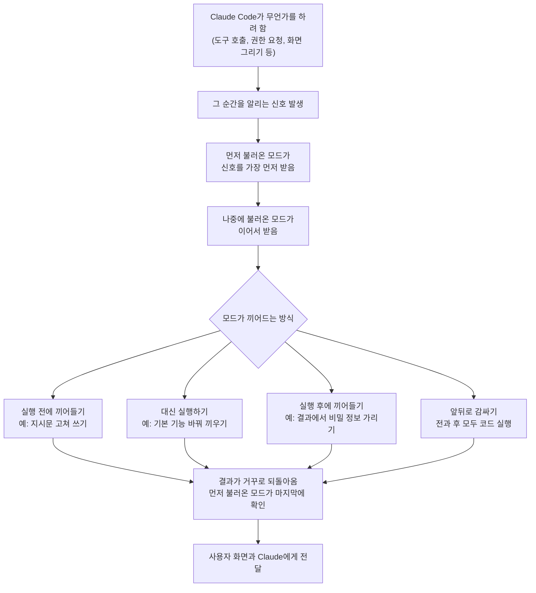

<article class="ai-knowledge-article">

<header class="ai-post-hero">
  
<a class="ai-back" href="../">이번 호</a> · 2026-10-05 · 학습 브리프

  <h2 class="ai-post-title">Customize Claude Code with mods</h2>
</header>

> 원문: [Customize Claude Code with mods](https://claude.com/blog/claude-code-mods)

## 📌 학습 정리

### 1. 한 줄로 말하면

Claude Code가 일하는 방식과 화면 모양을, 짧은 코드 조각을 끼워 넣어 내 입맛대로 바꿀 수 있게 됐다는 소식이에요. 완성품을 받아 쓰기만 하던 도구에 '개조용 부품을 끼우는 자리'가 생긴 셈입니다.

### 2. 왜 이게 만들어졌어요?

원문에 따르면 개발자들은 Anthropic이 새 기능을 내놓을 때까지 기다리지 않고도 Claude Code의 동작을 직접 조정하고 싶다고 요청해 왔다고 해요. 원래는 특정 시점에 내 명령을 끼워 넣는 장치인 [훅(Hooks)](https://code.claude.com/docs/en/hooks)이 이 역할을 일부 해 줬습니다. 그런데 훅으로는 일어나는 일의 내용을 고쳐 쓰거나, 새 화면 요소를 그리거나, 기본 기능을 통째로 바꿔 끼울 수는 없었어요. 그래서 이 세 가지까지 할 수 있는 개조 조각(mod, 이하 '모드')이 등장했습니다. 출시 전에 설계안을 GitHub에 먼저 공개해 개발자 의견을 받았다는 점도 원문에 적혀 있어요.

### 3. 비유로 풀면

이건 마치 게임에 모드를 까는 것과 비슷해요. 게임 본체는 그대로 두고, 작은 파일 하나로 규칙을 바꾸거나 화면에 새 버튼을 띄우거나 기존 기능을 다른 것으로 갈아 끼우는 식입니다.

또 하나는 사무실 우편물 검수대 비유예요. 들어오고 나가는 서류마다 검수 담당자가 줄지어 서 있어서, 서류를 고치거나 반려하거나 민감한 내용을 가릴 수 있습니다. 먼저 자리 잡은 담당자가 서류를 가장 먼저 보고, 처리 결과는 가장 마지막에 확인해요.

그래서 결국, Claude Code 안에서 일어나는 일 하나하나에 내 코드가 끼어들어 "그 전에, 그 후에, 혹은 그 대신" 무언가를 하게 만드는 장치가 모드입니다.

### 4. 어떻게 작동하는지 (그림으로)

Claude Code는 도구를 부르거나 권한을 묻거나 화면 일부를 그릴 때마다 "지금 이런 일이 일어난다"는 신호를 내보내고, 모드는 그 신호에 걸어 두는 함수예요. 같은 신호에 여러 모드가 걸려 있으면 불러온 순서대로 실행됩니다. 가장 먼저 불러온 모드가 신호를 처음 보고 결과는 마지막에 보기 때문에, 서로 다른 사람이 만든 모드를 겹쳐 쌓아 쓸 수 있다고 해요.

화면 쪽도 바꿀 수 있어요. 도구 결과나 Claude의 질문처럼 화면에 그려지는 부분을 고치거나 바꿔 끼울 수 있고, 버튼과 입력창을 추가하면 다른 모드가 그 버튼 눌림에 반응할 수도 있습니다. 현재는 터미널, 데스크톱 앱, 또는 둘 다를 대상으로 삼을 수 있다고 합니다.

### 5. 처음 보는 용어 풀이

- **개조 조각, 모드 (mod)** — Claude Code의 동작이나 화면을 바꾸는 작은 함수예요. 지시문을 고쳐 쓰거나, 새 화면 요소를 더하거나, 기본 기능을 바꿔 끼우거나, 아예 새 기능을 추가할 수 있습니다.
- **타입스크립트 (TypeScript)** — 모드를 작성할 때 쓰는 프로그래밍 언어 이름이에요. 직접 쓰지 않고 Claude Code에게 부탁하면, 코드를 쓰고 설치하고 바로 적용하는 것까지 해 준다고 원문은 설명합니다.
- **확장 꾸러미, 플러그인 (plugin)** — 여러 확장 기능을 묶어 설치하고 공유하는 포장 단위예요. 모드는 이 안에 담겨 배포되므로, 설치와 공유 방법이 기존 플러그인과 같습니다.
- **끼어들기 장치, 훅 (hook)** — 특정 시점에 내 명령을 실행하게 해 주던 기존 방식이에요. 일어나는 일을 고쳐 쓰거나 화면을 그리거나 기능을 교체하지는 못해서, 그 부분을 모드가 채웁니다.
- **격리 실행 공간 (sandbox)** — 프로그램이 컴퓨터의 다른 부분을 건드리지 못하게 가둬 두는 울타리예요. 모드는 이 울타리 없이 Claude Code와 같은 권한으로 돌아가므로, 믿을 수 있는 출처의 것만 설치하라고 원문이 당부합니다.
- **즉시 다시 불러오기 (hot reload)** — 프로그램을 껐다 켜지 않고 바뀐 코드를 진행 중인 세션에 바로 반영하는 것을 말해요. 모드를 만들자마자 그 자리에서 써 볼 수 있습니다.
- **관리형 설정 (managed settings)** — 조직 관리자가 구성원 컴퓨터에 내려보내는 설정이에요. 어떤 플러그인 장터를 허용하거나 막을지를 이걸로 통제할 수 있습니다.
- **기본 보안 모드 (`sec-default`)** — Team·Enterprise 요금제나 관리형 설정이 있는 컴퓨터에서 가장 먼저 불러와지는 내장 모드예요. 사용자가 설치한 모드가 권한 거부 규칙을 덮어쓰는 것 같은 위험한 행동을 못 하게 막습니다. 관리자가 자기 모드를 먼저 불러오도록 바꿀 때는, 목록에 `sec-default`를 넣어야 이 제한이 유지된다고 해요.

### 6. 한 발 더 들어가고 싶다면

- [read our guide to building your first mod](https://claude.dev/blog/getting-started-with-claude-code-mods/) — 이걸 보면 첫 모드를 만드는 과정과 모드로 할 수 있는 일을 알 수 있어요.
- [documentation](https://code.claude.com/docs/en/plugins/mods/overview) — 이걸 보면 모드의 공식 설명을 더 자세히 확인할 수 있어요.
- [Hooks](https://code.claude.com/docs/en/hooks) — 이걸 보면 기존 훅이 어떤 장치인지 알 수 있어서, 모드와 무엇이 다른지 비교하기 좋아요.
- [shared the design for mods on GitHub](https://github.com/anthropics/claude-code/issues/91870) — 이걸 보면 출시 전에 공개된 설계안과 개발자들의 의견을 알 수 있어요.
- [view the source code](http://github.com/anthropics/claude-code/tree/main/mods) — 이걸 보면 `sec-default`가 실제로 무엇을 제한하는지 알 수 있어요.

---

## 📖 원문 전체 번역 (정독용)

> 의역 최소화한 전체 번역입니다. 큰 흐름은 위 정리에서 잡고, 정확한 워딩이 필요할 땐 이 섹션에서 정독하세요.

# mods로 Claude Code 커스터마이징하기

몇 줄의 TypeScript로 Claude Code의 동작과 모습을 바꿀 수 있습니다.

- 카테고리: [제품 발표](https://claude.com/blog/category/announcements)
- 제품: [Claude Code](https://claude.com/product/claude-code)
- 날짜: 2026년 10월 1일
- 읽는 시간: 3분

오늘 저희는 Claude Code가 작동하는 방식을 바꾸는 작은 TypeScript 함수인 mods(모드)를 소개합니다. mod는 프롬프트를 다시 쓰거나, 새로운 UI를 추가하거나, 기본 제공 기능을 대체하거나, 완전히 새로운 기능을 추가할 수 있습니다. mod를 직접 작성할 수도 있고, Claude Code에게 대신 작성해 달라고 요청할 수도 있습니다. mods는 플러그인(plugin) 안에 담겨 배포되므로 다른 플러그인과 똑같이 설치하고 공유할 수 있습니다. mods는 Claude Code CLI와 데스크톱 앱에서 동작합니다.

mods는 Claude Code 자체와 동일한 수준으로 사용자의 머신에 접근합니다. 샌드박스(sandbox)로 격리되지 않으므로, 컴퓨터에 다른 코드를 설치할 때와 마찬가지로 신뢰할 수 있는 출처의 mods만 설치해야 합니다.

mods로 무엇을 할 수 있는지 보려면 [첫 번째 mod 만들기 가이드](https://claude.dev/blog/getting-started-with-claude-code-mods/)를 읽어 보세요.

### mods를 만든 이유

개발자들은 저희가 기능을 출시하기를 기다리지 않고도 Claude Code의 동작 방식을 더 많이 제어할 수 있기를 요청해 왔습니다. [Hooks](https://code.claude.com/docs/en/hooks)가 사용자에게 이러한 제어권을 일부 제공했지만, hooks는 이벤트를 다시 쓰거나, 새로운 UI를 그리거나, 기능을 대체할 수 없습니다. mods는 이를 할 수 있습니다.

저희는 Claude Code가 사용자의 것처럼 느껴지기를 바라며, 그래서 각자의 작업 방식에 맞게 만들어 갈 수 있도록 하고자 합니다. 출시에 앞서 개발자들의 피드백을 받기 위해 [mods의 설계를 GitHub에 공유](https://github.com/anthropics/claude-code/issues/91870)했습니다. 의견을 주신 모든 분께 감사드립니다.

### mods가 동작하는 방식

Claude Code는 무언가를 할 때마다 이벤트(event)를 발생시킵니다. 도구를 호출하는 것, 권한을 요청하는 것, 화면의 일부를 그리는 것 등이 그 예입니다. mod는 이러한 이벤트 중 하나에 연결(hook)되는 함수입니다. mod는 이벤트 이전에, 이후에, 또는 이벤트 대신 실행될 수 있습니다. 또한 이벤트를 감싸서(wrap) 앞뒤 모두에서 코드를 실행할 수도 있습니다. 함수 하나로 mod는 다음을 할 수 있습니다.

*   프롬프트가 모델에 도달하기 전에 다시 쓴다.
*   도구 호출을 차단하거나, 다시 쓰거나, 재시도한다.
*   권한 요청을 승인하거나 거부한다.
*   Claude가 읽기 전에 도구 출력에서 비밀 정보(secrets)를 가린다(redact).

mod는 사용자에게 보이는 것도 바꿀 수 있습니다. 도구 결과나 Claude의 질문처럼 Claude Code가 그리는 인터페이스의 일부를 편집하거나 대체할 수 있습니다. 버튼과 입력창을 추가할 수 있으며, 사용자가 그것을 누르면 다른 mods가 반응할 수 있습니다. 현재 mod는 터미널, 데스크톱 앱, 또는 둘 다를 대상으로 할 수 있습니다.

여러 mods가 같은 이벤트에 연결되어 있으면 로드된 순서대로 실행됩니다. 가장 먼저 로드된 mod가 이벤트를 가장 먼저 보고 결과는 가장 마지막에 봅니다. 덕분에 서로 다른 작성자의 mods를 겹쳐서(stack) 사용할 수 있습니다.

Claude Code를 사용해 Claude Code를 모딩(mod)할 수도 있습니다. Claude에게 mod를 만들어 달라고 요청하면, Claude가 TypeScript를 작성하고, 설치하고, 세션 안에서 핫 리로드(hot reload)할 수 있습니다.

### 기본 제공 기능을 나만의 것으로 교체하기

Claude Code의 일부 기본 제공 기능은 이제 mods로 제공됩니다. 예를 들어 기본 제공 `/diff` 기능은 이제 mod이므로 (`/plugin`에서) 끄거나 직접 만든 버전으로 교체할 수 있습니다. 저희는 시간이 지남에 따라 더 많은 기본 제공 기능을 mods로 옮길 계획이며, 그렇게 되면 Claude Code를 작은 핵심만 남기도록 덜어내고 원하는 것만 다시 추가할 수 있습니다.

### 팀과 엔터프라이즈를 위한 mods

mods는 플러그인 안에 담겨 배포되므로 기존 플러그인 제어가 그대로 적용됩니다. 관리자는 플러그인 마켓플레이스를 허용하거나 차단할 수 있습니다. Team 및 Enterprise 플랜에서는 소유자(owner)가 관리자 콘솔(admin console)에서 이를 설정합니다. Claude API 및 서드파티 API 플랜에서는 관리자가 사용자 머신에 관리형 설정(managed settings)을 배포합니다.

Team 및 Enterprise 플랜, 그리고 관리형 설정이 있는 모든 머신에서는 `sec-default`("security default", 보안 기본값)라는 기본 제공 mod가 가장 먼저 로드됩니다. 이 mod는 사용자가 설치한 mods가 권한 거부 규칙(permission deny rules)을 무시하고 덮어쓰는 것 같은 위험한 행동을 하지 못하도록 막습니다. 무엇을 제한하는지는 [소스 코드를 보면](http://github.com/anthropics/claude-code/tree/main/mods) 확인할 수 있습니다. 관리자는 대신 자신의 mods를 먼저 로드하도록 할 수도 있습니다. 그렇게 한다면 `sec-default`의 제한을 유지하기 위해 목록에 `sec-default`를 추가하세요.

팀은 mods를 사용해 자체적인 제어 수단과 기능을 만들 수도 있습니다. 예를 들면 다음과 같습니다.

*   **CI/CD 상태:** mod가 대화 옆의 패널(pane)에 파이프라인 상태를 표시하고, 빌드가 성공하거나 실패할 때마다 이를 갱신할 수 있습니다.
*   **프로덕션 안전장치:** mod가 프로덕션 설정을 건드리는 모든 명령에 대해 확인을 요구하도록 할 수 있습니다.
*   **감사 로깅(Audit logging):** 가장 먼저 로드되는 mod가 다른 모든 mod가 수행하는 모든 호출을 기록할 수 있습니다.

### 시작하기

mods는 오늘부터 Claude Code CLI와 데스크톱 앱에서 사용할 수 있습니다. [Claude 디렉터리](https://claude.ai/redirect/claudedotcom.v1.2391b2ba-f28e-4d22-8472-245bb07cbbfb/directory)에서 또는 CLI에서 `/plugin`을 실행하여 mods가 포함된 플러그인을 설치하세요. mod를 공유하려면 플러그인으로 패키징하여 [디렉터리에 제출](https://claude.ai/redirect/claudedotcom.v1.2391b2ba-f28e-4d22-8472-245bb07cbbfb/directory/manage)하세요.

직접 mods를 만들려면 [시작 가이드](https://claude.dev/blog/getting-started-with-claude-code-mods/)를 읽거나 [문서](https://code.claude.com/docs/en/plugins/mods/overview)를 참고하세요.

## 관련 글

Claude로 구축하는 팀을 위한 더 많은 제품 소식과 모범 사례를 살펴보세요.

*   2026년 9월 30일 — [Claude for Government 정식 출시(generally available)](https://claude.com/blog/claude-for-government-is-now-generally-available) (제품 발표)
*   2026년 9월 25일 — [Claude용 플러그인 만들기](https://claude.com/blog/build-plugins-for-claude) (제품 발표)
*   2026년 9월 23일 — [Claude Marketplace: 파트너의 플러그인, 에이전트, 서비스를 한곳에서 찾아보세요](https://claude.com/blog/claude-marketplace) (제품 발표)
*   2026년 9월 24일 — [Claude Tag, 이제 채널에서 개인 커넥터 지원](https://claude.com/blog/claude-tag-now-supports-personal-connectors-in-channels) (제품 발표)

## Claude로 조직의 운영 방식을 혁신하세요

[가격 보기](https://claude.com/pricing#api) · [영업팀 문의](https://claude.com/contact-sales)

**개발자 뉴스레터 받기** — 제품 업데이트, 사용 방법(how-to), 커뮤니티 소개 등을 매월 받은편지함으로 보내 드립니다. 월간 개발자 뉴스레터를 받으시려면 이메일 주소를 입력해 주세요. 언제든 구독을 취소할 수 있습니다.

</article>
